```{r setup, include=FALSE}
library(knitr)

options(htmltools.dir.version = FALSE)
knitr::opts_chunk$set(warning = FALSE, message = FALSE, echo=FALSE)

##
library(flextable)
library(magrittr)

wd="C:/Julian_LaCie/_Github/LOSOM_ModelEval"

plot.path="C:/Julian_LaCie/_Github/LOSOM_ModelEval/Plots/"

```

layout: true

<div class="my-footer">
<span> DRAFT </span>
</div>

---
name: title
class: left, middle

### Lake Okeechobee System Operating Manual

.pull-left[
#### Iteration 1 Modeling -<br>Estuary Nutrient Loading Models

*Sanibel-Captiva Conservation Foundation*

*Conservancy of Southwest Florida*

**DRAFT** - `r format(as.Date(Sys.Date()),"%B %d, %Y")`

]
<!-- this ends up being the title slide since seal = FALSE-->

.pull-right[
```{r ,fig.align="center",out.width="40%"}
knitr::include_graphics('./Plots/SCCF Logo knockout_c.png')
```

```{r ,fig.align="center",out.width="40%"}
knitr::include_graphics('./Plots/ConSWFL.jpeg')
```

]

---
name: alternatives

### Iteration 1 - Model runs

```{r}

data.frame(Alternative=c("LCMECB","LCM25B","ABNE","ECRE","ELOK","ESFL","ESLE","WAS","REC","NAV","WRDC","WRDS","SPAS","SPEF","SPLC"),
           Category=c("LOSOM Existing Condition Baseline 2019", "LOSOM No Action 2025 (FWO)", "Algal Bloom Risk for Northern Estuaries","Ecology - Caloosahatchee Estuary", "Ecology - Lake Okeechobee","Ecology - South Florida", "Ecology - St. Lucie Estuary","Water Supply","Recreation","Navigation","Alternative to address WRDA2020 requirements for Caloosahatchee","Alternative to address WRDA2020 requirements for St Luice","Stakeholder Plan - Audubon","Stakeholder Plan - Everglades Foundation","Stakeholder Plan - Lakeside Communities"),
           Pindex=c(NA,NA,6329,7023,601,"18729 (mode 2)",22448,15122,20814,15617,NA,NA,NA,NA,NA),
           ModelIndex=c(NA,NA,"1C-1_8086","2C_2193","LORS08flex_2827","4BC-2_6132","4C-1_3307","4BC-1_5423","4C-1_687","4BC-1_7802",NA,NA,NA,NA,NA))%>%
  flextable()%>%
  colformat_char(na_str="---")%>%
  width(width=c(1,3.5,1.5,1))%>%
  padding(padding=0.1,part="all")%>%
  font(fontname="Times New Roman",part="all")%>%
  fontsize(size=9,part="body")%>%
  fontsize(size=10,part="header")%>%
  bold(part="header")%>%
  set_header_labels("Pindex"="P Index",
                    "ModelIndex"="Model Index")%>%
  align(j=3:4,part="all",align="center")%>%
  footnote(i=~Alternative=="WRDC",j=~Alternative,
           part="body",value=as_paragraph("Prohibiting high volume releases S77,S78,S79"),ref_symbols =c(" 1 "), inline=T)%>%
  footnote(i=~Alternative=="WRDC",j=~Alternative,
           part="body",value=as_paragraph("Does not satisfy Dam Saftey criteria."),ref_symbols =c(" a "), inline=T)%>%
  footnote(i=~Alternative=="WRDS",j=~Alternative,
           part="body",value=as_paragraph("Prohibiting high volume releases S308,S80"),ref_symbols =c(" 2 "), inline=F)

```


---
name: stat101

### Quick 101

.pull-left[

* How to read box-and-whisker plots or boxplots

```{r ,fig.align="center",out.width="75%"}

knitr::include_graphics('./Plots/boxplot_explain.png')
```

]

.pull-right[

* Duration curves are based on cumulative distribution functions. 

```{r ,fig.align="center",out.width="75%"}

knitr::include_graphics('./Plots/ecdf_explain.png')
```

* *Example:* What is the data value 50% (or 0.5) of the time?
  * Follow the red dashed lines and you get a value of -0.04.

More reading on empirical CDF at this [link](https://towardsdatascience.com/what-why-and-how-to-read-empirical-cdf-123e2b922480).
]

---
name: methods

### The Models

Caloosahatchee River Estuary (S-79) - [Model Presentation](https://owper-tech.github.io/slides/LOSOM/ENLM/Julian_LOSOM_CRE_ENLM_ad1) - FDEP (2021a)

\begin{align*}
TP Load_{S79} = 127156 + 0.20 Q_{C43 Basin} + 0.08 Q_{S77} - 7689 Mean  Lake  Stage
\end{align*}

\begin{align*}
TN Load_{S79} = 27561 + 1.53 Q_{C43 Basin} + 1.58 Q_{S77} + 20813 Mean  Lake  Stage
\end{align*}

   * Model as [.RData file](https://github.com/SwampThingPaul/LOSOM_ENLM/blob/3fc1caa72640217bbf8646f5bf503f1b474d5247/Export/CRE_mods.RData)


<br>

St Lucie River Estuary (S-80) - [Model Presentation](https://owper-tech.github.io/slides/LOSOM/ENLM/Julian_LOSOM_SLE_ENLM) - FDEP (2021b)

.center[
.small[
\begin{align*}
ln(TP Load_{S80}) = -2.49 - (2.85x10^{-7}\times Q_{C44 Basin}) - (5.29x10^{-8}\times Q_{S308}) + (1.22\times ln(Q_{S80}))\\- (0.13\times Mean Stage)
\end{align*}
]
]

.small[
\begin{align*}
ln(TN Load_{S80}) = 1.76\times 10^{-2} + (6.60\times 10^{-8} Q_{C44 Basin}) + (1.99\times 10^{-7} Q_{S308}) + (1.06\times 10^{-2} ln(Q_{S80}))\\ - (1.70x10^{-2} Mean  Stage)
\end{align*}
]

  * Model as [.RData file](https://github.com/SwampThingPaul/LOSOM_ENLM/blob/3fc1caa72640217bbf8646f5bf503f1b474d5247/Export/SLE_mods.RData)

---
name: criticalload

### Critical Loads

* The concept of critical loads was proposed as a way to evaluate the modeled loads across alternatives.
  * Janicki (2003)

```{r ,fig.align="center",out.width="70%"}
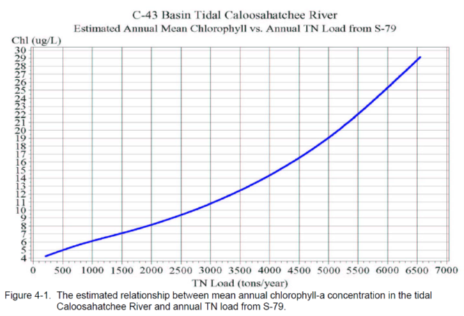
```

.small[
* Janicki Environmental (2003) Development of Critical Loads for the C-43 Basin, Caloosahatchee River. Prepared for: Florida Department of Environmental Protection, Tallahassee, FL.

]

---
name: criticalload2

### Critical Loads

* However, when attempting to verify this relationship for purposes of this evaluation the relationship (based on available data) were not congruent with prior efforts (Janicki 2003) or were not consistent with temporal resolution of the models (Doering et al. 2006).
  
```{r ,fig.align="center",out.width="70%"}
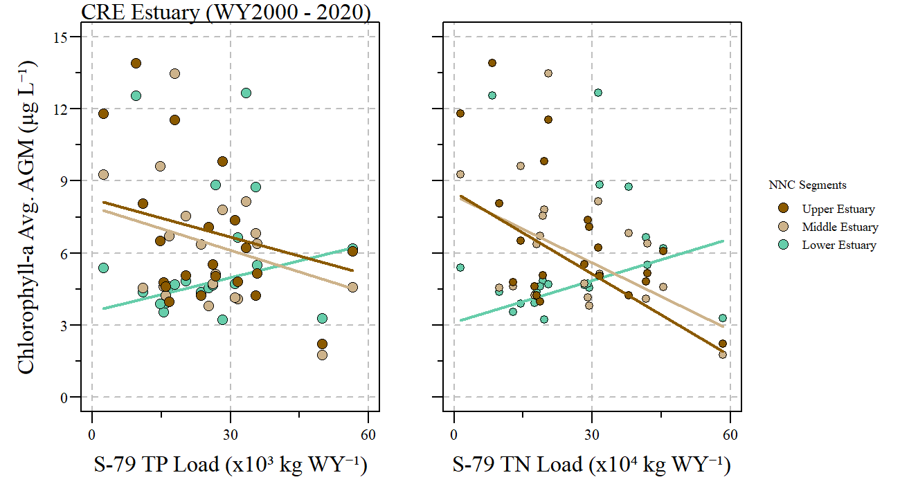
```

.center[S-79 TP and TN annual loads compared to spatially averaged annual geometric mean Chlorophyll-a concentration for each segment.]

* The effects of season, color (CDOM), biology, and hydrodynamics affect the chlorophyll-load relationship across the estuary.

---
name: CRE
class: middle, center

## Caloosahatchee River Estuary

---
name: ldc-TP

### Total Phosphorus Load Duration Curve


```{r ,fig.align="center",out.width="70%"}

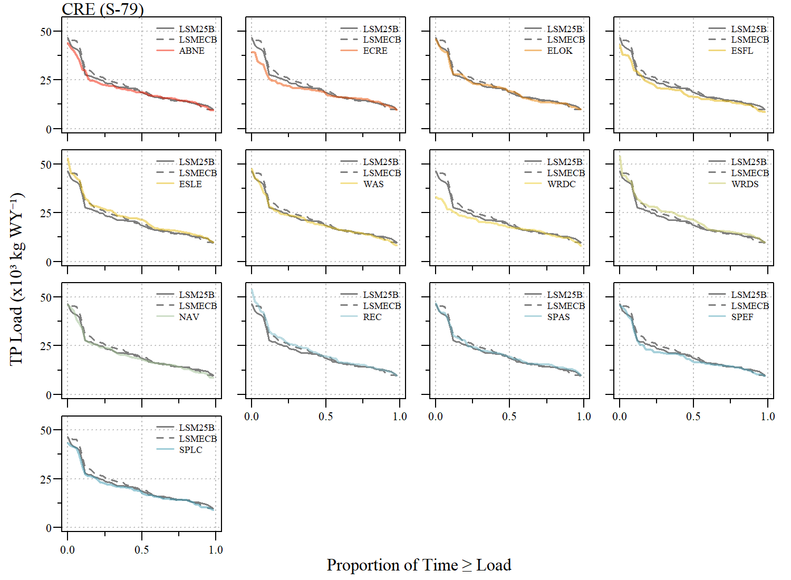
```

.center[Cumulative distribution/load duration curve comparison of S-79 TP loads for each alternative relative to FWO and ECB.]

* Relative to FWO - REC, WRDS and ESLE results in generally higher loads

---
name: bxp TP

### Total Phosphorus Load

```{r ,fig.align="center",out.width="75%"}

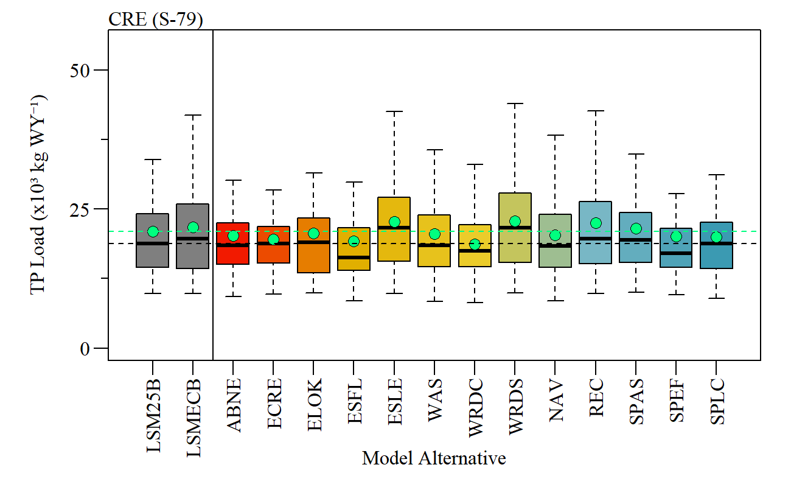
```
.center[Boxplot representing annual TP loads during the simulation period across alternatives. Black-dashed line represents the FWO median and green dashed line and point in boxplot indicates period of simulation mean.]

---
name: ldc-TN

### Total Nitrogen Load Duration Curve

```{r ,fig.align="center",out.width="70%"}

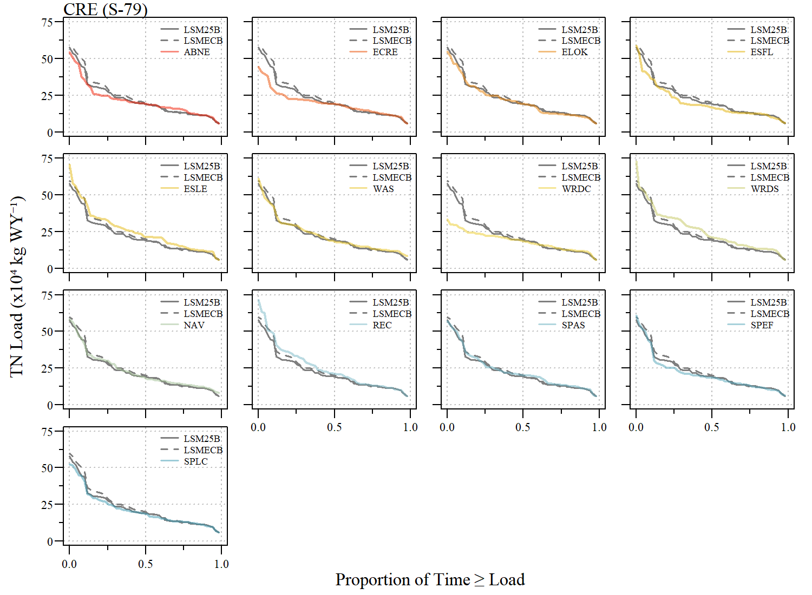
```

.center[Cumulative distribution/load duration curve comparison of S-79 TN loads for each alternative relative to FWO and ECB.]

* Relative to FWO - REC, WRDS and ESLE results in generally higher loads

---
name: bxp TN

### Total Nitrogen Load 

```{r ,fig.align="center",out.width="75%"}

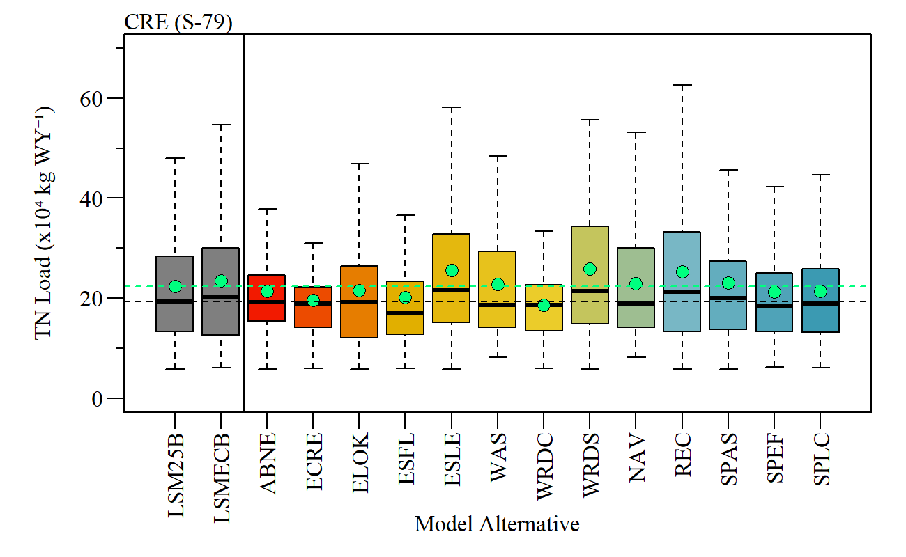
```
.center[Boxplot representing annual TN loads during the simulation period across alternatives. Black-dashed line represents the FWO median and green dashed line and point in boxplot indicates period of simulation mean.]

---
name: loadsum

### S-79 Load Summary

.pull-left[
```{r ,fig.align="center",out.width="100%"}

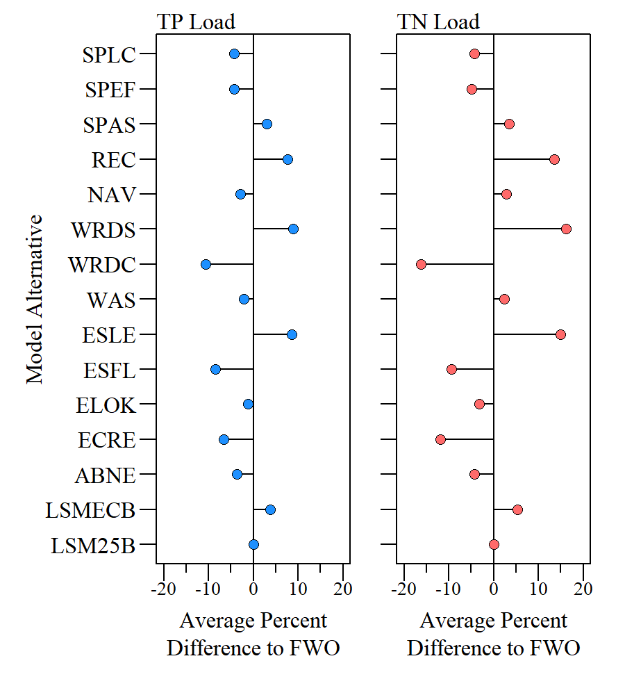
```
]

.pull-right[
Percent difference of average load relative to the FWO (LSM25B) alternative over the entire simulation period for total phosphorus (left) and total nitrogen (right) loads.

* ABNE, ECRE, ESFL and *WRDC* provide load benefit (negative % difference).

* ESLE, WRDC, and REC provide load impact (positive % difference).

* Remaining alternatives result in minor changes (`r paste("\u00B1")`) to loading.

]


---
name: FWM

### S-79 FWM Concentration

```{r ,fig.align="center",out.width="70%"}

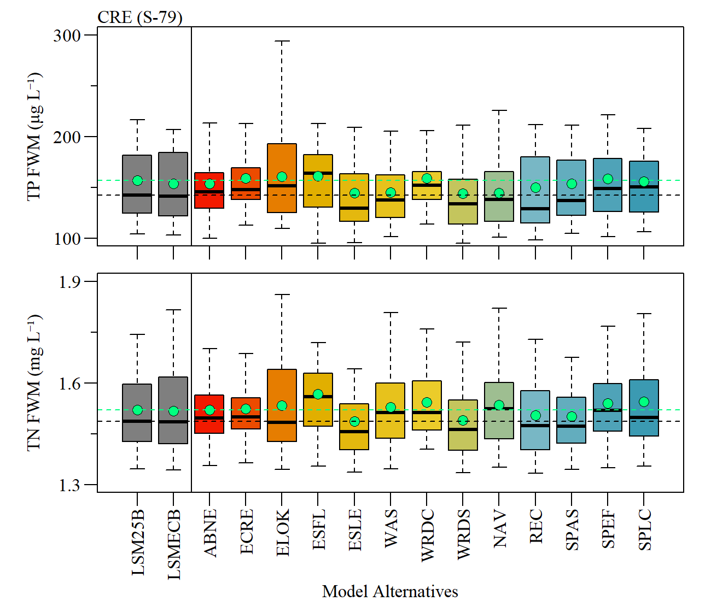
```
.center[Boxplot representing annual TP (top) and TN (bottom) flow-weighted mean concentration during the simulation period across alternatives. Black-dashed line represents the FWO median and green dashed line and point in boxplot indicates period of simulation mean.]

---
name: fwmsum

### S-79 FWM Summary

.pull-left[
```{r ,fig.align="center",out.width="100%"}

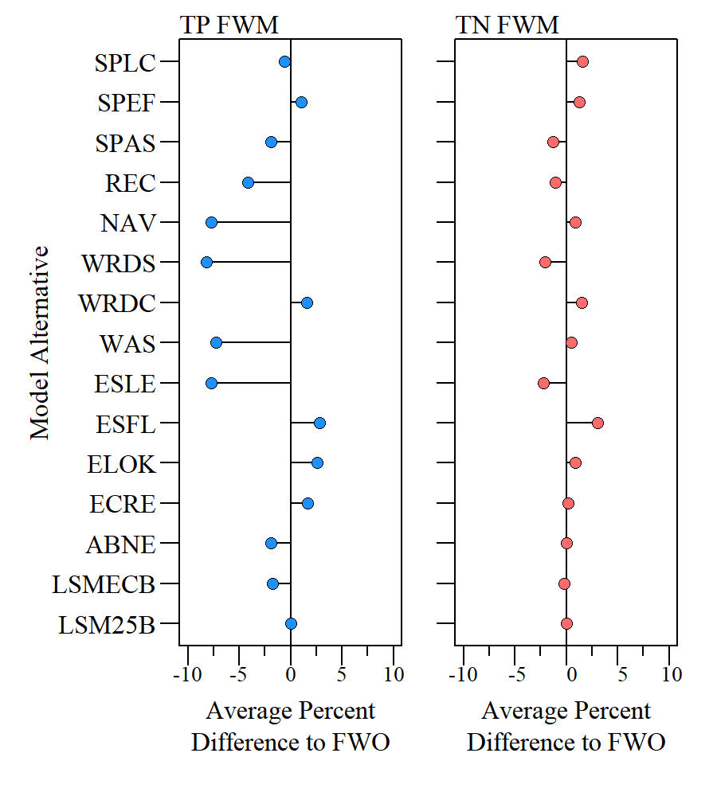
```
]

.pull-right[
Percent difference of average flow-weighted mean relative to the FWO (LSM25B) alternative over the entire simulation period for total phosphorus (left) and total nitrogen (right) loads.

]

---
name: SLE
class: middle, center

## St Lucie River Estuary

---
name: ldc-TP SLE

### Total Phosphorus Load Duration Curve


```{r ,fig.align="center",out.width="70%"}

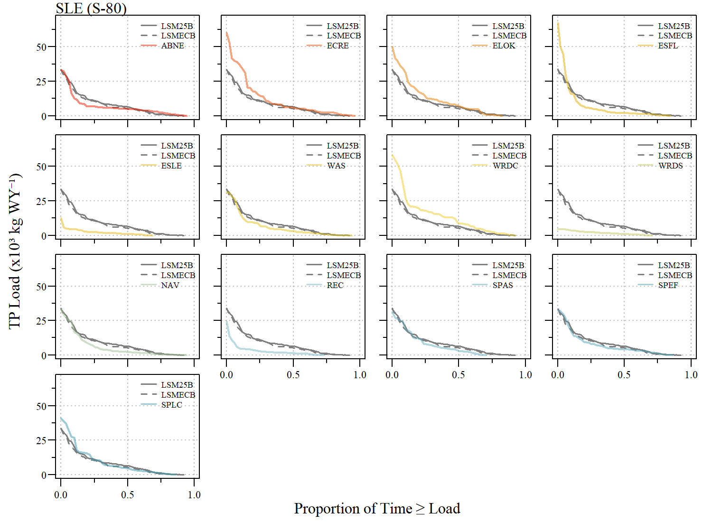
```

.center[Cumulative distribution/load duration curve comparison of S-80 TP loads for each alternative relative to FWO and ECB.]

---
name: ldc-TN SLE

### Total Nitrogen Load Duration Curve

```{r ,fig.align="center",out.width="70%"}

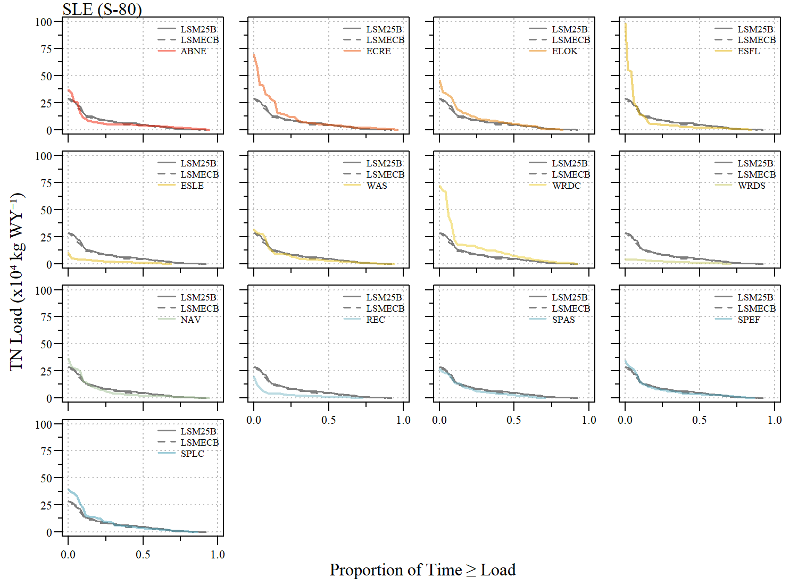
```

.center[Cumulative distribution/load duration curve comparison of S-80 TN loads for each alternative relative to FWO and ECB.]

---
name: bxp TN sle

### Total Nitrogen Load 

```{r ,fig.align="center",out.width="75%"}

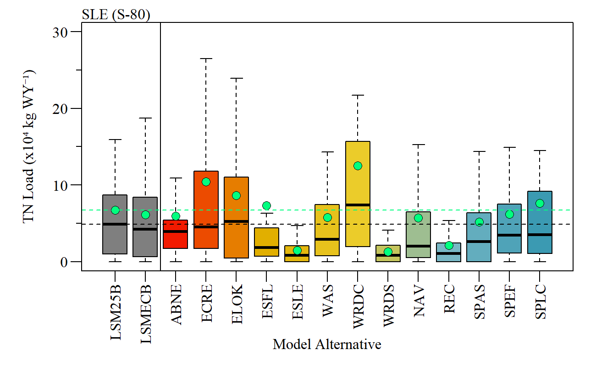
```
.center[Boxplot representing annual TN loads during the simulation period across alternatives. Black-dashed line represents the FWO median and green dashed line and point in boxplot indicates period of simulation mean.]

---
name: loadsum

### S-80 Load Summary

.pull-left[
```{r ,fig.align="center",out.width="100%"}

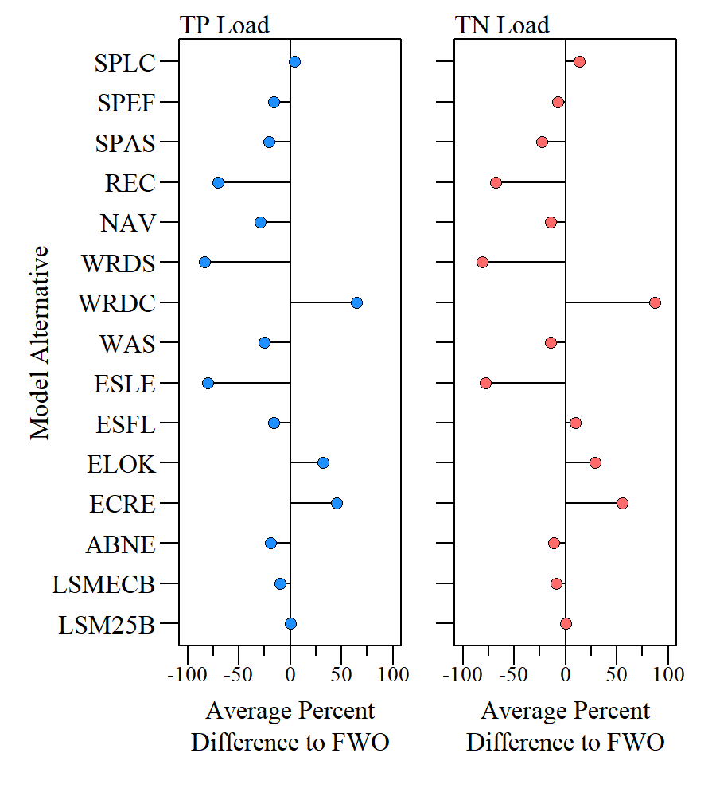
```
]

.pull-right[
Percent difference of average load relative to the FWO (LSM25B) alternative over the entire simulation period for total phosphorus (left) and total nitrogen (right) loads.


]


---
name: FWM

### S-80 FWM Concentration

```{r ,fig.align="center",out.width="60%"}

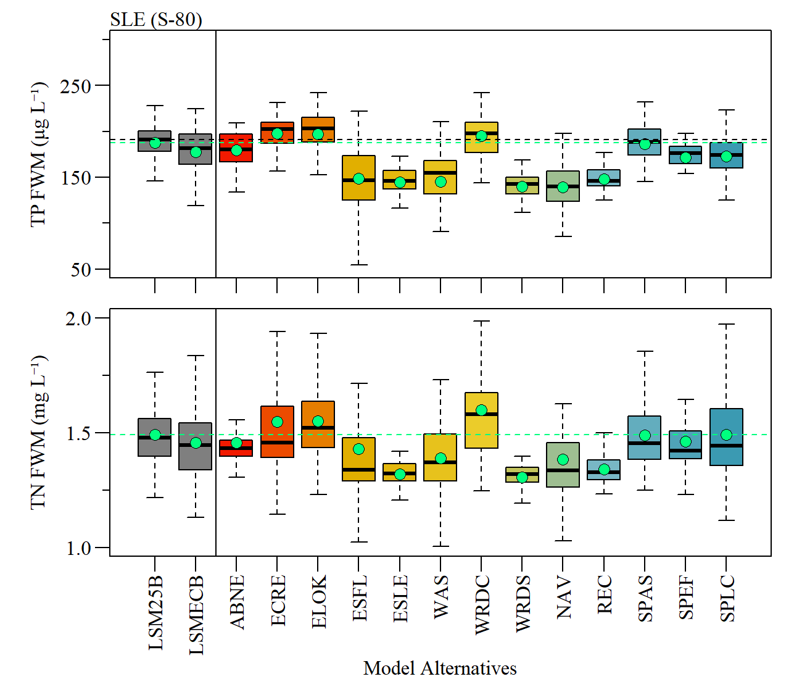
```
.center[Boxplot representing annual TP (top) and TN (bottom) flow-weighted mean concentration during the simulation period across alternatives. Black-dashed line represents the FWO median and green dashed line and point in boxplot indicates period of simulation mean.]

.small[FWMC during years with <80 ac-ft WY<sup>-1</sup> were excluded. See original presentation - [link](https://owper-tech.github.io/slides/LOSOM/ENLM/Julian_LOSOM_SLE_ENLM#43).]

---
name: fwmsum

### S-80 FWM Summary

.pull-left[
```{r ,fig.align="center",out.width="100%"}

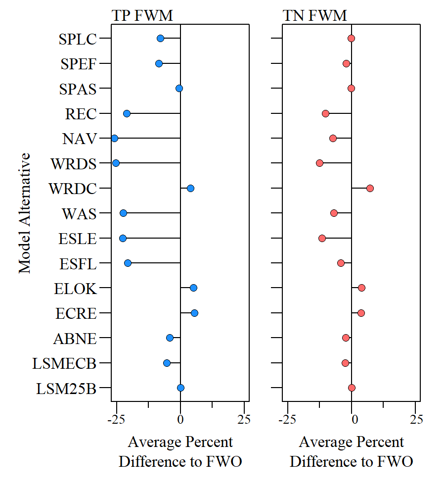
```
]

.pull-right[
Percent difference of average flow-weighted mean relative to the FWO (LSM25B) alternative over the entire simulation period for total phosphorus (left) and total nitrogen (right) loads.

]

---
name: refs

### References

* Doering et al (2006) Chlorophyll-a and its use as an indicator of eutrophication in the Caloosahatchee Estuary, Florida. Florida Scientist 69:51–72

* FDEP (2021a) Lake Okeechobee System Operating Manual (WQ Subteam) DRAFT - Caloosahatchee River Estuary Nutrient Loading Model. Presented January 13, 2021.

* FDEP (2021b) Lake Okeechobee System Operating Manual (WQ Subteam) DRAFT - St Lucie Estuary Nutrient Loading Model. Presented January 13, 2021.

* Janicki Environmental (2003) Development of Critical Loads for the C-43 Basin, Caloosahatchee River. Prepared for: Florida Department of Environmental Protection, Tallahassee, FL.
