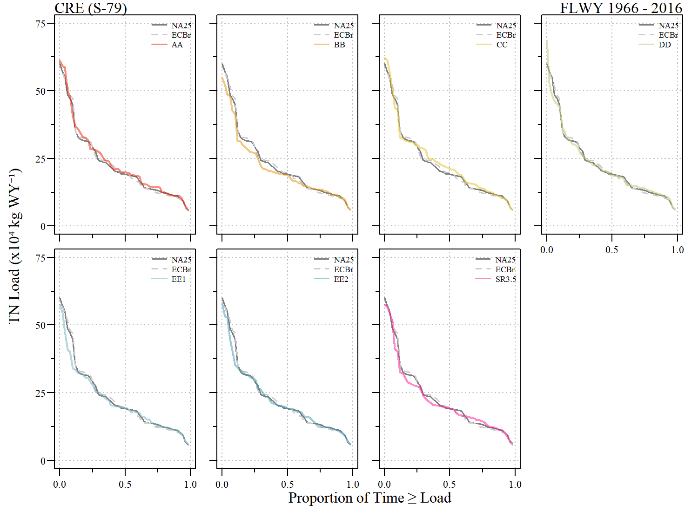
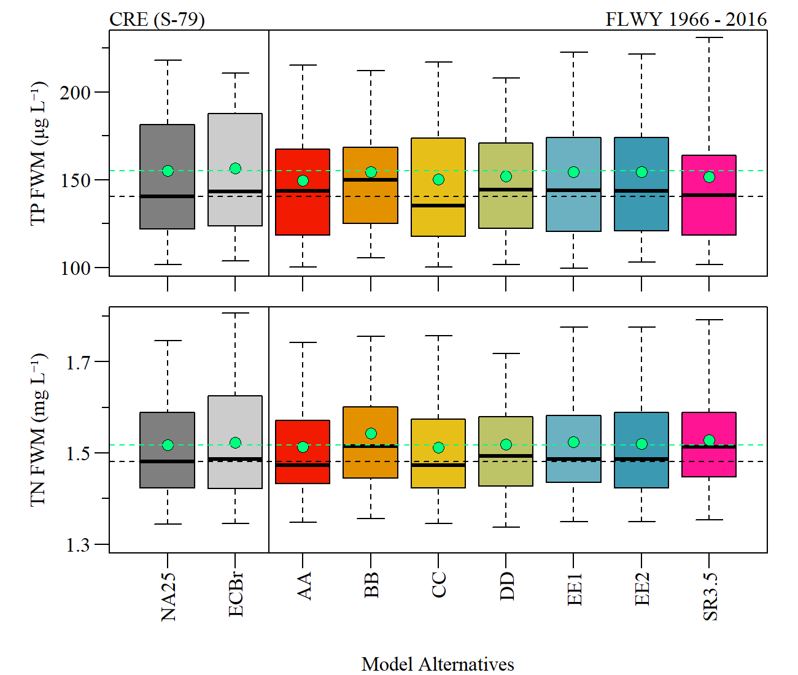
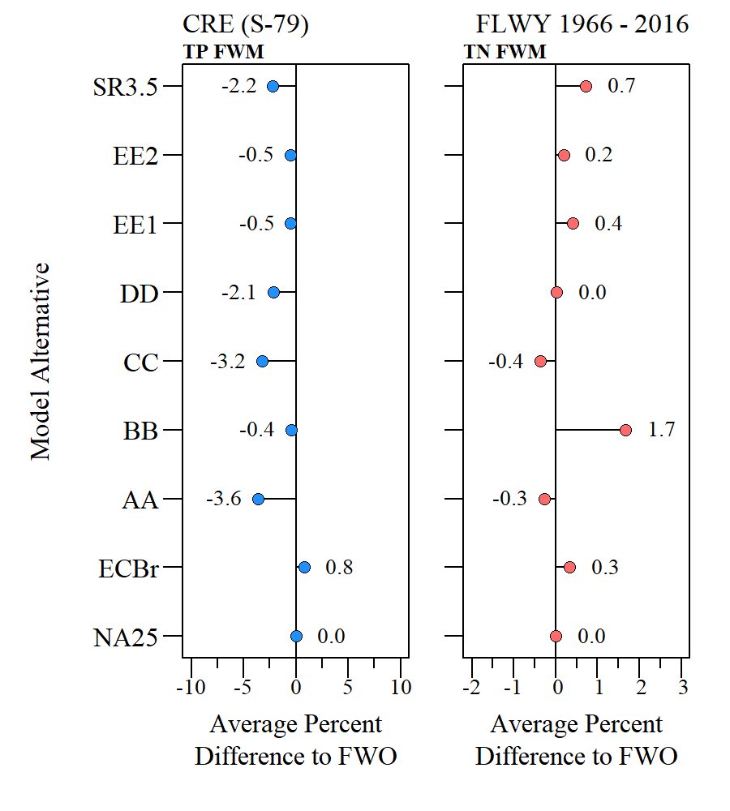
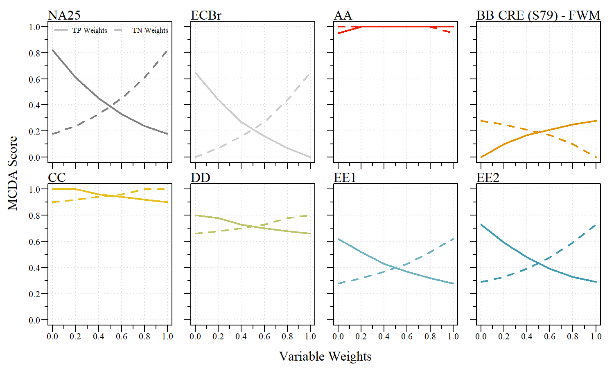

```{r setup, include=FALSE}
library(knitr)

options(htmltools.dir.version = FALSE)
knitr::opts_chunk$set(warning = FALSE, message = FALSE, echo=FALSE)

##
library(plyr)
library(flextable)
library(magrittr)

wd="C:/Julian_LaCie/_Github/LOSOM_ModelEval"

plot.path="C:/Julian_LaCie/_Github/LOSOM_ModelEval/Plots/"
export.path="C:/Julian_LaCie/_Github/LOSOM_ModelEval/Export/"

###
alts.sort=c("NA25","ECBr","AA","BB","CC","DD","EE1","EE2","SR3.5")
```

layout: true

<div class="my-footer">
<span> </span>
</div>

---
name: title
class: left, middle

### Lake Okeechobee System Operating Manual

.pull-left[
#### Iteration 2 Modeling -<br>Estuary Nutrient Loading Models

*Sanibel-Captiva Conservation Foundation*

*Conservancy of Southwest Florida*

`r paste(format(as.Date("2021-07-07"),"%B %d, %Y"),"<br>(Updated:", format(as.Date(Sys.Date()),"%B %d, %Y"),")")`

]
<!-- this ends up being the title slide since seal = FALSE-->

.pull-right[
```{r ,fig.align="center",out.width="40%"}
knitr::include_graphics('./Plots/SCCF Logo knockout_c.png')
```

```{r ,fig.align="center",out.width="40%"}

```

]

.footnote[
Paul Julian PhD<br>[`r fontawesome::fa("fas fa-envelope")`](mailto: pjulian@sccf.org) .small[pjulian@sccf.org]
]

```{r xaringanExtra, include=FALSE, warnint=FALSE}
# devtools::install_github("gadenbuie/xaringanExtra")
# xaringanExtra::use_webcam()
xaringanExtra::use_tile_view()
# xaringanExtra::use_scribble()
```
---
name: alternatives

### Iteration 2 - Model runs

```{r}

data.frame(Alternative=c("ECBr","NA25","AA","BB","CC","DD","EE1","EE2","SR3.5"),
           Description=c("LOSOM Existing Condition Baseline 2019", "LOSOM No Action 2025 (FWO)", "ESLE Framework. Enhances SLE ecology.","SPLC Framework. Improve water supply to pre-LORS08","Pareto Plan D Framework. Enhances CRE ecology and improves water supply","Pareto Plan A Framework. Incremental improvement over LORS.","Stage Target Operation Framework. Improve water supply performance by reducing flows south.","Stage Target Operations Framework. Reduce flows to SLE by reducing Zone B release rate.","SFWMD Sensitivity Run for CC (NOT an offical alternative)"))%>%
  flextable()%>%
  colformat_char(na_str="---")%>%
  width(width=c(1,5))%>%
  padding(padding=0.1,part="all")%>%
  font(fontname="Times New Roman",part="all")%>%
  fontsize(size=10,part="body")%>%
  fontsize(size=12,part="header")%>%
  bold(part="header")%>%
  footnote(i=c(1,2),j=1,
           value=as_paragraph(c("Existing Conditions Baseline 2019, revised (replaces LSMECB)","No action Condition 2025 (replaces LSM25B)")),
           ref_symbols = c(" 1 "," 2 "),part="body")
  
```

.small[

**SR3.5**
* Was included in this evaluation but is **NOT** an official iteration 2 alternative.

* Built from alternative CC

* SFWMD sensitivity run which serves as an example run incorporating policy direction (as informed by the Governing Board) and trade-offs between oper the different systems

* Presented at the July 15th 2021 Governing Board

]

---
name: methods

### The Models

Caloosahatchee River Estuary (S-79) - [Model Presentation](https://owper-tech.github.io/slides/LOSOM/ENLM/Julian_LOSOM_CRE_ENLM_ad1) - FDEP (2021a)

\begin{align*}
TP Load_{S79} = 127156 + 0.20 Q_{C43 Basin} + 0.08 Q_{S77} - 7689 Mean  Lake  Stage
\end{align*}

\begin{align*}
TN Load_{S79} = 27561 + 1.53 Q_{C43 Basin} + 1.58 Q_{S77} + 20813 Mean  Lake  Stage
\end{align*}

   * Model as [.RData file](https://github.com/SwampThingPaul/LOSOM_ENLM/blob/3fc1caa72640217bbf8646f5bf503f1b474d5247/Export/CRE_mods.RData)


<br>

St Lucie River Estuary (S-80) - [Model Presentation](https://owper-tech.github.io/slides/LOSOM/ENLM/Julian_LOSOM_SLE_ENLM) - FDEP (2021b)

.center[
.small[
\begin{align*}
ln(TP Load_{S80}) = -2.49 - (2.85x10^{-7}\times Q_{C44 Basin}) - (5.29x10^{-8}\times Q_{S308}) + (1.22\times ln(Q_{S80}))\\- (0.13\times Mean Stage)
\end{align*}
]
]

.small[
\begin{align*}
ln(TN Load_{S80}) = 1.76\times 10^{-2} + (6.60\times 10^{-8} Q_{C44 Basin}) + (1.99\times 10^{-7} Q_{S308}) + (1.06\times 10^{-2} ln(Q_{S80}))\\ - (1.70x10^{-2} Mean  Stage)
\end{align*}
]

  * Model as [.RData file](https://github.com/SwampThingPaul/LOSOM_ENLM/blob/3fc1caa72640217bbf8646f5bf503f1b474d5247/Export/SLE_mods.RData)

---
name: files

### Output

```{r}
data.frame(Column=c("Alt", "WY", "Q.S77/Q.S308", "Q.S79/Q.80", "Q.C43/Q.C44", "mean.stg", "TPLoad.kg.fit", 
"TPLoad.kg.95LCI", "TPLoad.kg.95UCI", "TNLoad.kg.fit", "TNLoad.kg.95LCI", 
"TNLoad.kg.95UCI"),
Units=c(NA,NA,"Ac-Ft WY\u207B\u00B9","Ac-Ft WY\u207B\u00B9","Ac-Ft WY\u207B\u00B9","Ft, NGVD",rep("kg WY\u207B\u00B9",6)),Des=c("Model Alternative","Florida Water Year (May - April)","Annual Discharge S77/S308 (depending on file)","Annual Discharge S79/S80 (depending on file)","Annual Discharge C43/C44 (depending on file)","Annual (WY) average Lake Okeechobee Stage","Predicted TP load","Predicted 95% lower CI TP load","Predicted 95% upper CI TP load","Predicted TN load","Predicted 95% lower CI TN load","Predicted 95% upper CI TN load"))%>%
  flextable()%>%
  width(width=c(1,1.25,3))%>%
  merge_v(j=2)%>%
  fix_border_issues()%>%
  padding(padding=0.1,part="all")%>%
  font(fontname="Times New Roman",part="all")%>%
  fontsize(size=11,part="body")%>%
  fontsize(size=12,part="header")%>%
  bold(part="header")%>%
  set_header_labels("Des"="Description")%>%
  footnote(i=1,j=1,
           part="header",value=as_paragraph("TP = Total Phosphorus; TN = Total Nitrogen; WY = Florida Water Year; Ac-Ft = Acre-foot; kg = kilogram; CI = Confidence Interval; NGVD = National Geodetic Vertical Datum"),ref_symbols =c(" "))
```


.pull-left[
.center[
**Caloosahatchee River Estuary (S79)<br>Nutrient Load Model Output**

```{r,echo=F,fig.align="center"}
dat1=read.csv(paste0(export.path,"RSMBN_iter2_load_CRE.csv"))
dat2=read.csv(paste0(export.path,"RSMBN_iter2_load_SLE.csv"))

library(downloadthis)

subset(dat1,Alt!="SR3.5")%>%
  download_this(
    output_name = "Iter1_CRE_ENLM",
    output_extension = ".xlsx",
    button_label = "Download CRE ENLM results",
    button_type = "primary",
    has_icon = TRUE,
    icon = "fa fa-file-excel")
```
]
]

.pull-right[
.center[
**St Lucie River Estuary (S80)<br>Nutrient Load Model Output**

```{r,echo=F,fig.align="center"}
subset(dat2,Alt!="SR3.5")%>%
  download_this(
    output_name = "Iter1_SLE_ENLM",
    output_extension = ".xlsx",
    button_label = "Download SLE ENLM results",
    button_type = "primary",
    has_icon = TRUE,
    icon = "fa fa-file-excel")
```
]
]

---
name: hydrodata

### Hydrologic Data

```{r ,fig.align="center",out.width="90%"}


```

.center[Boxplot of annual total discharge and mean annual lake stage for Florida water years 1966 - 2016 (May 1965 - April 2016).]

---
name: CRE
class: middle, center

## Caloosahatchee River Estuary

---
name: ldc-TP

### Total Phosphorus Load Duration Curve


```{r ,fig.align="center",out.width="80%"}


```

.center[Cumulative distribution/load duration curve comparison of S-79 TP loads for each alternative relative to FWO (NA25) and ECB (ECBr).]

---
name: ldc-TN

### Total Nitrogen Load Duration Curve

```{r ,fig.align="center",out.width="80%"}


```

.center[Cumulative distribution/load duration curve comparison of S-79 TN loads for each alternative relative to FWO (NA25) and ECB (ECBr).]

---
name: CRE bxp

### S-79 Load 

```{r ,fig.align="center",out.width="70%"}


```
.center[Boxplot representing annual TP (top) and TN (bottom) loads during the simulation period across alternatives. Black-dashed line represents the FWO median and green dashed line and point in boxplot indicates period of simulation mean.]

---
name: loadsum

### S-79 Load Summary

.pull-left[
```{r ,fig.align="center",out.width="100%"}

knitr::include_graphics('./Plots/Iteration_2/S79_Load_PerDiff.png')
```
]

.pull-right[
Percent difference of average load relative to the FWO (NA25) alternative over the entire simulation period for total phosphorus (left) and total nitrogen (right) loads.

]


---
name: FWM

### S-79 FWM Concentration

```{r ,fig.align="center",out.width="70%"}


```
.center[Boxplot representing annual TP (top) and TN (bottom) flow-weighted mean concentration during the simulation period across alternatives. Black-dashed line represents the FWO median and green dashed line and point in boxplot indicates period of simulation mean.]

---
name: fwmsum

### S-79 FWM Summary

.pull-left[
```{r ,fig.align="center",out.width="100%"}


```
]

.pull-right[
Percent difference of average flow-weighted mean relative to the FWO (NA25) alternative over the entire simulation period for total phosphorus (left) and total nitrogen (right) loads.

]

---
name: CRE Load MCDA

### CRE Nutrient Load/FWM MCDA
```{r}
dat1$S79.TNFWM=with(dat1,(TNLoad.kg.fit/(Q.S79*1.233e6))*1e6)
dat1$S79.TPFWM=with(dat1,(TPLoad.kg.fit/(Q.S79*1.233e6))*1e9)
cre.nut.mod.sum=ddply(dat1,"Alt",summarise,
                      mean.TP.load=mean(TPLoad.kg.fit),mean.TN.load=mean(TNLoad.kg.fit),
                      mean.TP.FWM=mean(S79.TPFWM),mean.TN.FWM=mean(S79.TNFWM))
cre.nut.mod.sum$Alt=factor(cre.nut.mod.sum$Alt,levels=alts.sort)
cre.nut.mod.sum=cre.nut.mod.sum[match(alts.sort,cre.nut.mod.sum$Alt),]

# MCDA type analysis
# cre.nut.mod.sum$TP.load.RS=with(cre.nut.mod.sum,(mean.TP.load/max(mean.TP.load,na.rm=T)))
cre.nut.mod.sum$TP.load.RS=cre.nut.mod.sum$mean.TP.load/max(subset(cre.nut.mod.sum,Alt!="SR3.5")$mean.TP.load,na.rm=T)
cre.nut.mod.sum$TP.load.RS=1-cre.nut.mod.sum$TP.load.RS; # lower the better
# cre.nut.mod.sum$TN.load.RS=with(cre.nut.mod.sum,(mean.TN.load/max(mean.TN.load,na.rm=T)))
cre.nut.mod.sum$TN.load.RS=cre.nut.mod.sum$mean.TN.load/max(subset(cre.nut.mod.sum,Alt!="SR3.5")$mean.TN.load,na.rm=T)
cre.nut.mod.sum$TN.load.RS=1-cre.nut.mod.sum$TN.load.RS
cre.nut.mod.sum[cre.nut.mod.sum$Alt=="SR3.5","TP.load.RS"]<-NA
cre.nut.mod.sum[cre.nut.mod.sum$Alt=="SR3.5","TN.load.RS"]<-NA

wts=c(0.5,0.5); # weights do not affect final score.
vars=c("TP.load","TN.load")
cre.nut.mod.sum$cre.nut.load.score=apply(cre.nut.mod.sum[,paste0(vars,".RS")],1,FUN=function(x) Hmisc::wtd.mean(x,wts,na.rm=T))
cre.nut.mod.sum$cre.nut.load.score=round(cre.nut.mod.sum$cre.nut.load.score/max(cre.nut.mod.sum$cre.nut.load.score,na.rm=T),3)
cre.nut.mod.sum$load.score.rank=c(rank(-subset(cre.nut.mod.sum,Alt!="SR3.5")$cre.nut.load.score,ties.method = "first"),NA)

cre.nut.mod.sum$mean.TP.FWM=round(cre.nut.mod.sum$mean.TP.FWM,0)
cre.nut.mod.sum$mean.TN.FWM=round(cre.nut.mod.sum$mean.TN.FWM,2)
# cre.nut.mod.sum$TP.FWM.RS=with(cre.nut.mod.sum,(mean.TP.FWM/max(mean.TP.FWM,na.rm=T)))
cre.nut.mod.sum$TP.FWM.RS=cre.nut.mod.sum$mean.TP.FWM/max(subset(cre.nut.mod.sum,Alt!="SR3.5")$mean.TP.FWM,na.rm=T)
cre.nut.mod.sum$TP.FWM.RS=1-cre.nut.mod.sum$TP.FWM.RS
# cre.nut.mod.sum$TN.FWM.RS=with(cre.nut.mod.sum,(mean.TN.FWM/max(mean.TN.FWM,na.rm=T)))
cre.nut.mod.sum$TN.FWM.RS=cre.nut.mod.sum$mean.TN.FWM/max(subset(cre.nut.mod.sum,Alt!="SR3.5")$mean.TN.FWM,na.rm=T)
cre.nut.mod.sum$TN.FWM.RS=1-cre.nut.mod.sum$TN.FWM.RS
cre.nut.mod.sum[cre.nut.mod.sum$Alt=="SR3.5","TP.FWM.RS"]<-NA
cre.nut.mod.sum[cre.nut.mod.sum$Alt=="SR3.5","TN.FWM.RS"]<-NA

wts=c(0.5,0.5); # weights do not affect final score.
vars=c("TP.FWM","TN.FWM")
cre.nut.mod.sum$cre.nut.FWM.score=apply(cre.nut.mod.sum[,paste0(vars,".RS")],1,FUN=function(x) Hmisc::wtd.mean(x,wts,na.rm=T))
cre.nut.mod.sum$cre.nut.FWM.score=round(cre.nut.mod.sum$cre.nut.FWM.score/max(cre.nut.mod.sum$cre.nut.FWM.score,na.rm=T),3)
# cre.nut.mod.sum$FWM.score.rank=rank(-cre.nut.mod.sum$cre.nut.FWM.score,ties.method = "first")
cre.nut.mod.sum$FWM.score.rank=c(rank(-subset(cre.nut.mod.sum,Alt!="SR3.5")$cre.nut.FWM.score,ties.method = "first"),NA)


```

* Equal weight for TP and TN loads and FWM Concentrations

.pull-left[
```{r}
cre.nut.mod.sum[,c("Alt","mean.TP.load","mean.TN.load","cre.nut.load.score","load.score.rank")]%>%
  flextable()%>%
  colformat_double(j=2:3,digits=0,big.mark="")%>%
  colformat_double(j=4,digits=3,big.mark="",na_str = "---")%>%
  colformat_int(j=5,na_str = "---")%>%
  padding(padding=0.5,part="all")%>%
  font(fontname="Times New Roman",part="all")%>%
  fontsize(size=8,part="body")%>%
  fontsize(size=10,part="header")%>%
  bold(part="header")%>%
  set_header_labels("mean.TP.load"="Mean TP Load\n(kg WY\u207B\u00B9)",
                    "mean.TN.load"="Mean TN Load\n(kg WY\u207B\u00B9)",
                    "cre.nut.load.score"="MCDA\nScore",
                    "load.score.rank"="Rank")%>%
  flextable::align(j=2:5,align="center",part="all")%>%
  width(width=c(0.5,0.8,0.8,0.75,0.4))%>%
  footnote(j=2:3,
           part="header",
           value=as_paragraph(c("Period of Simulation mean.")),ref_symbols =c(" 1"))%>%
  footnote(j=4,
           part="header",
           value=as_paragraph("Data Normalized and equally weighted. SR3.5 Not included in MCDA analysis."),ref_symbols =c(" 2"))%>%
  footnote(j=5,
           part="header",
           value=as_paragraph("When ties are present, the 'first' method was used (permutation with increasing values at each index set)."),ref_symbols =c(" 3"))

  
```
]

.pull-right[
```{r}
cre.nut.mod.sum[,c("Alt","mean.TP.FWM","mean.TN.FWM","cre.nut.FWM.score","FWM.score.rank")]%>%
  flextable()%>%
  colformat_double(j=2,digits=0,big.mark="")%>%
  colformat_double(j=3,digits=2,big.mark="")%>%
  colformat_double(j=4,digits=3,big.mark="",na_str = "---")%>%
  colformat_int(j=5,na_str = "---")%>%
  padding(padding=0.5,part="all")%>%
  font(fontname="Times New Roman",part="all")%>%
  fontsize(size=8,part="body")%>%
  fontsize(size=10,part="header")%>%
  bold(part="header")%>%
  set_header_labels("mean.TP.FWM"="Mean TP FWM\n(\u03BCg L\u207B\u00B9)",
                    "mean.TN.FWM"="Mean TN FWM\n(mg L\u207B\u00B9)",
                    "cre.nut.FWM.score"="MCDA\nScore",
                    "FWM.score.rank"="Rank")%>%
  flextable::align(j=2:5,align="center",part="all")%>%
  width(width=c(0.5,0.8,0.8,0.75,0.4))%>%
  footnote(j=2:3,
           part="header",
           value=as_paragraph(c("Period of Simulation mean.")),ref_symbols =c(" 1"))%>%
  footnote(j=4,
           part="header",
           value=as_paragraph("Data Normalized and equally weighted. SR3.5 Not included in MCDA analysis. "),ref_symbols =c(" 2"))%>%
  footnote(j=5,
           part="header",
           value=as_paragraph("When ties are present, the 'first' method was used (permutation with increasing values at each index set)."),ref_symbols =c(" 3"))
  
```
]

---
name: CRE MCDA Sen

### CRE Load MCDA Sensitivity


```{r ,fig.align="center",out.width="100%"}

knitr::include_graphics('./Plots/Iteration_2/S79_Load_MCDASense.png')
```

.center[MCDA weighting sensitivity for S79 during the simulated period of record mean TP and TN loads for each alternative.]

---
name: CRE MCDA Sen2

### CRE FWM MCDA Sensitivity


```{r ,fig.align="center",out.width="100%"}


```

.center[MCDA weighting sensitivity for S79 during the simulated period of record mean TP and TN FWM for each alternative.]

---
name: SLE
class: middle, center

## St Lucie River Estuary

---
name: ldc-TP SLE

### Total Phosphorus Load Duration Curve


```{r ,fig.align="center",out.width="80%"}


```

.center[Cumulative distribution/load duration curve comparison of S-80 TP loads for each alternative relative to FWO and ECB.]

---
name: ldc-TN SLE

### Total Nitrogen Load Duration Curve

```{r ,fig.align="center",out.width="80%"}


```

.center[Cumulative distribution/load duration curve comparison of S-80 TN loads for each alternative relative to FWO (NA25) and ECB (ECBr).]

---
name: SLE bxp

### S-80 Load 

```{r ,fig.align="center",out.width="70%"}


```
.center[Boxplot representing annual TP (top) and TN (bottom) loads during the simulation period across alternatives. Black-dashed line represents the FWO median and green dashed line and point in boxplot indicates period of simulation mean.]

---
name: loadsum

### S-80 Load Summary

.pull-left[
```{r ,fig.align="center",out.width="100%"}


```
]

.pull-right[
Percent difference of average load relative to the FWO (NA25) alternative over the entire simulation period for total phosphorus (left) and total nitrogen (right) loads.

]


---
name: FWM

### S-80 FWM Concentration

```{r ,fig.align="center",out.width="60%"}


```
.center[Boxplot representing annual TP (top) and TN (bottom) flow-weighted mean concentration during the simulation period across alternatives. Black-dashed line represents the FWO median and green dashed line and point in boxplot indicates period of simulation mean.]

.small[FWMC during years with <80 ac-ft WY<sup>-1</sup> were excluded. See original presentation - [link](https://owper-tech.github.io/slides/LOSOM/ENLM/Julian_LOSOM_SLE_ENLM#43).]

---
name: fwmsum

### S-80 FWM Summary

.pull-left[
```{r ,fig.align="center",out.width="100%"}


```
]

.pull-right[
Percent difference of average flow-weighted mean relative to the FWO (NA25) alternative over the entire simulation period for total phosphorus (left) and total nitrogen (right) loads.

]

---
name: sle Load MCDA

### SLE Nutrient Load/FWM MCDA
```{r}
dat2$S80.TNFWM=with(dat2,ifelse(Q.S80<80,NA,(TNLoad.kg.fit/(Q.S80*1.233e6))*1e6))
dat2$S80.TPFWM=with(dat2,ifelse(Q.S80<80,NA,(TPLoad.kg.fit/(Q.S80*1.233e6))*1e9))

sle.nut.mod.sum=ddply(dat2,"Alt",summarise,
                      mean.TP.load=mean(TPLoad.kg.fit,na.rm=T),mean.TN.load=mean(TNLoad.kg.fit,na.rm=T),
                      mean.TP.FWM=mean(S80.TPFWM,na.rm=T),mean.TN.FWM=mean(S80.TNFWM,na.rm=T))
sle.nut.mod.sum$Alt=factor(sle.nut.mod.sum$Alt,levels=alts.sort)
sle.nut.mod.sum=sle.nut.mod.sum[match(alts.sort,sle.nut.mod.sum$Alt),]

# MCDA type analysis
# sle.nut.mod.sum$TP.load.RS=with(sle.nut.mod.sum,(mean.TP.load/max(mean.TP.load,na.rm=T)))
sle.nut.mod.sum$TP.load.RS=sle.nut.mod.sum$mean.TP.load/max(subset(sle.nut.mod.sum,Alt!="SR3.5")$mean.TP.load,na.rm=T)
sle.nut.mod.sum$TP.load.RS=1-sle.nut.mod.sum$TP.load.RS; # lower the better
# sle.nut.mod.sum$TN.load.RS=with(sle.nut.mod.sum,(mean.TN.load/max(mean.TN.load,na.rm=T)))
sle.nut.mod.sum$TN.load.RS=sle.nut.mod.sum$mean.TN.load/max(subset(sle.nut.mod.sum,Alt!="SR3.5")$mean.TN.load,na.rm=T)
sle.nut.mod.sum$TN.load.RS=1-sle.nut.mod.sum$TN.load.RS
sle.nut.mod.sum[sle.nut.mod.sum$Alt=="SR3.5","TP.load.RS"]<-NA
sle.nut.mod.sum[sle.nut.mod.sum$Alt=="SR3.5","TN.load.RS"]<-NA

wts=c(0.5,0.5); # weights do not affect final score.
vars=c("TP.load","TN.load")
sle.nut.mod.sum$sle.nut.load.score=apply(sle.nut.mod.sum[,paste0(vars,".RS")],1,FUN=function(x) Hmisc::wtd.mean(x,wts,na.rm=T))
sle.nut.mod.sum$sle.nut.load.score=round(sle.nut.mod.sum$sle.nut.load.score/max(sle.nut.mod.sum$sle.nut.load.score,na.rm=T),3)
# sle.nut.mod.sum$load.score.rank=rank(-sle.nut.mod.sum$sle.nut.load.score,ties.method = "first")
sle.nut.mod.sum$load.score.rank=c(rank(-subset(sle.nut.mod.sum,Alt!="SR3.5")$sle.nut.load.score,ties.method = "first"),NA)


sle.nut.mod.sum$mean.TP.FWM=round(sle.nut.mod.sum$mean.TP.FWM,0)
sle.nut.mod.sum$mean.TN.FWM=round(sle.nut.mod.sum$mean.TN.FWM,2)

# sle.nut.mod.sum$TP.FWM.RS=with(sle.nut.mod.sum,(mean.TP.FWM/max(mean.TP.FWM,na.rm=T)))
sle.nut.mod.sum$TP.FWM.RS=sle.nut.mod.sum$mean.TP.FWM/max(subset(sle.nut.mod.sum,Alt!="SR3.5")$mean.TP.FWM,na.rm=T)
sle.nut.mod.sum$TP.FWM.RS=1-sle.nut.mod.sum$TP.FWM.RS
# sle.nut.mod.sum$TN.FWM.RS=with(sle.nut.mod.sum,(mean.TN.FWM/max(mean.TN.FWM,na.rm=T)))
sle.nut.mod.sum$TN.FWM.RS=sle.nut.mod.sum$mean.TN.FWM/max(subset(sle.nut.mod.sum,Alt!="SR3.5")$mean.TN.FWM,na.rm=T)
sle.nut.mod.sum$TN.FWM.RS=1-sle.nut.mod.sum$TN.FWM.RS
sle.nut.mod.sum[sle.nut.mod.sum$Alt=="SR3.5","TP.FWM.RS"]<-NA
sle.nut.mod.sum[sle.nut.mod.sum$Alt=="SR3.5","TN.FWM.RS"]<-NA


wts=c(0.5,0.5); # weights do not affect final score.
vars=c("TP.FWM","TN.FWM")
sle.nut.mod.sum$sle.nut.FWM.score=apply(sle.nut.mod.sum[,paste0(vars,".RS")],1,FUN=function(x) Hmisc::wtd.mean(x,wts,na.rm=T))
sle.nut.mod.sum$sle.nut.FWM.score=round(sle.nut.mod.sum$sle.nut.FWM.score/max(sle.nut.mod.sum$sle.nut.FWM.score,na.rm=T),3)
# sle.nut.mod.sum$FWM.score.rank=rank(-sle.nut.mod.sum$sle.nut.FWM.score,ties.method = "first")
sle.nut.mod.sum$FWM.score.rank=c(rank(-subset(sle.nut.mod.sum,Alt!="SR3.5")$sle.nut.FWM.score,ties.method = "first"),NA)


```

* Equal weight for TP and TN loads and FWM Concentrations

.pull-left[
```{r}
sle.nut.mod.sum[,c("Alt","mean.TP.load","mean.TN.load","sle.nut.load.score","load.score.rank")]%>%
  flextable()%>%
  colformat_double(j=2:3,digits=0,big.mark="")%>%
  colformat_double(j=4,digits=3,big.mark="",na_str = "---")%>%
  colformat_int(j=5,na_str = "---")%>%
  padding(padding=0.5,part="all")%>%
  font(fontname="Times New Roman",part="all")%>%
  fontsize(size=8,part="body")%>%
  fontsize(size=10,part="header")%>%
  bold(part="header")%>%
  set_header_labels("mean.TP.load"="Mean TP Load\n(kg WY\u207B\u00B9)",
                    "mean.TN.load"="Mean TN Load\n(kg WY\u207B\u00B9)",
                    "sle.nut.load.score"="MCDA\nScore",
                    "load.score.rank"="Rank")%>%
  flextable::align(j=2:5,align="center",part="all")%>%
  width(width=c(0.5,0.8,0.8,0.75,0.4))%>%
  footnote(j=2:3,
           part="header",
           value=as_paragraph(c("Period of Simulation mean.")),ref_symbols =c(" 1"))%>%
  footnote(j=4,
           part="header",
           value=as_paragraph("Data Normalized and equally weighted. SR3.5 Not included in MCDA analysis."),ref_symbols =c(" 2"))%>%
  footnote(j=5,
           part="header",
           value=as_paragraph("When ties are present, the 'first' method was used (permutation with increasing values at each index set)."),ref_symbols =c(" 3"))

  
```
]

.pull-right[
```{r}
sle.nut.mod.sum[,c("Alt","mean.TP.FWM","mean.TN.FWM","sle.nut.FWM.score","FWM.score.rank")]%>%
  flextable()%>%
  colformat_double(j=2,digits=0,big.mark="")%>%
  colformat_double(j=3,digits=2,big.mark="")%>%
  colformat_double(j=4,digits=3,big.mark="",na_str = "---")%>%
  colformat_int(j=5,na_str = "---")%>%
  padding(padding=0.5,part="all")%>%
  font(fontname="Times New Roman",part="all")%>%
  fontsize(size=8,part="body")%>%
  fontsize(size=10,part="header")%>%
  bold(part="header")%>%
  set_header_labels("mean.TP.FWM"="Mean TP FWM\n(\u03BCg L\u207B\u00B9)",
                    "mean.TN.FWM"="Mean TN FWM\n(mg L\u207B\u00B9)",
                    "sle.nut.FWM.score"="MCDA\nScore",
                    "FWM.score.rank"="Rank")%>%
  flextable::align(j=2:5,align="center",part="all")%>%
  width(width=c(0.5,0.8,0.8,0.75,0.4))%>%
  footnote(j=2:3,
           part="header",
           value=as_paragraph(c("Period of Simulation mean")),ref_symbols =c(" 1"))%>%
  footnote(j=4,
           part="header",
           value=as_paragraph("Data Normalized and equally weighted. SR3.5 Not included in MCDA analysis."),ref_symbols =c(" 2"))%>%
  footnote(j=5,
           part="header",
           value=as_paragraph("When ties are present, the 'first' method was used (permutation with increasing values at each index set)"),ref_symbols =c(" 3"))
  
```
]

---
name: SLE MCDA Sen

### SLE Load MCDA Sensitivity


```{r ,fig.align="center",out.width="100%"}


```

.center[MCDA weighting sensitivity for S80 during the simulated period of record mean TP and TN loads for each alternative.]

---
name: SLE MCDA Sen2

### SLE FWM MCDA Sensitivity


```{r ,fig.align="center",out.width="100%"}


```

.center[MCDA weighting sensitivity for S80 during the  simulated period of record mean TP and TN FWM for each alternative.]

---
name: Summary

### Summary

```{r}
data.frame(Param=c(rep("Load",3),rep("FWM",3)),
           CRE=c("BB lower relative to FWO\n(lower lake flows)",
                 "CC higher relative to FWO\n(higher lake flows)",
                 "MCDA Top 3: BB, EE1 and EE2",
                 "BB higher relative to FWO",
                 "CC & AA lower relative to FWO",
                 "MCDA Top 3: AA & CC (tied), DD"),
           SLE=c("AA and CC lower relative to FWO\n(lower lake flows)",
                 "BB higher relative to FWO\n(higher lake flows)",
                 "MCDA Top 3: AA, CC and DD",
                 "All plans are lower relative to FWO", 
                 "AA CC the lowest",
                 "MCDA Top 3: AA, CC and BB"))%>%
  flextable()%>%
  padding(padding=2.5,part="all")%>%
  font(fontname="Times New Roman",part="all")%>%
  fontsize(size=11,part="body")%>%
  fontsize(size=13,part="header")%>%
  bold(part="header")%>%
  set_header_labels("Param"=" ")%>%
  merge_v(j=1)%>%
  fix_border_issues()%>%
  hline(i=3)%>%
  align(j=2:3,align="center",part="all")%>%
  valign(valign="center",part="header")%>%
  footnote(i=1,j=1,part="header",
           value=as_paragraph("SR3.5 not included in this summary table"),
           ref_symbols = c(" "))%>%
  autofit()

```


---
name: Acknowledgments

### Acknowledgments

```{r ,out.width="8%"}
knitr::include_graphics("https://www.sfwmd.gov/sites/default/files/documents/sfwmd-seal-hq.png")
```
South Florida Water Management District ([DBHYDRO](https://www.sfwmd.gov/science-data/dbhydro))


```{r, out.width="8%"}
knitr::include_graphics("https://www.publications.usace.army.mil/Portals/76/Publications/EngineerStandardsGraphics/gs-03.gif")
```
US Army Corps of Engineers ([USACE LOSOM](https://www.saj.usace.army.mil/LOSOM/))

  * Interagency Modeling Center

[HTML Slide deck](https://sccf-tech.github.io/slides/LOSOM/SCCF_iter2_LOSOM_ENLMrslt.html) | [PDF Slide deck](https://sccf-tech.github.io/slides/LOSOM/SCCF_iter2_LOSOM_ENLMrslt.pdf) | [RMarkdown Source](https://github.com/SwampThingPaul/LOSOM_ModelEval) &copy; Julian (2021) [](http://creativecommons.org/licenses/by/4.0/)

[Analysis Script](https://raw.githubusercontent.com/SwampThingPaul/LOSOM_ModelEval/main/src/iter2_nutrientload_eval.R)

.pull-left[
```{r ,fig.align="center",out.width="35%"}
knitr::include_graphics('./Plots/SCCF Logo knockout_c.png')
```
]

.pull-right[
```{r ,fig.align="center",out.width="45%"}

```
]


