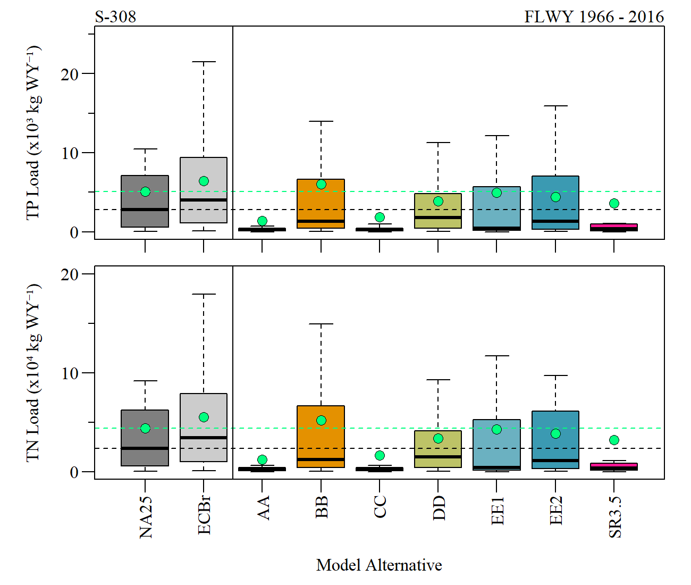

```{r setup, include=FALSE}
library(knitr)

options(htmltools.dir.version = FALSE)
knitr::opts_chunk$set(warning = FALSE, message = FALSE, echo=FALSE)

##
library(AnalystHelper)
library(plyr)
library(flextable)
library(magrittr)

wd="C:/Julian_LaCie/_Github/LOSOM_ModelEval"

plot.path="C:/Julian_LaCie/_Github/LOSOM_ModelEval/Plots/"
export.path="C:/Julian_LaCie/_Github/LOSOM_ModelEval/Export/"

###
alts.sort=c("NA25","ECBr","AA","BB","CC","DD","EE1","EE2","SR3.5")
```

layout: true

<div class="my-footer">
<span> </span>
</div>

---
name: title
class: left, middle

### Lake Okeechobee System Operating Manual

.pull-left[
#### Iteration 2 Modeling -<br>S-77/S-308 Load Estimates

*Sanibel-Captiva Conservation Foundation*

*Conservancy of Southwest Florida*

`r paste(format(as.Date("2021-07-08"),"%B %d, %Y"),"<br>(Updated:", format(as.Date(Sys.Date()),"%B %d, %Y"),")")`

]
<!-- this ends up being the title slide since seal = FALSE-->

.pull-right[
```{r ,fig.align="center",out.width="40%"}
knitr::include_graphics('./Plots/SCCF Logo knockout_c.png')
```

```{r ,fig.align="center",out.width="40%"}
knitr::include_graphics('./Plots/ConSWFL.jpeg')
```

]

.footnote[
Paul Julian PhD<br>[`r fontawesome::fa("fas fa-envelope")`](mailto: pjulian@sccf.org) .small[pjulian@sccf.org]
]

```{r xaringanExtra, include=FALSE, warnint=FALSE}
# devtools::install_github("gadenbuie/xaringanExtra")
# xaringanExtra::use_webcam()
xaringanExtra::use_tile_view()
```

---
name: alternatives

### Iteration 2 - Model runs

```{r}

data.frame(Alternative=c("ECBr","NA25","AA","BB","CC","DD","EE1","EE2","SR3.5"),
           Description=c("LOSOM Existing Condition Baseline 2019", "LOSOM No Action 2025 (FWO)", "ESLE Framework. Enhances SLE ecology.","SPLC Framework. Improve water supply to pre-LORS08","Pareto Plan D Framework. Enhances CRE ecology and improves water supply","Pareto Plan A Framework. Incremental improvement over LORS.","Stage Target Operation Framework. Improve water supply performance by reducing flows south.","Stage Target Operations Framework. Reduce flows to SLE by reducing Zone B release rate.","SFWMD Sensitivity Run for CC (NOT an offical alternative)"))%>%
  flextable()%>%
  colformat_char(na_str="---")%>%
  width(width=c(1,5))%>%
  padding(padding=0.1,part="all")%>%
  font(fontname="Times New Roman",part="all")%>%
  fontsize(size=10,part="body")%>%
  fontsize(size=12,part="header")%>%
  bold(part="header")%>%
  footnote(i=c(1,2),j=1,
           value=as_paragraph(c("Existing Conditions Baseline 2019, revised (replaces LSMECB)","No action Condition 2025 (replaces LSM25B)")),
           ref_symbols = c(" 1 "," 2 "),part="body")
  
```

.small[

**SR3.5**
* Was included in this evaluation but is **NOT** an official iteration 2 alternative.

* Built from alternative CC

* SFWMD sensitivity run which serves as an example run incorporating policy direction (as informed by the Governing Board) and trade-offs between oper the different systems

* Presented at the July 15th 2021 Governing Board

]


---
name: methods

### Methods
* Due to variability in concentration-Discharge relationships and lack of water quality-hydrodynamic model (like ENLM) monthly mean TP and TN concentration data was used. 

```{r}
month.wq=read.csv(paste0(export.path,"S77S308_monthlymean.csv"))
#month.wq=subset(month.wq,Station.ID=="C44S80")
month.wq$mon=month.abb[month.wq$month]

month.wq$mean.TP=month.wq$mean.TP*1000
month.wq$SD.TP=month.wq$SD.TP*1000
month.wq$TP.stat=with(month.wq,paste0(round(mean.TP,0)," \u00B1 ",round(SD.TP,0)," (",N.TP,")"))
month.wq$TN.stat=with(month.wq,paste0(format(round(mean.TN,2),nsmall=2)," \u00B1 ",format(round(SD.TN,2),nsmall=2)," (",N.TN,")"))

tmp=cbind(subset(month.wq,Station.ID=='S77')[,c("mon","TP.stat","TN.stat")],subset(month.wq,Station.ID=='S308C')[,c("TP.stat","TN.stat")])
colnames(tmp)=c("mon","S77.TP","S77.TN","S308.TP","S308.TN")
# tmp%>%
# flextable()%>%
#   align(j=2:5,align="center",part="all")%>%
#   padding(padding=1)%>%
#   fontsize(size=9,part="body")%>%
#   fontsize(size=11,part="header")%>%
#   add_header("S77.TP"="S-77",
#              "S77.TN"="S-77",
#              "S308.TP"="S-308",
#              "S308.TN"="S-308")%>%
#   merge_h(part="header")%>%
#   align(align="center",part="header")%>%
#   vline(j=c(3),border=officer::fp_border(color="grey"),part="all")%>%
#   set_header_labels("mon"="Month",
#                     "S77.TP"="Total Phosphorus\n(\u03BCg L\u207B\u00B9)",
#                     "S77.TN"="Total Nitrogen\n(mg L\u207B\u00B9)",
#                     "S308.TP"="Total Phosphorus\n(\u03BCg L\u207B\u00B9)",
#                     "S308.TN"="Total Nitrogen\n(mg L\u207B\u00B9)")%>%
#   width(width=c(0.5,1.5,1.5,1.5,1.5))%>%
#   footnote(i=1,j=2:3,part="header",
#            value=as_paragraph(" Mean \u00B1 Std Dev (N)"),
#            ref_symbols = c(" "))%>%
#   footnote(i=1,j=1,part="header",
#            value=as_paragraph("POR: May 1999 - April 2020"),
#            ref_symbols = c(" "))

tmp[,c("mon","S77.TP","S308.TP","S77.TN","S308.TN")]%>%
flextable()%>%
  align(j=2:5,align="center",part="all")%>%
  padding(padding=1)%>%
  fontsize(size=9,part="body")%>%
  fontsize(size=11,part="header")%>%
  add_header("S77.TP"="Total Phosphorus\n(\u03BCg L\u207B\u00B9)",
             "S77.TN"="Total Nitrogen\n(mg L\u207B\u00B9)",
             "S308.TP"="Total Phosphorus\n(\u03BCg L\u207B\u00B9)",
             "S308.TN"="Total Nitrogen\n(mg L\u207B\u00B9)")%>%
  merge_h(part="header")%>%
  align(align="center",part="header")%>%
  vline(j=c(3),border=officer::fp_border(color="grey"),part="all")%>%
  set_header_labels("mon"="Month",
                    "S77.TP"="S-77",
                    "S308.TP"="S-308",
                    "S77.TN"="S-77",
                    "S308.TN"="S-308")%>%
  width(width=c(0.5,1,1,1,1))%>%
  footnote(i=1,j=2:3,part="header",
           value=as_paragraph(" Mean \u00B1 Std Dev (N)"),
           ref_symbols = c(" "))%>%
  footnote(i=1,j=1,part="header",
           value=as_paragraph("POR: May 1999 - April 2020"),
           ref_symbols = c(" "))
```


---
name: methods2

### Methods

* Monthly TP/TN concentrations were pulled from a normal distribution using monthly mean and sd values for each month within the simulation period of record (1965 - 2016).

* If negative "simulated" values occurred (its possible given a normal distribution), the values was set to the POR mean value. 


.left-code[
*Example R Code*
```{r,echo=T}
set.seed(123)
mean.val<-0.1168
sd.val<-0.0826

sim.TP<-rnorm(1,
              mean=mean.val,
              sd=sd.val)
sim.TP
```
]

.right-plot[

```{r ,fig.align="center",fig.cap="Example normal distribution with with `sim.TP` identified."}


```

]

---
name: methods3

### Methods

**Proof of concept**

* Comparison of observed and simulated WQ data
  * POR: May 1999 - Apirl 2020
  * Want to ensure long-term mean values are comparable (i.e. POR mean).

```{r}
data.frame(SITE=c(rep("S77",2),rep("S308",2)),
           Parameter=rep(c("TP (mg L\u207B\u00B9)","TN (mg L\u207B\u00B9)"),2),
           Obs.mean=c(0.1116,1.60,0.2071,1.82),Obs.sd=c(0.0741,0.48,0.1175,0.68),
           sim.mean=c(0.1175,1.61,0.2176,1.84),sim.sd=c(0.0682,0.47,0.1079,0.67))%>%
  flextable()%>%
  colformat_double(i=c(2,4),digits=2)%>%
  merge_v(j=1)%>%
  fix_border_issues()%>%
  hline(i=2)%>%
  add_header("Obs.mean"="Observed",
             "Obs.sd"="Observed",
             "sim.mean"="Simulated",
             "sim.sd"="Simulated")%>%
  merge_h(part="header")%>%
  align(align="center",part="header")%>%
  align(j=c(1,2),align="left",part="header")%>%
  align(j=3:6,align="center",part="body")%>%
  set_header_labels("SITE"="Site",
                    "Obs.mean"="Mean",
                    "Obs.sd"="St. Dev.",
                    "sim.mean"="Mean",
                    "sim.sd"="St. Dev.")%>%
  width(width=c(0.5,1,0.75,0.75,0.75,0.75))
```

---
name: methods3

### Methods

* Simulated TP & TN conc. were paired with daily discharge values for each alternative during the period of simulation.
* Load were estimated by interpolating concentrations daily from simulated data. Daily interpolated
water quality concentrations were then multiplied by daily flow and summed for each WY.
* Load and FWM were estimated for S-77, S-308 and S-308 backflow events.

**Assumptions**
* No annual (or seasonal) trend in TP or TN concentrations during the period of simulation.
<!-- * Monthly mean TN concentrations at S77 significantly declined during the WY2000 - 2020 period (`r paste0("\u03C4")` = -0.19, `r paste0("\u03C1")` <0.01, Thiel-Sen Slope: -0.01 mg N L`r paste0("\u207B\u00B9")` WY`r paste0("\u207B\u00B9")`) .  -->

* Monthly data come from a normal distribution.


---
name: S77 bxp 

### S-77 Load

```{r ,fig.align="center",out.width="70%"}


```
.center[Boxplot representing annual TP (top) and TN (bottom) loads during the simulation period across alternatives. Black-dashed line represents the FWO median and green dashed line and point in boxplot indicates period of simulation mean.]

---
name: S77 loadsum

### S-77 Load Summary

.pull-left[
```{r ,fig.align="center",out.width="100%"}


```
]

.pull-right[
Percent difference of average load relative to the FWO (NA25) alternative over the entire simulation period for total phosphorus (left) and total nitrogen (right) loads.

]

---
name: S77 bxp2 

### S-77 FWM

```{r ,fig.align="center",out.width="70%"}


```
.center[Boxplot representing annual TP (top) and TN (bottom) flow-weighted mean concentration during the simulation period across alternatives. Black-dashed line represents the FWO median and green dashed line and point in boxplot indicates period of simulation mean.]

---
name: S77 loadsum

### S-77 FWM Summary

.pull-left[
```{r ,fig.align="center",out.width="100%"}


```
]

.pull-right[
Percent difference of average load relative to the FWO (NA25) alternative over the entire simulation period for total phosphorus (left) and total nitrogen (right) loads.

]

---
name: S308 bxp 

### S-308 Load

```{r ,fig.align="center",out.width="70%"}


```
.center[Boxplot representing annual TP (top) and TN (bottom) loads during the simulation period across alternatives. Black-dashed line represents the FWO median and green dashed line and point in boxplot indicates period of simulation mean.]

---
name: S308 loadsum

### S-308 Load Summary

.pull-left[
```{r ,fig.align="center",out.width="100%"}


```
]

.pull-right[
Percent difference of average load relative to the FWO (NA25) alternative over the entire simulation period for total phosphorus (left) and total nitrogen (right) loads.

]

---
name: S308 bxp2 

### S-308 FWM

```{r ,fig.align="center",out.width="70%"}


```
.center[Boxplot representing annual TP (top) and TN (bottom) flow-weighted mean concentration during the simulation period across alternatives. Black-dashed line represents the FWO median and green dashed line and point in boxplot indicates period of simulation mean.]

---
name: S308 loadsum

### S-308 FWM Summary

.pull-left[
```{r ,fig.align="center",out.width="100%"}


```
]

.pull-right[
Percent difference of average load relative to the FWO (NA25) alternative over the entire simulation period for total phosphorus (left) and total nitrogen (right) loads.

]

---
name: summary

### S-77 Summary

```{r}
S77.WY.sum=read.csv(paste0(export.path,"S77_load.csv"))
S77.WY.sum=S77.WY.sum[match(alts.sort,S77.WY.sum$Alt),]

S77.WY.sum%>%
  flextable()%>%
  colformat_double(j=2,digits=1)%>%
  colformat_double(j=3:4,digits=0, big.mark="")%>%
  colformat_double(j=5,digits=1, big.mark="")%>%
  colformat_double(j=6,digits=2, big.mark="")%>%
  padding(padding=1)%>%
  fontsize(size=9,part="body")%>%
  fontsize(size=11,part="header")%>%
  set_header_labels("mean.Q"="Discharge\n(kAc-Ft WY\u207B\u00B9)", 
                    "mean.TP.load"="TP Load\n(kg WY\u207B\u00B9)", 
                    "mean.TN.load"="TN Load\n(kg WY\u207B\u00B9)", 
                    "mean.TP.FWM"="TP FWM\n(\u03BCg L\u207B\u00B9)",
                    "mean.TN.FWM"="TN FWM\n(mg L\u207B\u00B9)")%>%
  width(width=c(0.5,1.25,1,1,0.75,0.75))%>%
  align(j=2:6,align="center",part="all")%>%
  footnote(i=1,j=1,part="header",
           value=as_paragraph("WY1966 - 2016 (May 1965 - Apirl 2016)"),
           ref_symbols = c(" "))%>%
  set_caption(caption="Period of simulation annual mean discharge, total phoshphorus and total nitrogen load and flow-weight mean concentrations")%>%
  font(fontname="Times New Roman",part="all")


```

---
name: summary

### S-308 Summary

```{r}
S308.WY.sum=read.csv(paste0(export.path,"S308_load.csv"))
S308.WY.sum=S308.WY.sum[match(alts.sort,S308.WY.sum$Alt),]
S308.WY.sum$TP_perBF=with(S308.WY.sum,mean.BF.TPLoad/mean.TPLoad)*100
S308.WY.sum$TN_perBF=with(S308.WY.sum,mean.BF.TNLoad/mean.TNLoad)*100
S308.WY.sum$Q_perBF=with(S308.WY.sum,mean.BF.Q/mean.Q)*100

vars=c("Alt", "mean.Q", "mean.TPLoad", "mean.TNLoad", 
"mean.TPFWM", "mean.TNFWM","mean.BF.Q", "mean.BF.TPLoad", "mean.BF.TNLoad")

S308.WY.sum[,vars]%>%
  flextable()%>%
  colformat_double(j=c(2,7),digits=1)%>%
  colformat_double(j=c(3:4,8:9),digits=0, big.mark="")%>%
  colformat_double(j=5,digits=1, big.mark="")%>%
  colformat_double(j=6,digits=2, big.mark="")%>%
  padding(padding=1)%>%
  fontsize(size=9,part="body")%>%
  fontsize(size=11,part="header")%>%
  set_header_labels("mean.Q"="Discharge\n(kAc-Ft WY\u207B\u00B9)", 
                    "mean.TPLoad"="TP Load\n(kg WY\u207B\u00B9)", 
                    "mean.TNLoad"="TN Load\n(kg WY\u207B\u00B9)", 
                    "mean.TPFWM"="TP FWM\n(\u03BCg L\u207B\u00B9)",
                    "mean.TNFWM"="TN FWM\n(mg L\u207B\u00B9)",
                    "mean.BF.Q"="Discharge\n(kAc-Ft WY\u207B\u00B9)",
                    "mean.BF.TPLoad"="TP Load\n(kg WY\u207B\u00B9)",
                    "mean.BF.TNLoad"="TN Load\n(kg WY\u207B\u00B9)")%>%
  add_header("mean.Q"="S-308\n(From Lake to C-44 Canal)", 
             "mean.TPLoad"="S-308\n(From Lake to C-44 Canal)", 
             "mean.TNLoad"="S-308\n(From Lake to C-44 Canal)",
             "mean.TPFWM"="S-308\n(From Lake to C-44 Canal)",
             "mean.TNFWM"="S-308\n(From Lake to C-44 Canal)",
             "mean.BF.Q"="S-308 Back Flow\n(From C-44 Canal to Lake)",
             "mean.BF.TPLoad"="S-308 Back Flow\n(From C-44 Canal to Lake)",
             "mean.BF.TNLoad"="S-308 Back Flow\n(From C-44 Canal to Lake)")%>%
  merge_h(part="header")%>%
  align(align="center",part="header")%>%
  width(width=c(0.5,1.25,1,1,0.75,0.75,1.25,1,1))%>%
  align(j=2:9,align="center",part="all")%>%
  align(j=1,align="left",part="all")%>%
  vline(j=c(6))%>%
  footnote(i=1,j=1,part="header",
           value=as_paragraph("WY1966 - 2016 (May 1965 - Apirl 2016)"),
           ref_symbols = c(" "))%>%
  set_caption(caption="Period of simulation annual mean discharge, total phoshphorus and total nitrogen load and flow-weight mean concentrations for S308 and S-308 Backflow.")%>%
  font(fontname="Times New Roman",part="all")


```

---
name: Summary

### Summary

```{r}
data.frame(Param=c(rep("Load",2),rep("FWM",2)),
           S77=c("BB lower relative to FWO\n(lower lake flows)",
                 "CC higher relative to FWO\n(higher lake flows)",
                 "EE1 lower relative to FWO",
                 "DD higher relative to FWO"),
           S308=c("AA and CC lower relative to FWO\n(lower lake flows)",
                 "BB higher relative to FWO\n(higher lake flows)",
                 "CC lower relative to FWO",
                 "DD higher relative to FWO for TP"))%>%
  flextable()%>%
  padding(padding=2.5,part="all")%>%
  font(fontname="Times New Roman",part="all")%>%
  fontsize(size=11,part="body")%>%
  fontsize(size=13,part="header")%>%
  bold(part="header")%>%
  set_header_labels("Param"=" ")%>%
  merge_v(j=1)%>%
  fix_border_issues()%>%
  hline(i=2)%>%
  align(j=2:3,align="center",part="all")%>%
  valign(valign="center",part="header")%>%
  footnote(i=1,j=1,part="header",
           value=as_paragraph("SR3.5 not included in this summary table"),
           ref_symbols = c(" "))%>%
  autofit()

```

* Some plans (AA,CC,DD & EEs) increase the flow and load associated with backflow at the S308.
  * of the water discharged through S308, 84% and 60% is returned to the lake as backflow in plan AA and CC, respectively. 

* While not included in the summary, SR3.5 does result in reduced loads at S77 and S308 relative to FWO. 

* Not evaluated here, backflow from S2, S3 and S4 also contribute to the nutrient and hydrologic load to the Lake. [(*Link to summary*)](https://sccf-tech.github.io/slides/LOSOM/SCCF_iter2_LOSOM_SR35#18)

---
name: Acknowledgments

### Acknowledgments

```{r ,out.width="8%"}
knitr::include_graphics("https://www.sfwmd.gov/sites/default/files/documents/sfwmd-seal-hq.png")
```
South Florida Water Management District ([DBHYDRO](https://www.sfwmd.gov/science-data/dbhydro))


```{r, out.width="8%"}
knitr::include_graphics("https://www.publications.usace.army.mil/Portals/76/Publications/EngineerStandardsGraphics/gs-03.gif")
```
US Army Corps of Engineers ([USACE LOSOM](https://www.saj.usace.army.mil/LOSOM/))

  * Interagency Modeling Center

[HTML Slide deck](https://sccf-tech.github.io/slides/LOSOM/SCCF_iter2_LOSOM_LakeBasinLoad.html) | [PDF Slide deck](https://sccf-tech.github.io/slides/LOSOM/SCCF_iter2_LOSOM_LakeBasinLoad.pdf) | [RMarkdown Source](https://github.com/SwampThingPaul/LOSOM_ModelEval) &copy; Julian (2021) [](http://creativecommons.org/licenses/by/4.0/)

[Additional Evaluation with SR3.5](https://sccf-tech.github.io/slides/LOSOM/SCCF_iter2_LOSOM_SR35)

[Analysis Script](https://raw.githubusercontent.com/SwampThingPaul/LOSOM_ModelEval/main/src/iter2_LakeBasinLoad_eval.R)

.pull-left[
```{r ,fig.align="center",out.width="35%"}
knitr::include_graphics('./Plots/SCCF Logo knockout_c.png')
```
]

.pull-right[
```{r ,fig.align="center",out.width="45%"}
knitr::include_graphics('./Plots/ConSWFL.jpeg')
```
]

