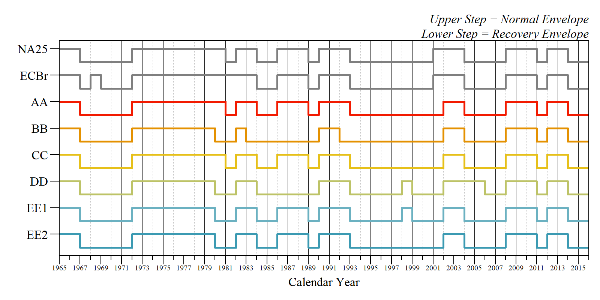
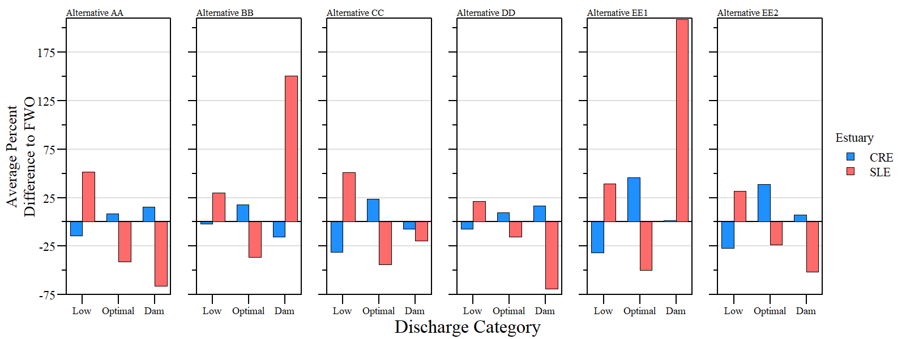
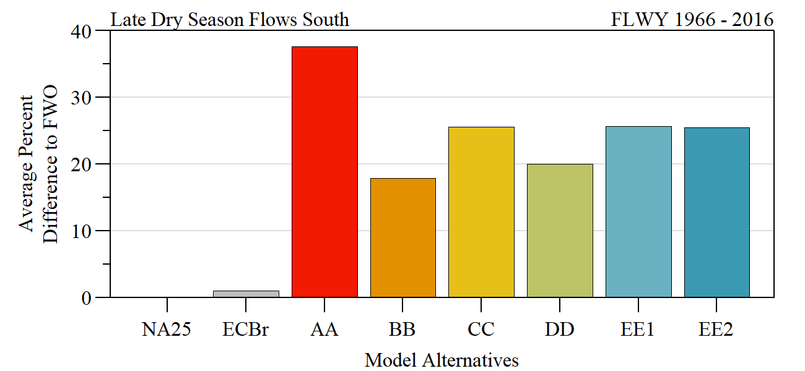

```{r setup, include=FALSE}
library(knitr)

options(htmltools.dir.version = FALSE)
knitr::opts_chunk$set(warning = FALSE, message = FALSE, echo=FALSE)

##
library(flextable)
library(magrittr)
library(plyr)

wd="C:/Julian_LaCie/_Github/LOSOM_ModelEval"

plot.path="C:/Julian_LaCie/_Github/LOSOM_ModelEval/Plots/"
export.path="C:/Julian_LaCie/_GitHub/LOSOM_ModelEval/Export/"

##
alts.sort=c("NA25","ECBr","AA","BB","CC","DD","EE1","EE2")
```

layout: true

<div class="my-footer">
<span>  </span>
</div>

---
name: title
class: left, middle

### Lake Okeechobee System Operating Manual

.pull-left[
#### Iteration 2 Modeling - <br>Evaluation Technical workshop

*Sanibel-Captiva Conservation Foundation*

*Conservancy of Southwest Florida*

`r paste(format(as.Date("2021-06-21"),"%B %d, %Y"))`


]
<!-- this ends up being the title slide since seal = FALSE-->

.pull-right[
```{r ,fig.align="center",out.width="40%"}
knitr::include_graphics('./Plots/SCCF Logo knockout_c.png')
```

```{r ,fig.align="center",out.width="40%"}
knitr::include_graphics('./Plots/ConSWFL.jpeg')
```

]

.footnote[
Paul Julian PhD [`r fontawesome::fa("fas fa-envelope")`](mailto: pjulian@sccf.org)
]

---
name: alternatives

### Iteration 2 - Model runs

```{r}

data.frame(Alternative=c("ECBr","NA25","AA","BB","CC","DD","EE1","EE2"),
           Description=c("LOSOM Existing Condition Baseline 2019", "LOSOM No Action 2025 (FWO)", "ESLE Framework. Enhances SLE ecology.","SPLC Framework. Improve water supply to pre-LORS08","Pareto Plan D Framework. Enhances CRE ecology and improves water supply","Pareto Plan A Framework. Incremental improvement over LORS.","Stage Target Operation Framework. Improve water supply performance by reducing flows south.","Stage Target Operations Framework. Reduce flows to SLE by reducing Zone B release rate."))%>%
  flextable()%>%
  colformat_char(na_str="---")%>%
  width(width=c(1,5))%>%
  padding(padding=0.1,part="all")%>%
  font(fontname="Times New Roman",part="all")%>%
  fontsize(size=10,part="body")%>%
  fontsize(size=12,part="header")%>%
  bold(part="header")%>%
  footnote(i=c(1,2),j=1,
           value=as_paragraph(c("Existing Conditions Baseline 2019, revised (replaces LSMECB)","No action Condition 2025 (replaces LSM25B)")),
           ref_symbols = c(" 1 "," 2 "),part="body")
  
```


.small[
#### Refinements (from Modeling Subteam)
* Improved eastern RSMBN domain (Grassy Waters and ITID)

* Refine C-44 basin and reservoir modeling to maintain reservoir benefits to C-44 basin

* Updated water supply for STOF Brighton Reservation
]

---
name: shortcuts
### Table of Contents
.pull-left[
* Lake Okeechobee 
  * [Stage Duration Curves](#LakeSDC)
  * [High/Low Lake Stages](#HiLoStg)
  * [Stage Envelope](#StgEnv1)
  * [Overall FWO Comparison](#StgEnv1)
  * [Above, Within and Below Comparison](#StgEnv3)

* Caloosahatchee River Estuary
  * [Flow Categories](#CREFlowCat)
  * [RECOVER Flow Categories](#CRE_tern)
  * [Basin vs Lake](#source)
  * [CRE MFL](#CREMFL)
]

.pull-right[

* St Lucie Estuary
  * [Flow Categories](#SLEFlowCat)
  * [RECOVER Flow Categories](#SLE_tern)

* [Estuary Flow Category Comparison](#estuarycompare)

* Flows South
  * [Annual Discharge comparison](#EAAQ), [Relative to FWO](#EAAQ_FWO)
  * [Wet Season discharges](#EAAWet), [Relative to FWO](#EAAWet_FWO)

* [Principal Component Analysis](#PCA1)

]

---
name: LakeSDC

### Lake Stage Duration Curves

```{r ,fig.align="center",out.width="82%"}


```
.small[
.center[Stage duration curves for the entire period of simulation (Jan 1, 1965 - Dec 31, 2016) for each alternative compared to FWO (NA25) and ECB (ECBr).]
]

--

```{r ,fig.align="center",out.width="82%"}


```
.small[
.center[Difference in stage duration curves (SDC) for the entire period of simulation (Jan 1, 1965 - Dec 31, 2016) for each alternative compared to FWO (NA25).]
]
---
name: HiLoStg

### High/Low Stages 

```{r ,fig.align="center",out.width="50%"}

knitr::include_graphics('./Plots/Iteration_2/LO_totalDays.png')
```

.center[Total number of days during the simulation period where (Top) stage elevations were `r paste("\u2264")` 11 or `r paste("\u003E")` 16 Ft NGVD29 and (Bottom) `r paste("\u2264")` 10 or `r paste("\u2265")` 17 Ft NGVD29.]


---
name: StgEnv1

### Normal/Recovery Envelope

```{r ,fig.align="center",out.width="90%"}


```
.center[Transition between normal and recovery stage envelopes for each alternative during the entire simulation period.]
.small[
.pull-left[
**Shift from normal to recovery:**
- Stages >17 Ft any time of the year
*or*
- Stage in the June1 – July31 window is `r "\u2264"` 13.0 ft for < 30 days

]

.pull-right[
**Shift from recovery to normal:**
- Stage `r "\u2264"`16.0 ft from Aug1 – Dec31
*and* 
- Stage during May1 - Aug1 falls below 11.5 Ft for 60 or more days
*or*
- Stage during Apr15 - Sep15 falls below 12.0 Ft for 90 or more days


]

]

---
name: StgEnv2

### Lake Envelope Score Summary
.pull-left[
```{r ,fig.align="center",out.width="100%"}


```
]

.pull-right[
Percent difference of average annual score relative to the FWO (NA25) alternative over the entire simulation period (FLWY 1966-2016).

* On average, stage enevelope score for alt **DD** is 9.6% lower than FWO.

* On average, stage enevelope score for alt **EE1** is 26.4% higher than FWO.

```{r}
stg.scr.sum=read.csv(paste0(export.path,"stg_score_perdiff.csv"))

stg.scr.sum[3:8,]%>%
  flextable()%>%
  colformat_double(j=2,digits=0)%>%
  colformat_double(j=3,digits=1)%>%
  padding(padding=0.5,part="all")%>%
  font(fontname="Times New Roman",part="all")%>%
  fontsize(size=10,part="body")%>%
  fontsize(size=12,part="header")%>%
  bold(part="header")%>%
  set_header_labels("Alt"="Alternative",
                    "mean.val"="Mean Score",
                    "FWO.perdiff"="% Diff.\nto FWO")%>%
  align(j=2:3,align="center",part="all")
  
```

]

---
name: StgEnv3

### Lake Okeechobee Stage Envelope
```{r ,fig.align="center",out.width="90%"}


```

<center>Average percent difference of relative to the FWO (NA25) alternative over the entire simulation period (FLWY 1966-2016) comparing percent below, within and above the Lake stage envelope (including transitions between normal and recovery).

---
name: CREFlowCat

### CRE Flow Categories

```{r ,fig.align="center",out.width="70%"}
knitr::include_graphics('./Plots/Iteration_2/CRE_iter2_freq_bxp.png')
```
.center[Boxplot representing the frequency of low (<750 cfs), optimum (750 - 2100 cfs) and damaging (>2600 cfs) flow events during the simulation period across alternatives. Dashed line represents the FWO median and green dashed line and point in boxplot indicates period of simulation mean.]

---
name: CRE_tern
class: middle

```{r ,fig.align="center",out.width="100%"}
knitr::include_graphics('./Plots/Iteration_2/CRE_FlowCat.png')
```

.center[Frequency of optimum, damaging and low flow events for the CRE during the simulation period of record (FLWY 1966 - 2016). Each point represents a seperate water year, 95% and 50% confidence intervals identified by blue dashed lines]

* The data is normalized to show variables relative to one another.

.small[[Ternary 101](https://en.wikipedia.org/wiki/Ternary_plot)]

---
name: source

### Source of Discharges
```{r ,fig.align="center",out.width="70%" }
knitr::include_graphics('./Plots/Iteration_2/S79_PercentBasinQ_bxp.png')
```
.center[
Boxplot representing the percent of S-79 discharges originating from the C-43 Basin (top) and Lake Okeechobee (bottom). Dashed line represents the FWO median and green point in boxplot indicates period of simulation mean.
]

---
name: CREMFL

### Caloosahatchee MFL

```{r ,fig.align="center",out.width="70%"}

knitr::include_graphics('./Plots/Iteration_2/CRE_MFL_sum.png')
```

.center[
Average percent difference of MFL exceedances compared to FWO (NA25) during the simulation period of record (Jan 1, 1965 - Dec 31, 2016).
]

---
name: SLEFlowCat

### SLE Flow Categories

```{r ,fig.align="center",out.width="70%" }

```
.center[
Boxplot representing the frequency of low (<150 cfs), optimum (150 - 1400 cfs) and damaging (>1700 cfs) flow events during the simulation period across alternatives. Dashed line represents the FWO median and green point in boxplot indicates period of simulation mean.
]

---
name: SLE_tern
class: middle

```{r ,fig.align="center",out.width="100%"}
knitr::include_graphics('./Plots/Iteration_2/SLE_FlowCat.png')
```

.center[Frequency of optimum, damaging and low flow events for the SLE during the simulation period of record (FLWY 1966 - 2016). Each point represents a seperate water year, 95% and 50% confidence intervals identified by blue dashed lines]

---
name: estuarycompare

### FWO Discharge Comparison
```{r ,fig.align="center",out.width="100%" }

```
.center[
Average percent difference from FWO (NA25) for low, optimal and damaging discharges for Caloosahatchee River Estuary and St Lucie Estuary (CRE and SLE, respectively).
]

* Compared annual average number of events over the FLWY 1966 - 2016 simulation period

---
name: EAAQ 

### EAA (S-354 + S-351)
```{r ,fig.align="center",out.width="80%" }

```
.center[
Boxplot representing the annual discharge volume from Lake Okeechobee to the EAA via S-354 and S-351 during the simulation period across alternatives. Dashed line represents the FWO median and green point in boxplot indicates period of simulation mean.
]

---
name: EAAQ_FWO

### FWO Discharge Comparison
```{r ,fig.align="center",out.width="100%" }
knitr::include_graphics('./Plots/Iteration_2/FlowSouth_FWOCompare.png')
```
.center[
Percent Difference from FWO (NA25) for total discharges south (S-351 and S-354).
]

* Compared annual average number of events over the FLWY 1966 - 2016 simulation period

---
name: EAAWet

### EAA (S-354 + S-351) Wet Season
```{r ,fig.align="center",out.width="90%" }

```
.center[
Wet Season (June - October) discharge to the EAA via S-354 and S-351 during the simulation period across alternatives. Dashed line represents the FWO median and green point in boxplot indicates period of simulation mean.
]

---
name: EAAWet_FWO

### FWO Discharge Comparison
```{r ,fig.align="center",out.width="100%" }
knitr::include_graphics('./Plots/Iteration_2/FlowSouth_wet_FWOCompare.png')
```
.center[
Average percent difference from FWO (NA25) for wet season discharges south (S-351 and S-354) during the simulation period of record.
]

---
name: PCA1

### Principal Component Analysis

.pull-left[
**Parameters**

* Q<sub>S79</sub>, Q<sub>S80</sub>, Q<sub>S77</sub>, Q<sub>S308</sub> and Q<sub>South</sub>: Total annual discharge.

* S79 / S80 <sub>Low, Opt, Dam</sub>: Frequency of low, optimum and damaging events at S79 / S80 (based on 14-day moving average).

* Stg <11Ft: Frequency of daily stage < 11 Ft.

* Stg >16Ft: Frequency of daily stage < 16 Ft.

* % Within: Percentage of time within the Lake stage envelope.

]

.pull-right[
**PCA Data Suitability**

* Kaiser-Meyer-Olkin Statistics (Measure of Sampling Adequacy)
  * KMO-Criterion: 0.79

* Bartlett's Test Of Sphericity
 * `r paste("\u03C7\u00B2 = 10034.6; DF = 91; \u03C1 <0.01")`
 
* [PCA Scree](#PCAScree) Plot
 
]

---
name: PCA2

### Principal Component Analysis

```{r ,fig.align="center",out.width="85%" }
knitr::include_graphics('./Plots/Iteration_2/Iter2_PCA_Alts.png')
```
.small[
* Occurrence of optimum flow events, flows south and % within envelope is positively loaded w/ CC and EE plans
* Stg >16 Ft correlated with total discharge and damaging flow events
* Stg <11 Ft correlated with low flow event
* Despite having higher Flows south AA is pulled to the bottom left (driven by higher freq stag <11 Ft).
]

---
name: PCA3

### Principal Component Analysis

```{r ,fig.align="center",out.width="90%" }

```

* *Removed the individual points to better see the ordination ellipse.* 

---

### Summary

Overall, a plan that provides a balanced approach across the system to maintain ecological integrity and function is needed. 

* All plans, *except DD*, keep lake stages higher relative to FWO.
  * AA & EEs have the highest number of days in extreme [high and low stages](#HiLoStg).

--

* CC and EEs provide the greatest number of optimum flow events for [CRE](#CREFlowCat).

--

* AA, CC and EEs provide the greatest number of low flow events for [SLE](#SLEFlowCat).
  * EE1 has highest frequency of damaging flow events for SLE.

--

* AA followed by CC and EEs provide the highest discharge volume south ([total annual](#EAAQ), [wet season](#EAAWet)) and late dry season ([*not shown*](#EAALateDry)).

--

* CC and EE plans are associated with optimal estuary flow events, flow south and % w/in the stage envelope based on [principal component analysis](#PCA2). 

--

* **PDT Question**: How much variability could we expect for EE plan(s) due to operational flexibility? 

???
**Lake Stage** EEs result in higher lake stage

**Lake Envelope** CC (and to some degree BB) provide a more balanced lake stage (relative to envelope) but not at the expense of other parts of the system

**Flows south** CC and EEs provide the highest discharge volume south but not at the expense of the Lake or Estuaries.

---
name: Acknowledgments

### Acknowledgments

```{r ,out.width="8%"}
knitr::include_graphics("https://www.sfwmd.gov/sites/default/files/documents/sfwmd-seal-hq.png")
```
South Florida Water Management District ([DBHYDRO](https://www.sfwmd.gov/science-data/dbhydro))


```{r, out.width="8%"}
knitr::include_graphics("https://www.publications.usace.army.mil/Portals/76/Publications/EngineerStandardsGraphics/gs-03.gif")
```
US Army Corps of Engineers ([USACE LOSOM](https://www.saj.usace.army.mil/LOSOM/))

  * Interagency Modeling Center

[HTML Slide deck](https://sccf-tech.github.io/slides/LOSOM/SCCF_iter2_TechWorkshop) | [PDF Slide deck](https://sccf-tech.github.io/slides/LOSOM/SCCF_iter2_TechWorkshop.pdf) | [RMarkdown Source](https://github.com/SwampThingPaul/LOSOM_ModelEval) &copy; Julian (2021) [](http://creativecommons.org/licenses/by/4.0/)

[Additional Supplemental Slides](https://sccf-tech.github.io/slides/LOSOM/SCCF_iter2_LOSOM)

.pull-left[
```{r ,fig.align="center",out.width="35%"}
knitr::include_graphics('./Plots/SCCF Logo knockout_c.png')
```
]

.pull-right[
```{r ,fig.align="center",out.width="45%"}
knitr::include_graphics('./Plots/ConSWFL.jpeg')
```
]


---
class: inverse

---
name: PCAScree

### PCA Scree plot

```{r ,fig.align="center",out.width="50%"}


```

[Principal Component Analysis](#PCA2)

---
name: EAALateDry

### EAA (S-354 + S-351) Late Dry Season
```{r ,fig.align="center",out.width="90%" }

```
.center[
Late Dry Season (Mar - May) discharge to the EAA via S-354 and S-351 during the simulation period across alternatives. Dashed line represents the FWO median and green point in boxplot indicates period of simulation mean.
]

---
name: EAALateDry_FWO

### FWO Discharge Comparison Late Dry Season
```{r ,fig.align="center",out.width="100%" }

```
.center[
Average percent difference from FWO (NA25) for late dry season (Mar - May) discharges south (S-351 and S-354) during the simulation period of record.
]

---
name: eval-methods
class: middle


#### Lake Okeechobee 

* Evaluate lake stage consistent with RECOVER - Lake Okeechobee Stage Performance Measure.
  * PM documentation - [link](https://usace.contentdm.oclc.org/utils/getfile/collection/p16021coll7/id/14096)
  * R-package - [link](https://github.com/SwampThingPaul/LORECOVER)

#### Estuaries

* Evaluate estuary discharges consistent with RECOVER thresholds
  * PM documentation - [link](https://usace.contentdm.oclc.org/utils/getfile/collection/p16021coll7/id/14793)

```{r}
#cap.val="Flow Envelopes determined as optimum, stressful, and damaging for the corresponding Salinity Envelopes of all indicator species in the Northern Estuaries."
data.frame(Estuary=c("St. Lucie", "Caloosahatchee"),Optimum=c("150 - 1400 cfs","750 - 2100 cfs"),Stress=c("1400 - 1700 cfs","2100 - 2600 cfs"),Damaging=c(">1700 cfs",">2600 cfs"))%>%
  flextable()%>%
  width(width=c(1,1.5,1.5,1))%>%
  padding(padding=0.5,part="all")%>%
  font(fontname="Times New Roman",part="all")%>%
  # fontsize(size=10,part="body")%>%
  # fontsize(size=11,part="header")%>%
  bold(part="header")%>%
  align(align="center",part="all")%>%
  bg(i=1,bg="grey90")%>%
  #add_header_lines(values=cap.val)%>%align(align="center",part="header")%>%
  footnote(part="header",value=as_paragraph("Source: RECOVER Northern Estuaries Performance Measure: Salinity Envelope"),ref_symbols =c(" "))
```

* Frequency of low (below optimum), optimum and damaging flow events were evaluated for each water year (May - April) and alternative.

* Principal Component Analysis - compare various metrics across alternatives.

