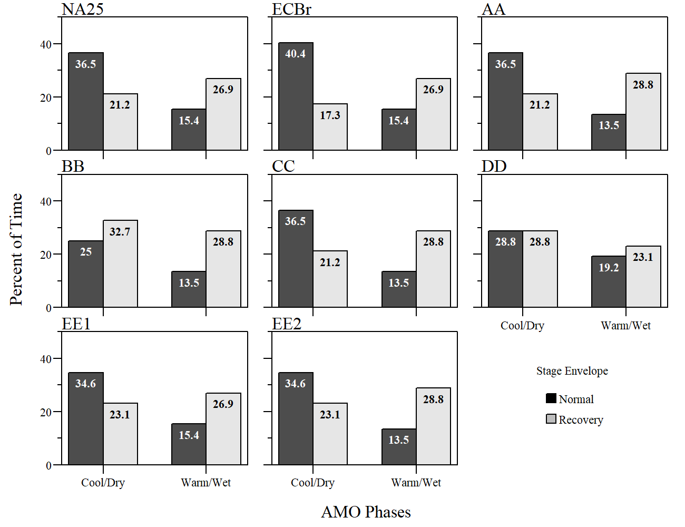
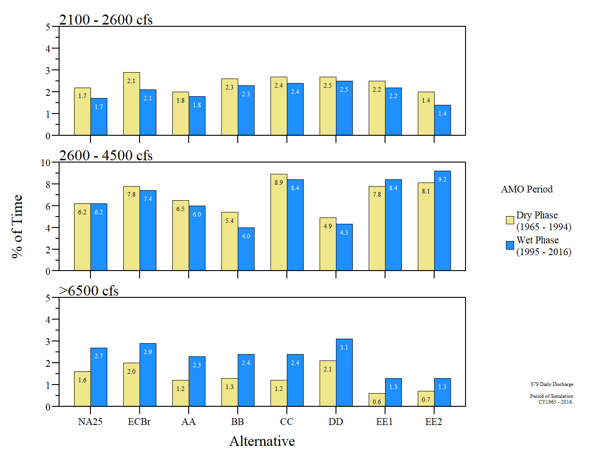

```{r setup, include=FALSE}
library(knitr)

options(htmltools.dir.version = FALSE)
knitr::opts_chunk$set(warning = FALSE, message = FALSE, echo=FALSE)

##
library(flextable)
library(magrittr)
library(plyr)

wd="C:/Julian_LaCie/_Github/LOSOM_ModelEval"

plot.path="C:/Julian_LaCie/_Github/LOSOM_ModelEval/Plots/"
export.path="C:/Julian_LaCie/_GitHub/LOSOM_ModelEval/Export/"

##
alts.sort=c("NA25","ECBr","AA","BB","CC","DD","EE1","EE2")
```

layout: true

<div class="my-footer">
<span>  </span>
</div>

---
name: title
class: left, middle

### Lake Okeechobee System Operating Manual

.pull-left[
#### Iteration 2 Modeling - <br>Evaluation Technical workshop<br>Climate perspective

*Sanibel-Captiva Conservation Foundation*

*Conservancy of Southwest Florida*

`r paste(format(as.Date("2021-06-29"),"%B %d, %Y"),"<br>(Updated:", format(as.Date(Sys.Date()),"%B %d, %Y"),")")`

]
<!-- this ends up being the title slide since seal = FALSE-->

.pull-right[
```{r ,fig.align="center",out.width="40%"}
knitr::include_graphics('./Plots/SCCF Logo knockout_c.png')
```

```{r ,fig.align="center",out.width="40%"}
knitr::include_graphics('./Plots/ConSWFL.jpeg')
```

]

.footnote[
Paul Julian PhD [`r fontawesome::fa("fas fa-envelope")`](mailto: pjulian@sccf.org)
]

---
name: climate

```{r ,fig.align="center",out.width="100%"}


```
.small[
.center[Monthly observed Atlantic Multidecadal Oscillation (AMO) Index from 1856 to 2021 for the northern Atlantic (Enfield et al. 2001).]
]


* Recent debate on AMO index suggest decadal or longer-term internal oscillatory signals that
are distinguishable from climatic noise (see Steinman et al 2015; Mann et al 2020; Mann et al 2021).

* Only variability in the interannual range associated with the El Niño/Southern Oscillation is found to be distinguishable from the noise background.
  * Still an indicator of warm/cool phase shift. 

???
Mann et al 2021
indicates that apparent AMO like oscillatory variability during the past millennium is driven exclusively by volcanic radiative forcing because

existence of externally forced multidecadal oscillations that are a consequence of competing anthropogenic forcings during the historical era and the coincidental multidecadal pacing of explosive tropical volcanic activity in past centuries

no compelling evidence for a purely internal multidecadal AMO-like cycle.

---
name: High/Low

### Extreme High/Low

```{r ,fig.align="center",out.width="100%"}


```

.center[Percent of time where stages `r paste("\u2264")` 10 or `r paste("\u2265")` 17 Ft NGVD29 during the period of simulation (1965 - 2016).]

---
name: High/Low2

### Extreme High/Low

```{r ,fig.align="center",out.width="100%"}


```

.center[Percent of time where stages `r paste("\u2264")` 10 or `r paste("\u2265")` 17 Ft NGVD29 during the period of simulation (1965 - 2016) broken down into dry (1965-1994) and wet (1995-2016) phases.]

---
name: StageEnvelope

### Lake Stage Envelope

```{r ,fig.align="center",out.width="80%"}


```
.small[
.center[Percent of time within normal and recovery stage envelope during dry (1965-1994) and wet (1995-2016) phases for ewach alternative.]
]


---
name: LakeSDC

### Lake Stage Duration Curves

```{r ,fig.align="center",out.width="82%"}


```
.small[
.center[Stage duration curves for the entire period of simulation (Jan 1, 1965 - Dec 31, 2016) within each phase for each alternative compared to FWO (NA25) and ECB (ECBr).]
]

--

```{r ,fig.align="center",out.width="82%"}


```
.small[
.center[Difference in stage duration curves (SDC;Cool - Wet) between climate phases for the entire period of simulation (Jan 1, 1965 - Dec 31, 2016) for each alternative includes FWO and ECB.]
]

---
name: CRE

.left-column[
<br>
Daily time-series of S79 discharges for each alternative with mean discharge for dry/cold (1965 – 1994) and wet/warm (1995 – 2016) AMO phase depicted (red and blue, respectively).
]

.right-column[
```{r ,fig.align="center",out.width="90%"}


```

]

---
name: CRE_bxp

```{r ,fig.align="center",out.width="90%"}


```
.small[
.center[Boxplot of daily discharge comparing dry/cold (1965 – 1994) and wet/warm (1995 – 2016) AMO phase for each alternative for the entire period of simulation (Jan 1, 1965 - Dec 31, 2016).]
]

---
name: CRE_QCat

```{r ,fig.align="center",out.width="90%"}


```

.small[
.center[Percent of time within each respective flow category for S-79 comparing dry/cold (1965 – 1994) and wet/warm (1995 – 2016) AMO phase for each alternative for the entire period of simulation (Jan 1, 1965 - Dec 31, 2016).]
]

---
name: Acknowledgments

### Acknowledgments

```{r ,out.width="8%"}
knitr::include_graphics("https://www.sfwmd.gov/sites/default/files/documents/sfwmd-seal-hq.png")
```
South Florida Water Management District ([DBHYDRO](https://www.sfwmd.gov/science-data/dbhydro))


```{r, out.width="8%"}
knitr::include_graphics("https://www.publications.usace.army.mil/Portals/76/Publications/EngineerStandardsGraphics/gs-03.gif")
```
US Army Corps of Engineers ([USACE LOSOM](https://www.saj.usace.army.mil/LOSOM/))

  * Interagency Modeling Center

[HTML Slide deck](https://sccf-tech.github.io/slides/LOSOM/SCCF_iter2_TechWorkshopClimate) | [PDF Slide deck](https://sccf-tech.github.io/slides/LOSOM/SCCF_iter2_TechWorkshopClimate.pdf) | [RMarkdown Source](https://github.com/SwampThingPaul/LOSOM_ModelEval) &copy; Julian (2021) [](http://creativecommons.org/licenses/by/4.0/)

[Script]()

[Additional Supplemental Slides](https://sccf-tech.github.io/slides/LOSOM/SCCF_iter2_LOSOM)
[Workshop #1 Presentation](https://sccf-tech.github.io/slides/LOSOM/SCCF_iter2_TechWorkshop)


.pull-left[
```{r ,fig.align="center",out.width="35%"}
knitr::include_graphics('./Plots/SCCF Logo knockout_c.png')
```
]

.pull-right[
```{r ,fig.align="center",out.width="45%"}
knitr::include_graphics('./Plots/ConSWFL.jpeg')
```
]


---
class: inverse

---
name: References

### References

* Enfield DB, Mestas-Nuñez AM, Trimble PJ (2001) The Atlantic Multidecadal Oscillation and its relation to rainfall and river flows in the continental U.S. Geophysical Research Letters 28:2077–2080. doi: 10.1029/2000GL012745

* Mann ME, Steinman BA, Brouillette DJ, Miller SK (2021) Multidecadal climate oscillations during the past millennium driven by volcanic forcing. Science 371:1014–1019. doi: 10.1126/science.abc5810

* Mann ME, Steinman BA, Miller SK (2020) Absence of internal multidecadal and interdecadal oscillations in climate model simulations. Nature Communications 11:49. doi: 10.1038/s41467-019-13823-w

* Steinman BA, Mann ME, Miller SK (2015) Atlantic and Pacific multidecadal oscillations and Northern Hemisphere temperatures. 347:5.

