```{r setup, include=FALSE}
library(knitr)

options(htmltools.dir.version = FALSE)
knitr::opts_chunk$set(warning = FALSE, message = FALSE, echo=FALSE)

##
library(flextable)
library(magrittr)

wd="C:/Julian_LaCie/_Github/LOSOM_ModelEval"

plot.path="C:/Julian_LaCie/_Github/LOSOM_ModelEval/Plots/"
export.path="C:/Julian_LaCie/_GitHub/LOSOM_ModelEval/Export/"
```

layout: true

<div class="my-footer">
<span>  </span>
</div>

---
name: title
class: left, middle

### Lake Okeechobee System Operating Manual

.pull-left[
#### Iteration 1 Modeling - Evaluation

*Sanibel-Captiva Conservation Foundation*

*Conservancy of Southwest Florida*

**DRAFT** - `r format(as.Date(Sys.Date()),"%B %d, %Y")`

]
<!-- this ends up being the title slide since seal = FALSE-->

.pull-right[
```{r ,fig.align="center",out.width="40%"}
knitr::include_graphics('./Plots/SCCF Logo knockout_c.png')
```

```{r ,fig.align="center",out.width="40%"}
knitr::include_graphics('./Plots/ConSWFL.jpeg')
```

]

---
name: alternatives

### Iteration 1 - Model runs

```{r}

data.frame(Alternative=c("LCMECB","LCM25B","ABNE","ECRE","ELOK","ESFL","ESLE","WAS","REC","NAV","WRDC","WRDS","SPAS","SPEF","SPLC"),
           Category=c("LOSOM Existing Condition Baseline 2019", "LOSOM No Action 2025 (FWO)", "Algal Bloom Risk for Northern Estuaries","Ecology - Caloosahatchee Estuary", "Ecology - Lake Okeechobee","Ecology - South Florida", "Ecology - St. Lucie Estuary","Water Supply","Recreation","Navigation","Alternative to address WRDA2020 requirements for Caloosahatchee","Alternative to address WRDA2020 requirements for St Luice","Stakeholder Plan - Audubon","Stakeholder Plan - Everglades Foundation","Stakeholder Plan - Lakeside Communities"),
           Pindex=c(NA,NA,6329,7023,601,"18729 (mode 2)",22448,15122,20814,15617,NA,NA,NA,NA,NA),
           ModelIndex=c(NA,NA,"1C-1_8086","2C_2193","LORS08flex_2827","4BC-2_6132","4C-1_3307","4BC-1_5423","4C-1_687","4BC-1_7802",NA,NA,NA,NA,NA))%>%
  flextable()%>%
  colformat_char(na_str="---")%>%
  width(width=c(1,3.5,1.5,1))%>%
  padding(padding=0.1,part="all")%>%
  font(fontname="Times New Roman",part="all")%>%
  fontsize(size=9,part="body")%>%
  fontsize(size=10,part="header")%>%
  bold(part="header")%>%
  set_header_labels("Pindex"="P Index",
                    "ModelIndex"="Model Index")%>%
  align(j=3:4,part="all",align="center")%>%
  footnote(i=~Alternative=="WRDC",j=~Alternative,
           part="body",value=as_paragraph("Prohibiting high volume releases S77,S78,S79"),ref_symbols =c(" 1 "))%>%
  footnote(i=~Alternative=="WRDS",j=~Alternative,
           part="body",value=as_paragraph("Prohibiting high volume releases S308,S80"),ref_symbols =c(" 2 "))

```

---
name: eval-methods
class: middle


#### Lake Okeechobee 

* Evaluate lake stage consistent with RECOVER - Lake Okeechobee Stage Performance Measure.
  * PM documentation - [link](https://usace.contentdm.oclc.org/utils/getfile/collection/p16021coll7/id/14096)
  * R-package - [link](https://github.com/SwampThingPaul/LORECOVER)

#### Estuaries

* Evaluate estuary discharges consistent with RECOVER thresholds
  * PM documentation - [link](https://usace.contentdm.oclc.org/utils/getfile/collection/p16021coll7/id/14793)

```{r}
cap.val="Flow Envelopes determined as optimum, stressful, and damaging for the corresponding Salinity Envelopes of all indicator species in the Northern Estuaries."
data.frame(Estuary=c("St. Lucie", "Caloosahatchee"),Optimum=c("150 - 1400 cfs","750 - 2100 cfs"),Stress=c("1400 - 1700 cfs","2100 - 2600 cfs"),Damaging=c(">1700 cfs",">2600 cfs"))%>%
  flextable()%>%
  width(width=c(1,1.5,1.5,1))%>%
  padding(padding=0.5,part="all")%>%
  font(fontname="Times New Roman",part="all")%>%
  # fontsize(size=10,part="body")%>%
  # fontsize(size=11,part="header")%>%
  bold(part="header")%>%
  align(align="center",part="all")%>%
  bg(i=1,bg="grey90")%>%
  add_header_lines(values=cap.val)%>%align(align="center",part="header")%>%
  footnote(part="header",value=as_paragraph("Source: RECOVER Northern Estuaries Performance Measure: Salinity Envelope"),ref_symbols =c(" "))
```

* Frequency of low (below optimum), optimum and damaging flow events were evaluated for each water year (May - April) and alternative.


---
name: stat101

### Quick 101

.pull-left[

* How to read box-and-whisker plots or boxplots

```{r ,fig.align="center",out.width="75%"}

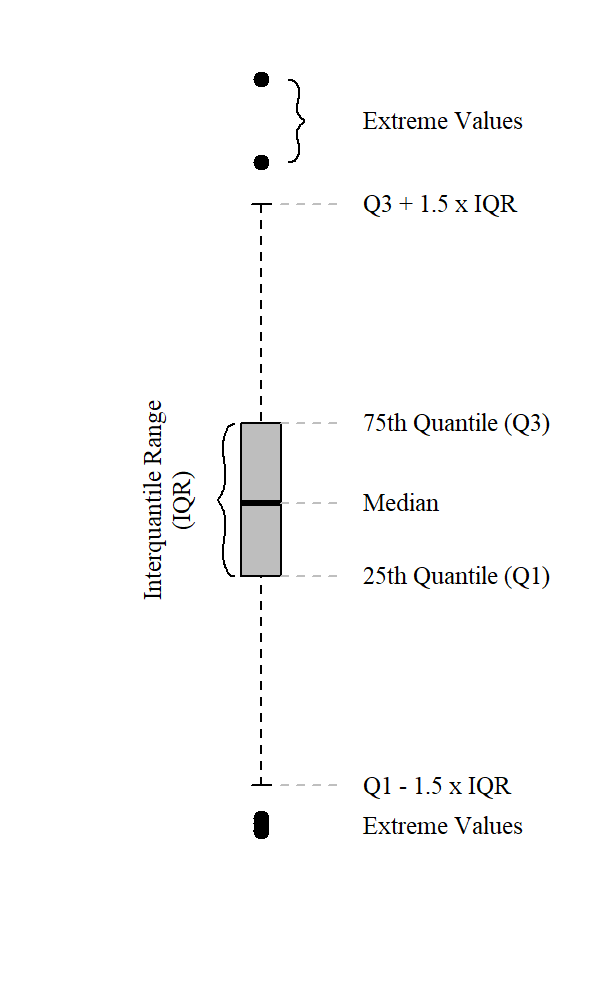
```

]

.pull-right[

* Stage and flow duration curves are based on cumulative distribution functions. 

```{r ,fig.align="center",out.width="75%"}

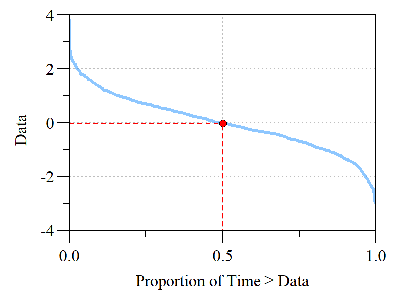
```

* *Example:* What is the data value 50% (or 0.5) of the time?
  * Follow the red dashed lines and you get a value of -0.04.

More reading on empirical CDF at this [link](https://towardsdatascience.com/what-why-and-how-to-read-empirical-cdf-123e2b922480).
]

---
name: Lake
class: middle, center

## Lake Okeechobee

---
name: sdc

### Lake Stage Duration Curves

```{r ,fig.align="center",out.width="80%"}

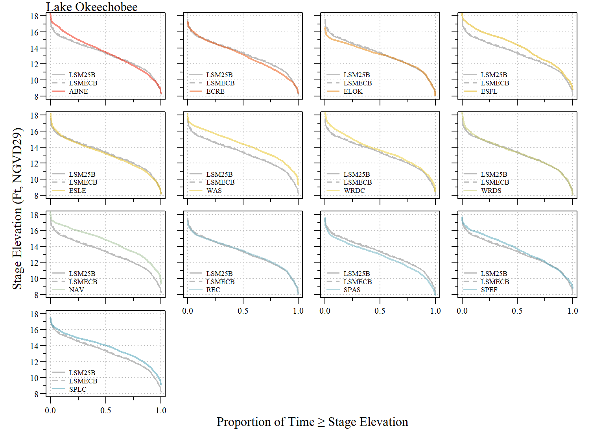
```

[Interative Plots Here](https://sccf-tech.github.io/DataReports/LOSOM/Iteration1_stagecurve.html)
---
name: LOFreq

### High/Low Stages 
```{r ,fig.align="center",out.width="75%"}
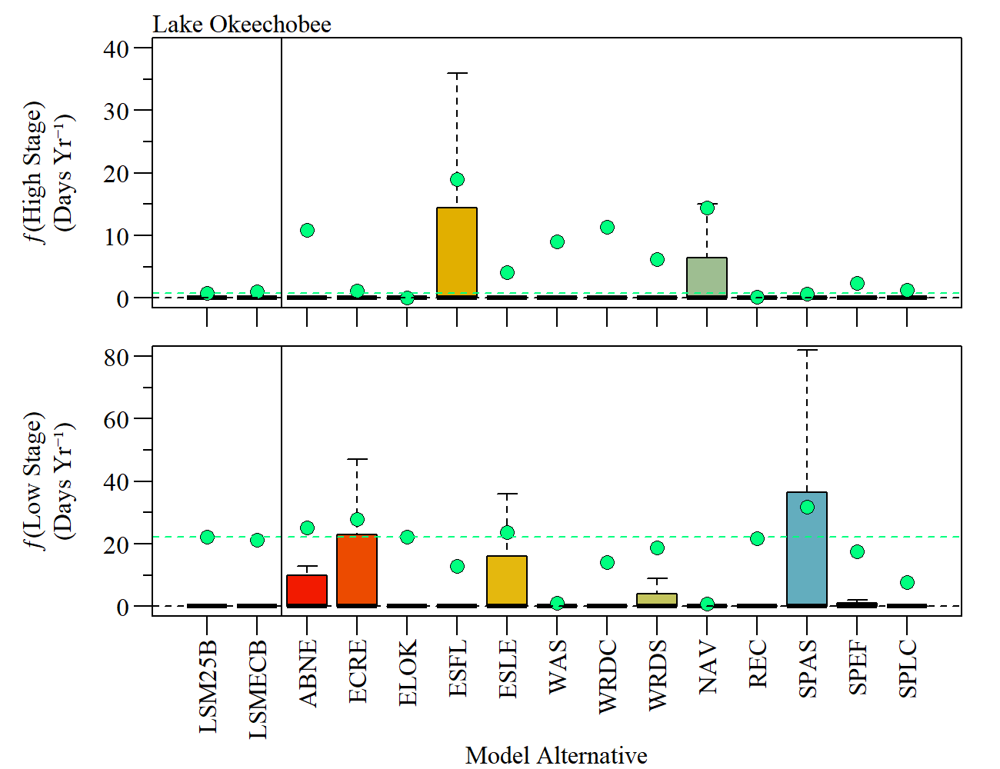
```
.center[Boxplot representing the frequency of low (<10 Ft NGVD) and high (>17 Ft NGVD) stage elevations during the simulation period across alternatives. Dashed line represents the FWO median and green dashed line and point in boxplot indicates period of simulation mean.]

---
name: LOFreq2

### High/Low Stages 
.pull-left[
```{r}

cap.val="Proportion of time during the simulation period where stage elevations \u2265 17 and 10 feet NGVD29 (see stage duration curves)."
read.csv(paste0(export.path,"highlow_ecdf_rslt.csv"))%>%
  flextable()%>%
  colformat_double(j=2:3,digits=3,na_str="---")%>%
  fontsize(size=9,part="body")%>%
  fontsize(size=10,part="header")%>%
  bold(part="header")%>%
  set_header_labels("Alt"="Alternative",
                    "high.prop"="Proportion of Time\n\u2265 17 Ft NGVD",
                    "low.prop"="Proportion of Time\n\u2265 10 Ft NGVD")%>%
  align(j=2:3,part="all",align="center")%>%
  width(width=c(1,1,1))%>%
  font(fontname="Times New Roman",part="all")%>%
  padding(padding=0.5,part="all")%>%
  add_header_lines(values=cap.val)%>%align(align="left",part="header")
```

]

.pull-right[
```{r}
cap.val="Average frequency of high (>17 Ft NGVD) and low (<10 Ft NGVD) stage occurances across the simulation period (see boxplots)."
read.csv(paste0(export.path,"highlow_meanfreq_rslt.csv"))[,c(1,3,2)]%>%
  flextable()%>%
  colformat_double(j=2:3,digits=1,na_str="---")%>%
  fontsize(size=9,part="body")%>%
  fontsize(size=10,part="header")%>%
  bold(part="header")%>%
  set_header_labels("Alt"="Alternative",
                    "freqLow"="Avg Freq of\nLow Stage\n(Days Yr\u207B\u00B9)",
                    "freqHigh"="Avg Freq of\nHigh Stage\n(Days Yr\u207B\u00B9)")%>%
  align(j=2:3,part="all",align="center")%>%
  width(width=c(1,1,1))%>%
  font(fontname="Times New Roman",part="all")%>%
  padding(padding=0.5,part="all")%>%
  add_header_lines(values=cap.val)%>%align(align="left",part="header")
```
]

---
name: LOFreq3

### High/Low Stages 

```{r ,fig.align="center",out.width="50%"}

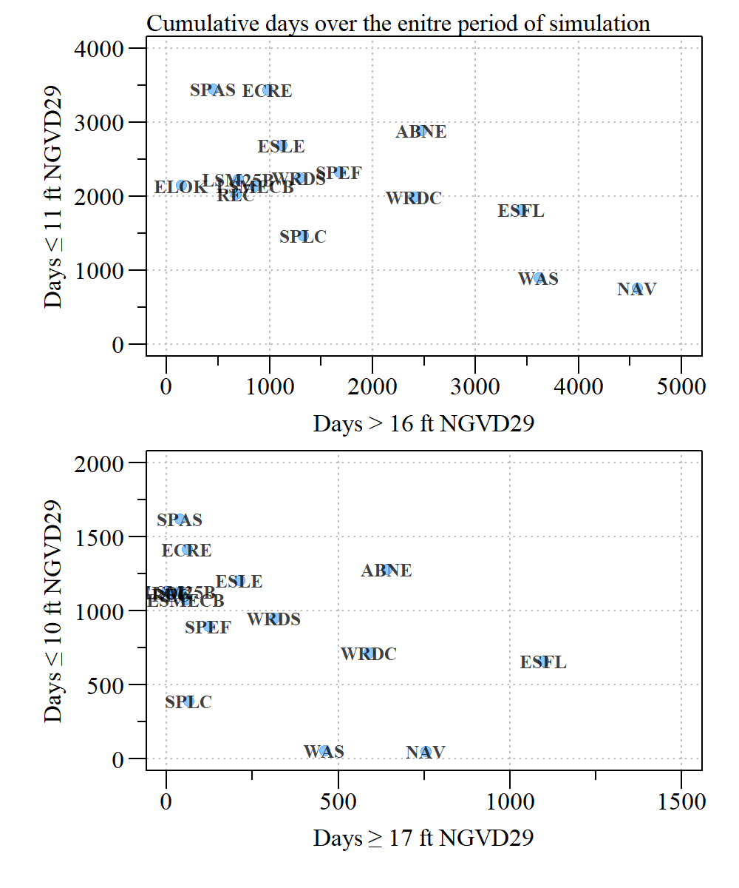
```

.center[Total number of days during the simulation period where (Top) stage elevations were `r paste("\u2264")` 11 or `r paste("\u003E")` 16 Ft NGVD29 and (Bottom) `r paste("\u2264")` 10 or `r paste("\u2265")` 17 Ft NGVD29.]

---
name: envelope

### Lake Envelope Score

```{r ,fig.align="center",out.width="75%"}

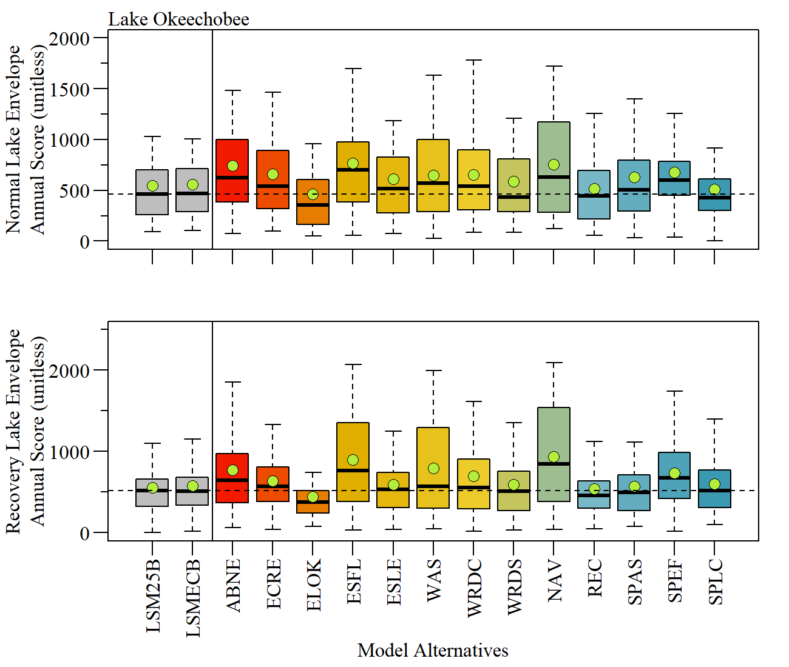
```
.center[Boxplot representing the annual normal and recovery total stage envelope score during the simulation period across alternatives. Dashed line represents the FWO median and green dashed line and point in boxplot indicates period of simulation mean.]

---
name: envelope2

### Lake Envelope Score Summary
.pull-left[
```{r ,fig.align="center",out.width="100%"}

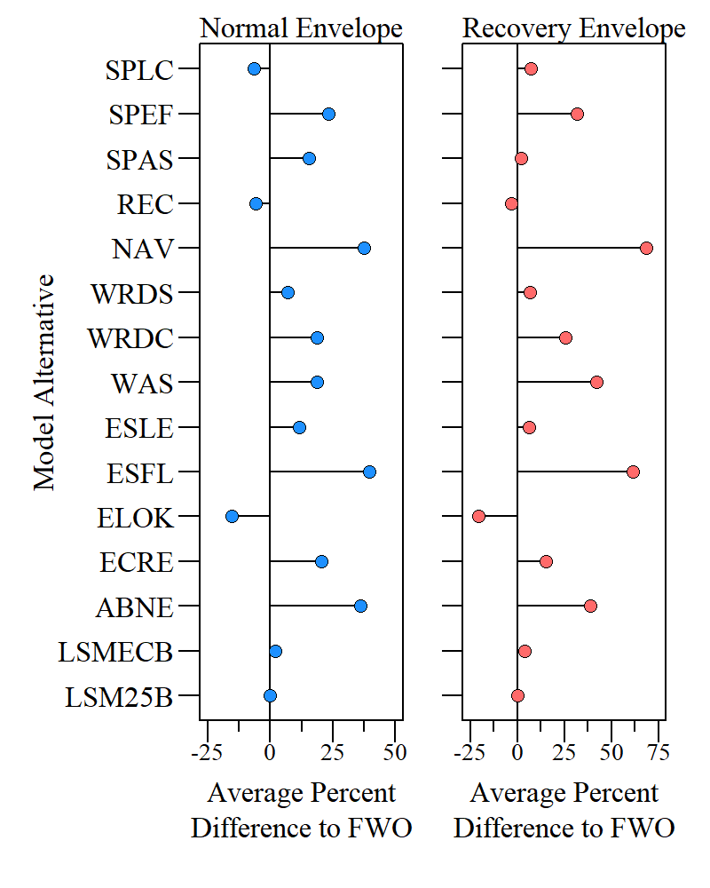
```
]

.pull-right[
Percent difference of average score relative to the FWO (LSM25B) alternative over the entire simulation period. Both Normal (left) and Recovery (right) envelope scores are presented.

]
---
name: CRE
class: middle, center

## Caloosahatchee River Estuary

---
name: fdc

### Estuary Flow Duration Curves

#### Caloosahatchee River Estuary

```{r ,fig.align="center",out.width="79%"}

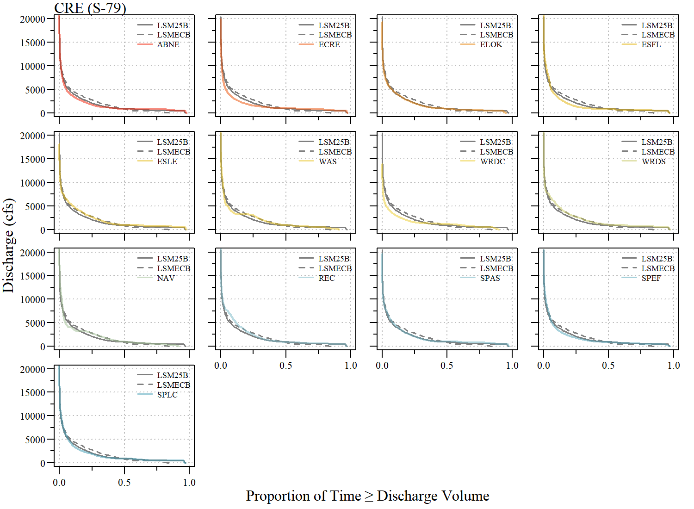
```

---
name: fdc2

### Flow Duration Curves

#### C-43 Canal

```{r ,fig.align="center",out.width="79%"}

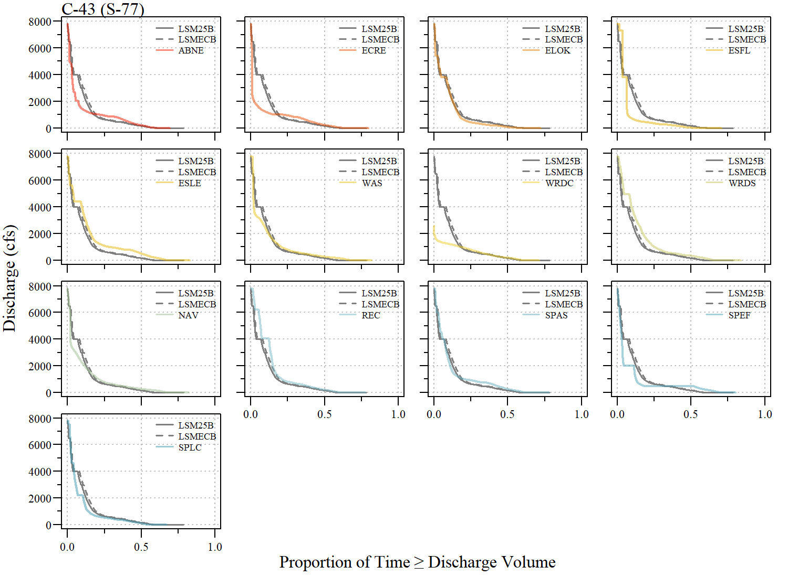
```


---
name: freq

### Flow Categories

```{r ,fig.align="center",out.width="80%"}
knitr::include_graphics('./Plots/Iteration_1/CRE_iter1_freq_bxp.png')
```
.center[Boxplot representing the frequency of low, optimum and damaging flow events during the simulation period across alternatives. Dashed line represents the FWO median and green dashed line and point in boxplot indicates period of simulation mean.]


---
name: freq2

```{r ,fig.align="center",out.width="85%"}
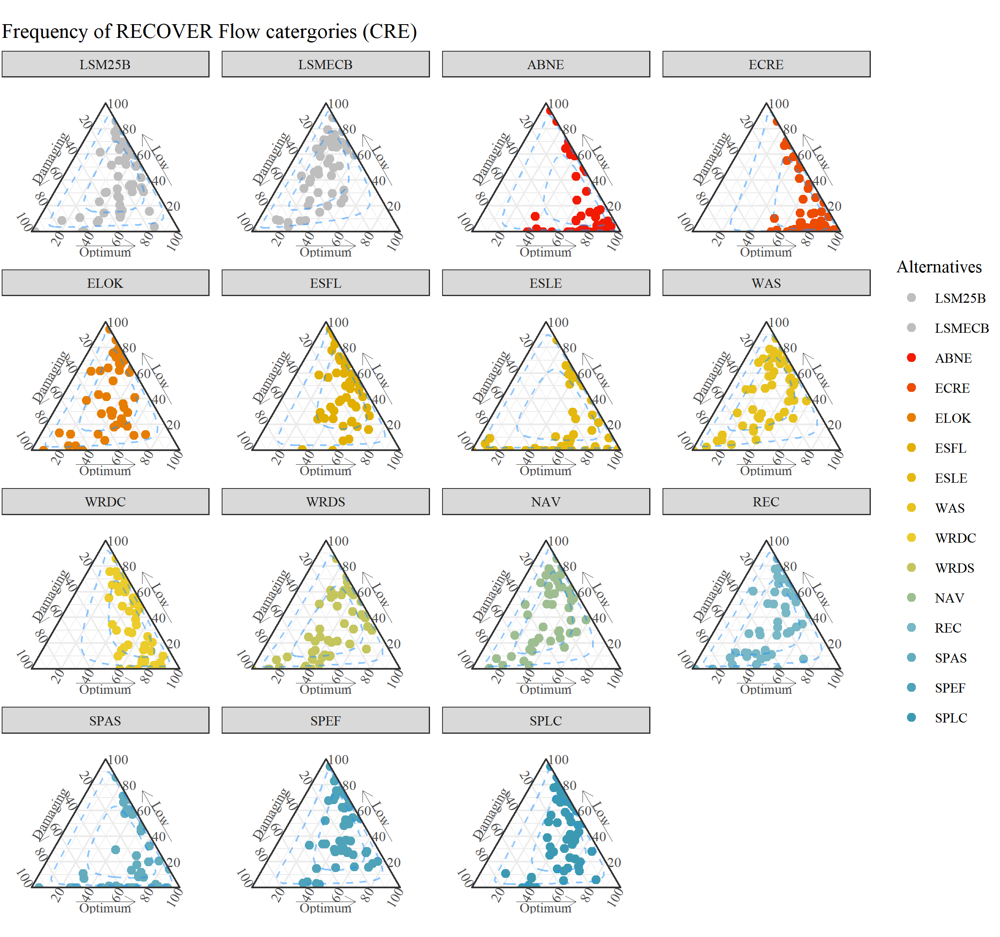
```

---
name: DrySeason2

### Dry Season Discharges
```{r ,fig.align="center",out.width="80%"}
knitr::include_graphics('./Plots/Iteration_1/S79_PercentDryQ_bxp.png')
```
.center[Boxplot representing the annual percent dry season discharge during the simulation period across alternatives. Dashed line represents the FWO median and green dashed line and point in boxplot indicates period of simulation mean.]
---
name: Source

### Source of Discharges
```{r ,fig.align="center",out.width="70%" }
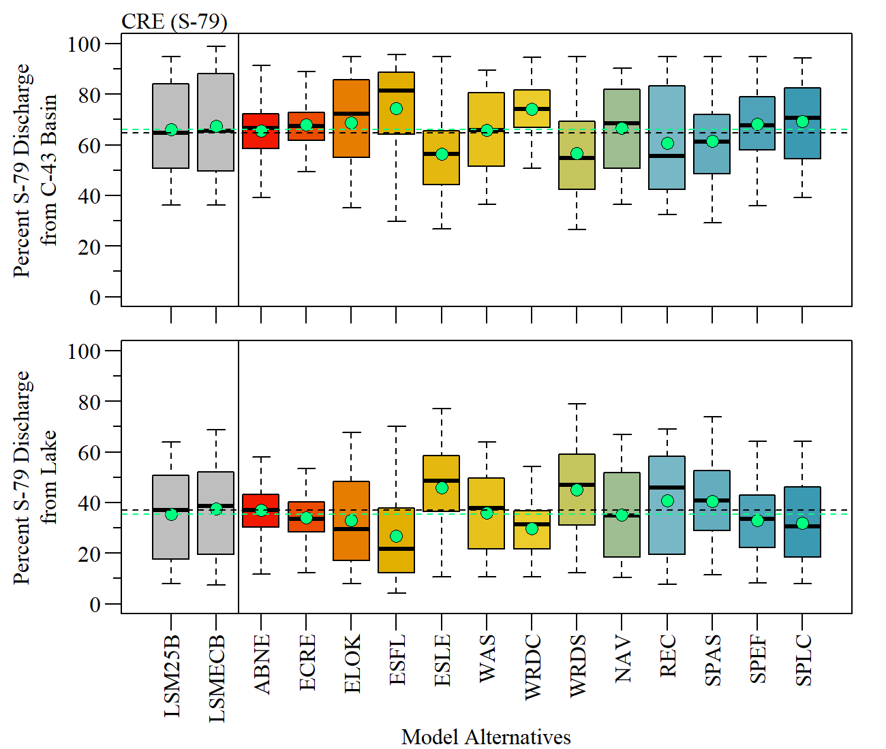
```
.center[
Boxplot representing the percent of S-79 discharges originating from the C-43 Basin (top) and Lake Okeechobee (bottom). Dashed line represents the FWO median and green point in boxplot indicates period of simulation mean.
]
---
name: Bloom

### Bloom Period Discharges
```{r ,fig.align="center",out.width="80%" }
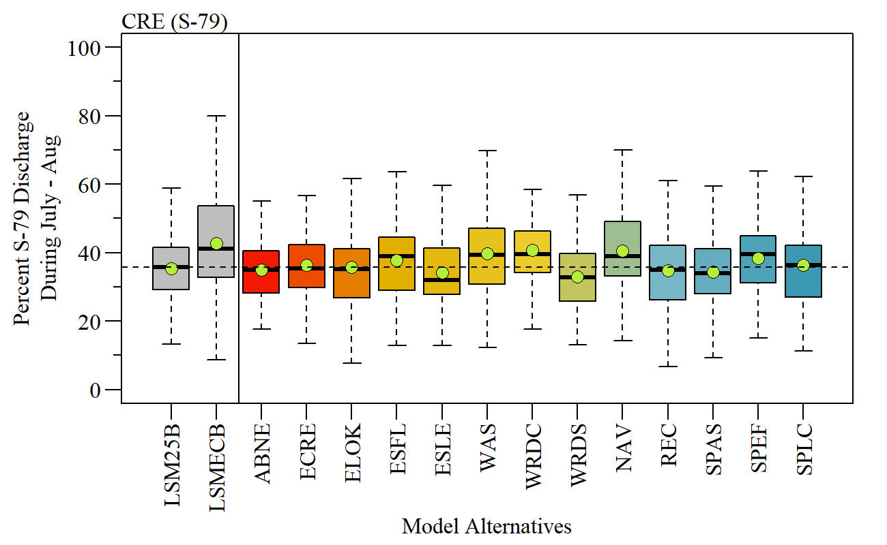
```
.center[Boxplot representing the percent of S-79 discharges during the July to August (bloom period). Dashed line represents the FWO median and green point in boxplot indicates period of simulation mean.]


---
name: SLE
class: middle, center

## St Lucie Estuary

---
name: fdcSLE

### Estuary Flow Duration Curves

#### St Lucie Estuary

```{r ,fig.align="center",out.width="79%"}

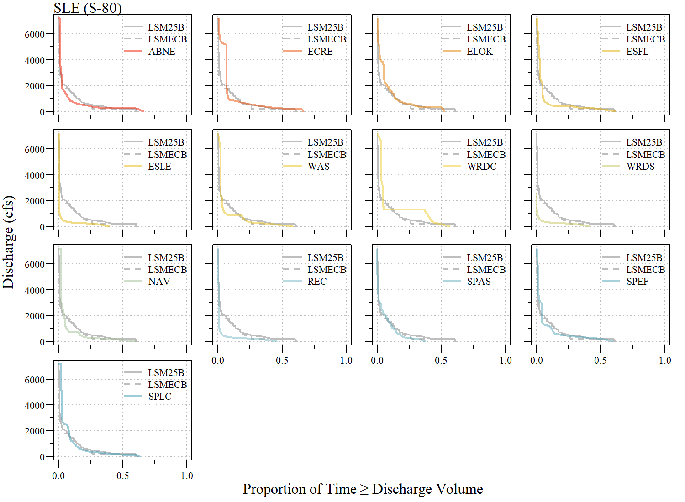
```

---
name: fdc2

### Flow Duration Curves

#### C-44 Canal

```{r ,fig.align="center",out.width="79%"}

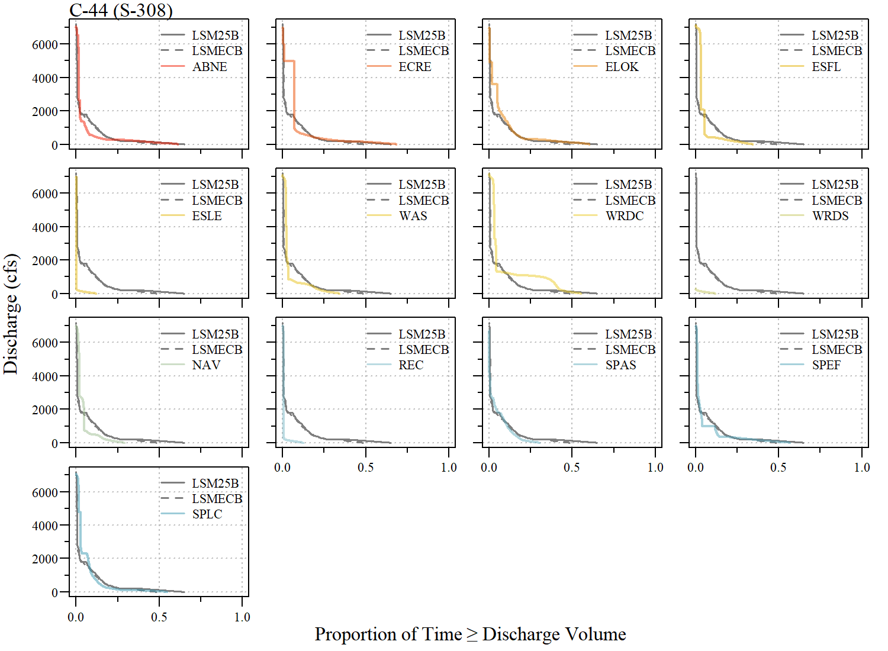
```

---
name: freqSLE

### Flow Categories

```{r ,fig.align="center",out.width="55%" }
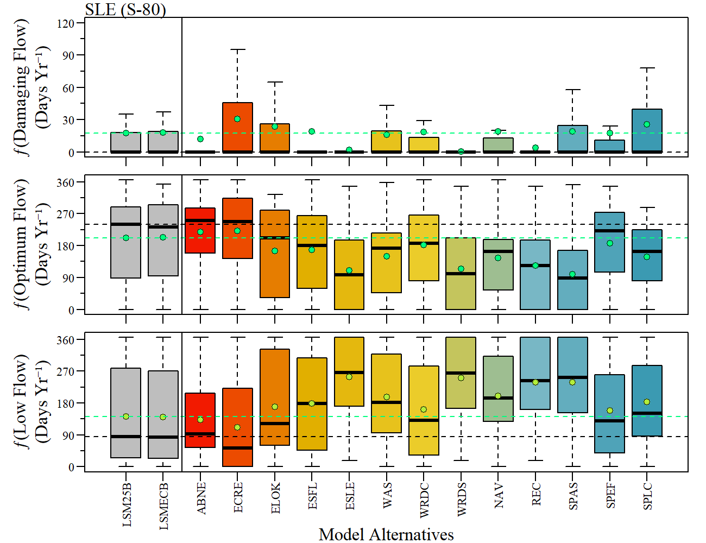
```
.center[
Boxplot representing the frequency of low, optimum and damaging flow events during the simulation period across alternatives. Dashed line represents the FWO median and green point in boxplot indicates period of simulation mean.
]
---
name: DrySeasonSLE

### Dry Season Discharges
```{r ,fig.align="center",out.width="80%" }
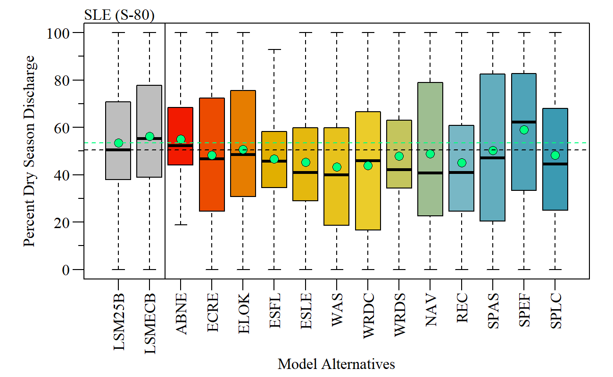
```
.center[
Boxplot representing the annual percent dry season discharge during the simulation period across alternatives. Dashed line represents the FWO median and green point in boxplot indicates period of simulation mean.
]

---
name: LakeOutflow
class: middle, center

## Flows South<br>(S351, S352 & S354)

---
name: fdcEAA

### EAA Flow Duration Curves

#### EAA (S-354 + S-351 + S-352)

```{r ,fig.align="center",out.width="79%"}

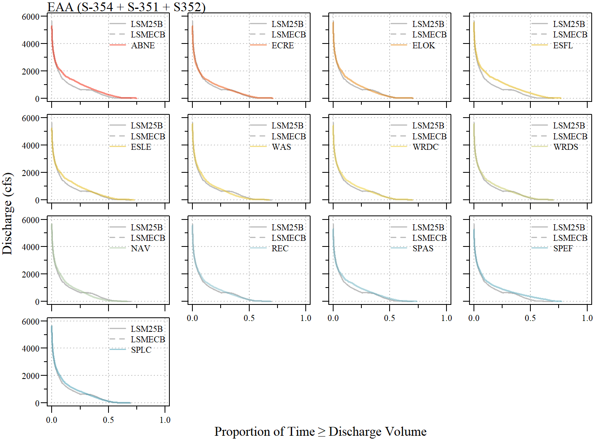
```

Flow Duration Curves for [S-354](#S354FDC), [S-351](#S351FDC), [S-352](#S352FDC)

---
name: EAAQ 

### EAA (S-354 + S-351 + S-352)
```{r ,fig.align="center",out.width="80%" }
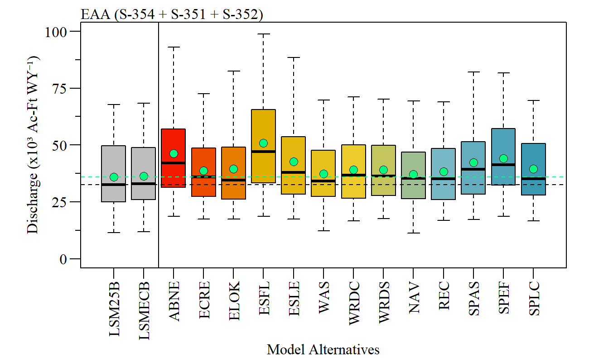
```
.center[
Boxplot representing the annual discharge volume from Lake Okeechoee to the EAA via S-354, S-351 and S-352 during the simulation period across alternatives. Dashed line represents the FWO median and green point in boxplot indicates period of simulation mean.
]

---
name: EAAQ2

### EAA (S-354 + S-351 + S-352)
.pull-left[
```{r ,fig.align="center",out.width="80%"}

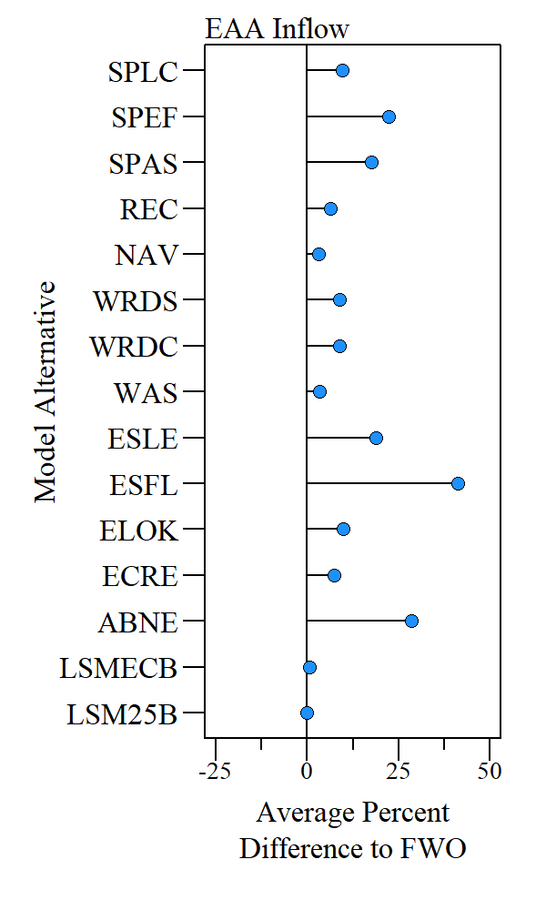
```
]

.pull-right[
Percent difference of average discharge volume score relative to the FWO (LSM25B) alternative over the entire simulation period.

]
---
class: inverse

---
name: S354FDC

### EAA Flow Duration Curves

#### EAA (S-354)

```{r ,fig.align="center",out.width="79%"}

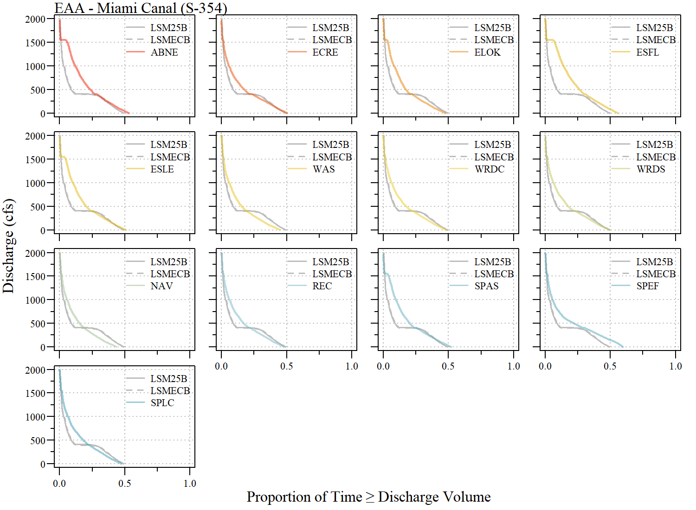
```

[EAA Flow Duration Curves](#fdcEAA)

---
name: S351FDC

### EAA Flow Duration Curves

#### EAA (S-351)

```{r ,fig.align="center",out.width="79%"}

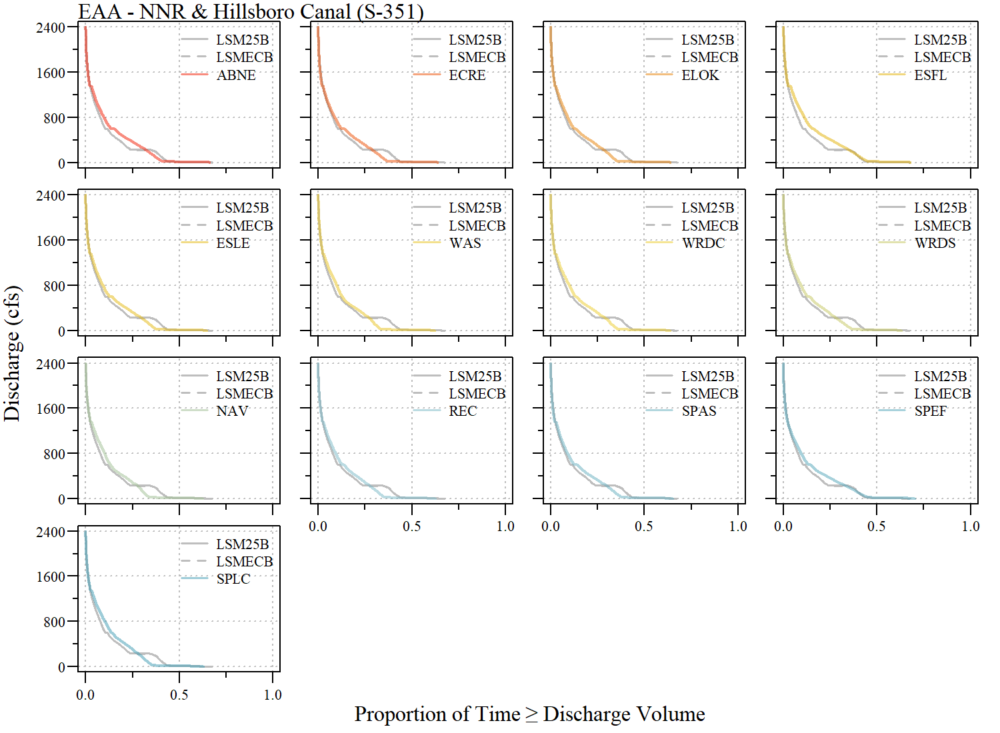
```

[EAA Flow Duration Curves](#fdcEAA)

---
name: S352FDC

### EAA Flow Duration Curves

#### EAA (S-352)

```{r ,fig.align="center",out.width="79%"}

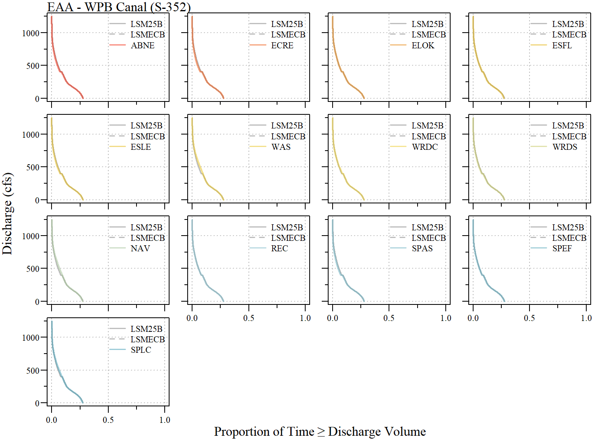
```

[EAA Flow Duration Curves](#fdcEAA)