```{r setup, include=FALSE}
library(knitr)

options(htmltools.dir.version = FALSE)
knitr::opts_chunk$set(warning = FALSE, message = FALSE, echo=FALSE)

##
library(flextable)
library(magrittr)

wd="C:/Julian_LaCie/_Github/LOSOM_ModelEval"

plot.path="C:/Julian_LaCie/_Github/LOSOM_ModelEval/Plots/"
export.path="C:/Julian_LaCie/_GitHub/LOSOM_ModelEval/Export/"
```

layout: true

<div class="my-footer">
<span>  </span>
</div>

---
name: title
class: left, middle

### Lake Okeechobee System Operating Manual

.pull-left[
#### Iteration 2 Modeling - Evaluation

*Sanibel-Captiva Conservation Foundation*

*Conservancy of Southwest Florida*

**DRAFT** - `r format(as.Date(Sys.Date()),"%B %d, %Y")`

]
<!-- this ends up being the title slide since seal = FALSE-->

.pull-right[
```{r ,fig.align="center",out.width="40%"}
knitr::include_graphics('./Plots/SCCF Logo knockout_c.png')
```

```{r ,fig.align="center",out.width="40%"}
knitr::include_graphics('./Plots/ConSWFL.jpeg')
```

]

---
name: alternatives

### Iteration 2 - Model runs

```{r}

data.frame(Alternative=c("ECBr","NA25","AA","BB","CC","DD","EE1","EE2"),
           Description=c("LOSOM Existing Condition Baseline 2019", "LOSOM No Action 2025 (FWO)", "ESLE Framework. Enhances SLE ecology.","SPLC Framework. Improve water supply to pre-LORS08","Pareto Plan D Framework. Enhances CRE ecology and improves water supply","Pareto Plan A Framework. Incremental improvement over LORS.","Stage Target Operation Framework. Improve water supply performance by reducing flows south.","Stage Target Operations Framework. Reduce flows to SLE by reducing Zone B release rate."))%>%
  flextable()%>%
  colformat_char(na_str="---")%>%
  width(width=c(1,5))%>%
  padding(padding=0.1,part="all")%>%
  font(fontname="Times New Roman",part="all")%>%
  fontsize(size=10,part="body")%>%
  fontsize(size=12,part="header")%>%
  bold(part="header")
  
```


---
name: Lake
class: middle, center

## Lake Okeechobee

---
name: sdc

### Lake Stage Duration Curves

```{r ,fig.align="center",out.width="80%"}

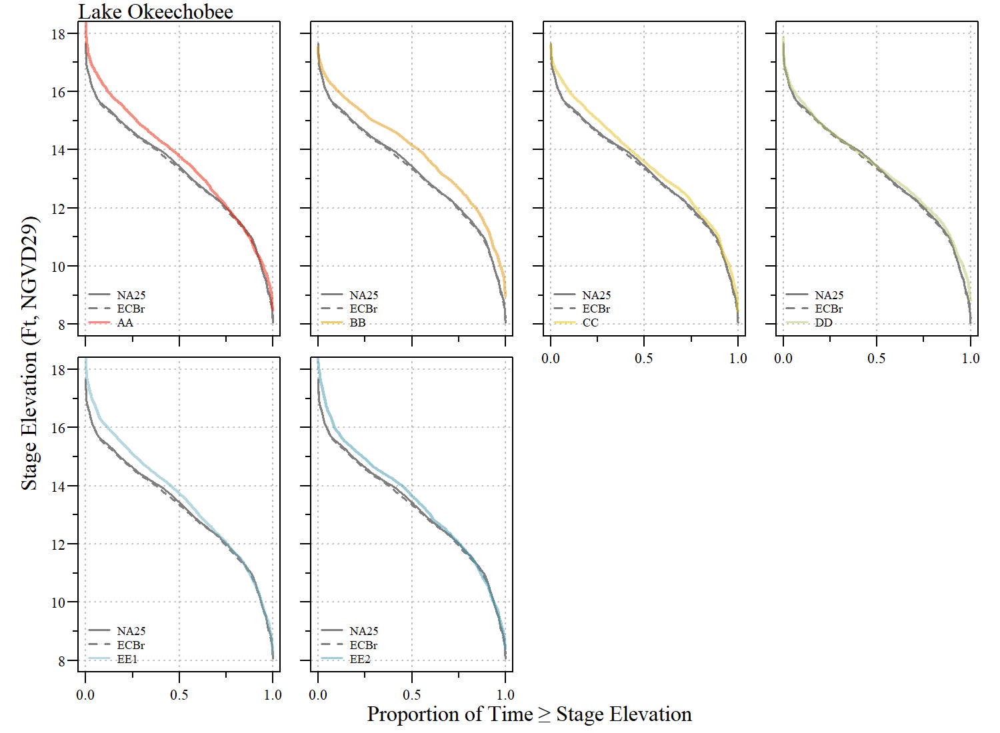
```

---
name: LOFreq

### High/Low Stages 
```{r ,fig.align="center",out.width="75%"}
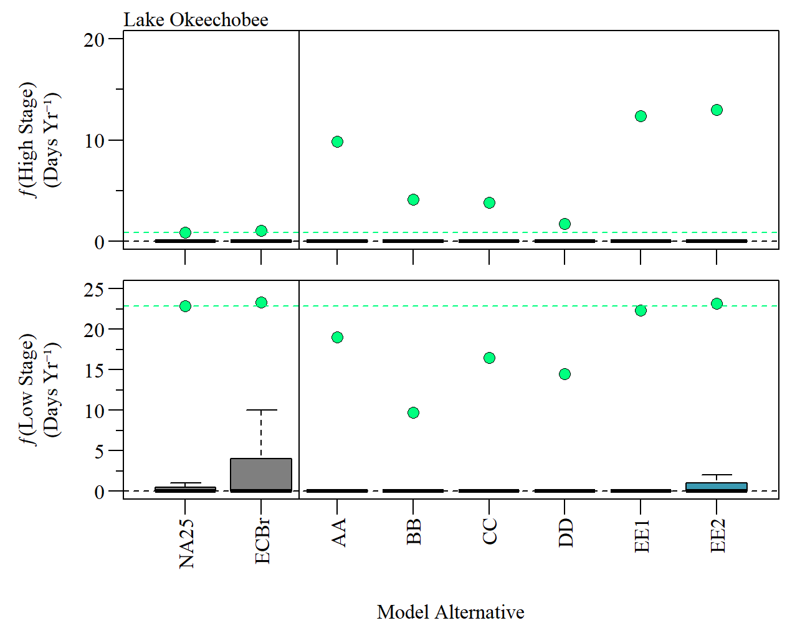
```
.center[Boxplot representing the frequency of low (<10 Ft NGVD) and high (>17 Ft NGVD) stage elevations during the simulation period across alternatives. Dashed line represents the FWO median and green dashed line and point in boxplot indicates period of simulation mean.]

---
name: LOFreq3

### High/Low Stages 

```{r ,fig.align="center",out.width="50%"}

knitr::include_graphics('./Plots/Iteration_2/LO_totalDays.png')
```

.center[Total number of days during the simulation period where (Top) stage elevations were `r paste("\u2264")` 11 or `r paste("\u003E")` 16 Ft NGVD29 and (Bottom) `r paste("\u2264")` 10 or `r paste("\u2265")` 17 Ft NGVD29.]

---
name: envelope

### Lake Envelope Score

```{r ,fig.align="center",out.width="75%"}

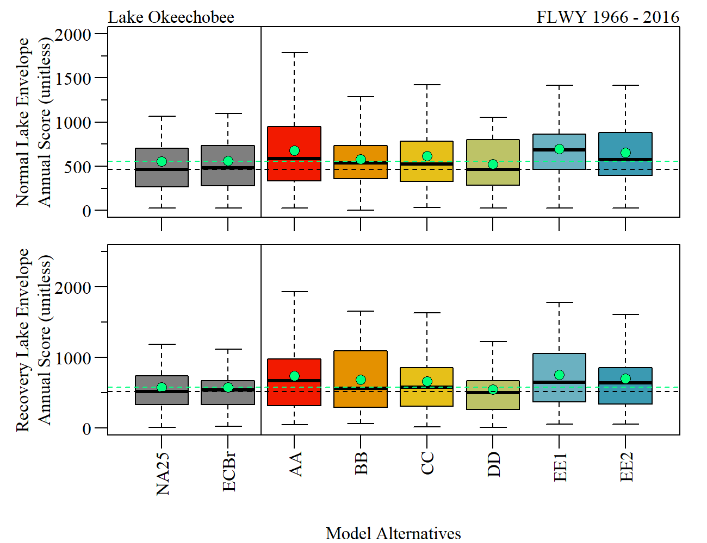
```
.center[Boxplot representing the annual normal and recovery total stage envelope score during the simulation period across alternatives. Dashed line represents the FWO median and green dashed line and point in boxplot indicates period of simulation mean.]

---
name: envelope2

### Lake Envelope Score Summary
.pull-left[
```{r ,fig.align="center",out.width="100%"}

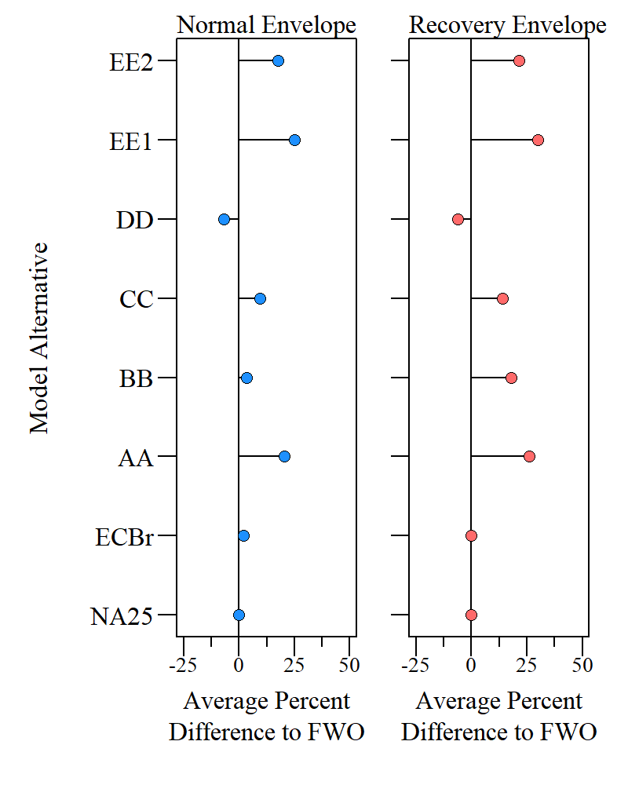
```
]

.pull-right[
Percent difference of average score relative to the FWO (NA25) alternative over the entire simulation period. Both Normal (left) and Recovery (right) envelope scores are presented.

]
---
name: CRE
class: middle, center

## Caloosahatchee River Estuary

---
name: fdc

### Estuary Flow Duration Curves

#### Caloosahatchee River Estuary

```{r ,fig.align="center",out.width="79%"}

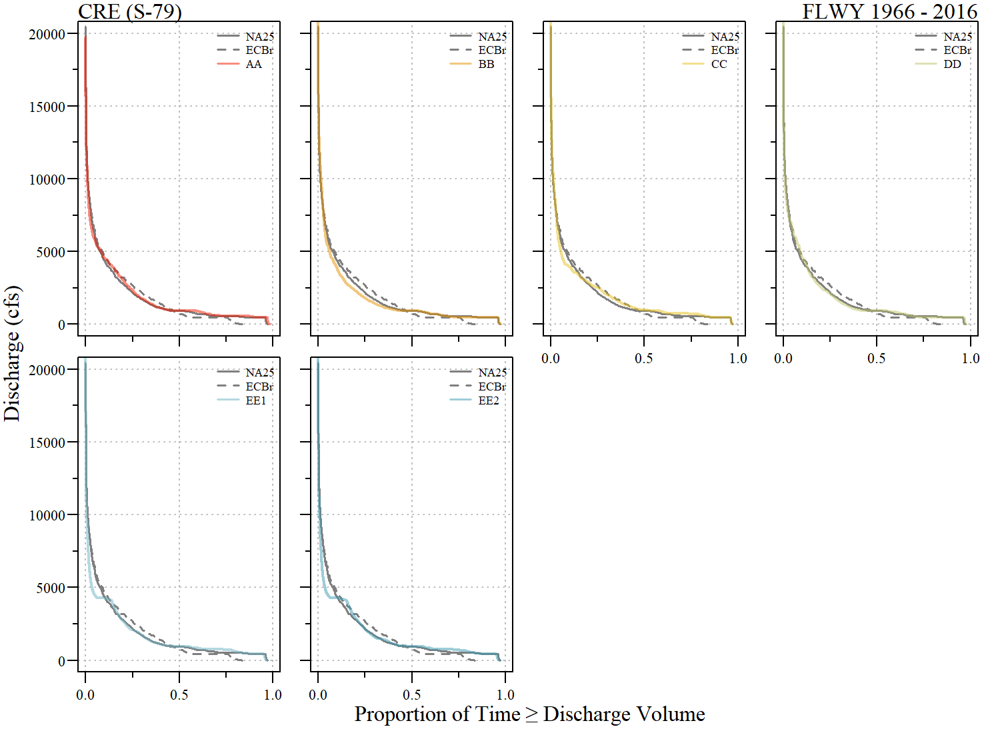
```

---
name: fdc2

### Flow Duration Curves

#### C-43 Canal

```{r ,fig.align="center",out.width="79%"}

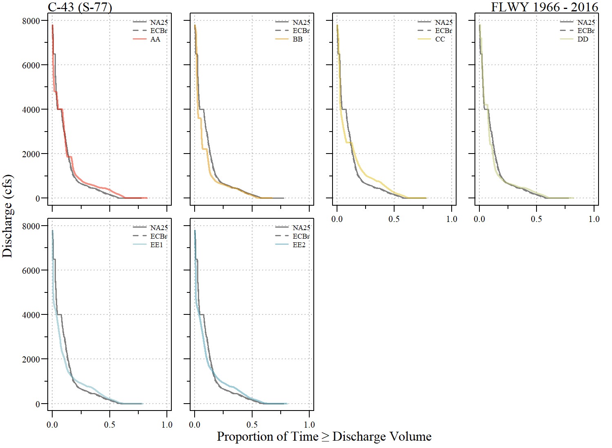
```


---
name: freq

### Flow Categories

```{r ,fig.align="center",out.width="80%"}
knitr::include_graphics('./Plots/Iteration_2/CRE_iter2_freq_bxp.png')
```
.center[Boxplot representing the frequency of low, optimum and damaging flow events during the simulation period across alternatives. Dashed line represents the FWO median and green dashed line and point in boxplot indicates period of simulation mean.]


---
name: freq2
class: middle

```{r ,fig.align="center",out.width="100%"}
knitr::include_graphics('./Plots/Iteration_2/CRE_FlowCat.png')
```

---
name: TotalQ

### Annual Discharge

```{r ,fig.align="center",out.width="85%"}
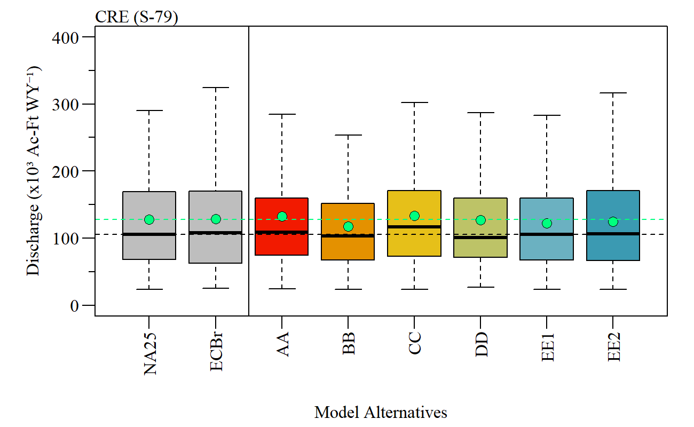
```

.center[
Boxplot representing the annual discharge volume from S-79 during the simulation period across alternatives. Dashed line represents the FWO median and green point in boxplot indicates period of simulation mean.
]


---
name: DrySeason2

### Dry Season Discharges
```{r ,fig.align="center",out.width="80%"}
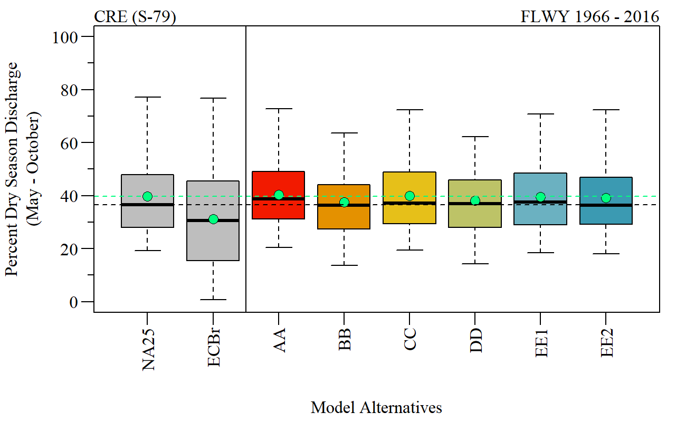
```
.center[Boxplot representing the annual percent dry (May - October) season discharge during the simulation period across alternatives. Dashed line represents the FWO median and green dashed line and point in boxplot indicates period of simulation mean.]
---
name: Source

### Source of Discharges
```{r ,fig.align="center",out.width="70%" }
knitr::include_graphics('./Plots/Iteration_2/S79_PercentBasinQ_bxp.png')
```
.center[
Boxplot representing the percent of S-79 discharges originating from the C-43 Basin (top) and Lake Okeechobee (bottom). Dashed line represents the FWO median and green point in boxplot indicates period of simulation mean.
]
---
name: Bloom

### Bloom Period Discharges
```{r ,fig.align="center",out.width="70%" }
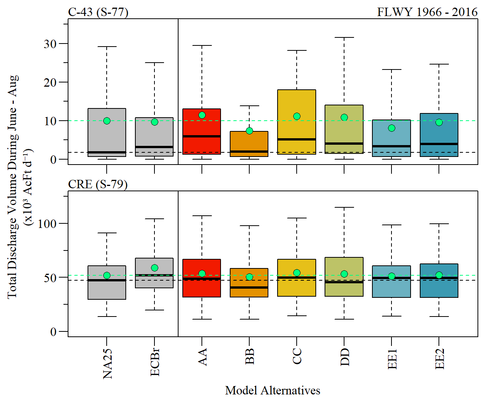
```
.center[Boxplot representing the S-77 and S-79 discharges during the June to August (bloom period). Dashed line represents the FWO median and green point in boxplot indicates period of simulation mean.]


---
name: SLE
class: middle, center

## St Lucie Estuary

---
name: fdcSLE

### Estuary Flow Duration Curves

#### St Lucie Estuary

```{r ,fig.align="center",out.width="79%"}

knitr::include_graphics('./Plots/Iteration_2/S80_FlowDuration.png')
```

---
name: fdc2

### Flow Duration Curves

#### C-44 Canal

```{r ,fig.align="center",out.width="79%"}

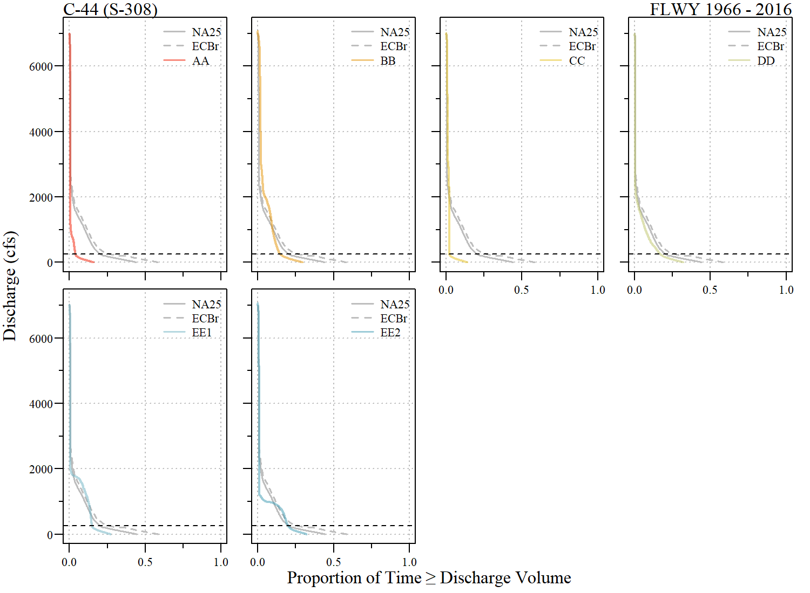
```

---
name: freqSLE

### Flow Categories

```{r ,fig.align="center",out.width="80%" }
knitr::include_graphics('./Plots/Iteration_2/SLE_iter2_freq_bxp.png')
```
.center[
Boxplot representing the frequency of low, optimum and damaging flow events during the simulation period across alternatives. Dashed line represents the FWO median and green point in boxplot indicates period of simulation mean.
]

---
name: freq2SLE
class: middle

```{r ,fig.align="center",out.width="100%"}
knitr::include_graphics('./Plots/Iteration_2/SLE_FlowCat.png')
```

---
name: TotalQSLE

### Annual Discharge

```{r ,fig.align="center",out.width="85%"}
knitr::include_graphics('./Plots/Iteration_2/S80_WYQ_bxp.png')
```

.center[
Boxplot representing the annual discharge volume from S-80 during the simulation period across alternatives. Dashed line represents the FWO median and green point in boxplot indicates period of simulation mean.
]


---
name: DrySeasonSLE

### Dry Season Discharges
```{r ,fig.align="center",out.width="80%" }
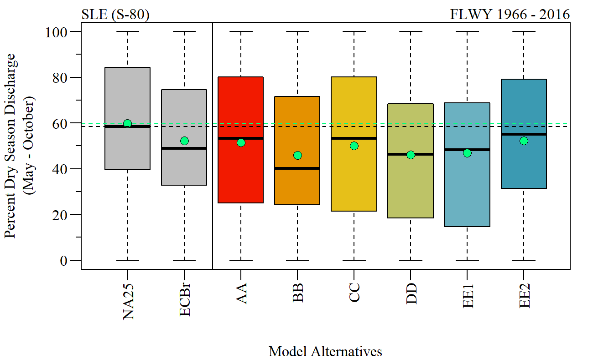
```
.center[
Boxplot representing the annual percent dry season discharge during the simulation period across alternatives. Dashed line represents the FWO median and green point in boxplot indicates period of simulation mean.
]

---
name: WetSeasonSLE

### Wet Season Discharges
```{r ,fig.align="center",out.width="80%" }
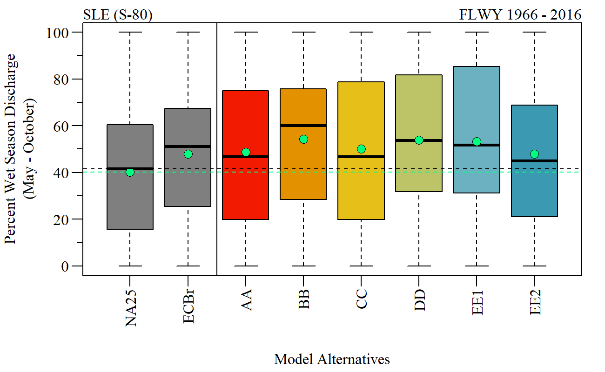
```
.center[
Boxplot representing the annual percent wet season discharge during the simulation period across alternatives. Dashed line represents the FWO median and green point in boxplot indicates period of simulation mean.
]

---
name: BloomSLE

### Bloom Period Discharges
```{r ,fig.align="center",out.width="70%" }
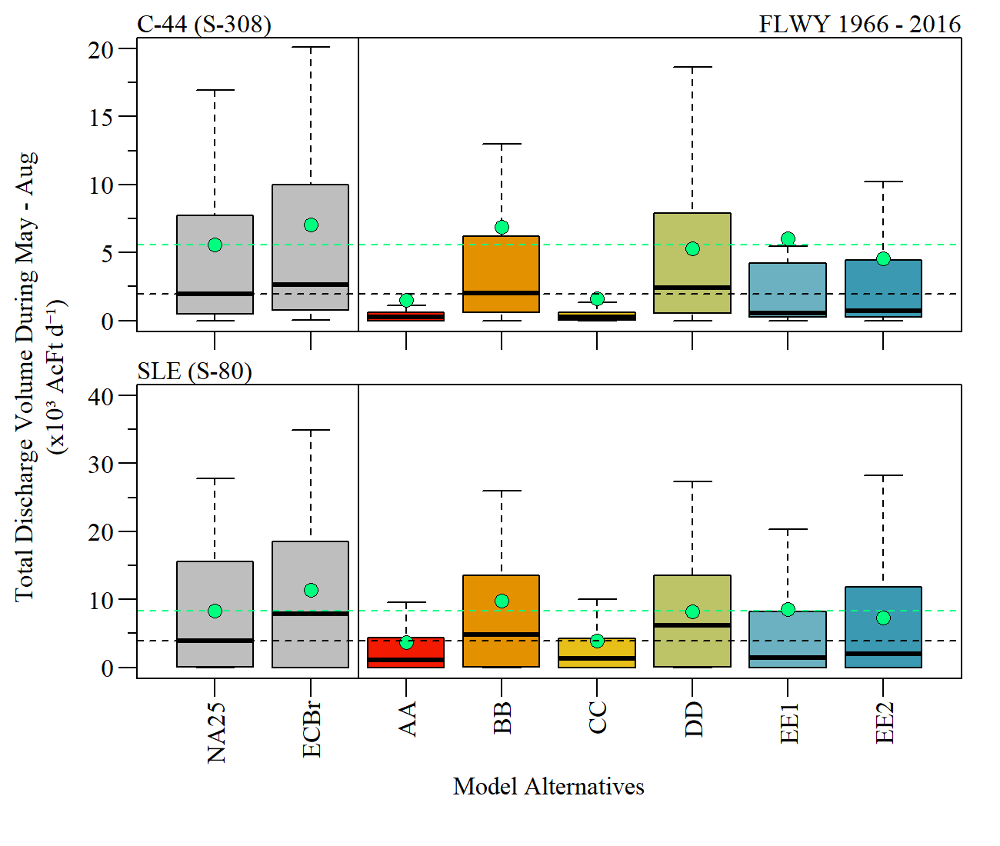
```
.center[Boxplot representing the S-308 and S-80 discharges during the May to August (bloom period). Dashed line represents the FWO median and green point in boxplot indicates period of simulation mean.]

---
name: estuarycompare

### FWO Discharge Comparison
```{r ,fig.align="center",out.width="100%" }
knitr::include_graphics('./Plots/Iteration_2/Estuary_FWOCompare.png')
```
.center[
Percent Difference from FWO (LSM25B) for low, optimal and high discharges for Caloosahatchee River Estuary and St Lucie Estuary (CRE and SLE, respectively).
]

* Compared annual average number of events over the FLWY 1966 - 2016 simulation period
---
name: LakeOutflow
class: middle, center

## Flows South<br>(S351, S352 & S354)

---
name: fdcEAA

### EAA Flow Duration Curves

#### EAA (S-354 + S-351 + S-352)

```{r ,fig.align="center",out.width="79%"}

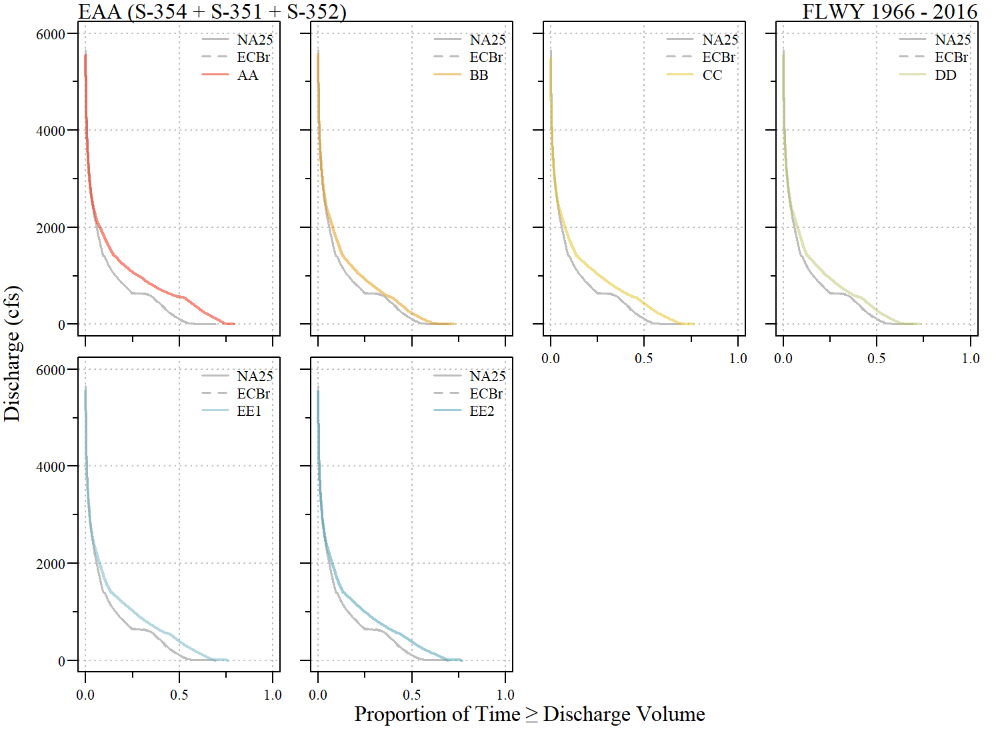
```

Flow Duration Curves for [S-354](#S354FDC), [S-351](#S351FDC), [S-352](#S352FDC)

---
name: EAAQ 

### EAA (S-354 + S-351 + S-352)
```{r ,fig.align="center",out.width="80%" }
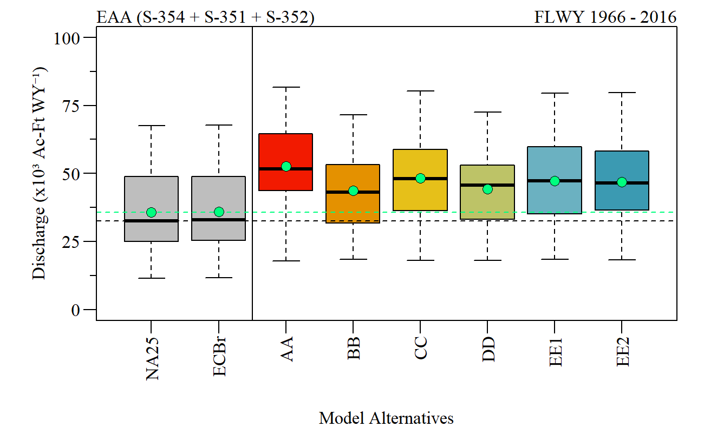
```
.center[
Boxplot representing the annual discharge volume from Lake Okeechoee to the EAA via S-354, S-351 and S-352 during the simulation period across alternatives. Dashed line represents the FWO median and green point in boxplot indicates period of simulation mean.
]

---
name: EAAQ2

### EAA (S-354 + S-351 + S-352)
.pull-left[
```{r ,fig.align="center",out.width="80%"}

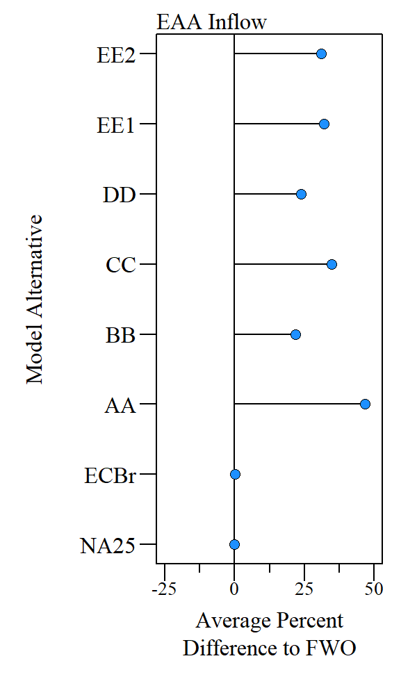
```
]

.pull-right[
Percent difference of average discharge volume score relative to the FWO (NA25) alternative over the entire simulation period.

]
---
name: WCA3
class: middle, center

## Southern Everglades (WCA3)

---
class: WCA3Q

### Annual Discharge

```{r ,fig.align="center",out.width="70%"}
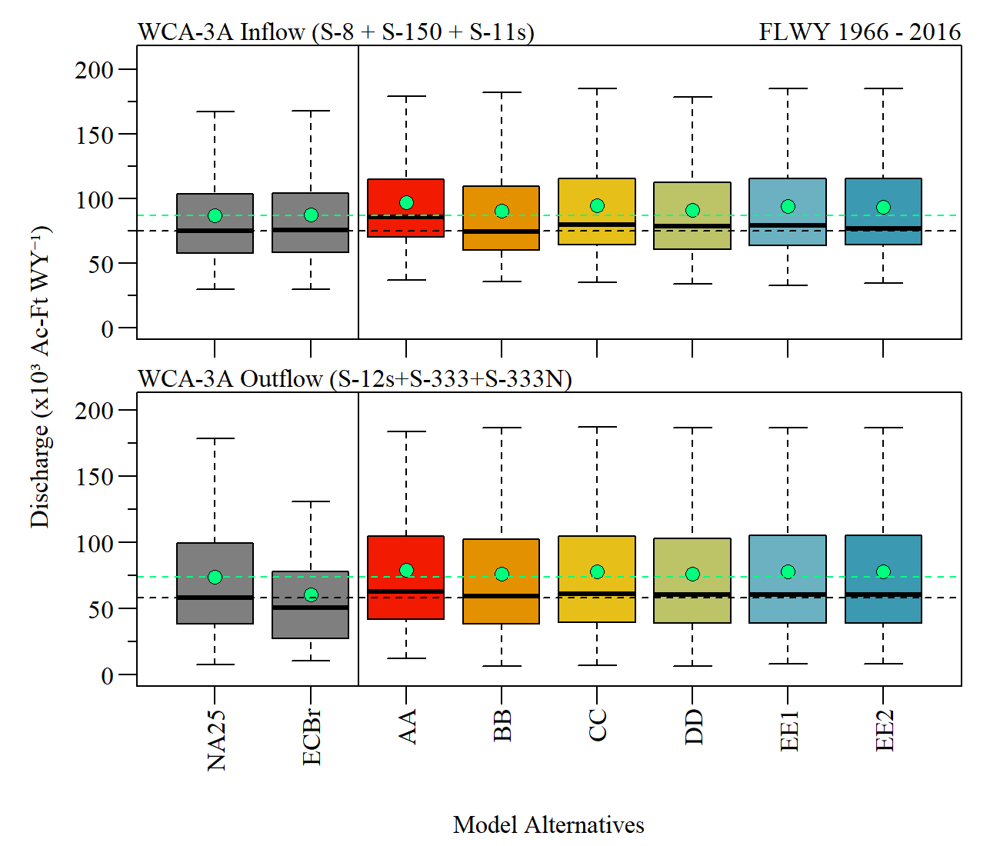
```

.center[
Boxplot representing the annual discharge volume in and out of WCA-3A during the simulation period across alternatives. Dashed line represents the FWO median and green point in boxplot indicates period of simulation mean.
]

---
name: sdc_wca3_1

### Stage Duration Curves

#### WCA-3 (3-62 and 3-63 Average)

```{r ,fig.align="center",out.width="79%"}

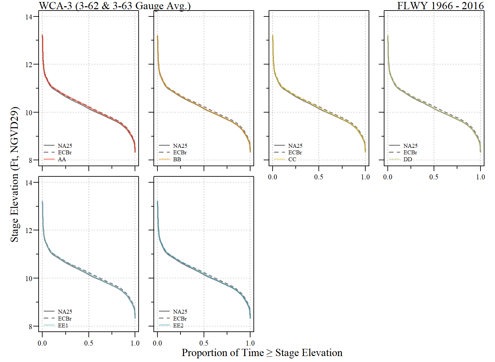
```

---
name: sdc_wca3_2

### Stage Duration Curves

#### WCA-3 (3-63, 3-64 and 3-65 Average)

```{r ,fig.align="center",out.width="79%"}

knitr::include_graphics('./Plots/Iteration_2/WCA3_636465_StageDuration.png')
```


---
name: WCA3_freqclose

### WCA-3
.pull-left[
```{r ,fig.align="center",out.width="100%"}

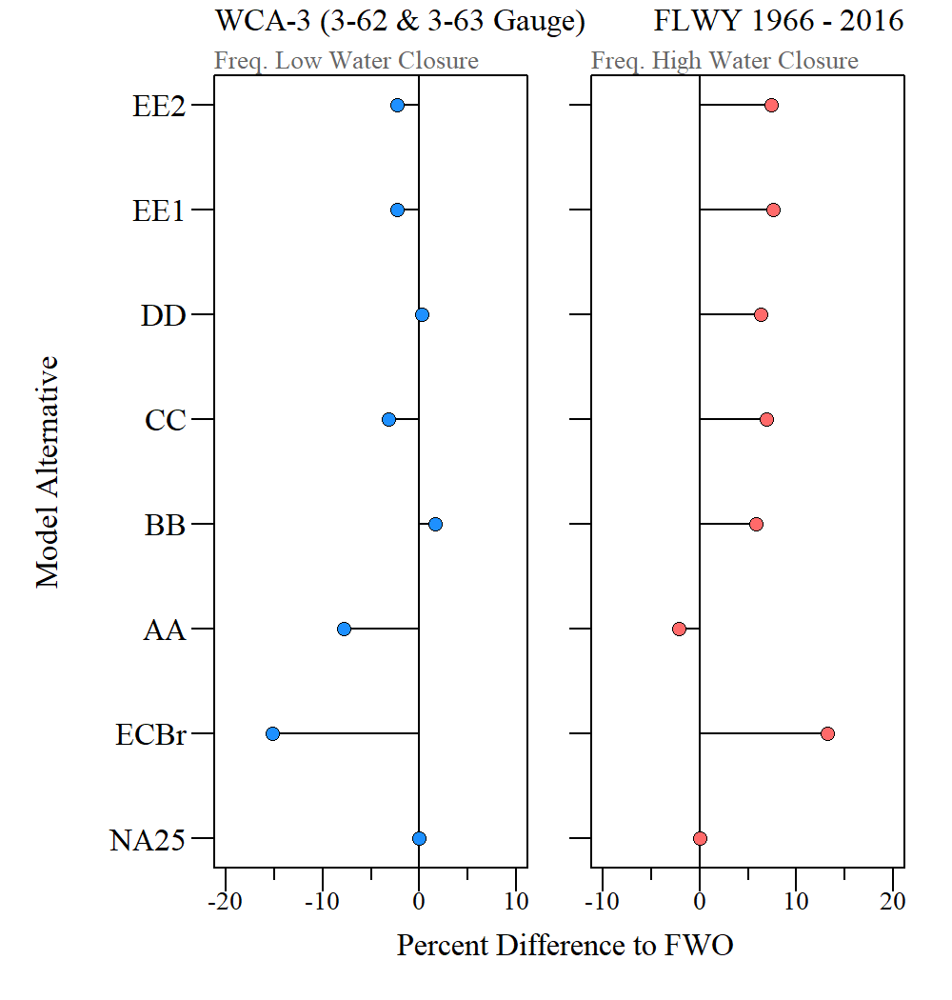
```
]

.pull-right[
#### WCA-3 Closure Criteria

* FWC High and Low water closure criteria 
  * 2-Gauge Average (3-62 and 3-63)
  * High Water Closure: 11.6 Ft NGVD29
  * Low Water Closure: 9.3 Ft NGVD29


Percent difference of the frequency of daily low (left) and high (right) closure criteria exceedances relative to the FWO (NA25) alternative over the entire simulation period.

]

---
name: WCA3_zoneA

### WCA-3
.pull-left[
```{r ,fig.align="center",out.width="80%"}

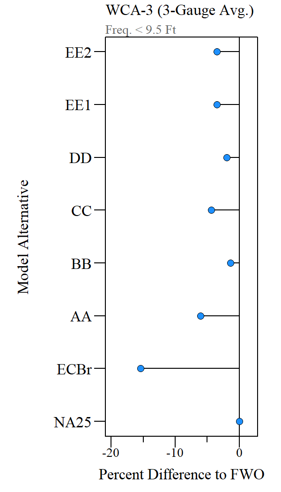
```
]

.pull-right[
#### WCA-3 

* 3-Gauge Average (3-63, 3-64 and 3-65)
* Bottom of Zone A: 9.5 Ft NGVD29

Percent difference of the frequency of daily low (left) and high (right) closure criteria exceedances relative to the FWO (NA25) alternative over the entire simulation period.

]

---
name: ENP
class: middle, center

## Everglades National Park

---
name: ENP_methods

### Everglades National Park - Water Quality

- Annual (Federal WY 1966 - 2016) Flow-Weighted Mean TP concentrations were modeled using predictive tools developed during Combined Operations (COP) Planning 
    - Predictive tools use upstream stage (3-gauge average, stage gradient, stage increase, etc.)

- Relative differences in annual FWM TP were assess.

---
name: ENP_SRS

### Everglades National Park - Water Quality

```{r ,fig.align="center",out.width="80%" }
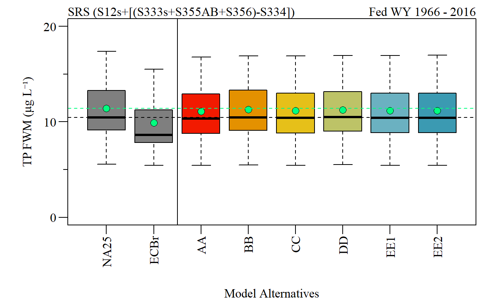
```
.center[
Boxplot representing the Shark River Slough annual flow-weighted mean TP concentration the simulation period across alternatives. Dashed line represents the FWO median and green point in boxplot indicates period of simulation mean.
]

---
name: ENP_SRS2

### Everglades National Park - Water Quality

.pull-left[
```{r ,fig.align="center",out.width="80%"}

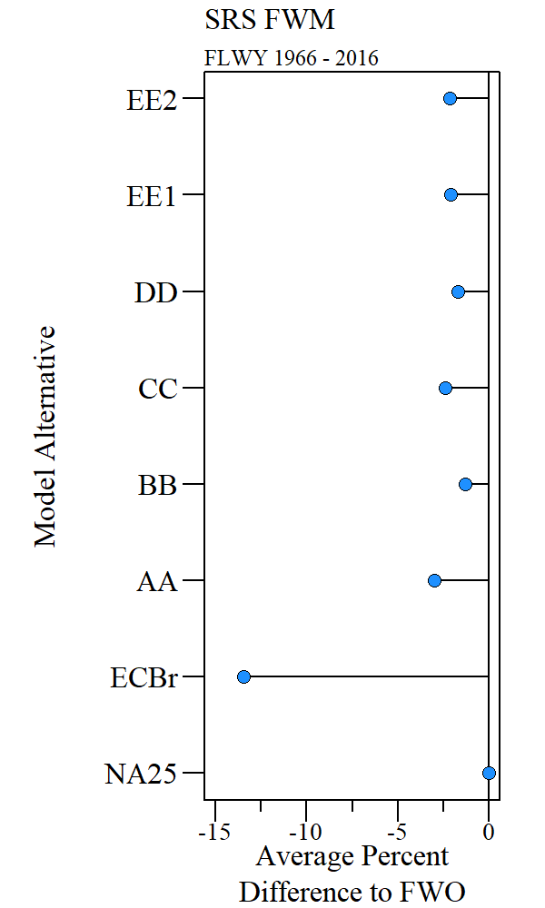
```
]

.pull-right[

Average percent difference of SRS annual TP FWM concentrations relative to the FWO (NA25) alternative over the simulation period.

]

---
class: inverse

---
name: S354FDC

### EAA Flow Duration Curves

#### EAA (S-354)

```{r ,fig.align="center",out.width="79%"}

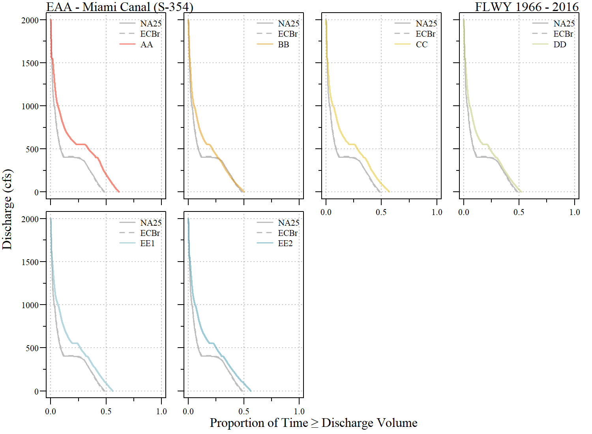
```

[EAA Flow Duration Curves](#fdcEAA)

---
name: S351FDC

### EAA Flow Duration Curves

#### EAA (S-351)

```{r ,fig.align="center",out.width="79%"}

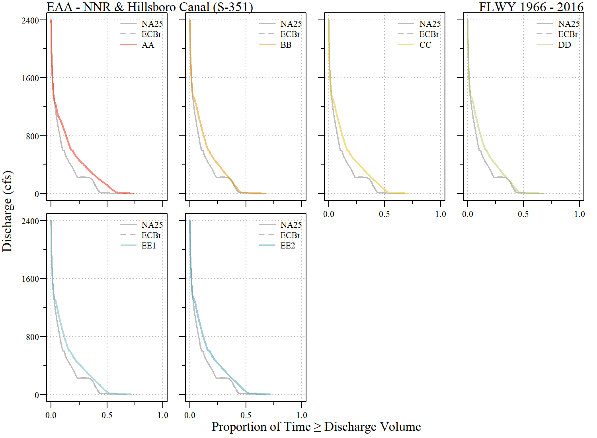
```

[EAA Flow Duration Curves](#fdcEAA)

---
name: S352FDC

### EAA Flow Duration Curves

#### EAA (S-352)

```{r ,fig.align="center",out.width="79%"}

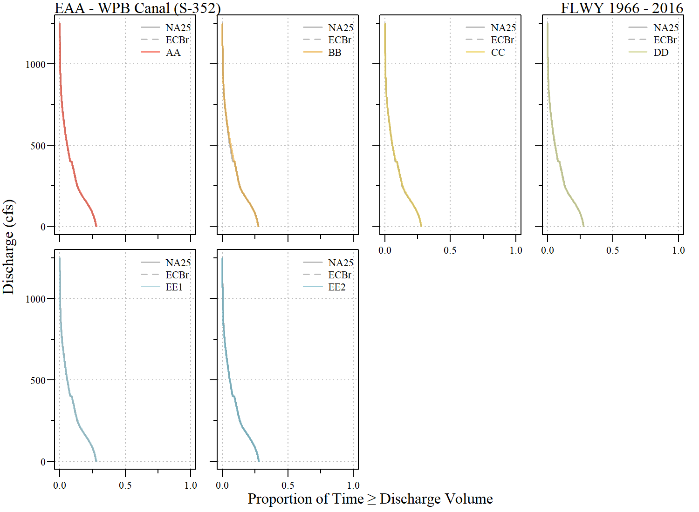
```

[EAA Flow Duration Curves](#fdcEAA)

---

---
---
name: eval-methods
class: middle


#### Lake Okeechobee 

* Evaluate lake stage consistent with RECOVER - Lake Okeechobee Stage Performance Measure.
  * PM documentation - [link](https://usace.contentdm.oclc.org/utils/getfile/collection/p16021coll7/id/14096)
  * R-package - [link](https://github.com/SwampThingPaul/LORECOVER)

#### Estuaries

* Evaluate estuary discharges consistent with RECOVER thresholds
  * PM documentation - [link](https://usace.contentdm.oclc.org/utils/getfile/collection/p16021coll7/id/14793)

```{r}
cap.val="Flow Envelopes determined as optimum, stressful, and damaging for the corresponding Salinity Envelopes of all indicator species in the Northern Estuaries."
data.frame(Estuary=c("St. Lucie", "Caloosahatchee"),Optimum=c("150 - 1400 cfs","750 - 2100 cfs"),Stress=c("1400 - 1700 cfs","2100 - 2600 cfs"),Damaging=c(">1700 cfs",">2600 cfs"))%>%
  flextable()%>%
  width(width=c(1,1.5,1.5,1))%>%
  padding(padding=0.5,part="all")%>%
  font(fontname="Times New Roman",part="all")%>%
  # fontsize(size=10,part="body")%>%
  # fontsize(size=11,part="header")%>%
  bold(part="header")%>%
  align(align="center",part="all")%>%
  bg(i=1,bg="grey90")%>%
  add_header_lines(values=cap.val)%>%align(align="center",part="header")%>%
  footnote(part="header",value=as_paragraph("Source: RECOVER Northern Estuaries Performance Measure: Salinity Envelope"),ref_symbols =c(" "))
```

* Frequency of low (below optimum), optimum and damaging flow events were evaluated for each water year (May - April) and alternative.


---
name: stat101

### Quick 101

.pull-left[

* How to read box-and-whisker plots or boxplots

```{r ,fig.align="center",out.width="75%"}

knitr::include_graphics('./Plots/boxplot_explain.png')
```

]

.pull-right[

* Stage and flow duration curves are based on cumulative distribution functions. 

```{r ,fig.align="center",out.width="75%"}

knitr::include_graphics('./Plots/ecdf_explain.png')
```

* *Example:* What is the data value 50% (or 0.5) of the time?
  * Follow the red dashed lines and you get a value of -0.04.

More reading on empirical CDF at this [link](https://towardsdatascience.com/what-why-and-how-to-read-empirical-cdf-123e2b922480).
]
