```{r setup, include=FALSE}
library(knitr)

options(htmltools.dir.version = FALSE)
knitr::opts_chunk$set(warning = FALSE, message = FALSE, echo=FALSE)

##
library(flextable)
library(magrittr)
library(plyr)

wd="C:/Julian_LaCie/_Github/LOSOM_ModelEval"

plot.path="C:/Julian_LaCie/_Github/LOSOM_ModelEval/Plots/"
export.path="C:/Julian_LaCie/_GitHub/LOSOM_ModelEval/Export/"

##
alts.sort=c("NA25","ECBr","AA","BB","CC","DD","EE1","EE2")
```

layout: true

<div class="my-footer">
<span>  </span>
</div>

---
name: title
class: left, middle

### Lake Okeechobee System Operating Manual

.pull-left[
#### Iteration 2 Modeling - Evaluation

*Sanibel-Captiva Conservation Foundation*

*Conservancy of Southwest Florida*

**DRAFT** - `r paste(format(as.Date("2021-06-09"),"%B %d, %Y"),"<br>(Updated:", format(as.Date(Sys.Date()),"%B %d, %Y"),")")`

]
<!-- this ends up being the title slide since seal = FALSE-->

.pull-right[
```{r ,fig.align="center",out.width="40%"}
knitr::include_graphics('./Plots/SCCF Logo knockout_c.png')
```

```{r ,fig.align="center",out.width="40%"}
knitr::include_graphics('./Plots/ConSWFL.jpeg')
```

]

---
name: alternatives

### Iteration 2 - Model runs

```{r}

data.frame(Alternative=c("ECBr","NA25","AA","BB","CC","DD","EE1","EE2"),
           Description=c("LOSOM Existing Condition Baseline 2019", "LOSOM No Action 2025 (FWO)", "ESLE Framework. Enhances SLE ecology.","SPLC Framework. Improve water supply to pre-LORS08","Pareto Plan D Framework. Enhances CRE ecology and improves water supply","Pareto Plan A Framework. Incremental improvement over LORS.","Stage Target Operation Framework. Improve water supply performance by reducing flows south.","Stage Target Operations Framework. Reduce flows to SLE by reducing Zone B release rate."))%>%
  flextable()%>%
  colformat_char(na_str="---")%>%
  width(width=c(1,5))%>%
  padding(padding=0.1,part="all")%>%
  font(fontname="Times New Roman",part="all")%>%
  fontsize(size=10,part="body")%>%
  fontsize(size=12,part="header")%>%
  bold(part="header")%>%
  footnote(i=c(1,2),j=1,
           value=as_paragraph(c("Existing Conditions Baseline 2019, revised (replaces LSMECB)","No action Condition 2025 (replaces LSM25B)")),
           ref_symbols = c(" 1 "," 2 "),part="body")
  
```


.small[
#### Refinements (from Modeling Subteam)
* Improved eastern RSMBN domain (Grassy Waters and ITID)

* Refine C-44 basin and reservoir modeling to maintain reservoir benefits to C-44 basin

* Updated water supply for STOF Brighton Reservation
]

---
name: summary

```{r}
in.bord=officer::fp_border(color="grey",width=0.5)

data.frame(Alt=c("AA","BB","CC","DD","EE1","EE2"),
           CRE=c(
             "\u2191 Total annual S79 Q;\nMarginal \u2191 Optimal Q events;\n \u2191 Damaging Q events;\n\u2193 MFL Exceedance",
             "\u2193 Total annual S79 Q;\n\u2191 Optimal Q events;\u2193 Damaging Q events;\n Marginal \u2191 Low Q events;\n\u2193 MFL Exceedance",
             "\u2191 Total annual S79 Q;\n\u2191 Optimal Q events;\n\u2193 Low & Damaging Q events;\n No \u0394 MFL Exceedance",
             "\u2193 Total annual S79 Q;\n\u2191 Optimal & Damaging Q events;\n\u2193 Low Q events;\n No \u0394 MFL Exceedance",
             "\u2193 Total annual S79 Q;\n\u2191 Optimal & Low Q events;\nMarginal \u2191 Damaging Q events;\n\u2191 MFL Exceedance",
             "\u2193 Total annual S79 Q;\n\u2191 Optimal & Low Q events;\nMarginal \u2191 Damaging Q events;\n\u2191 MFL Exceedance"),
           LakeO=c("\u2191 Avg POS Envelope Score;\n\u2193 % Below & Within Envelope;\n\u2191 % Above Envelope","\u2191 Avg POS Envelope Score;\n\u2193\u2193 % Below Envelope;\n\u2193 % Within Evnelope;\n\u2191\u2191 % Above Envelope","\u2191 Avg POS Envelope Score;\n\u2193 % Below & Within Envelope;\n\u2191 % Above Envelope","\u2193 Avg POS Envelope Score;\n\u2193 % Below & Above Envelope;\n\u2191 % Within Envelope ","\u2191 Avg POS Envelope Score;\n\u2193 % Below Envelope;\n \u2193\u2193 % Within Envelope;\n\u2191 % Above Envelope","\u2191 Avg POS Envelope Score;\n\u2193 % Below Envelope;\n \u2193\u2193 % Within Envelope;\n\u2191 % Above Envelope"),
           SLE=c("\u2193 Total annual S80 Q;\n\u2191 Low Q events;\n\u2193 Optimal & Damaging Q events",
                 "\u2191 Total annual S80 Q;\n\u2191 Low Q events;\n\u2193 Optimal Q events;\n\u2191\u2191 Damaging Q events",
                 "\u2193 Total annual S80 Q;\n\u2191 Low Q events;\n\u2193 Optimal & Damaging Q events",
                 "\u2193 Total annual S80 Q;\n\u2191 Low Q events;\n\u2193 Optimal Q events;\n\u2193\u2193 Damaging Q events",
                 "\u2193 Total annual S80 Q;\n\u2191 Low Q events;\n\u2193 Optimal Q events;\n\u2191\u2191 Damaging Q events",
                 "\u2193 Total annual S80 Q;\n\u2191 Low Q events;\n\u2193 Optimal Q events;\n\u2193 Damaging Q events"),
           SouthEver=c(
             "\u2193 WCA3 Low & High water closure",
             "\u2191 WCA3 Low & High water closure",
             "\u2193 WCA3 Low water closure;\n\u2191 WCA3 High water closure",
             "Marginal \u2191 WCA3 Low water closure;\n\u2191 WCA3 High water closure",
             "\u2193 WCA3 Low water closure;\n\u2191 WCA3 High water closure",
             "\u2193 WCA3 Low water closure;\n\u2191 WCA3 High water closure"))%>%
  flextable()%>%
  padding(padding=0.01,part="all")%>%
  width(width=c(0.5,2.25,2,2,2))%>%
  border_inner_h(border=in.bord)%>%
  set_header_labels("LakeO"="Lake\nOkeechobee",
                    "CRE"="Caloosahatchee River\nEstuary",
                    "SouthEver"="Southern\nEverglades",
                    "SLE"="St Lucie\nEstuary")%>%
  add_header(CRE="Relative to FWO",LakeO="Relative to FWO",SLE="Relative to FWO",SouthEver="Relative to FWO")%>%
  merge_h(part="header")%>%
  align(align="center",part="header")%>%
  align(j=2:5,align="center",part="body")%>%
  align(j=1,align="left",part="header")%>%
  font(fontname="Times New Roman",part="all")%>%
  fontsize(size=8,part="body")%>%
  fontsize(size=10,part="header")%>%
  bold(part="header") #%>%
  # footnote(i=1,j=5,
  #          value=as_paragraph("\u2191 Total annual S351+S354 Q; \u2191 Wet season S351+S354 Q; \u2191 WCA3A inflow Q;"),
  #          ref_symbols = c(" 2 "),part="header")

```

???
`r paste("\u2191 Total annual S351+S354 Q; \u2191 Wet season S351+S354 Q; \u2191 WCA3A inflow Q;")`

---
name: Lake
class: middle, center

## Lake Okeechobee

---
name: sdc

### Lake Stage Duration Curves

```{r ,fig.align="center",out.width="80%"}

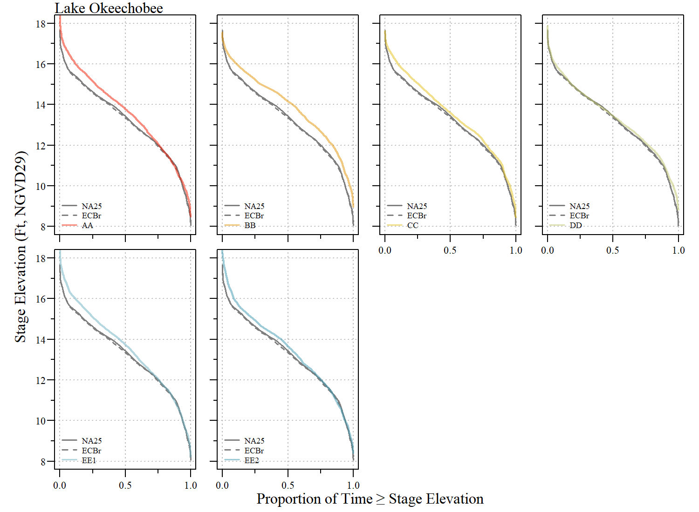
```

---
name: LOFreq

### High/Low Stages 
```{r ,fig.align="center",out.width="75%"}
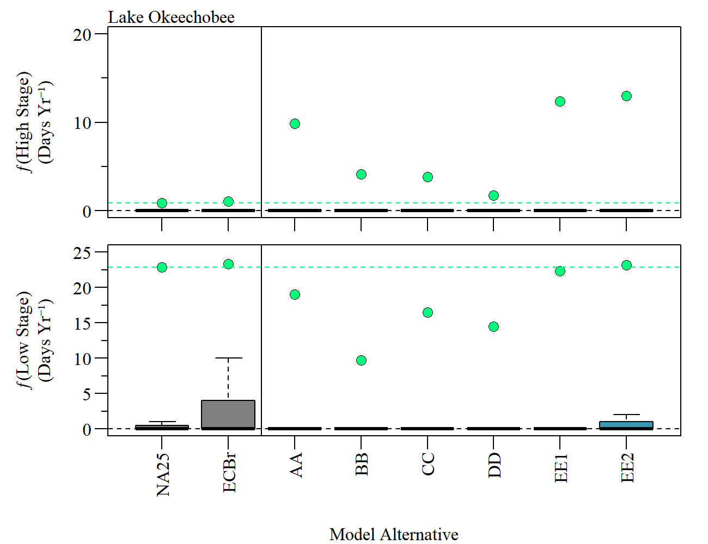
```
.center[Boxplot representing the frequency of low (<10 Ft NGVD) and high (>17 Ft NGVD) stage elevations during the simulation period across alternatives. Dashed line represents the FWO median and green dashed line and point in boxplot indicates period of simulation mean.]

---
name: LOFreq3

### High/Low Stages 

```{r ,fig.align="center",out.width="50%"}

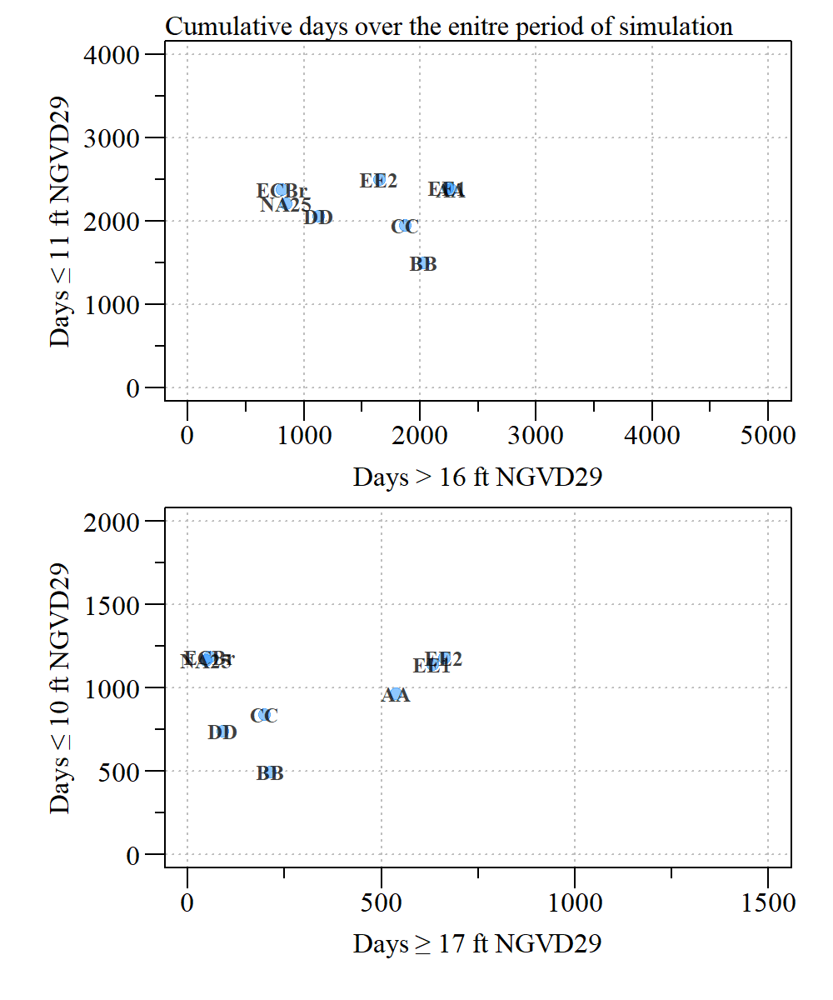
```

.center[Total number of days during the simulation period where (Top) stage elevations were `r paste("\u2264")` 11 or `r paste("\u003E")` 16 Ft NGVD29 and (Bottom) `r paste("\u2264")` 10 or `r paste("\u2265")` 17 Ft NGVD29.]

---
name: envelope1

### Normal/Recovery Envelope

```{r ,fig.align="center",out.width="90%"}

knitr::include_graphics('./Plots/Iteration_2/LakeO_Env.png')
```
.center[Transition between normal and recovery stage envelopes for each alternative during the entire simulation period.]
.small[
.pull-left[
**Shift from normal to recovery:**
- Stages >17 Ft any time of the year
*or*
- Stage in the June1 – July31 window is `r "\u2264"` 13.0 ft for < 30 days

]

.pull-right[
**Shift from recovery to normal:**
- Stage `r "\u2264"`16.0 ft from Aug1 – Dec31
*and* 
- Stage during May1 - Aug1 falls below 11.5 Ft for 60 or more days
*or*
- Stage during Apr15 - Sep15 falls below 12.0 Ft for 90 or more days


]

]

---
name: envelope2

### Lake Envelope Score

```{r ,fig.align="center",out.width="75%"}

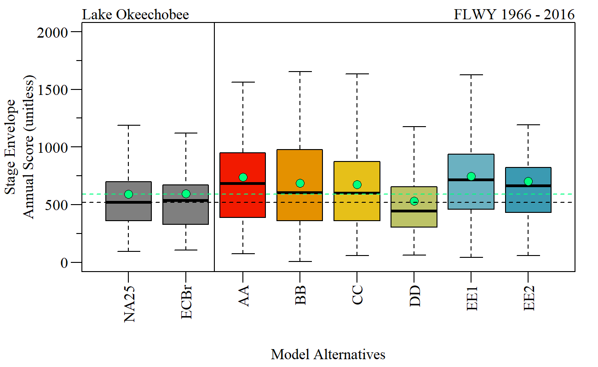
```
.center[Boxplot representing the annual total stage envelope score during the simulation period (FLWY 1966-2016) across alternatives. Dashed line represents the FWO median and green dashed line and point in boxplot indicates period of simulation mean. This summary includes transitions between normal and recovery envelopes.]

---
name: envelope2

### Lake Envelope Score Summary
.pull-left[
```{r ,fig.align="center",out.width="100%"}

knitr::include_graphics('./Plots/Iteration_2/LakeO_EnvScore_all_sum.png')
```
]

.pull-right[
Percent difference of average annual score relative to the FWO (NA25) alternative over the entire simulation period (FLWY 1966-2016).
]

---
name: envelope

### Lake Okeechobee Stage Envelope
```{r ,fig.align="center",out.width="90%"}

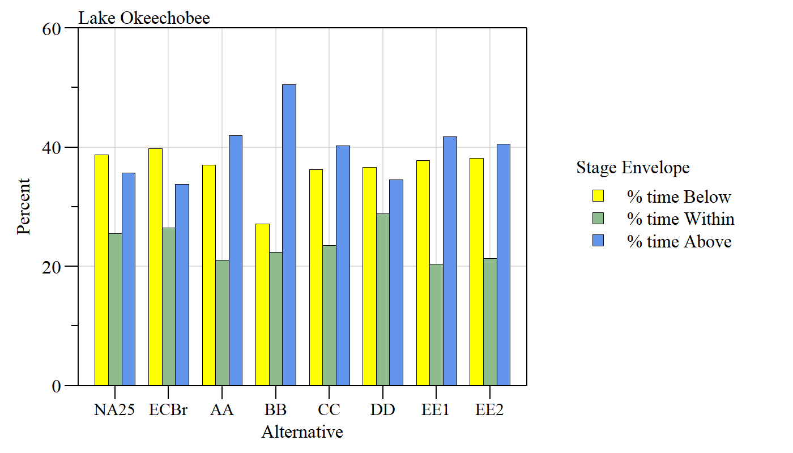
```

* Similar to available summaries on FTP site
* Some differences due to transitions between envelopes
* BB gives the highest overall % above envelope, followed by AA, EE1 & EE2

---
name: envelope

### Lake Okeechobee Stage Envelope
```{r ,fig.align="center",out.width="90%"}

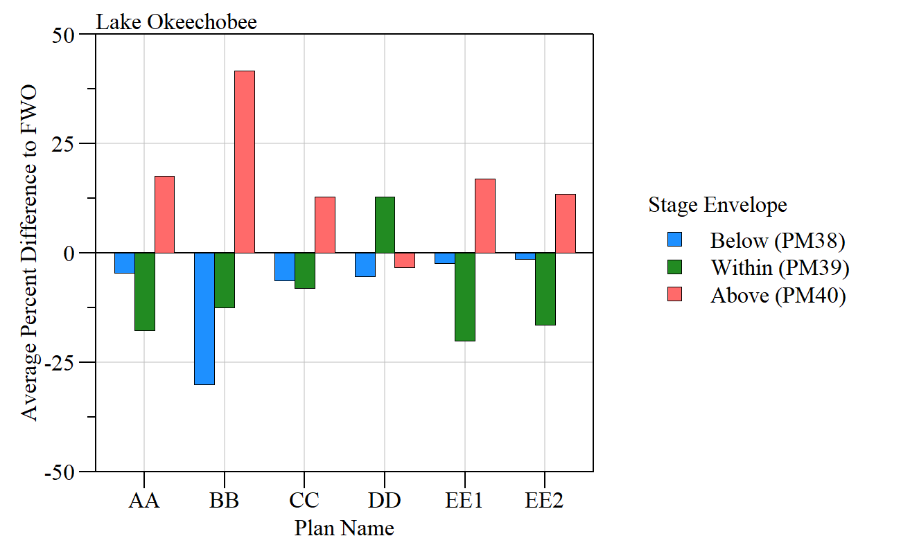
```

---
name: CRE
class: middle, center

## Caloosahatchee River Estuary

---
name: fdc

### Estuary Flow Duration Curves

#### Caloosahatchee River Estuary

```{r ,fig.align="center",out.width="79%"}

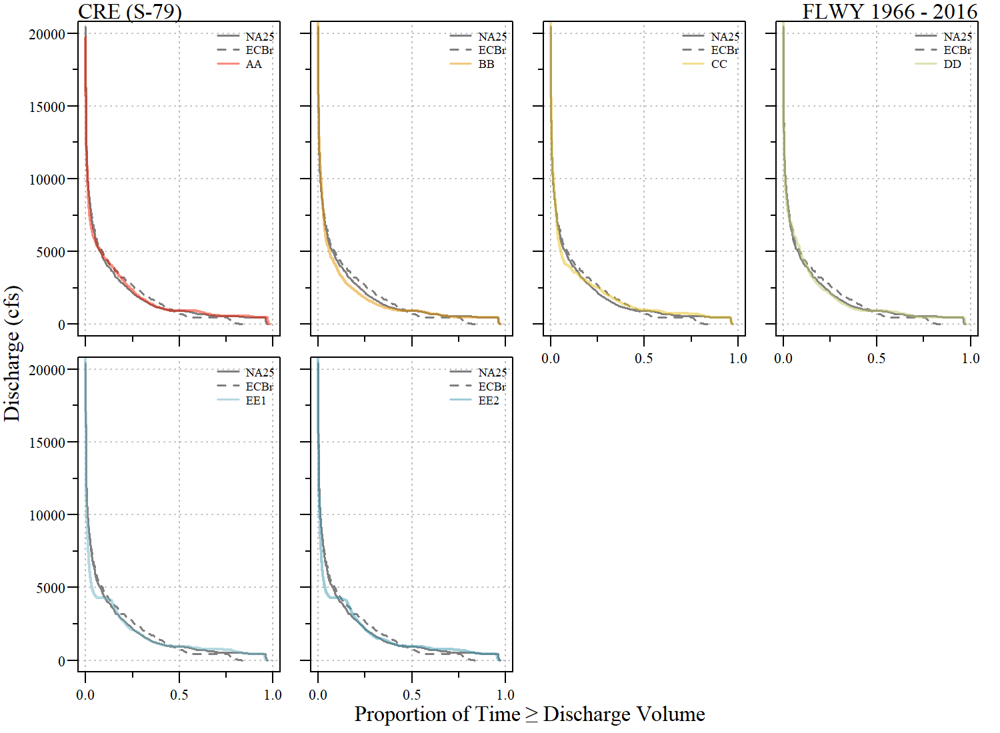
```

---
name: fdc2

### Flow Duration Curves

#### C-43 Canal

```{r ,fig.align="center",out.width="79%"}

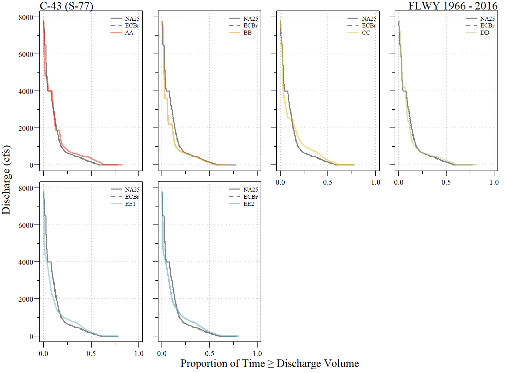
```


---
name: freq

### Flow Categories

```{r ,fig.align="center",out.width="80%"}
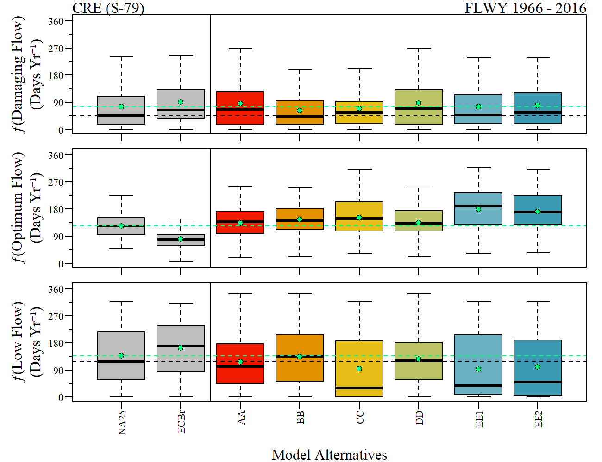
```
.center[Boxplot representing the frequency of low, optimum and damaging flow events during the simulation period across alternatives. Dashed line represents the FWO median and green dashed line and point in boxplot indicates period of simulation mean.]


---
name: freq2
class: middle

```{r ,fig.align="center",out.width="100%"}
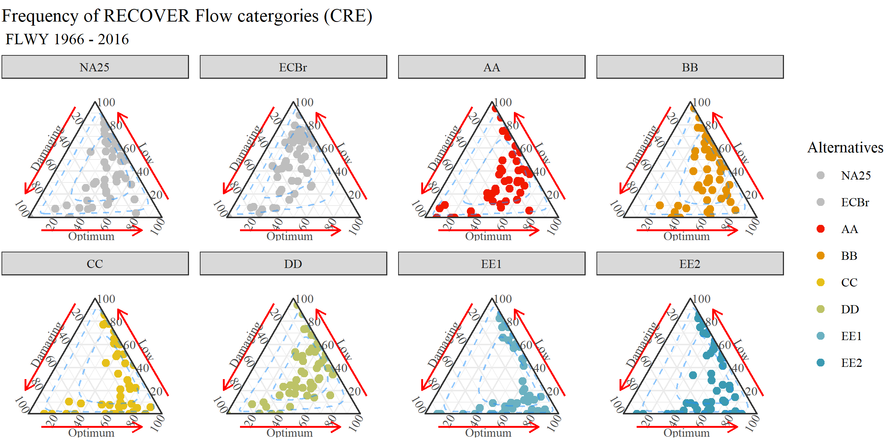
```

---
name: TotalQ

### Annual Discharge

```{r ,fig.align="center",out.width="85%"}
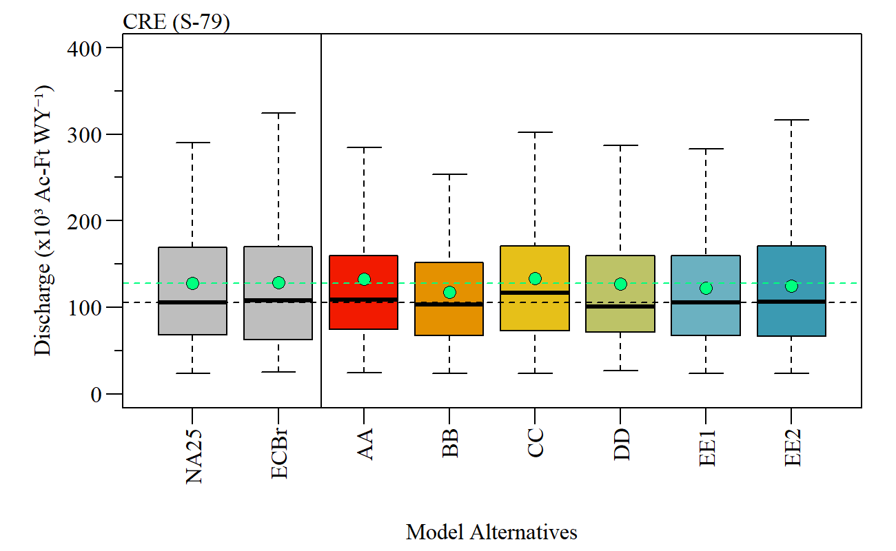
```

.center[
Boxplot representing the annual discharge volume from S-79 during the simulation period across alternatives. Dashed line represents the FWO median and green point in boxplot indicates period of simulation mean.
]


---
name: DrySeason2

### Dry Season Discharges
```{r ,fig.align="center",out.width="80%"}
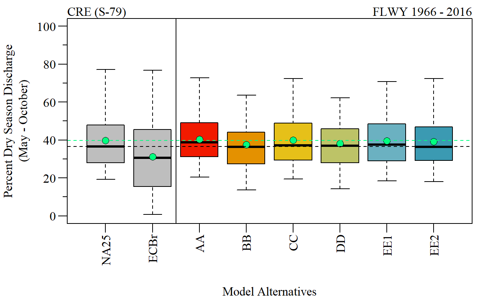
```
.center[Boxplot representing the annual percent dry (May - October) season discharge during the simulation period across alternatives. Dashed line represents the FWO median and green dashed line and point in boxplot indicates period of simulation mean.]
---
name: Source

### Source of Discharges
```{r ,fig.align="center",out.width="70%" }
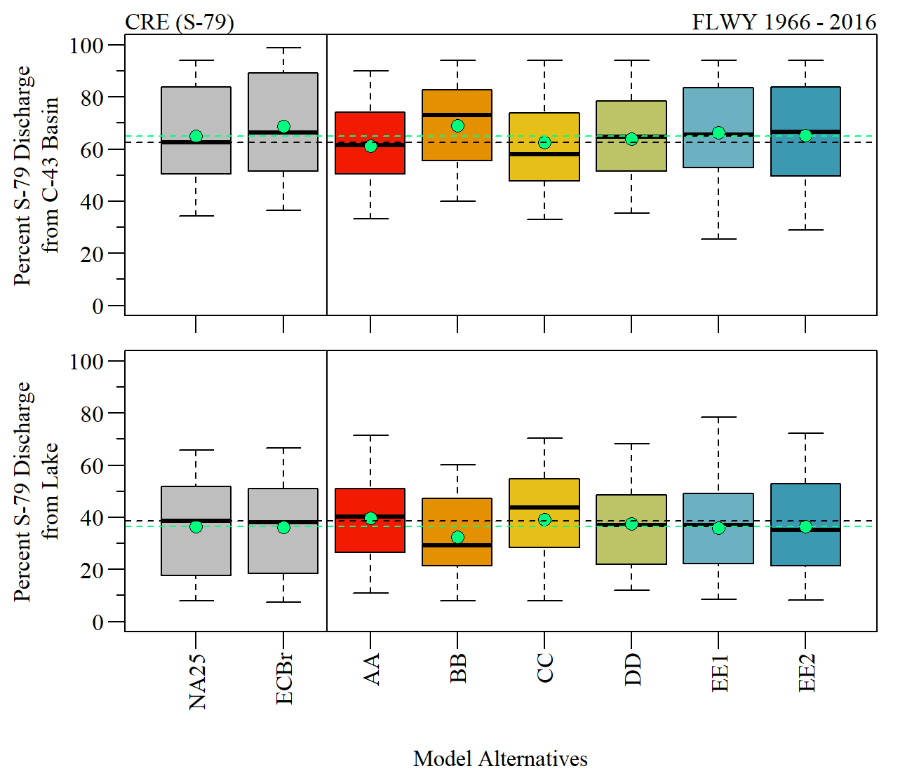
```
.center[
Boxplot representing the percent of S-79 discharges originating from the C-43 Basin (top) and Lake Okeechobee (bottom). Dashed line represents the FWO median and green point in boxplot indicates period of simulation mean.
]
---
name: Bloom

### Bloom Period Discharges
```{r ,fig.align="center",out.width="70%" }
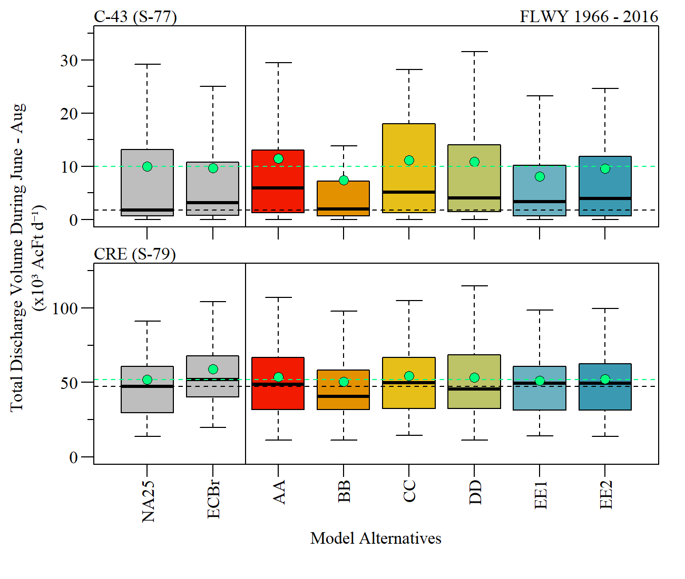
```
.center[Boxplot representing the S-77 and S-79 discharges during the June to August (bloom period). Dashed line represents the FWO median and green point in boxplot indicates period of simulation mean.]

---
name: S77perchange

### S77 Discharge Percent Change

```{r}
est.allPOS.sum=read.csv(paste0(export.path,"POS_eststruct_sum.csv"))
S77.sum=subset(est.allPOS.sum,SITE=="S77")
S77.sum=S77.sum[match(alts.sort,S77.sum$Alt),]

S77.sum$NA25_perchange=with(S77.sum,round(((Avg.TQ.kacft-Avg.TQ.kacft[1])/Avg.TQ.kacft[1])*100,2))
S77.sum$ECBr_perchange=with(S77.sum,round(((Avg.TQ.kacft-Avg.TQ.kacft[2])/Avg.TQ.kacft[2])*100,2))

S77.sum[,2:5]%>%
  flextable()%>%
  colformat_double(j=2,digits=2)%>%
  set_header_labels("Alt"="Alternative",
                    "Avg.TQ.kacft"="Average Total\nAnnual Discharge\n(x1000 Ac-Ft Yr\u207B\u00B9)",
                    "NA25_perchange"="% Change Compared to FWO",
                    "ECBr_perchange"="% Change Compared to ECB")%>%
  width(width=c(0.5,1.5,1.5,1.5))%>%
  padding(padding=1,part="all")%>%
  font(fontname="Times New Roman",part="all")%>%
  fontsize(size=9,part="body")%>%
  fontsize(size=10,part="header")%>%
  align(j=2:4,align="center",part="all")%>%
  footnote(j=3,
           part="header",value=as_paragraph("FWO = NA25"),ref_symbols =c(" 1 "),inline=T)%>%
  footnote(j=4,
           part="header",value=as_paragraph("ECB = ECBr"),ref_symbols =c(" 2 "),inline=T)%>%
  set_caption(caption="S77 average total discharge comparison between alternatives with percent change relative to FWO and ECB across the entire simulation period of record (Jan 1965 - Dec 2016).")
  

```

---
name: S79perchange

### S79 Discharge Percent Change

```{r}
S79.sum=subset(est.allPOS.sum,SITE=="S79")
S79.sum=S79.sum[match(alts.sort,S79.sum$Alt),]

S79.sum$NA25_perchange=with(S79.sum,round(((Avg.TQ.kacft-Avg.TQ.kacft[1])/Avg.TQ.kacft[1])*100,2))
S79.sum$ECBr_perchange=with(S79.sum,round(((Avg.TQ.kacft-Avg.TQ.kacft[2])/Avg.TQ.kacft[2])*100,2))

S79.sum[,2:5]%>%
  flextable()%>%
  colformat_double(j=2,digits=2)%>%
  set_header_labels("Alt"="Alternative",
                    "Avg.TQ.kacft"="Average Total\nAnnual Discharge\n(x1000 Ac-Ft Yr\u207B\u00B9)",
                    "NA25_perchange"="% Change Compared to FWO",
                    "ECBr_perchange"="% Change Compared to ECB")%>%
  width(width=c(0.5,1.5,1.5,1.5))%>%
  padding(padding=1,part="all")%>%
  font(fontname="Times New Roman",part="all")%>%
  fontsize(size=9,part="body")%>%
  fontsize(size=10,part="header")%>%
  align(j=2:4,align="center",part="all")%>%
  footnote(j=3,
           part="header",value=as_paragraph("FWO = NA25"),ref_symbols =c(" 1 "),inline=T)%>%
  footnote(j=4,
           part="header",value=as_paragraph("ECB = ECBr"),ref_symbols =c(" 2 "),inline=T)%>%
  set_caption(caption="S79 average total discharge comparison between alternatives with percent change relative to FWO and ECB across the entire simulation period of record (Jan 1965 - Dec 2016).")
  

```

---
name: CRE MFL

## Caloosahatchee MFL

```{r ,fig.align="center",out.width="75%"}

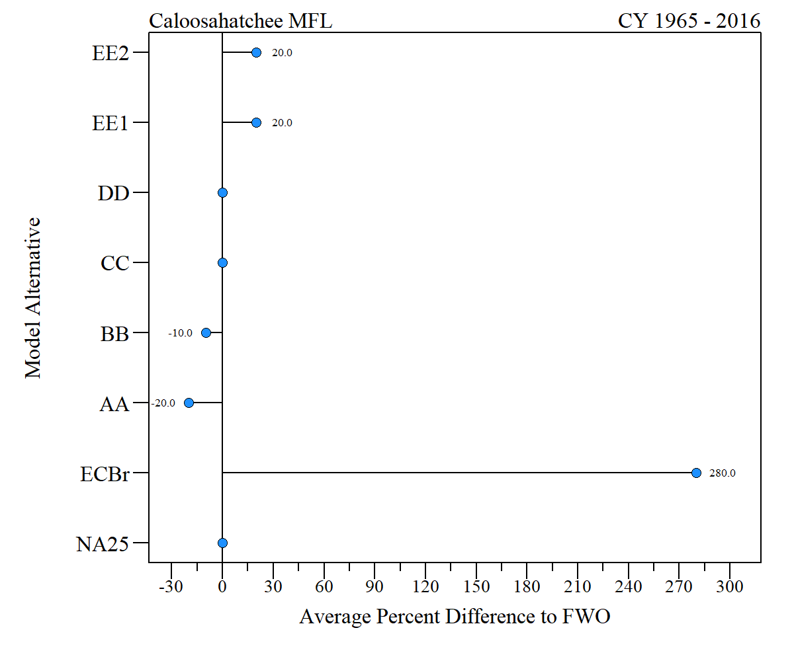
```

* ECBr results in high number of exceedances and violations of the MFL. 

---
name: SLE
class: middle, center

## St Lucie Estuary

---
name: fdcSLE

### Estuary Flow Duration Curves

#### St Lucie Estuary

```{r ,fig.align="center",out.width="79%"}

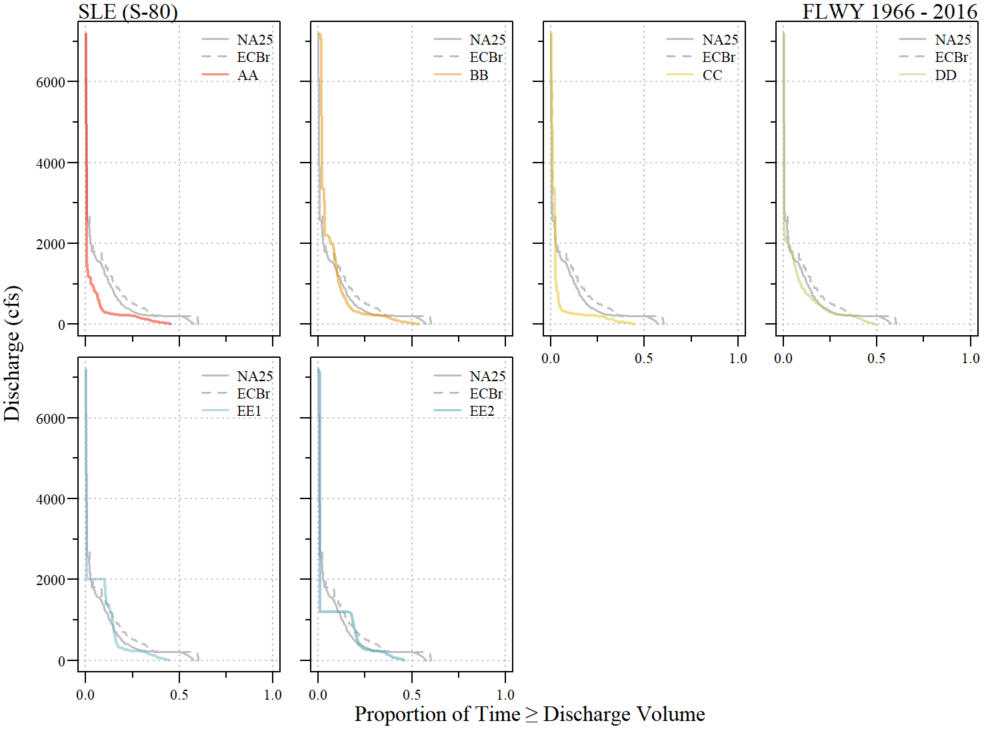
```

---
name: fdc2

### Flow Duration Curves

#### C-44 Canal

```{r ,fig.align="center",out.width="79%"}

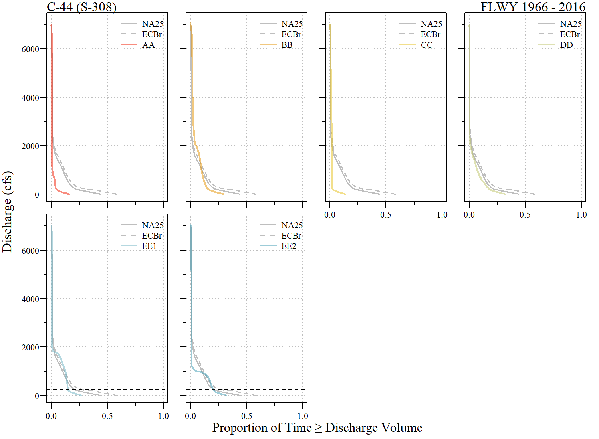
```

---
name: freqSLE

### Flow Categories

```{r ,fig.align="center",out.width="75%" }
knitr::include_graphics('./Plots/Iteration_2/SLE_iter2_freq_bxp.png')
```
.center[
Boxplot representing the frequency of low, optimum and damaging flow events during the simulation period across alternatives. Dashed line represents the FWO median and green point in boxplot indicates period of simulation mean.
]

---
name: freq2SLE
class: middle

```{r ,fig.align="center",out.width="100%"}
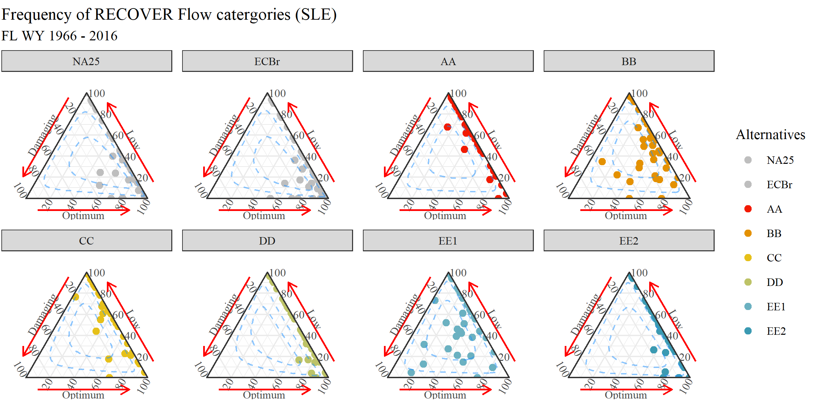
```

---
name: TotalQSLE

### Annual Discharge

```{r ,fig.align="center",out.width="85%"}
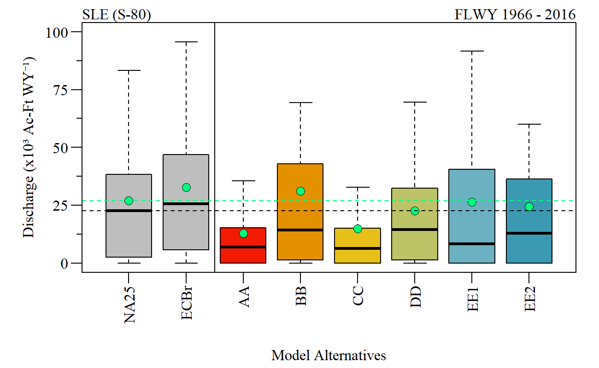
```

.center[
Boxplot representing the annual discharge volume from S-80 during the simulation period across alternatives. Dashed line represents the FWO median and green point in boxplot indicates period of simulation mean.
]


---
name: DrySeasonSLE

### Dry Season Discharges
```{r ,fig.align="center",out.width="80%" }
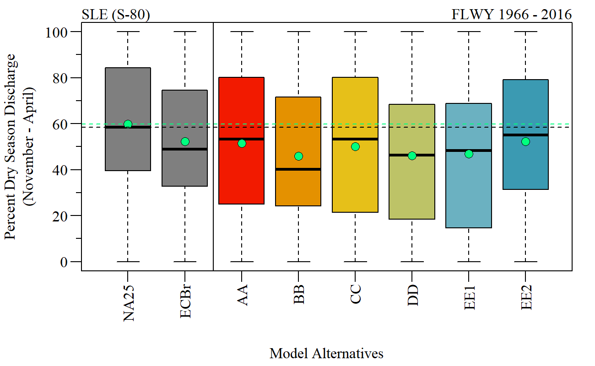
```
.center[
Boxplot representing the annual percent dry season discharge during the simulation period across alternatives. Dashed line represents the FWO median and green point in boxplot indicates period of simulation mean.
]

---
name: WetSeasonSLE

### Wet Season Discharges
```{r ,fig.align="center",out.width="80%" }
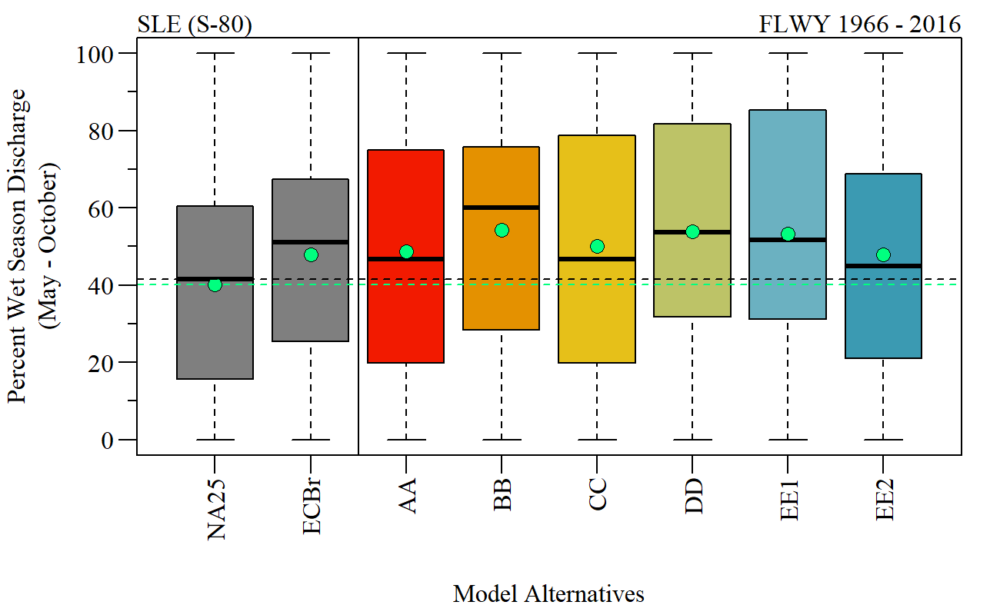
```
.center[
Boxplot representing the annual percent wet season discharge during the simulation period across alternatives. Dashed line represents the FWO median and green point in boxplot indicates period of simulation mean.
]

---
name: BloomSLE

### Bloom Period Discharges
```{r ,fig.align="center",out.width="70%" }
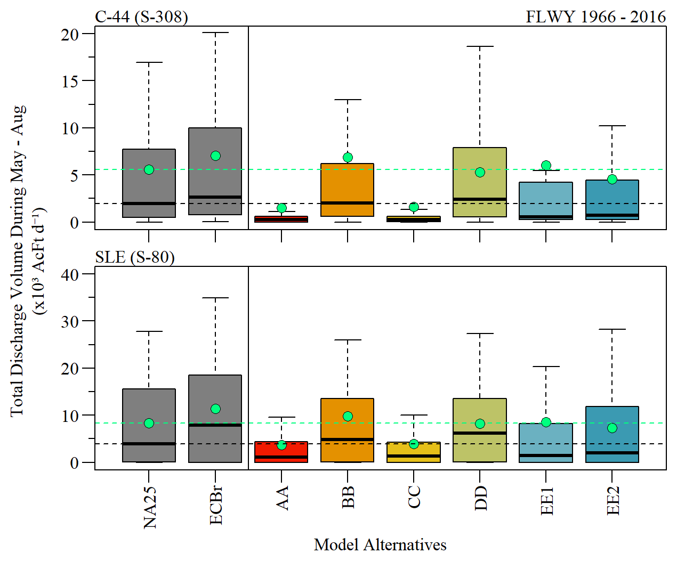
```
.center[Boxplot representing the S-308 and S-80 discharges during the May to August (bloom period). Dashed line represents the FWO median and green point in boxplot indicates period of simulation mean.]

---
name: S308perchange

### S308 Discharge Percent Change 

```{r}
S308.sum=subset(est.allPOS.sum,SITE=="S308")
S308.sum=S308.sum[match(alts.sort,S308.sum$Alt),]

S308.sum$NA25_perchange=with(S308.sum,round(((Avg.TQ.kacft-Avg.TQ.kacft[1])/Avg.TQ.kacft[1])*100,2))
S308.sum$ECBr_perchange=with(S308.sum,round(((Avg.TQ.kacft-Avg.TQ.kacft[2])/Avg.TQ.kacft[2])*100,2))

S308.sum[,2:5]%>%
  flextable()%>%
  colformat_double(j=2,digits=2)%>%
  set_header_labels("Alt"="Alternative",
                    "Avg.TQ.kacft"="Average Total\nAnnual Discharge\n(x1000 Ac-Ft Yr\u207B\u00B9)",
                    "NA25_perchange"="% Change Compared to FWO",
                    "ECBr_perchange"="% Change Compared to ECB")%>%
  width(width=c(0.5,1.5,1.5,1.5))%>%
  padding(padding=1,part="all")%>%
  font(fontname="Times New Roman",part="all")%>%
  fontsize(size=9,part="body")%>%
  fontsize(size=10,part="header")%>%
  align(j=2:4,align="center",part="all")%>%
  footnote(j=3,
           part="header",value=as_paragraph("FWO = NA25"),ref_symbols =c(" 1 "),inline=T)%>%
  footnote(j=4,
           part="header",value=as_paragraph("ECB = ECBr"),ref_symbols =c(" 2 "),inline=T)%>%
  set_caption(caption="S308 average total discharge comparison between alternatives with percent change relative to FWO and ECB across the entire simulation period of record (Jan 1965 - Dec 2016).")
  

```

---
name: S80perchange

### S80 Discharge Percent Change 

```{r}
S80.sum=subset(est.allPOS.sum,SITE=="S80")
S80.sum=S80.sum[match(alts.sort,S80.sum$Alt),]

S80.sum$NA25_perchange=with(S80.sum,round(((Avg.TQ.kacft-Avg.TQ.kacft[1])/Avg.TQ.kacft[1])*100,2))
S80.sum$ECBr_perchange=with(S80.sum,round(((Avg.TQ.kacft-Avg.TQ.kacft[2])/Avg.TQ.kacft[2])*100,2))

S80.sum[,2:5]%>%
  flextable()%>%
  colformat_double(j=2,digits=2)%>%
  set_header_labels("Alt"="Alternative",
                    "Avg.TQ.kacft"="Average Total\nAnnual Discharge\n(x1000 Ac-Ft Yr\u207B\u00B9)",
                    "NA25_perchange"="% Change Compared to FWO",
                    "ECBr_perchange"="% Change Compared to ECB")%>%
  width(width=c(0.5,1.5,1.5,1.5))%>%
  padding(padding=1,part="all")%>%
  font(fontname="Times New Roman",part="all")%>%
  fontsize(size=9,part="body")%>%
  fontsize(size=10,part="header")%>%
  align(j=2:4,align="center",part="all")%>%
  footnote(j=3,
           part="header",value=as_paragraph("FWO = NA25"),ref_symbols =c(" 1 "),inline=T)%>%
  footnote(j=4,
           part="header",value=as_paragraph("ECB = ECBr"),ref_symbols =c(" 2 "),inline=T)%>%
  set_caption(caption="S80 average total discharge comparison between alternatives with percent change relative to FWO and ECB across the entire simulation period of record (Jan 1965 - Dec 2016).")
  

```
---
name: estuarycompare

### FWO Discharge Comparison
```{r ,fig.align="center",out.width="100%" }
knitr::include_graphics('./Plots/Iteration_2/Estuary_FWOCompare.png')
```
.center[
Percent Difference from FWO (NA25) for low, optimal and high discharges for Caloosahatchee River Estuary and St Lucie Estuary (CRE and SLE, respectively).
]

* Compared annual average number of events over the FLWY 1966 - 2016 simulation period

---
name: LakeOutflow
class: middle, center

## Flows South<br>(S351, S352 & S354)

---
name: fdcEAA

### EAA Flow Duration Curves

#### EAA (S-354 + S-351 + S-352)

```{r ,fig.align="center",out.width="79%"}

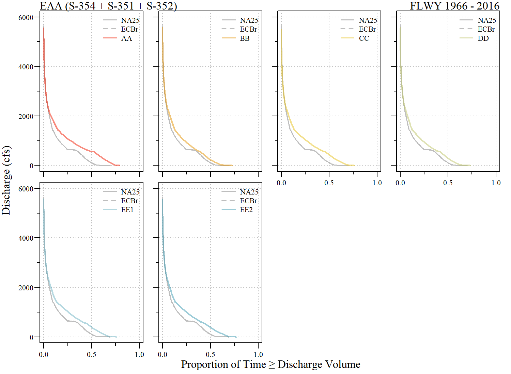
```

Flow Duration Curves for [S-354](#S354FDC), [S-351](#S351FDC), [S-352](#S352FDC)

---
name: EAAQ 

### EAA (S-354 + S-351 + S-352)
```{r ,fig.align="center",out.width="80%" }
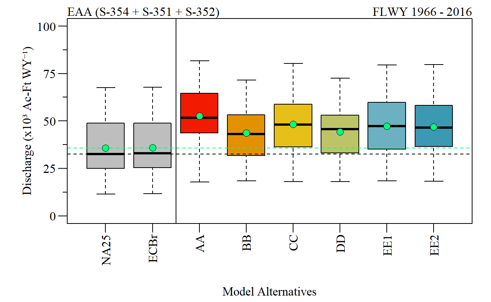
```
.center[
Boxplot representing the annual discharge volume from Lake Okeechobee to the EAA via S-354, S-351 and S-352 during the simulation period across alternatives. Dashed line represents the FWO median and green point in boxplot indicates period of simulation mean.
]

---
name: EAAQ2

### EAA (S-354 + S-351 + S-352)
.pull-left[
```{r ,fig.align="center",out.width="80%"}

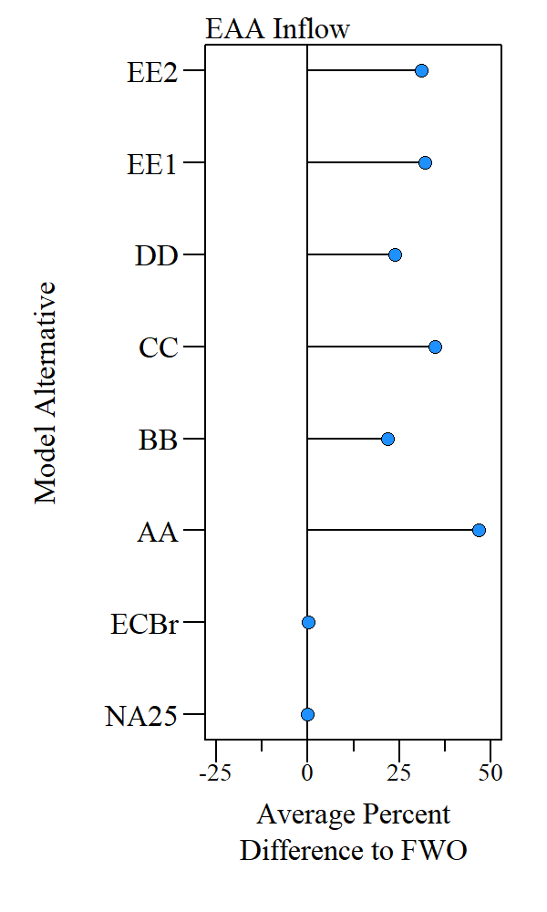
```
]

.pull-right[
Percent difference of average discharge volume score relative to the FWO (NA25) alternative over the entire simulation period.

]

---
name: Southperchange

### S351 + S354 Discharge Percent Change 

```{r}
FlowSouth.sum=ddply(subset(est.allPOS.sum,SITE%in%c("S351","S354")),"Alt",summarise,Avg.TQ.kacft=sum(Avg.TQ.kacft))
FlowSouth.sum=FlowSouth.sum[match(alts.sort,FlowSouth.sum$Alt),]

FlowSouth.sum$NA25_perchange=with(FlowSouth.sum,round(((Avg.TQ.kacft-Avg.TQ.kacft[1])/Avg.TQ.kacft[1])*100,2))
FlowSouth.sum$ECBr_perchange=with(FlowSouth.sum,round(((Avg.TQ.kacft-Avg.TQ.kacft[2])/Avg.TQ.kacft[2])*100,2))

FlowSouth.sum%>%
  flextable()%>%
  colformat_double(j=2,digits=2)%>%
  set_header_labels("Alt"="Alternative",
                    "Avg.TQ.kacft"="Average Total\nAnnual Discharge\n(x1000 Ac-Ft Yr\u207B\u00B9)",
                    "NA25_perchange"="% Change Compared to FWO",
                    "ECBr_perchange"="% Change Compared to ECB")%>%
  width(width=c(0.5,1.5,1.5,1.5))%>%
  padding(padding=1,part="all")%>%
  font(fontname="Times New Roman",part="all")%>%
  fontsize(size=9,part="body")%>%
  fontsize(size=10,part="header")%>%
  align(j=2:4,align="center",part="all")%>%
  footnote(j=3,
           part="header",value=as_paragraph("FWO = NA25"),ref_symbols =c(" 1 "),inline=T)%>%
  footnote(j=4,
           part="header",value=as_paragraph("ECB = ECBr"),ref_symbols =c(" 2 "),inline=T)%>%
  set_caption(caption="Flow south (S-351 and S-354) average total discharge comparison between alternatives with percent change relative to FWO and ECB across the entire simulation period of record (Jan 1965 - Dec 2016).")
  

```

---
name: southcompare

### FWO Discharge Comparison
```{r ,fig.align="center",out.width="100%" }
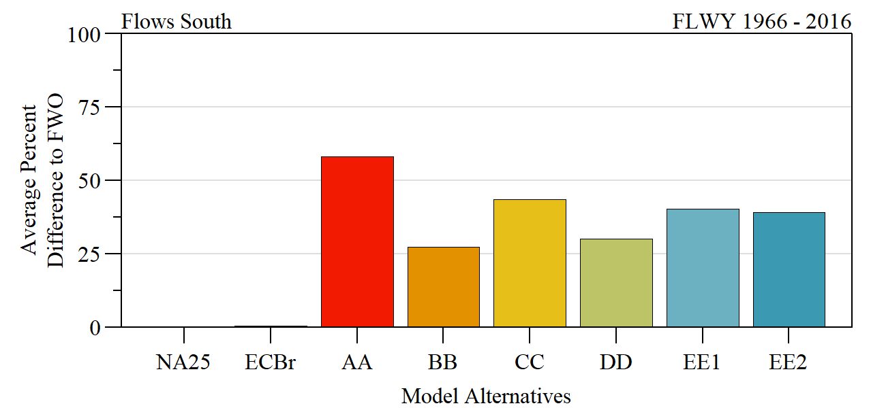
```
.center[
Percent Difference from FWO (NA25) for total discharges south (S-351 and S-354).
]

* Compared annual average number of events over the FLWY 1966 - 2016 simulation period

---
name: southwet

### EAA (S-354 + S-351) Wet Season
```{r ,fig.align="center",out.width="90%" }
knitr::include_graphics('./Plots/Iteration_2/FlowSouth_wetseason.png')
```
.center[
Wet Season (June - October) discharge to the EAA via S-354 and S-351 during the simulation period across alternatives. Dashed line represents the FWO median and green point in boxplot indicates period of simulation mean.
]

---
name: southwet2

### FWO Discharge Comparison
```{r ,fig.align="center",out.width="100%" }
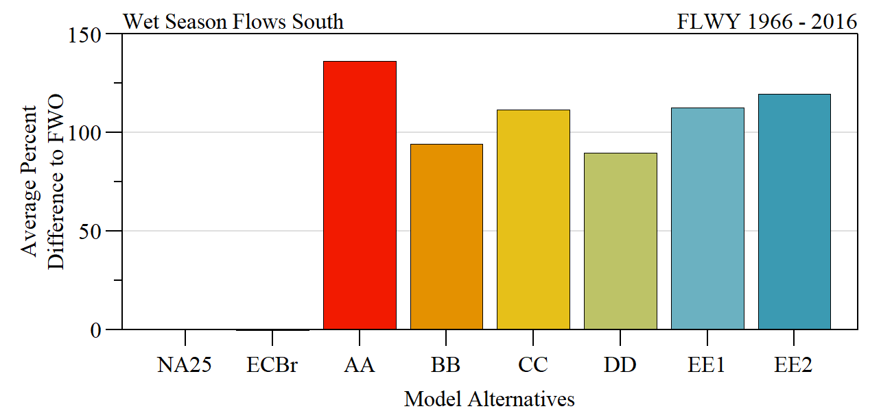
```
.center[
Percent Difference from FWO (NA25) for wet season discharges south (S-351 and S-354).
]

---
name: PCA1

## Principal Component Analysis

.pull-left[
**Parameters**

* Q<sub>S79</sub>, Q<sub>S80</sub>, Q<sub>S77</sub>, Q<sub>S308</sub> and Q<sub>South</sub>: Total annual discharge.
* S79<sub>Low, Opt, Dam</sub>: Frequency of low, optimum and damaging events at S79 (based on 14-day moving average).
* S80<sub>Low, Opt, Dam</sub>: Frequency of low, optimum and damaging events at S80 (based on 14-day moving average).
* Stg <11Ft: Frequency of daily stage < 11 Ft.
* Stg >16Ft: Frequency of daily stage < 16 Ft.
* % Within: Percentage of time within the Lake stage envelope.

]

.pull-right[
**PCA Data Suitability**

* Kaiser-Meyer-Olkin Statistics (Measure of Sampling Adequacy)
  * KMO-Criterion: 0.79

* Bartlett's Test Of Sphericity
 * `r paste("\u03C7\u00B2 = 10034.6; DF = 91; \u03C1 <0.01")`
 
* [PCA Scree](#PCAScree) Plot
 
]

---
name: PCA2

## Principal Component Analysis

```{r ,fig.align="center",out.width="85%" }
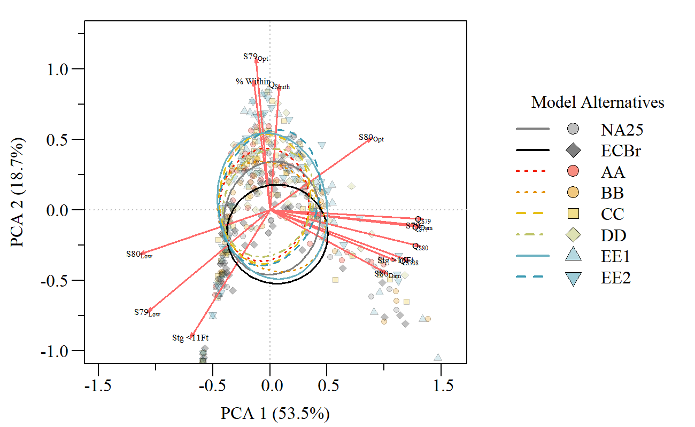
```
.small[
* Occurrence of optimum flow events and flows south is positively loaded w/ CC and EE plans
* Stg >16 Ft correlated with total discharge and damaging flow events
* Stg <11 Ft correlated with low flow event
* Despite having higher Flows south AA is pulled to the bottom left (driven by higher freq stag <11 Ft).
]
---
name: WCA3
class: middle, center

## Southern Everglades (WCA3)

---
class: WCA3Q

### Annual Discharge

```{r ,fig.align="center",out.width="70%"}
knitr::include_graphics('./Plots/Iteration_2/WCA3_WYQ_bxp.png')
```

.center[
Boxplot representing the annual discharge volume in and out of WCA-3A during the simulation period across alternatives. Dashed line represents the FWO median and green point in boxplot indicates period of simulation mean.
]

---
name: sdc_wca3_1

### Stage Duration Curves

#### WCA-3 (3-62 and 3-63 Average)

```{r ,fig.align="center",out.width="79%"}

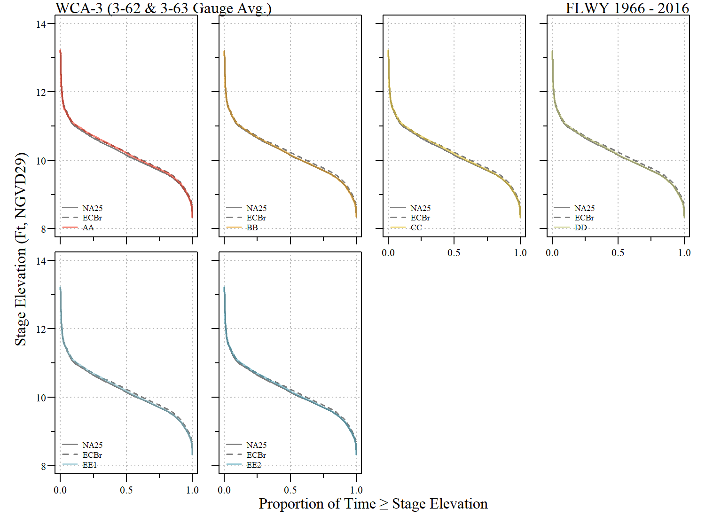
```

---
name: sdc_wca3_2

### Stage Duration Curves

#### WCA-3 (3-63, 3-64 and 3-65 Average)

```{r ,fig.align="center",out.width="79%"}

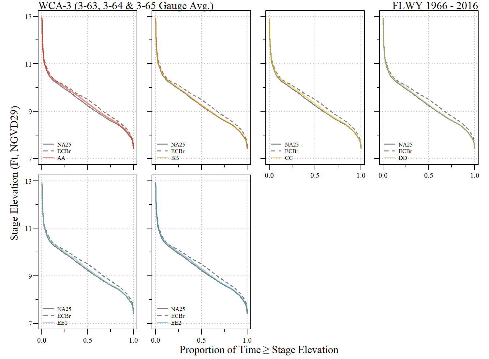
```


---
name: WCA3_freqclose

### WCA-3
.pull-left[
```{r ,fig.align="center",out.width="100%"}

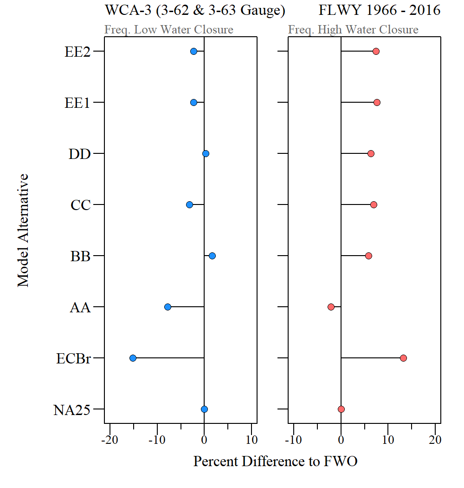
```
]

.pull-right[
#### WCA-3 Closure Criteria

* FWC High and Low water closure criteria 
  * 2-Gauge Average (3-62 and 3-63)
  * High Water Closure: 11.6 Ft NGVD29
  * Low Water Closure: 9.3 Ft NGVD29


Percent difference of the frequency of daily low (left) and high (right) closure criteria exceedances relative to the FWO (NA25) alternative over the entire simulation period.

]

---
name: WCA3_zoneA

### WCA-3
.pull-left[
```{r ,fig.align="center",out.width="80%"}

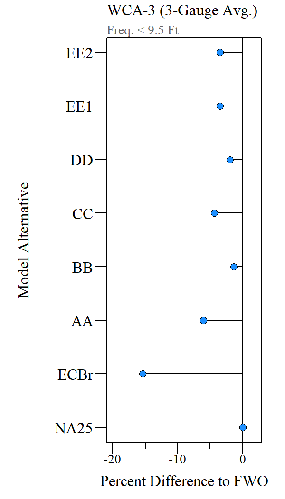
```
]

.pull-right[
#### WCA-3 

* 3-Gauge Average (3-63, 3-64 and 3-65)
* Bottom of Zone A: 9.5 Ft NGVD29

Percent difference of the frequency of daily low (left) and high (right) closure criteria exceedances relative to the FWO (NA25) alternative over the entire simulation period.

]

---
name: ENP
class: middle, center

## Everglades National Park

---
name: ENP_methods

### Everglades National Park - Water Quality

- Annual (Federal WY 1966 - 2016) Flow-Weighted Mean TP concentrations were modeled using predictive tools developed during Combined Operations (COP) Planning 
    - Predictive tools use upstream stage (3-gauge average, stage gradient, stage increase, etc.)

- Relative differences in annual FWM TP were assess.

---
name: ENP_SRS

### Everglades National Park - Water Quality

```{r ,fig.align="center",out.width="80%" }
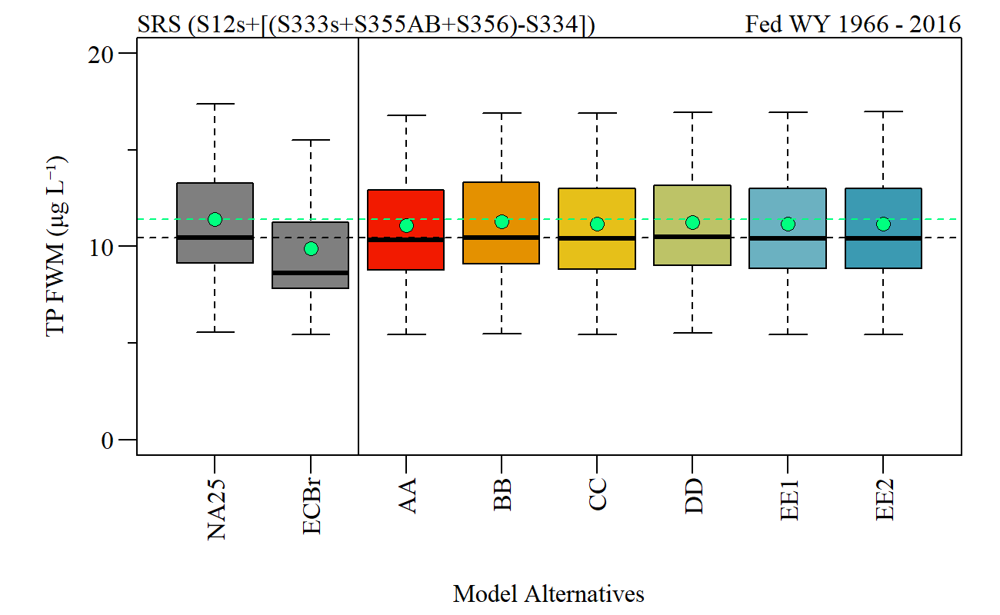
```
.center[
Boxplot representing the Shark River Slough annual flow-weighted mean TP concentration the simulation period across alternatives. Dashed line represents the FWO median and green point in boxplot indicates period of simulation mean.
]

---
name: ENP_SRS2

### Everglades National Park - Water Quality

.pull-left[
```{r ,fig.align="center",out.width="80%"}

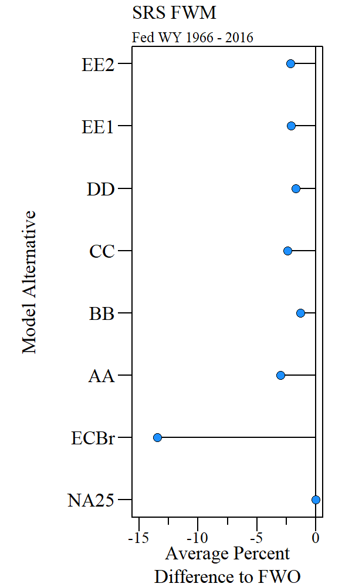
```
]

.pull-right[

Average percent difference of SRS annual TP FWM concentrations relative to the FWO (NA25) alternative over the simulation period.

]

---
class: inverse

---
name: S354FDC

### EAA Flow Duration Curves

#### EAA (S-354)

```{r ,fig.align="center",out.width="79%"}

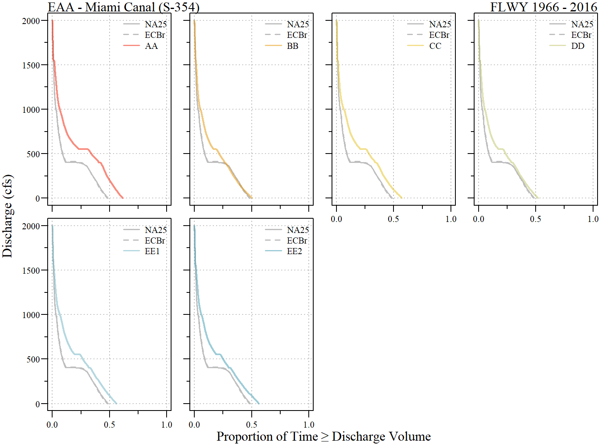
```

[EAA Flow Duration Curves](#fdcEAA)

---
name: S351FDC

### EAA Flow Duration Curves

#### EAA (S-351)

```{r ,fig.align="center",out.width="79%"}

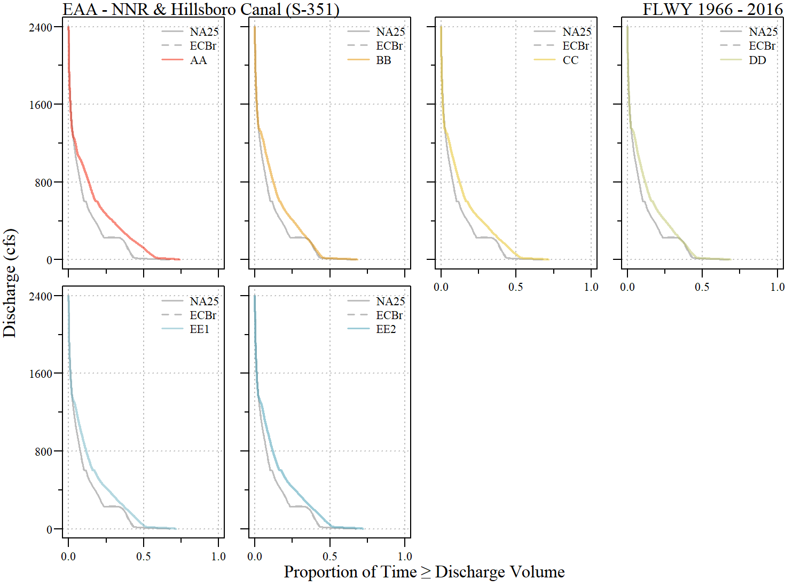
```

[EAA Flow Duration Curves](#fdcEAA)

---
name: S352FDC

### EAA Flow Duration Curves

#### EAA (S-352)

```{r ,fig.align="center",out.width="79%"}

knitr::include_graphics('./Plots/Iteration_2/S352_FlowDuration.png')
```

[EAA Flow Duration Curves](#fdcEAA)

---
name: PCAScree

### PCA Scree plot

```{r ,fig.align="center",out.width="50%"}

knitr::include_graphics('./Plots/Iteration_2/Q_STG_Scree.png')
```

[Principal Component Analysis](#PCA2)

---
name: eval-methods
class: middle


#### Lake Okeechobee 

* Evaluate lake stage consistent with RECOVER - Lake Okeechobee Stage Performance Measure.
  * PM documentation - [link](https://usace.contentdm.oclc.org/utils/getfile/collection/p16021coll7/id/14096)
  * R-package - [link](https://github.com/SwampThingPaul/LORECOVER)

#### Estuaries

* Evaluate estuary discharges consistent with RECOVER thresholds
  * PM documentation - [link](https://usace.contentdm.oclc.org/utils/getfile/collection/p16021coll7/id/14793)

```{r}
cap.val="Flow Envelopes determined as optimum, stressful, and damaging for the corresponding Salinity Envelopes of all indicator species in the Northern Estuaries."
data.frame(Estuary=c("St. Lucie", "Caloosahatchee"),Optimum=c("150 - 1400 cfs","750 - 2100 cfs"),Stress=c("1400 - 1700 cfs","2100 - 2600 cfs"),Damaging=c(">1700 cfs",">2600 cfs"))%>%
  flextable()%>%
  width(width=c(1,1.5,1.5,1))%>%
  padding(padding=0.5,part="all")%>%
  font(fontname="Times New Roman",part="all")%>%
  # fontsize(size=10,part="body")%>%
  # fontsize(size=11,part="header")%>%
  bold(part="header")%>%
  align(align="center",part="all")%>%
  bg(i=1,bg="grey90")%>%
  add_header_lines(values=cap.val)%>%align(align="center",part="header")%>%
  footnote(part="header",value=as_paragraph("Source: RECOVER Northern Estuaries Performance Measure: Salinity Envelope"),ref_symbols =c(" "))
```

* Frequency of low (below optimum), optimum and damaging flow events were evaluated for each water year (May - April) and alternative.


---
name: stat101

### Quick 101

.pull-left[

* How to read box-and-whisker plots or boxplots

```{r ,fig.align="center",out.width="75%"}

knitr::include_graphics('./Plots/boxplot_explain.png')
```

]

.pull-right[

* Stage and flow duration curves are based on cumulative distribution functions. 

```{r ,fig.align="center",out.width="75%"}

knitr::include_graphics('./Plots/ecdf_explain.png')
```

* *Example:* What is the data value 50% (or 0.5) of the time?
  * Follow the red dashed lines and you get a value of -0.04.

More reading on empirical CDF at this [link](https://towardsdatascience.com/what-why-and-how-to-read-empirical-cdf-123e2b922480).
]
