```{r setup, include=FALSE}
library(knitr)

options(htmltools.dir.version = FALSE)
knitr::opts_chunk$set(warning = FALSE, message = FALSE, echo=FALSE)

##
library(flextable)
library(magrittr)
library(plyr)
library(reshape2)

wd="C:/Julian_LaCie/_Github/LOSOM_ModelEval"

plot.path="C:/Julian_LaCie/_Github/LOSOM_ModelEval/Plots/"
export.path="C:/Julian_LaCie/_GitHub/LOSOM_ModelEval/Export/"

##
alts.sort=c("NA25","ECBr","AA","BB","CC","DD","EE1","EE2","SR3.5")
```

layout: true

<div class="my-footer">
<span>  </span>
</div>

---
name: title
class: left, middle

### Lake Okeechobee System Operating Manual

.pull-left[
#### Iteration 2 Modeling Evaluation<br>(with SFWMD Sensitivity Run)

*Sanibel-Captiva Conservation Foundation*

*Conservancy of Southwest Florida*

**DRAFT** - `r paste(format(as.Date("2021-07-14"),"%B %d, %Y"),"<br>(Updated:", format(as.Date(Sys.Date()),"%B %d, %Y"),")")`

]
<!-- this ends up being the title slide since seal = FALSE-->

.pull-right[
```{r ,fig.align="center",out.width="40%"}
knitr::include_graphics('./Plots/SCCF Logo knockout_c.png')
```

```{r ,fig.align="center",out.width="40%"}
knitr::include_graphics('./Plots/ConSWFL.jpeg')
```

]


```{r xaringanExtra, include=FALSE, warnint=FALSE}
# devtools::install_github("gadenbuie/xaringanExtra")
# xaringanExtra::use_webcam()
xaringanExtra::use_tile_view()
# xaringanExtra::use_scribble()
```
.footnote[
Paul Julian PhD<br>[`r fontawesome::fa("fas fa-envelope")`](mailto: pjulian@sccf.org) .small[pjulian@sccf.org]

.small[Use cursor keys for navigation, press .red["O"] for a slide .red[O]verview]
]
---
name: alternatives

### Iteration 2 - Model runs

```{r}

data.frame(Alternative=c("ECBr","NA25","AA","BB","CC","DD","EE1","EE2","SR3.5"),
           Description=c("LOSOM Existing Condition Baseline 2019", "LOSOM No Action 2025 (FWO)", "ESLE Framework. Enhances SLE ecology.","SPLC Framework. Improve water supply to pre-LORS08","Pareto Plan D Framework. Enhances CRE ecology and improves water supply","Pareto Plan A Framework. Incremental improvement over LORS.","Stage Target Operation Framework. Improve water supply performance by reducing flows south.","Stage Target Operations Framework. Reduce flows to SLE by reducing Zone B release rate.","SFWMD Sensitivity Run for CC (NOT an offical alternative)"))%>%
  flextable()%>%
  colformat_char(na_str="---")%>%
  width(width=c(1,5))%>%
  padding(padding=0.1,part="all")%>%
  font(fontname="Times New Roman",part="all")%>%
  fontsize(size=10,part="body")%>%
  fontsize(size=12,part="header")%>%
  bold(part="header")%>%
  footnote(i=c(1,2),j=1,
           value=as_paragraph(c("Existing Conditions Baseline 2019, revised (replaces LSMECB)","No action Condition 2025 (replaces LSM25B)")),
           ref_symbols = c(" 1 "," 2 "),part="body")
  
```

.small[

**SR3.5**
* Built from alternative CC

* SFWMD sensitivity run which serves as an example run incorporating policy direction (as informed by the Governing Board) and trade-offs between the different systems

* Presented at the July 15th 2021 Governing Board

]

---
name: sdc

### Lake Stage Duration Curves

```{r ,fig.align="center",out.width="100%",fig.cap="Lake Okeechobee stage duration curves comparing FWO and ECB relative to each alternative during the simulation period of record (CY1965 - 2016)."}

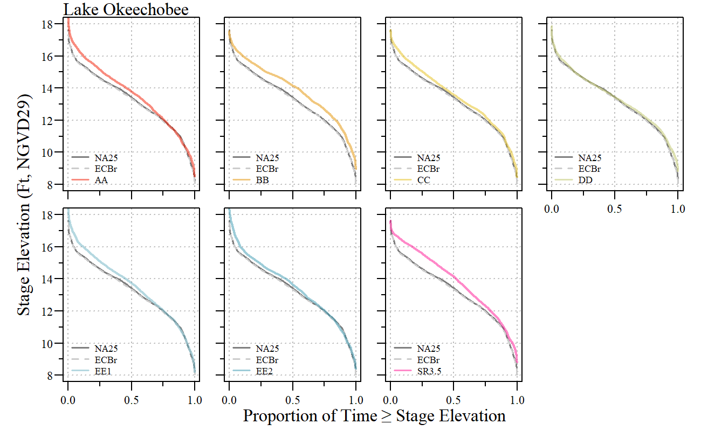
```

---
name: sdc

### Lake Stage Duration Curves

```{r ,fig.align="center",out.width="100%",fig.cap="Lake Okeechobee stage duration curves for all alternatives including SR3.5 with stage values identified along the curve during the simulation period of record (CY1965 - 2016)."}

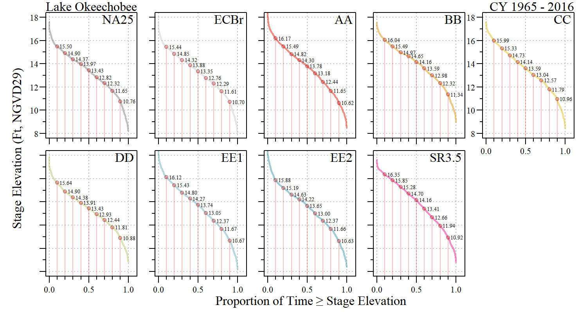
```

---
name: sdc

### Lake Stage Duration Curves

```{r}
SDC_seg=read.csv(paste0(export.path,"Iteration2/w_SR35/iter2_SDC_seg_analysis.csv"))

SDC_seg%>%
flextable()%>%
  colformat_double(j=2:10,digits=2,na_str="---")%>%
  fontsize(size=11,part="body")%>%
  fontsize(size=12,part="header")%>%
  font(fontname="Times New Roman",part="all")%>%
  align(j=2:10,part="all",align="center")%>%
  bold(part="header")%>%
  padding(padding=1,part="all")%>%
  set_header_labels("SDC_point_10"="10% Pt", 
                    "SDC_point_20"="20% Pt", 
                    "SDC_point_30"="30% Pt", 
                    "SDC_point_40"="40% Pt", 
                    "SDC_point_50"="50% Pt", 
                    "SDC_point_60"="60% Pt", 
                    "SDC_point_70"="70% Pt", 
                    "SDC_point_80"="80% Pt", 
                    "SDC_point_90"="90% Pt")%>%
  autofit()%>%
  set_caption(caption="Stage values for each segment of the stage duration curve for each alternative including SR3.5 during the simulation period of record (CY1965 - 2016).")
```

---
name: LOFreq3

### High/Low Stages 

```{r ,fig.align="center",out.width="50%"}

knitr::include_graphics('./Plots/Iteration_2/w_SR35/LOK_totalDays.png')
```

.center[Total number of days during the simulation period where (Top) stage elevations were `r paste("\u2264")` 11 or `r paste("\u003E")` 16 Ft NGVD29 and (Bottom) `r paste("\u2264")` 10 or `r paste("\u2265")` 17 Ft NGVD29.]

---
name: envelope1

### Normal/Recovery Envelope

```{r ,fig.align="center",out.width="95%",fig.cap="Lake Okeechobee ecological stage envelope across alternatives and period of simulation. Upper step signifies the year during which the normal stage envelope applies and the lower is the recovery envelope. Counts of each evelope are identified on the secondary y-axis (right)."}

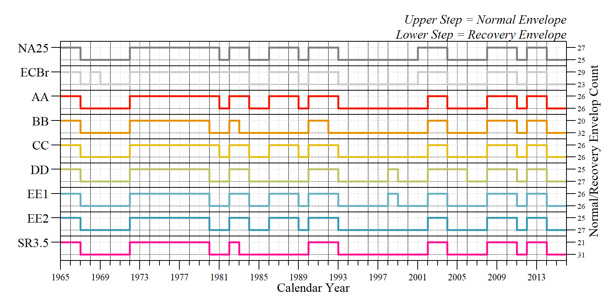
```

---
name: envelope1

### Normal/Recovery Envelope

```{r ,fig.align="center",out.width="95%",fig.cap="Percent average difference relative to FWO of the percent of time below, within and above the ecological stage envelope across alternatives including SR3.5 during the period of simulation."}

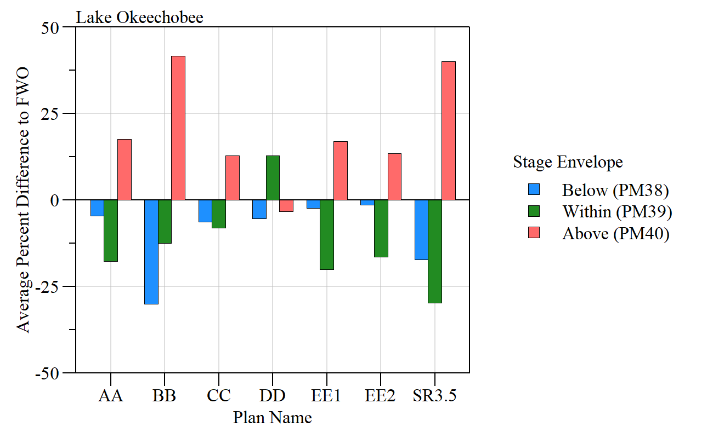
```

---
name: CREQ

### Caloosahatchee Estuary

```{r}
q.dat.CY=read.csv(paste0(export.path,"Iteration2/w_SR35/ann_Q.csv"))

CRE.Q.sum=dcast(subset(q.dat.CY,SITE%in%c("S79","S77")),Alt~SITE,value.var="TFlow.acft",fun.aggregate=function(x) mean(x/1000))
CRE.Q.sum=CRE.Q.sum[match(alts.sort,CRE.Q.sum$Alt),]
CRE.Q.sum$perFWO.S77=with(CRE.Q.sum,(S77-S77[1])/S77[1])*100
CRE.Q.sum$perFWO.S79=with(CRE.Q.sum,(S79-S79[1])/S79[1])*100


CRE.Q.sum%>%
  flextable()%>%
  colformat_double(j=2:3,digits=1,big.mark = "")%>%
  colformat_double(j=4:5,digits=1)%>%
  set_header_labels("Alt"="Alternative",
                    "perFWO.S77"="S77",
                    "perFWO.S79"="S79")%>%
  add_header("S77"="Average Total\nAnnual Discharge\n(x1000 Ac-Ft Yr\u207B\u00B9)",
             "S79"="Average Total\nAnnual Discharge\n(x1000 Ac-Ft Yr\u207B\u00B9)",
             "perFWO.S77"="% Change Compared to FWO",
             "perFWO.S79"="% Change Compared to FWO")%>%
  merge_h(part="header")%>%
  padding(padding=1,part="all")%>%
  font(fontname="Times New Roman",part="all")%>%
  fontsize(size=9,part="body")%>%
  fontsize(size=10,part="header")%>%
  align(j=2:5,align="center",part="all")%>%
  footnote(j=4:5,
           part="header",value=as_paragraph("FWO = NA25"),ref_symbols =c(" 1 "))%>%
  set_caption(caption="S77 and S79 average total discharge comparison between alternatives with percent change relative to FWO and ECB across the entire simulation period of record (Jan 1965 - Dec 2016).")
  

```

---
name: CRE

### Caloosahatchee Estuary
```{r}
CRE.Q.sum=dcast(subset(q.dat.CY,SITE%in%c("S79","S77")),Alt~SITE,value.var="TFlow.acft",fun.aggregate=function(x) sum(x/1000))
CRE.Q.sum=CRE.Q.sum[match(alts.sort,CRE.Q.sum$Alt),]

CRE.Q.sum%>%
  flextable()%>%
  set_header_labels("Alt"="Alternative")%>%
  add_header("S77"="Total Discharge\n(x1000 Ac-Ft)",
             "S79"="Total Discharge\n(x1000 Ac-Ft)")%>%
  merge_h(part="header")%>%
  padding(padding=1,part="all")%>%
  font(fontname="Times New Roman",part="all")%>%
  fontsize(size=9,part="body")%>%
  fontsize(size=10,part="header")%>%
  align(j=2:3,align="center",part="all")%>%
  set_caption(caption="S77 and S79 total discharge volume for the 52 year simulation period (Jan 1965 - Dec 2016) for each alternative.")
  
```

---
name: CRE_RECOVER

### RECOVER Salinity Envelope

```{r ,fig.align="center",out.width="100%",fig.cap="Count of 14-day period within each respective flow category for each alternative across the simulation period of record. Estimates consistent with RECOVER methodology using 14-day moving average discharge values for S79."}
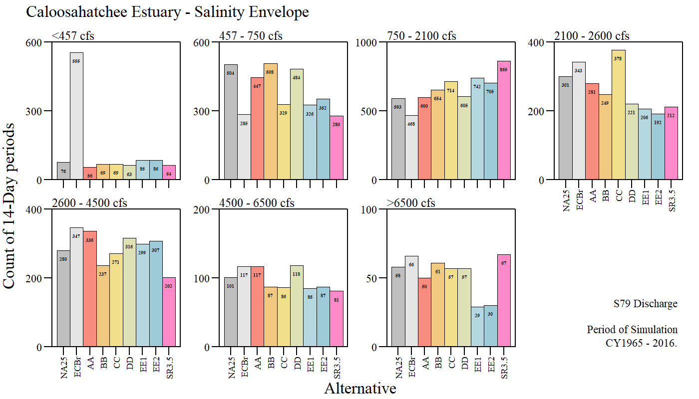
```

---
name: CRE_RECOVER_Tab

### RECOVER Salinity Envelope
```{r}
CRE.SalEnv_count=read.csv(paste0(export.path,"CRE_SalEnv_count.csv"))

vars=c("Alt", "CRE.low1.count", "CRE.low2.count", "CRE.opt.count", 
       "CRE.high.count", "CRE.high1.count", "CRE.high2.count", "CRE.high3.count","CRE.dam.count")
CRE.SalEnv_count$PerFWO.low1=with(CRE.SalEnv_count,(CRE.low1.count-CRE.low1.count[1])/CRE.low1.count[1])*100
CRE.SalEnv_count$PerFWO.low2=with(CRE.SalEnv_count,(CRE.low2.count-CRE.low2.count[1])/CRE.low2.count[1])*100
CRE.SalEnv_count$PerFWO.opt=with(CRE.SalEnv_count,(CRE.opt.count-CRE.opt.count[1])/CRE.opt.count[1])*100
CRE.SalEnv_count$PerFWO.high=with(CRE.SalEnv_count,(CRE.high.count-CRE.high.count[1])/CRE.high.count[1])*100
CRE.SalEnv_count$PerFWO.high1=with(CRE.SalEnv_count,(CRE.high1.count-CRE.high1.count[1])/CRE.high1.count[1])*100
CRE.SalEnv_count$PerFWO.high2=with(CRE.SalEnv_count,(CRE.high2.count-CRE.high2.count[1])/CRE.high2.count[1])*100
CRE.SalEnv_count$PerFWO.high3=with(CRE.SalEnv_count,(CRE.high3.count-CRE.high3.count[1])/CRE.high3.count[1])*100
CRE.SalEnv_count$PerFWO.dam=with(CRE.SalEnv_count,(CRE.dam.count-CRE.dam.count[1])/CRE.dam.count[1])*100

vars=c("Alt","PerFWO.low1", "PerFWO.low2", "PerFWO.opt", "PerFWO.high","PerFWO.dam", "PerFWO.high1","PerFWO.high2", "PerFWO.high3")
labs=c("<457","457 - 750","750 - 2100","2100 - 2600",">2600","2600 - 4500","4500 - 6500",">6500")

CRE.SalEnv_count[,vars]%>%
  flextable()%>%
  colformat_double(j=2:9,digits=1,big.mark="",na_str="---")%>%
  set_header_labels("Alt"="Alternative",
                    "PerFWO.low1"="<457 cfs", 
                    "PerFWO.low2" = "457 - 750\ncfs", 
                    "PerFWO.opt"="750 - 2100 cfs\n(Optimum)",
                    "PerFWO.high"="2100 - 2600 cfs\n(Stress)",
                    "PerFWO.dam"="> 2600 cfs\n(Damaging)",
                    "PerFWO.high1"="2600 - 4500\ncfs",
                    "PerFWO.high2"="2600 - 4500\ncfs",
                    "PerFWO.high3"="4500 - 6500\ncfs")%>%
  align(j=2:9,align="center",part="all")%>%
  padding(padding=1,part="all")%>%
  set_caption("Percent difference relative to FWO for the Caloosahatchee River Estuary. Count of 14-day period within each respective flow category for each alternative across the simulation period of record. Estimates consistent with RECOVER methodology using 14-day moving average discharge values for S79. ")%>%
  font(fontname="Times New Roman",part="all")%>%
  fontsize(size=9,part="body")%>%
  fontsize(size=10,part="header")%>%
  width(width=c(1,0.75,1,1,1,0.75,1,1,1))
```

---
name: CRE_RECOVER_Tab2

### RECOVER Salinity Envelope

```{r}
CRE.SalEnv_count$PerFWO.high.LOK=with(CRE.SalEnv_count,(CRE.high.LOK.count-CRE.high.LOK.count[1])/CRE.high.LOK.count[1])*100
CRE.SalEnv_count$PerFWO.high.basin=with(CRE.SalEnv_count,(CRE.high.basin.count-CRE.high.basin.count[1])/CRE.high.basin.count[1])*100
CRE.SalEnv_count$PerFWO.Dam.LOK=with(CRE.SalEnv_count,(CRE.dam.LOK.count-CRE.dam.LOK.count[1])/CRE.dam.LOK.count[1])*100
CRE.SalEnv_count$PerFWO.Dam.basin=with(CRE.SalEnv_count,(CRE.dam.basin.count-CRE.dam.basin.count[1])/CRE.dam.basin.count[1])*100

vars=c("Alt","PerFWO.high.LOK","PerFWO.high.basin","PerFWO.Dam.LOK","PerFWO.Dam.basin")
CRE.SalEnv_count[,vars]%>%
  flextable()%>%
  colformat_double(j=2:5,digits=1,big.mark="",na_str="---")%>%
  set_header_labels("Alt"="Alternative",
                    "PerFWO.Dam.LOK"="Lake\nRegulatory",
                    "PerFWO.Dam.basin" = "Basin",
                    "PerFWO.high.LOK"="Lake\nRegulatory",
                    "PerFWO.high.basin" = "Basin")%>%
  add_header("PerFWO.Dam.LOK"="> 2600 cfs\n(Damaging)",
             "PerFWO.Dam.basin"="> 2600 cfs\n(Damaging)",
             "PerFWO.high.LOK"="2100 - 2600 cfs\n(High)", # "\u2265 2100 - < 2600 cfs\n(High)",
             "PerFWO.high.basin"="2100 - 2600 cfs\n(High)")%>%
  merge_h(part="header")%>%
  padding(padding=1,part="all")%>%
  align(j=2:5,align="center",part="all")%>%
  set_caption("Percent difference relative to FWO for the Caloosahatchee River Estuary. Count of 14-day period within each respective flow category for each alternative across the simulation period of record. Estimates consistent with RECOVER methodology using 14-day moving average discharge values for S79. ")%>%
  font(fontname="Times New Roman",part="all")%>%
  fontsize(size=9,part="body")%>%
  fontsize(size=10,part="header")
                    

```

---
name: CRE

### Monthly Mean Discharge

```{r ,fig.align="center",out.width="50%",fig.cap="Frequency of consecutive months of monthly mean S79 discharges greater than 2100 cfs for each alternative across the simulation period of record (CY 1965 - 2016)."}
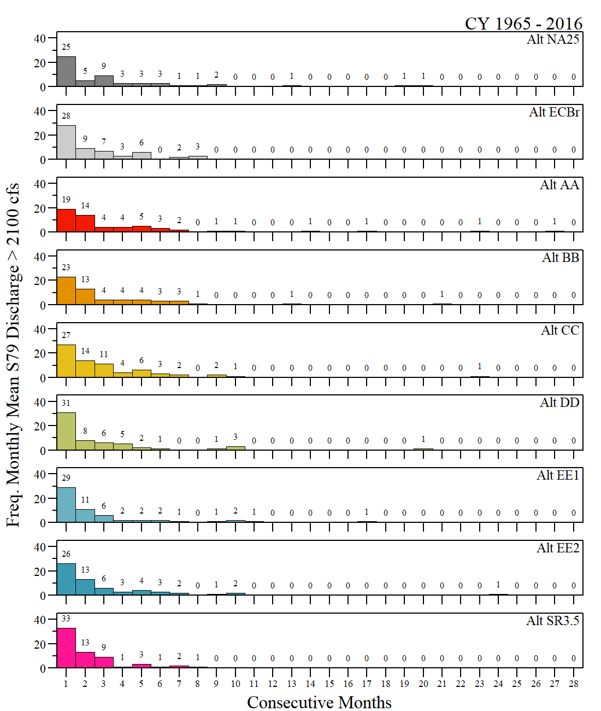
```

---
name: CRE

### Monthly Mean Discharge

```{r ,fig.align="center",out.width="50%",fig.cap="Frequency of consecutive months of monthly mean S79 discharges greater than 2600 cfs for each alternative across the simulation period of record (CY 1965 - 2016)."}
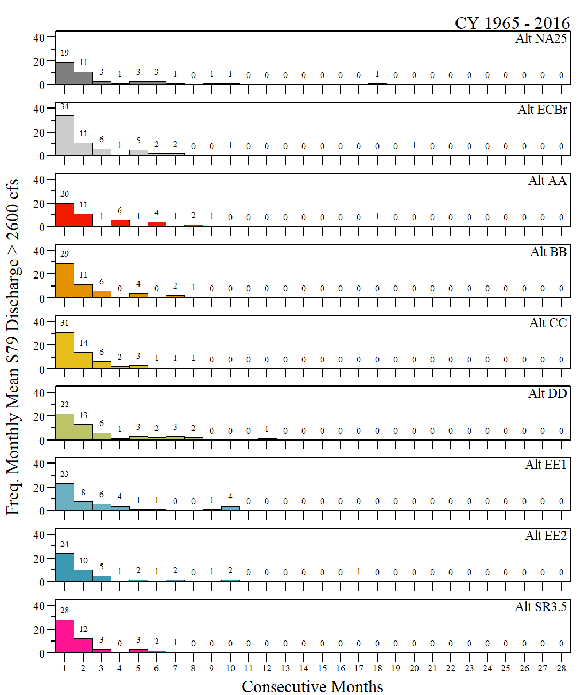
```

---
name: CRE MFL

### Caloosahatchee MFL

```{r ,fig.align="center",out.width="70%",fig.cap="Percent average difference relative to FWO of MFL exceedances for the Caloosahatchee River estuary across alternatives including SR3.5 during the period of simulation."}
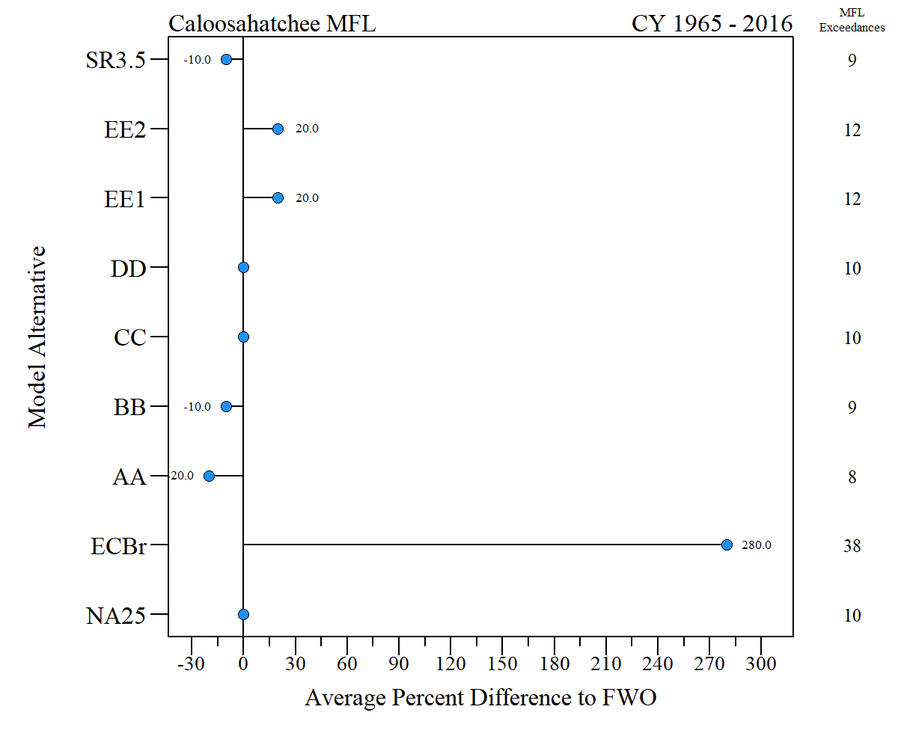
```

---
name: SLEQ

### St Lucie Estuary

```{r}
# q.dat.CY=read.csv(paste0(export.path,"Iteration2/w_SR35/ann_Q.csv"))

SLE.Q.sum=dcast(subset(q.dat.CY,SITE%in%c("S80","S308","S308BF")),Alt~SITE,value.var="TFlow.acft",fun.aggregate=function(x) mean(x/1000))
SLE.Q.sum=SLE.Q.sum[match(alts.sort,SLE.Q.sum$Alt),c("Alt","S80","S308","S308BF")]
SLE.Q.sum$perFWO.S80=with(SLE.Q.sum,(S80-S80[1])/S80[1])*100
SLE.Q.sum$perFWO.S308=with(SLE.Q.sum,(S308-S308[1])/S308[1])*100
SLE.Q.sum$perFWO.S308BF=with(SLE.Q.sum,(S308BF-S308BF[1])/S308BF[1])*100


SLE.Q.sum%>%
  flextable()%>%
  colformat_double(j=2:4,digits=1,big.mark = "")%>%
  colformat_double(j=5:7,digits=1)%>%
  set_header_labels("Alt"="Alternative",
                    "perFWO.S80"="S80",
                    "perFWO.S308"="S308",
                    "perFWO.S308BF"="S308\nBackflow",
                    "S308BF"="S308\nBackflow")%>%
  add_header("S80"="Average Total\nAnnual Discharge\n(x1000 Ac-Ft Yr\u207B\u00B9)",
             "S308"="Average Total\nAnnual Discharge\n(x1000 Ac-Ft Yr\u207B\u00B9)",
             "S308BF"="Average Total\nAnnual Discharge\n(x1000 Ac-Ft Yr\u207B\u00B9)",
             "perFWO.S80"="% Change Compared to FWO",
             "perFWO.S308"="% Change Compared to FWO",
             "perFWO.S308BF"="% Change Compared to FWO")%>%
  merge_h(part="header")%>%
  padding(padding=1,part="all")%>%
  font(fontname="Times New Roman",part="all")%>%
  fontsize(size=9,part="body")%>%
  fontsize(size=10,part="header")%>%
  align(j=2:7,align="center",part="all")%>%
  footnote(j=5:7,
           part="header",value=as_paragraph("FWO = NA25"),ref_symbols =c(" 1 "))%>%
  set_caption(caption="S308, S80 and S308 backflow (return to Lake) average total discharge comparison between alternatives with percent change relative to FWO and ECB across the entire simulation period of record (Jan 1965 - Dec 2016).")
  

```

---
name: SLE

### St Lucie Estuary
```{r}
SLE.Q.sum=dcast(subset(q.dat.CY,SITE%in%c("S80","S308","S308BF")),Alt~SITE,value.var="TFlow.acft",fun.aggregate=function(x) sum(x/1000))
SLE.Q.sum=SLE.Q.sum[match(alts.sort,SLE.Q.sum$Alt),c("Alt","S80","S308","S308BF")]

SLE.Q.sum%>%
  flextable()%>%
  set_header_labels("Alt"="Alternative",
                    "S308BF"="S308\nBackflow")%>%
  add_header("S80"="Total Discharge\n(x1000 Ac-Ft)",
             "S308"="Total Discharge\n(x1000 Ac-Ft)",
             "S308BF"="Total Discharge\n(x1000 Ac-Ft)")%>%
  merge_h(part="header")%>%
  padding(padding=1,part="all")%>%
  font(fontname="Times New Roman",part="all")%>%
  fontsize(size=9,part="body")%>%
  fontsize(size=10,part="header")%>%
  align(j=2:4,align="center",part="all")%>%
  set_caption(caption="S308, S80 and S308 backflow (return to Lake) total discharge volume for the 52 year simulation period (Jan 1965 - Dec 2016) for each alternative.")

```

---
name: SLE_RECOVER

### RECOVER Salinity Envelope

```{r ,fig.align="center",out.width="100%",fig.cap="Count of 14-day period within each respective flow category for each alternative across the simulation period of record. Estimates consistent with RECOVER methodology using 14-day moving average discharge values for S80 and Tributaries."}
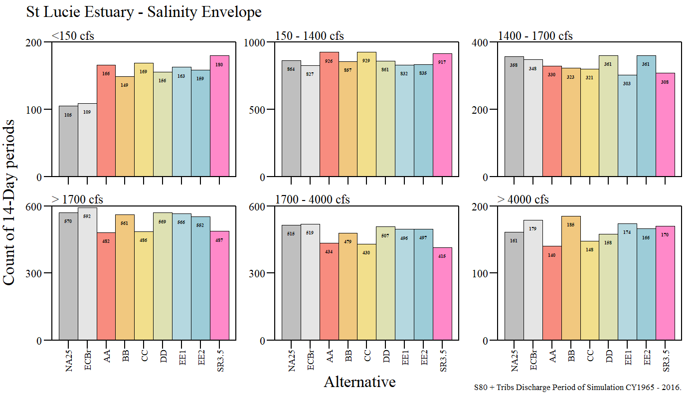
```


---
name: SLE_RECOVER_Tab

### RECOVER Salinity Envelope
```{r}
SLE.SalEnv_count=read.csv(paste0(export.path,"SLE_SalEnv_count.csv"))

SLE.SalEnv_count$PerFWO.low=with(SLE.SalEnv_count,(SLE.low.count-SLE.low.count[1])/SLE.low.count[1])*100
SLE.SalEnv_count$PerFWO.opt=with(SLE.SalEnv_count,(SLE.opt.count-SLE.opt.count[1])/SLE.opt.count[1])*100
SLE.SalEnv_count$PerFWO.high=with(SLE.SalEnv_count,(SLE.high.count-SLE.high.count[1])/SLE.high.count[1])*100
SLE.SalEnv_count$PerFWO.dam=with(SLE.SalEnv_count,(SLE.dam.count-SLE.dam.count[1])/SLE.dam.count[1])*100
SLE.SalEnv_count$PerFWO.high1=with(SLE.SalEnv_count,(SLE.high1.count-SLE.high1.count[1])/SLE.high1.count[1])*100
SLE.SalEnv_count$PerFWO.high2=with(SLE.SalEnv_count,(SLE.high2.count-SLE.high2.count[1])/SLE.high2.count[1])*100


vars=c("Alt","PerFWO.low", "PerFWO.opt", "PerFWO.high", "PerFWO.dam", "PerFWO.high1", "PerFWO.high2")
labs=c("<150","150 - 1400","1400 - 1700","> 1700","1700 - 4000","> 4000")
SLE.SalEnv_count[,vars]%>%
  flextable()%>%
  colformat_double(j=2:7,digits=1,big.mark="",na_str="---")%>%
  set_header_labels("Alt"="Alternative",
                    "PerFWO.low"="< 150 cfs",
                    "PerFWO.opt"="150 - 1400 cfs\n(Optimum)",
                    "PerFWO.high"="1400 - 1700 cfs\n(Stress)",
                    "PerFWO.dam"="> 1700 cfs\n(Damaging)",
                    "PerFWO.high1" = "1700 - 4000\ncfs",
                    "PerFWO.high2" = "> 4000\ncfs")%>%
  font(fontname="Times New Roman",part="all")%>%
  padding(padding=1,part="all")%>%
  bold(part="header")%>%
  align(j=2:7,align="center",part="all")%>%
  set_caption("Percent difference relative to FWO for the St Lucie River Estuary. Count of 14-day period within each respective flow category for each alternative across the simulation period of record. Estimates consistent with RECOVER methodology using 14-day moving average discharge values for S80 and Tributaries.")%>%
  font(fontname="Times New Roman",part="all")%>%
  fontsize(size=9,part="body")%>%
  fontsize(size=10,part="header")%>%
  width(width=c(1,0.75,1,1,0.75,1,0.75))
```


---
name: SLE_RECOVER_Tab2

### RECOVER Salinity Envelope
```{r}

SLE.SalEnv_count$PerFWO.high.LOK=with(SLE.SalEnv_count,(SLE.high.LOK.count-SLE.high.LOK.count[1])/SLE.high.LOK.count[1])*100
SLE.SalEnv_count$PerFWO.high.basin=with(SLE.SalEnv_count,(SLE.high.basin.count-SLE.high.basin.count[1])/SLE.high.basin.count[1])*100

SLE.SalEnv_count$PerFWO.Dam.LOK=with(SLE.SalEnv_count,(SLE.dam.LOK.count-SLE.dam.LOK.count[1])/SLE.dam.LOK.count[1])*100
SLE.SalEnv_count$PerFWO.Dam.basin=with(SLE.SalEnv_count,(SLE.dam.basin.count-SLE.dam.basin.count[1])/SLE.dam.basin.count[1])*100

vars=c("Alt","PerFWO.high.LOK","PerFWO.high.basin","PerFWO.Dam.LOK","PerFWO.Dam.basin")
SLE.SalEnv_count[,vars]%>%
  flextable()%>%
  colformat_double(j=2:5,digits=1,big.mark="",na_str="---")%>%
  set_header_labels("Alt"="Alternative",
                    "PerFWO.Dam.LOK"="Lake\nRegulatory",
                    "PerFWO.Dam.basin" = "Basin",
                    "PerFWO.high.LOK"="Lake\nRegulatory",
                    "PerFWO.high.basin" = "Basin")%>%
  add_header("PerFWO.Dam.LOK"="> 2600 cfs\n(Damaging)",
             "PerFWO.Dam.basin"="> 2600 cfs\n(Damaging)",
             "PerFWO.high.LOK"="2100 - 2600 cfs\n(High)", # "\u2265 2100 - < 2600 cfs\n(High)",
             "PerFWO.high.basin"="2100 - 2600 cfs\n(High)")%>%
  merge_h(part="header")%>%
  padding(padding=1,part="all")%>%
  align(j=2:5,align="center",part="all")%>%
  set_caption("Percent difference relative to FWO for the St Lucie River Estuary. Count of 14-day period within each respective flow category for each alternative across the simulation period of record. Estimates consistent with RECOVER methodology using 14-day moving average discharge values for S80 and Tributaries.")%>%
  font(fontname="Times New Roman",part="all")%>%
  fontsize(size=9,part="body")%>%
  fontsize(size=10,part="header")
              
```

---
name: FlowSouth

### Flow South 

```{r}
sites.val=c("NSF2EST","S4BP", "S2", "S3", "S308", "S308_QFC", "S308BF", "S351","S352", "S354", "S48", "S49", "S77", "S77_QFC", "S78", "S79","S79_QFC", "S80", "S80_QFC", "S80_QPFCSOURCE_LAKE", "TMC2EST")
group.val=c("NSF2EST","S2S3S4", "S2S3S4", "S2S3S4", "S308", "S308_QFC", "S308BF", "FlowSouth","S352", "FlowSouth", "S48", "S49", "S77", "S77_QFC", "S78", "S79","S79_QFC", "S80", "S80_QFC", "S80_QPFCSOURCE_LAKE", "TMC2EST")
q.dat2=merge(q.dat.CY,data.frame(SITE=sites.val,SITE2=group.val),"SITE")


q.dat.CY2=ddply(q.dat2,c("CY","Alt",'SITE2'),summarise,TFlow.acft=sum(TFlow.acft,na.rm=T))
q.dat.CY2$Alt=factor(q.dat.CY2$Alt,levels=alts.sort)

Flowsouth.sum=reshape2::dcast(subset(q.dat.CY2,SITE2%in%c("S2S3S4","FlowSouth")),Alt~SITE2,value.var="TFlow.acft",fun.aggregate=function(x) mean(x/1000,na.rm=T))
Flowsouth.sum=Flowsouth.sum[match(alts.sort,Flowsouth.sum$Alt),]
Flowsouth.sum$perFWO.flowsouth=with(Flowsouth.sum,(FlowSouth-FlowSouth[1])/FlowSouth[1])*100
Flowsouth.sum$perFWO.S2S3S4=with(Flowsouth.sum,(S2S3S4-S2S3S4[1])/S2S3S4[1])*100
# Flowsouth.sum

Flowsouth.sum%>%
  flextable()%>%
  colformat_double(j=2:3,digits=1,big.mark = "")%>%
  colformat_double(j=4:5,digits=1)%>%
  set_header_labels("Alt"="Alternative",
                    "FlowSouth"="\u2211 S351, S354",
                    "S2S3S4"="\u2211 S2, S3, S4",
                    "perFWO.flowsouth"="\u2211 S351, S354",
                    "perFWO.S2S3S4"="\u2211 S2, S3, S4")%>%
  add_header("FlowSouth"="Average Total\nAnnual Discharge\n(x1000 Ac-Ft Yr\u207B\u00B9)",
             "S2S3S4"="Average Total\nAnnual Discharge\n(x1000 Ac-Ft Yr\u207B\u00B9)",
             "perFWO.flowsouth"="% Change Compared to FWO",
             "perFWO.S2S3S4"="% Change Compared to FWO")%>%
  merge_h(part="header")%>%
  padding(padding=1,part="all")%>%
  fontsize(size=9,part="body")%>%
  fontsize(size=10,part="header")%>%
  align(j=2:5,align="center",part="all")%>%
  width(width=c(0.5,1,1,1,1))%>%
  footnote(j=4:5,
           part="header",value=as_paragraph("FWO = NA25"),ref_symbols =c(" 1 "))%>%
  set_caption(caption="S351 and S354 (Flow South) and S2, S3, and S4 (backflow to Lake) average total discharge comparison between alternatives with percent change relative to FWO and ECB across the entire simulation period of record (Jan 1965 - Dec 2016).")%>%
  font(fontname="Times New Roman",part="all")
  
```

---
name: SouthQ

### Flow South

```{r ,fig.align="center",out.width="100%",fig.cap="Boxplots of annual (calendar year) discharge for flows south (S351 and S354) for each alterntive across the simulation period of record including SR3.5."}
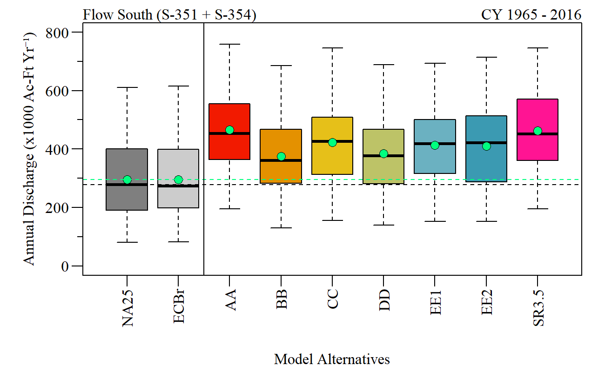
```

---
name: SouthQ2

### Flow South - Backflow

```{r ,fig.align="center",out.width="100%",fig.cap="Boxplots of annual (calendar year) discharge for S2, S3 and S4 (backflow to Lake) for each alterntive across the simulation period of record including SR3.5."}
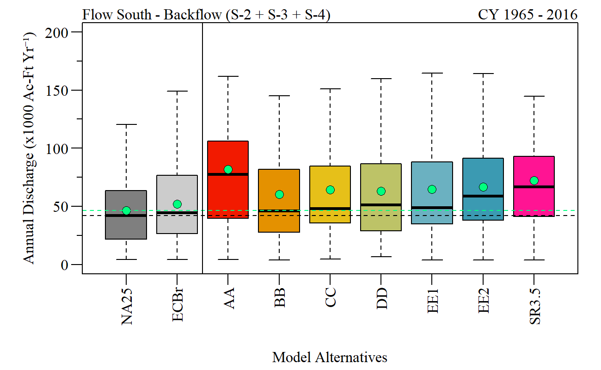
```