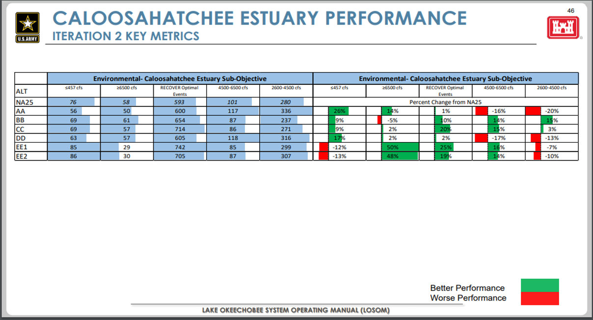
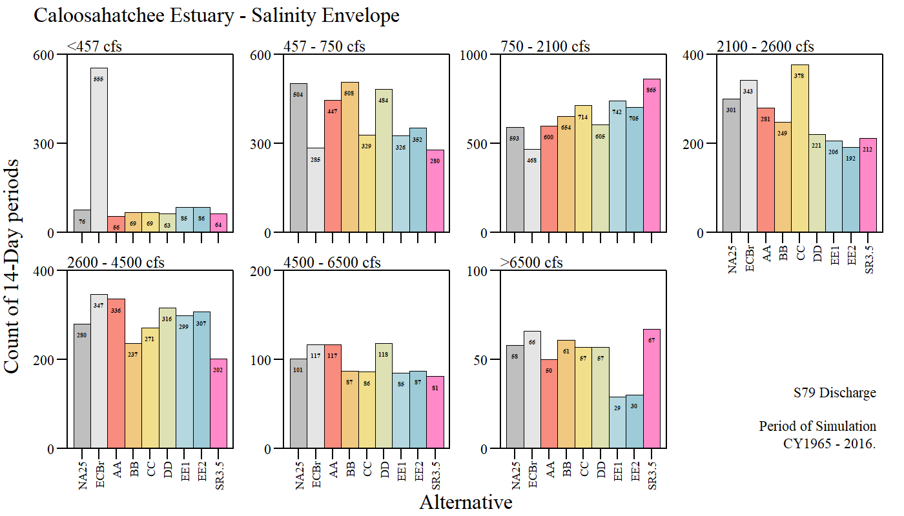
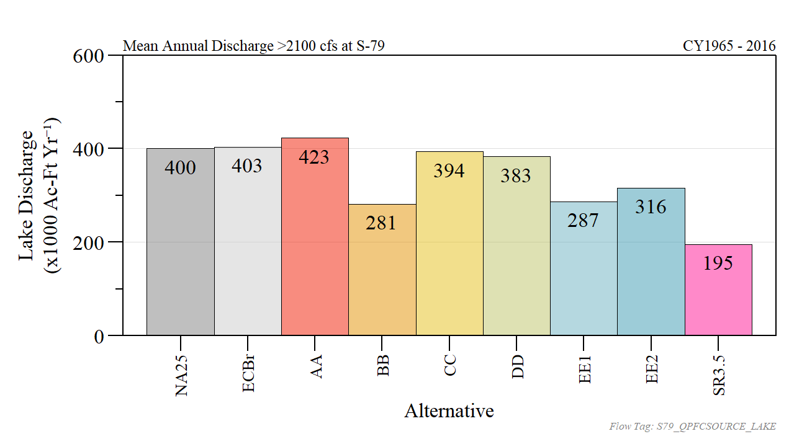
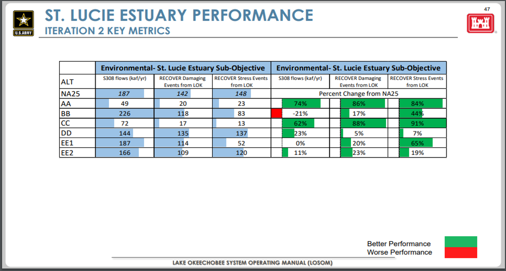
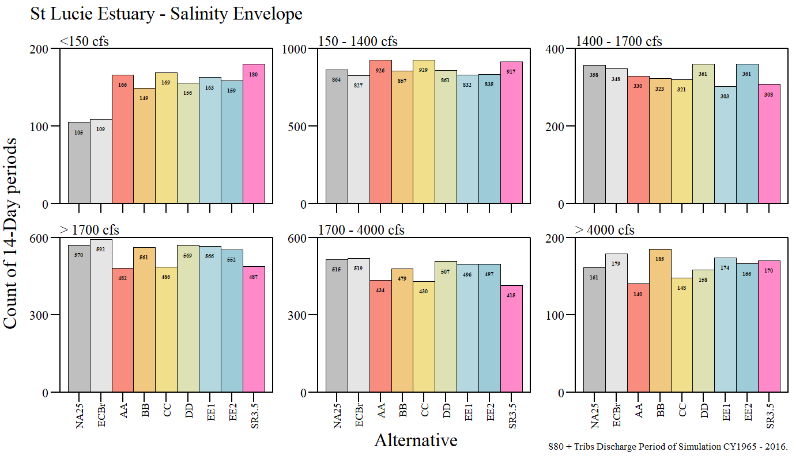
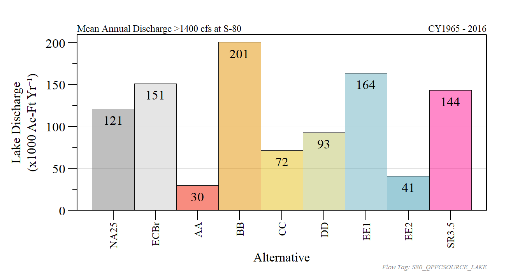
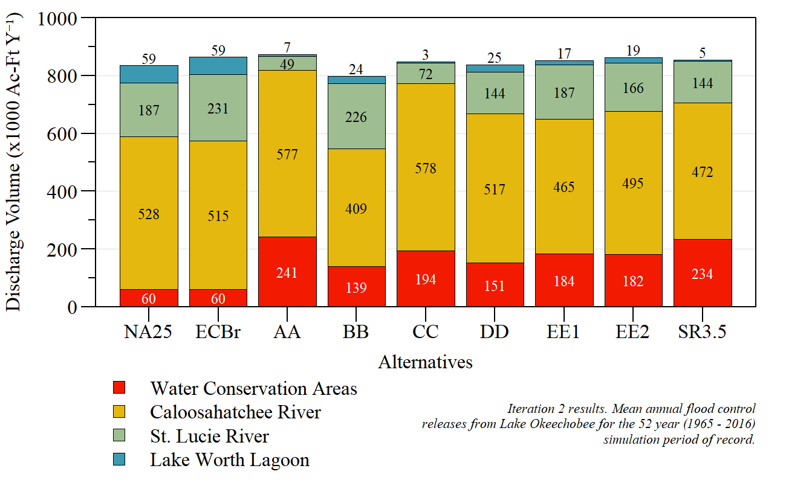

```{r setup, include=FALSE}
library(knitr)

options(htmltools.dir.version = FALSE)
knitr::opts_chunk$set(warning = FALSE, message = FALSE, echo=FALSE)

##
library(flextable)
library(magrittr)
library(plyr)
library(reshape2)

wd="C:/Julian_LaCie/_Github/LOSOM_ModelEval"

plot.path="C:/Julian_LaCie/_Github/LOSOM_ModelEval/Plots/"
export.path="C:/Julian_LaCie/_GitHub/LOSOM_ModelEval/Export/"

##
alts.sort=c("NA25","ECBr","AA","BB","CC","DD","EE1","EE2","SR3.5")
```

layout: true

<div class="my-footer">
<span>  </span>
</div>

---
name: title
class: left, middle

### Lake Okeechobee System Operating Manual

.pull-left[
#### Iteration 2 Modeling Evaluation

*Sanibel-Captiva Conservation Foundation*

*Conservancy of Southwest Florida*

**DRAFT** - `r paste(format(as.Date("2021-08-10"),"%B %d, %Y"))#,"<br>(Updated:", format(as.Date(Sys.Date()),"%B %d, %Y"),")")`

]
<!-- this ends up being the title slide since seal = FALSE-->

.pull-right[
```{r ,fig.align="center",out.width="40%"}
knitr::include_graphics('./Plots/SCCF Logo knockout_c.png')
```

```{r ,fig.align="center",out.width="40%"}
knitr::include_graphics('./Plots/ConSWFL.jpeg')
```

]


```{r xaringanExtra, include=FALSE, warnint=FALSE}
# devtools::install_github("gadenbuie/xaringanExtra")
# xaringanExtra::use_webcam()
xaringanExtra::use_tile_view()
# xaringanExtra::use_scribble()
```
.footnote[
Paul Julian PhD<br>[`r fontawesome::fa("fas fa-envelope")`](mailto: pjulian@sccf.org) .small[pjulian@sccf.org]

.small[Use cursor keys for navigation, press .red["O"] for a slide .red[O]verview]

```{r} 
bsplus::bs_button(
    label = "Download PDF Version",
    button_type = "primary",
    button_size = "small") %>%
    htmltools::a(
      href = "https://github.com/SwampThingPaul/LOSOM_ModelEval/raw/main/SCCF_iter2_LOSOM_SR35.pdf"
    )
```
]
---
name: USACE CRE
class: middle


```{r ,fig.align="center",out.width="150%"}

```

.footnote[
.small[from 17 June 2021 PDT Meeting Presentation]
]

---
name: CREQ

### Caloosahatchee Estuary

```{r}
q.dat.CY=read.csv(paste0(export.path,"Iteration2/w_SR35/ann_Q.csv"))

CRE.Q.sum=dcast(subset(q.dat.CY,SITE%in%c("S79","S77")),Alt~SITE,value.var="TFlow.acft",fun.aggregate=function(x) mean(x/1000))
CRE.Q.sum=CRE.Q.sum[match(alts.sort,CRE.Q.sum$Alt),]
CRE.Q.sum$perFWO.S77=with(CRE.Q.sum,(S77-S77[1])/S77[1])*100
CRE.Q.sum$perFWO.S79=with(CRE.Q.sum,(S79-S79[1])/S79[1])*100


CRE.Q.sum%>%
  flextable()%>%
  colformat_double(j=2:3,digits=1,big.mark = "")%>%
  colformat_double(j=4:5,digits=1)%>%
  set_header_labels("Alt"="Alternative",
                    "perFWO.S77"="S77",
                    "perFWO.S79"="S79")%>%
  add_header("S77"="Average Total\nAnnual Discharge\n(x1000 Ac-Ft Yr\u207B\u00B9)",
             "S79"="Average Total\nAnnual Discharge\n(x1000 Ac-Ft Yr\u207B\u00B9)",
             "perFWO.S77"="% Change Compared to FWO",
             "perFWO.S79"="% Change Compared to FWO")%>%
  merge_h(part="header")%>%
  padding(padding=1,part="all")%>%
  font(fontname="Times New Roman",part="all")%>%
  fontsize(size=9,part="body")%>%
  fontsize(size=10,part="header")%>%
  align(j=2:5,align="center",part="all")%>%
  bg(i=~Alt%in%c("NA25","CC","SR3.5"),bg="yellow",part="body")%>%
  footnote(j=4:5,
           part="header",value=as_paragraph("FWO = NA25"),ref_symbols =c(" 1 "))%>%
  set_caption(caption="S77 and S79 average total discharge comparison between alternatives with percent change relative to FWO and ECB across the entire simulation period of record (Jan 1965 - Dec 2016).")
  

```

---
name: CRE_RECOVER_Tab

### RECOVER Salinity Envelope
```{r}
CRE.SalEnv_count=read.csv(paste0(export.path,"CRE_SalEnv_count.csv"))

vars=c("Alt", "CRE.low1.count", "CRE.low2.count", "CRE.opt.count", 
       "CRE.high.count", "CRE.high1.count", "CRE.high2.count", "CRE.high3.count","CRE.dam.count")
CRE.SalEnv_count$PerFWO.low1=with(CRE.SalEnv_count,(CRE.low1.count-CRE.low1.count[1])/CRE.low1.count[1])*100
CRE.SalEnv_count$PerFWO.low2=with(CRE.SalEnv_count,(CRE.low2.count-CRE.low2.count[1])/CRE.low2.count[1])*100
CRE.SalEnv_count$PerFWO.opt=with(CRE.SalEnv_count,(CRE.opt.count-CRE.opt.count[1])/CRE.opt.count[1])*100
CRE.SalEnv_count$PerFWO.high=with(CRE.SalEnv_count,(CRE.high.count-CRE.high.count[1])/CRE.high.count[1])*100
CRE.SalEnv_count$PerFWO.high1=with(CRE.SalEnv_count,(CRE.high1.count-CRE.high1.count[1])/CRE.high1.count[1])*100
CRE.SalEnv_count$PerFWO.high2=with(CRE.SalEnv_count,(CRE.high2.count-CRE.high2.count[1])/CRE.high2.count[1])*100
CRE.SalEnv_count$PerFWO.high3=with(CRE.SalEnv_count,(CRE.high3.count-CRE.high3.count[1])/CRE.high3.count[1])*100
CRE.SalEnv_count$PerFWO.dam=with(CRE.SalEnv_count,(CRE.dam.count-CRE.dam.count[1])/CRE.dam.count[1])*100

vars=c("Alt","PerFWO.low1", "PerFWO.low2", "PerFWO.opt", "PerFWO.high","PerFWO.dam", "PerFWO.high1","PerFWO.high2", "PerFWO.high3")
labs=c("<457","457 - 750","750 - 2100","2100 - 2600",">2600","2600 - 4500","4500 - 6500",">6500")

CRE.SalEnv_count[,vars]%>%
  flextable()%>%
  colformat_double(j=2:9,digits=1,big.mark="",na_str="---")%>%
  set_header_labels("Alt"="Alternative",
                    "PerFWO.low1"="<457 cfs", 
                    "PerFWO.low2" = "457 - 750\ncfs", 
                    "PerFWO.opt"="750 - 2100 cfs\n(Optimum)",
                    "PerFWO.high"="2100 - 2600 cfs\n(Stress)",
                    "PerFWO.dam"="> 2600 cfs\n(Damaging)",
                    "PerFWO.high1"="2600 - 4500\ncfs",
                    "PerFWO.high2"="4500 - 6500\ncfs",
                    "PerFWO.high3"=">6500 cfs")%>%
  align(j=2:9,align="center",part="all")%>%
  padding(padding=1,part="all")%>%
  set_caption("Percent difference relative to FWO for the Caloosahatchee River Estuary. Count of 14-day period within each respective flow category for each alternative across the simulation period of record. Estimates consistent with RECOVER methodology using 14-day moving average discharge values for S79. ")%>%
  font(fontname="Times New Roman",part="all")%>%
  fontsize(size=9,part="body")%>%
  fontsize(size=10,part="header")%>%
  bg(i=~Alt%in%c("NA25","CC","SR3.5"),bg="yellow",part="body")%>%
  width(width=c(1,0.75,1,1,1,0.75,1,1,1))
```

---
name: CRE_RECOVER_Tab2

### RECOVER Salinity Envelope

```{r}
CRE.SalEnv_count$PerFWO.high.LOK=with(CRE.SalEnv_count,(CRE.high.LOK.count-CRE.high.LOK.count[1])/CRE.high.LOK.count[1])*100
CRE.SalEnv_count$PerFWO.high.basin=with(CRE.SalEnv_count,(CRE.high.basin.count-CRE.high.basin.count[1])/CRE.high.basin.count[1])*100
CRE.SalEnv_count$PerFWO.Dam.LOK=with(CRE.SalEnv_count,(CRE.dam.LOK.count-CRE.dam.LOK.count[1])/CRE.dam.LOK.count[1])*100
CRE.SalEnv_count$PerFWO.Dam.basin=with(CRE.SalEnv_count,(CRE.dam.basin.count-CRE.dam.basin.count[1])/CRE.dam.basin.count[1])*100

vars=c("Alt","PerFWO.high.LOK","PerFWO.high.basin","PerFWO.Dam.LOK","PerFWO.Dam.basin")
CRE.SalEnv_count[,vars]%>%
  flextable()%>%
  colformat_double(j=2:5,digits=1,big.mark="",na_str="---")%>%
  set_header_labels("Alt"="Alternative",
                    "PerFWO.Dam.LOK"="Lake\nRegulatory",
                    "PerFWO.Dam.basin" = "Basin",
                    "PerFWO.high.LOK"="Lake\nRegulatory",
                    "PerFWO.high.basin" = "Basin")%>%
  add_header("PerFWO.Dam.LOK"="> 2600 cfs\n(Damaging)",
             "PerFWO.Dam.basin"="> 2600 cfs\n(Damaging)",
             "PerFWO.high.LOK"="2100 - 2600 cfs\n(Stress)", # "\u2265 2100 - < 2600 cfs\n(High)",
             "PerFWO.high.basin"="2100 - 2600 cfs\n(Stress)")%>%
  bg(i=~Alt%in%c("NA25","CC","SR3.5"),bg="yellow",part="body")%>%
  merge_h(part="header")%>%
  padding(padding=1,part="all")%>%
  align(j=2:5,align="center",part="all")%>%
  set_caption("Percent difference relative to FWO for the Caloosahatchee River Estuary. Count of 14-day period within each respective flow category for each alternative across the simulation period of record. Estimates consistent with RECOVER methodology using 14-day moving average discharge values for S79. ")%>%
  font(fontname="Times New Roman",part="all")%>%
  fontsize(size=9,part="body")%>%
  fontsize(size=10,part="header")
                    

```


---
name: CRE_RECOVER

### RECOVER Salinity Envelope

```{r ,fig.align="center",out.width="100%",fig.cap="Count of 14-day period within each respective flow category for each alternative across the simulation period of record. Estimates consistent with RECOVER methodology using 14-day moving average discharge values for S79."}

```

---
name: CRE_LakeDam

### Damaging Lake Discharges

```{r ,fig.align="center",out.width="100%",fig.cap="Mean annual lake discharge volume when S79 flows are greater than 2100 cfs."}

```

---
name: USACE SLE
class: middle


```{r ,fig.align="center",out.width="150%"}

```

.footnote[
.small[from 17 June 2021 PDT Meeting Presentation]
]


---
name: SLEQ

### St Lucie Estuary

```{r}
# q.dat.CY=read.csv(paste0(export.path,"Iteration2/w_SR35/ann_Q.csv"))

SLE.Q.sum=dcast(subset(q.dat.CY,SITE%in%c("S80","S308","S308BF")),Alt~SITE,value.var="TFlow.acft",fun.aggregate=function(x) mean(x/1000))
SLE.Q.sum=SLE.Q.sum[match(alts.sort,SLE.Q.sum$Alt),c("Alt","S80","S308","S308BF")]
SLE.Q.sum$perFWO.S80=with(SLE.Q.sum,(S80-S80[1])/S80[1])*100
SLE.Q.sum$perFWO.S308=with(SLE.Q.sum,(S308-S308[1])/S308[1])*100
SLE.Q.sum$perFWO.S308BF=with(SLE.Q.sum,(S308BF-S308BF[1])/S308BF[1])*100


SLE.Q.sum%>%
  flextable()%>%
  colformat_double(j=2:4,digits=1,big.mark = "")%>%
  colformat_double(j=5:7,digits=1)%>%
  set_header_labels("Alt"="Alternative",
                    "perFWO.S80"="S80",
                    "perFWO.S308"="S308",
                    "perFWO.S308BF"="S308\nBackflow",
                    "S308BF"="S308\nBackflow")%>%
  add_header("S80"="Average Total\nAnnual Discharge\n(x1000 Ac-Ft Yr\u207B\u00B9)",
             "S308"="Average Total\nAnnual Discharge\n(x1000 Ac-Ft Yr\u207B\u00B9)",
             "S308BF"="Average Total\nAnnual Discharge\n(x1000 Ac-Ft Yr\u207B\u00B9)",
             "perFWO.S80"="% Change Compared to FWO",
             "perFWO.S308"="% Change Compared to FWO",
             "perFWO.S308BF"="% Change Compared to FWO")%>%
  merge_h(part="header")%>%
  padding(padding=1,part="all")%>%
  font(fontname="Times New Roman",part="all")%>%
  fontsize(size=9,part="body")%>%
  fontsize(size=10,part="header")%>%
  align(j=2:7,align="center",part="all")%>%
  bg(i=~Alt%in%c("NA25","CC","SR3.5"),bg="yellow",part="body")%>%
  footnote(j=5:7,
           part="header",value=as_paragraph("FWO = NA25"),ref_symbols =c(" 1 "))%>%
  set_caption(caption="S308, S80 and S308 backflow (return to Lake) average total discharge comparison between alternatives with percent change relative to FWO and ECB across the entire simulation period of record (Jan 1965 - Dec 2016).")
  

```

---
name: SLE_RECOVER_Tab

### RECOVER Salinity Envelope
```{r}
SLE.SalEnv_count=read.csv(paste0(export.path,"SLE_SalEnv_count.csv"))

SLE.SalEnv_count$PerFWO.low=with(SLE.SalEnv_count,(SLE.low.count-SLE.low.count[1])/SLE.low.count[1])*100
SLE.SalEnv_count$PerFWO.opt=with(SLE.SalEnv_count,(SLE.opt.count-SLE.opt.count[1])/SLE.opt.count[1])*100
SLE.SalEnv_count$PerFWO.high=with(SLE.SalEnv_count,(SLE.high.count-SLE.high.count[1])/SLE.high.count[1])*100
SLE.SalEnv_count$PerFWO.dam=with(SLE.SalEnv_count,(SLE.dam.count-SLE.dam.count[1])/SLE.dam.count[1])*100
SLE.SalEnv_count$PerFWO.high1=with(SLE.SalEnv_count,(SLE.high1.count-SLE.high1.count[1])/SLE.high1.count[1])*100
SLE.SalEnv_count$PerFWO.high2=with(SLE.SalEnv_count,(SLE.high2.count-SLE.high2.count[1])/SLE.high2.count[1])*100


vars=c("Alt","PerFWO.low", "PerFWO.opt", "PerFWO.high", "PerFWO.dam", "PerFWO.high1", "PerFWO.high2")
labs=c("<150","150 - 1400","1400 - 1700","> 1700","1700 - 4000","> 4000")
SLE.SalEnv_count[,vars]%>%
  flextable()%>%
  colformat_double(j=2:7,digits=1,big.mark="",na_str="---")%>%
  set_header_labels("Alt"="Alternative",
                    "PerFWO.low"="< 150 cfs",
                    "PerFWO.opt"="150 - 1400 cfs\n(Optimum)",
                    "PerFWO.high"="1400 - 1700 cfs\n(Stress)",
                    "PerFWO.dam"="> 1700 cfs\n(Damaging)",
                    "PerFWO.high1" = "1700 - 4000\ncfs",
                    "PerFWO.high2" = "> 4000\ncfs")%>%
  font(fontname="Times New Roman",part="all")%>%
  padding(padding=1,part="all")%>%
  bold(part="header")%>%
  align(j=2:7,align="center",part="all")%>%
  bg(i=~Alt%in%c("NA25","CC","SR3.5"),bg="yellow",part="body")%>%
  set_caption("Percent difference relative to FWO for the St Lucie River Estuary. Count of 14-day period within each respective flow category for each alternative across the simulation period of record. Estimates consistent with RECOVER methodology using 14-day moving average discharge values for S80 and Tributaries.")%>%
  font(fontname="Times New Roman",part="all")%>%
  fontsize(size=9,part="body")%>%
  fontsize(size=10,part="header")%>%
  width(width=c(1,0.75,1,1,0.75,1,0.75))
```


---
name: SLE_RECOVER_Tab2

### RECOVER Salinity Envelope
```{r}

SLE.SalEnv_count$PerFWO.high.LOK=with(SLE.SalEnv_count,(SLE.high.LOK.count-SLE.high.LOK.count[1])/SLE.high.LOK.count[1])*100
SLE.SalEnv_count$PerFWO.high.basin=with(SLE.SalEnv_count,(SLE.high.basin.count-SLE.high.basin.count[1])/SLE.high.basin.count[1])*100

SLE.SalEnv_count$PerFWO.Dam.LOK=with(SLE.SalEnv_count,(SLE.dam.LOK.count-SLE.dam.LOK.count[1])/SLE.dam.LOK.count[1])*100
SLE.SalEnv_count$PerFWO.Dam.basin=with(SLE.SalEnv_count,(SLE.dam.basin.count-SLE.dam.basin.count[1])/SLE.dam.basin.count[1])*100

vars=c("Alt","PerFWO.high.LOK","PerFWO.high.basin","PerFWO.Dam.LOK","PerFWO.Dam.basin")
SLE.SalEnv_count[,vars]%>%
  flextable()%>%
  colformat_double(j=2:5,digits=1,big.mark="",na_str="---")%>%
  set_header_labels("Alt"="Alternative",
                    "PerFWO.Dam.LOK"="Lake\nRegulatory",
                    "PerFWO.Dam.basin" = "Basin",
                    "PerFWO.high.LOK"="Lake\nRegulatory",
                    "PerFWO.high.basin" = "Basin")%>%
  add_header("PerFWO.Dam.LOK"="> 1700 cfs\n(Damaging)",
             "PerFWO.Dam.basin"="> 1700 cfs\n(Damaging)",
             "PerFWO.high.LOK"="1400 - 1700 cfs\n(Stress)", # "\u2265 2100 - < 2600 cfs\n(High)",
             "PerFWO.high.basin"="1400 - 1700 cfs\n(Stress)")%>%
  merge_h(part="header")%>%
  padding(padding=1,part="all")%>%
  align(j=2:5,align="center",part="all")%>%
  bg(i=~Alt%in%c("NA25","CC","SR3.5"),bg="yellow",part="body")%>%
  set_caption("Percent difference relative to FWO for the St Lucie River Estuary. Count of 14-day period within each respective flow category for each alternative across the simulation period of record. Estimates consistent with RECOVER methodology using 14-day moving average discharge values for S80 and Tributaries.")%>%
  font(fontname="Times New Roman",part="all")%>%
  fontsize(size=9,part="body")%>%
  fontsize(size=10,part="header")
              
```

---
name: SLE_RECOVER

### RECOVER Salinity Envelope

```{r ,fig.align="center",out.width="100%",fig.cap="Count of 14-day period within each respective flow category for each alternative across the simulation period of record. Estimates consistent with RECOVER methodology using 14-day moving average discharge values for S80 and Tributaries."}

```

---
name: SLE_LakeDam

### Damaging Lake Discharges

```{r ,fig.align="center",out.width="100%",fig.cap="Mean annual lake discharge volume when S80 flows are greater than 1400 cfs."}

```

---
name: FlowSouth

### Flow South 

```{r}
sites.val=c("NSF2EST","S4BP", "S2", "S3", "S308", "S308_QFC", "S308BF", "S351","S352", "S354", "S48", "S49", "S77", "S77_QFC", "S78", "S79","S79_QFC", "S80", "S80_QFC", "S80_QPFCSOURCE_LAKE", "TMC2EST")
group.val=c("NSF2EST","S2S3S4", "S2S3S4", "S2S3S4", "S308", "S308_QFC", "S308BF", "FlowSouth","S352", "FlowSouth", "S48", "S49", "S77", "S77_QFC", "S78", "S79","S79_QFC", "S80", "S80_QFC", "S80_QPFCSOURCE_LAKE", "TMC2EST")
q.dat2=merge(q.dat.CY,data.frame(SITE=sites.val,SITE2=group.val),"SITE")


q.dat.CY2=ddply(q.dat2,c("CY","Alt",'SITE2'),summarise,TFlow.acft=sum(TFlow.acft,na.rm=T))
q.dat.CY2$Alt=factor(q.dat.CY2$Alt,levels=alts.sort)

Flowsouth.sum=reshape2::dcast(subset(q.dat.CY2,SITE2%in%c("S2S3S4","FlowSouth")),Alt~SITE2,value.var="TFlow.acft",fun.aggregate=function(x) mean(x/1000,na.rm=T))
Flowsouth.sum=Flowsouth.sum[match(alts.sort,Flowsouth.sum$Alt),]
Flowsouth.sum$perFWO.flowsouth=with(Flowsouth.sum,(FlowSouth-FlowSouth[1])/FlowSouth[1])*100
Flowsouth.sum$perFWO.S2S3S4=with(Flowsouth.sum,(S2S3S4-S2S3S4[1])/S2S3S4[1])*100
# Flowsouth.sum

Flowsouth.sum%>%
  flextable()%>%
  colformat_double(j=2:3,digits=1,big.mark = "")%>%
  colformat_double(j=4:5,digits=1)%>%
  set_header_labels("Alt"="Alternative",
                    "FlowSouth"="\u2211 S351, S354",
                    "S2S3S4"="\u2211 S2, S3, S4",
                    "perFWO.flowsouth"="\u2211 S351, S354",
                    "perFWO.S2S3S4"="\u2211 S2, S3, S4")%>%
  add_header("FlowSouth"="Average Total\nAnnual Discharge\n(x1000 Ac-Ft Yr\u207B\u00B9)",
             "S2S3S4"="Average Total\nAnnual Discharge\n(x1000 Ac-Ft Yr\u207B\u00B9)",
             "perFWO.flowsouth"="% Change Compared to FWO",
             "perFWO.S2S3S4"="% Change Compared to FWO")%>%
  merge_h(part="header")%>%
  padding(padding=1,part="all")%>%
  fontsize(size=9,part="body")%>%
  fontsize(size=10,part="header")%>%
  align(j=2:5,align="center",part="all")%>%
  width(width=c(0.5,1,1,1,1))%>%
  bg(i=~Alt%in%c("NA25","CC","SR3.5"),bg="yellow",part="body")%>%
  footnote(j=4:5,
           part="header",value=as_paragraph("FWO = NA25"),ref_symbols =c(" 1 "))%>%
  set_caption(caption="S351 and S354 (Flow South) and S2, S3, and S4 (backflow to Lake) average total discharge comparison between alternatives with percent change relative to FWO and ECB across the entire simulation period of record (Jan 1965 - Dec 2016).")%>%
  font(fontname="Times New Roman",part="all")
  
```

---
name: FloodControl

### Flood Control

```{r ,fig.align="center",out.width="90%",fig.cap="Mean annual flood control releases from Lake Okeechobee over the 52 year (1965 - 2016) simulation period of record."}

```