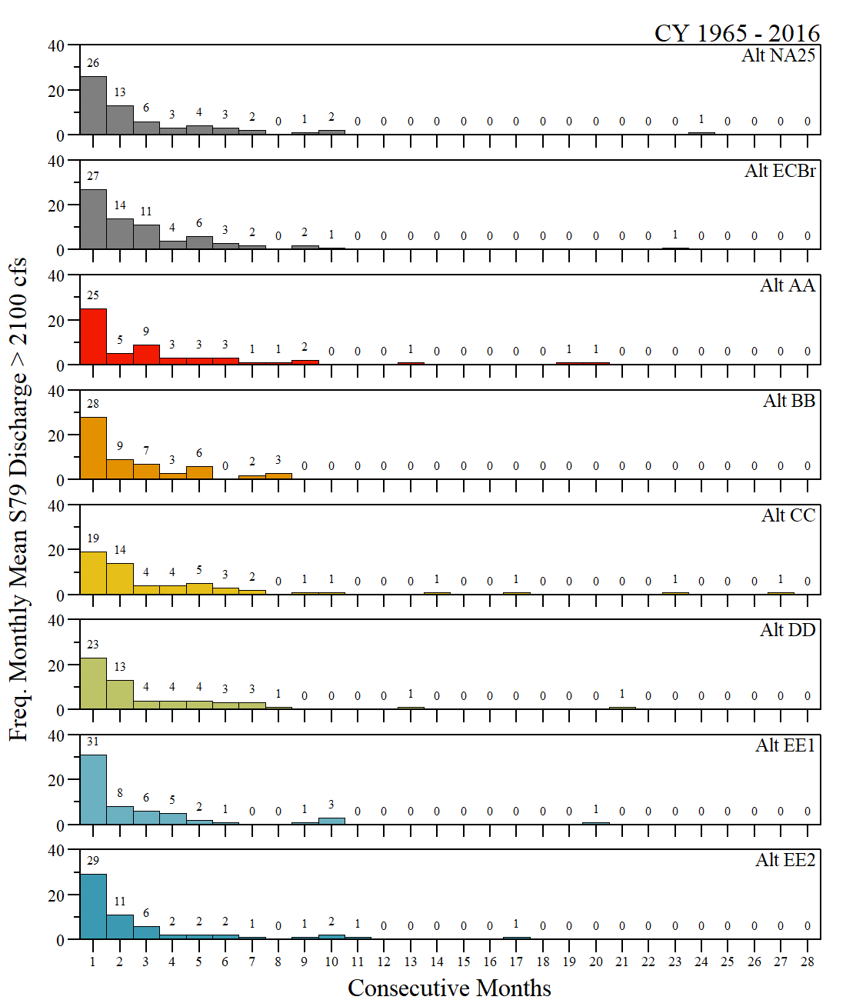
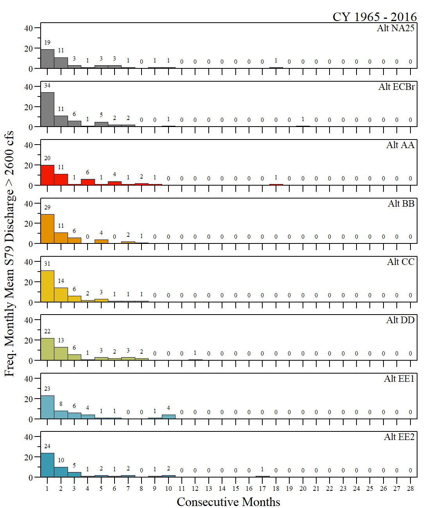

<style type="text/css">
body{
  font-family: serif;
  }
</style>

***
`r as.Date("2021-07-01")` (Site Updated `r Sys.Date()`)


```{r setup, include=FALSE}
knitr::opts_chunk$set(echo = FALSE)

# Libraries
library(AnalystHelper);
library(openxlsx)
library(plyr)
library(reshape)

library(flextable)
library(magrittr)

library(downloadthis)


wd="C:/Julian_LaCie/_Github/LOSOM_ModelEval"

export.path="C:/Julian_LaCie/_GitHub/LOSOM_ModelEval/Export/"
data.path=paste0(wd,"/Data/")

alts.sort=c("NA25","ECBr","AA","BB","CC","DD","EE1","EE2")
cols=c("grey50","grey50",rev(wesanderson::wes_palette("Zissou1",length(alts.sort)-2,"continuous")))


```

***

## Lake Okeechobee
<br>
```{r}
env.pen.sum=read.csv(paste0(export.path,"Iteration2/iter2_LOMetrics.csv"))
vars=c("Alt","FWO_PerBelow","FWO_PerWith","FWO_PerAbove")

env.pen.sum[,vars]%>%
  flextable()%>%
  colformat_double(j=2:4,digits=1,big.mark="",na_str="---")%>%
  set_header_labels("Alt"="Alternative",
                    "FWO_PerBelow"="% Below\nEnvelope",
                    "FWO_PerWith"="% Within\nEnvelope",
                    "FWO_PerAbove"="% Above\nEnvelope")%>%
  add_header("FWO_PerBelow"="% Difference relative to FWO",
             "FWO_PerWith"="% Difference relative to FWO",
             "FWO_PerAbove"="% Difference relative to FWO")%>%
    merge_h(part="header")%>%
  fontsize(size=10)%>%
  font(fontname="Times New Roman",part="all")%>%
  bold(part="header")%>%
  align(j=2:4,align="center",part="all")%>%
  set_caption("Percent difference relative to FWO (NA25) of percent oftime below, within and above<br>the Lake Okeechobee ecological stage envelope (including normal and recovery envelopes)<br>during the period of simulation (1965 - 2016).",html_escape = F)

```


```{r,fig.width=6.5,fig.height=4,fig.align='center',fig.cap="Percent difference relative to FWO (NA25) of percent of time below, within and above the Lake Okeechobee ecological stage envelope (including normal and recovery envelopes) during the period of simulation (1965 - 2016)."}
env.pen.sum.plns=subset(env.pen.sum,Alt%in%alts.sort[3:8])

ylim.val=c(-50,50);by.y=25;ymaj=seq(ylim.val[1],ylim.val[2],by.y);ymin=seq(ylim.val[1],ylim.val[2],by.y/2)
par(family="serif",mar=c(1,1.5,0.5,0.25),oma=c(2,2,0.75,1),lwd=0.5);
layout(matrix(1:2,1,2,byrow=T),widths=c(1,0.5))

x=barplot(t(env.pen.sum.plns[,c("FWO_PerBelow","FWO_PerWith","FWO_PerAbove")]),beside=T,
          ylim=ylim.val,axes=F,ann=F,col=NA,border=NA,xaxt="n")
abline(h=ymaj,v=x[2,],lty=1,col=adjustcolor("grey",0.5),lwd=1)
abline(h=0,lwd=1)
x=barplot(t(env.pen.sum.plns[,c("FWO_PerBelow","FWO_PerWith","FWO_PerAbove")]),beside=T,
          ylim=ylim.val,axes=F,ann=F,col=c("dodgerblue1","forestgreen","indianred1"),add=T,xaxt="n")
x.val=x[2,] #x[1,]+(x[2,]-x[1,])/2
axis_fun(1,x.val,x.val,alts.sort[3:8],line=-0.5)
axis_fun(2,ymaj,ymin,ymaj);box(lwd=1)
mtext(side=1,line=1.5,"Plan Name")
mtext(side=2,line=2,"Average Percent Difference to FWO",cex=1)
mtext(side=3,adj=0,"Lake Okeechobee")

plot(0:1,0:1,type="n",axes=F,ylab=NA,xlab=NA)
legend(0.5,0.5,legend=c("Below","Within","Above"),
       pch=22,
       lty=0,lwd=0.01,
       col="black",
       pt.bg=c("dodgerblue1","forestgreen","indianred1"),
       pt.cex=1.5,ncol=1,cex=1,bty="n",y.intersp=1,x.intersp=0.75,xpd=NA,xjust=0.5,yjust=0.5,
       title.adj=0,title="Stage Envelope")
```

***

## Caloosahatchee Estuary
<br>
```{r}
CRE.QCat.POS.sum=read.csv(paste0(export.path,"Iteration2/iter2_CREQ_metrics.csv"))
CRE.QCat.POS.sum=CRE.QCat.POS.sum[match(alts.sort,CRE.QCat.POS.sum$Alt),]
#CRE.QCat.POS.sum[,11:13]=CRE.QCat.POS.sum[,11:13]/1000
vars=c("Alt", "N.LT457", "N.Q457_750", "N.Q_Opt", "N.Q_Stress","N.Q_Dam", "N.Q2600_4500", 
"N.Q4500_6500", "N.QGT6500","S77_QFC", "S77","S79")

CRE.QCat.POS.sum[,vars]%>%
  flextable()%>%
  colformat_double(j=9:12,digits=1,big.mark="",na_str="---")%>%
  set_header_labels("Alt"="Alternative",
                    "N.LT457"="<457 cfs", 
                    "N.Q457_750" = "457 - 750 cfs", 
                    "N.Q_Opt"="750 - 2100 cfs\n(Optimum)",
                    "N.Q_Stress"="2100 - 2600 cfs\n(Stress)",
                    "N.Q_Dam"=">2600 cfs\n(Damaging)",
                    "N.Q2600_4500"="2600 - 4500 cfs",
                    "N.Q4500_6500"="4500 - 6500 cfs",
                    "N.QGT6500"=">6500 cfs",
                    "S77_QFC"="S77 Reg Q\nkAc-Ft/Yr",
                    "S77"="S77 Total Q\nkAc-Ft/Yr",
                    "S79"="S79 Total Q\nkAc-Ft/Yr")%>%
  add_header("N.LT457"="Count of 14-day MA", 
                    "N.Q457_750" = "Count of 14-day MA", 
                    "N.Q_Opt"="Count of 14-day MA",
                    "N.Q_Stress"="Count of 14-day MA",
                    "N.Q_Dam"="Count of 14-day MA",
                    "N.Q2600_4500"="Count of 14-day MA",
                    "N.Q4500_6500"="Count of 14-day MA",
                    "N.QGT6500"="Count of 14-day MA",
             "S77_QFC"="Average Annual Discharge",
                    "S77"="Average Annual Discharge",
                    "S79"="Average Annual Discharge")%>%
  merge_h(part="header")%>%
  fontsize(size=10)%>%
  font(fontname="Times New Roman",part="all")%>%
  bold(part="header")%>%
  align(j=2:12,align="center",part="all")%>%
  set_caption("Summarised data for each alternative for the Caloosahatchee River Estuary during the period of simulation.")

```

<br>

```{r}
CRE.QCat.POS.sum$FWO.N.LT457=with(CRE.QCat.POS.sum,((N.LT457-N.LT457[1])/N.LT457[1])*100)
CRE.QCat.POS.sum$FWO.N.Q457_750=with(CRE.QCat.POS.sum,((N.Q457_750-N.Q457_750[1])/N.Q457_750[1])*100)
CRE.QCat.POS.sum$FWO.N.Q_Opt=with(CRE.QCat.POS.sum,((N.Q_Opt-N.Q_Opt[1])/N.Q_Opt[1])*100)
CRE.QCat.POS.sum$FWO.N.Q_Stress=with(CRE.QCat.POS.sum,((N.Q_Stress-N.Q_Stress[1])/N.Q_Stress[1])*100)
CRE.QCat.POS.sum$FWO.N.Q_Dam=with(CRE.QCat.POS.sum,((N.Q_Dam-N.Q_Dam[1])/N.Q_Dam[1])*100)
CRE.QCat.POS.sum$FWO.N.Q2600_4500=with(CRE.QCat.POS.sum,((N.Q2600_4500-N.Q2600_4500[1])/N.Q2600_4500[1])*100)
CRE.QCat.POS.sum$FWO.N.QGT6500=with(CRE.QCat.POS.sum,((N.QGT6500-N.QGT6500[1])/N.QGT6500[1])*100)
CRE.QCat.POS.sum$FWO.S77_QFC=with(CRE.QCat.POS.sum,((S77_QFC-S77_QFC[1])/S77_QFC[1])*100)
CRE.QCat.POS.sum$FWO.S77=with(CRE.QCat.POS.sum,((S77-S77[1])/S77[1])*100)
CRE.QCat.POS.sum$FWO.S79=with(CRE.QCat.POS.sum,((S79-S79[1])/S79[1])*100)

vars=c("Alt","FWO.N.LT457", "FWO.N.Q457_750", "FWO.N.Q_Opt", "FWO.N.Q_Stress","FWO.N.Q_Dam",
"FWO.N.Q2600_4500", "FWO.N.QGT6500", "FWO.S77_QFC", "FWO.S77","FWO.S79")

CRE.QCat.POS.sum[,vars]%>%
  flextable()%>%
  colformat_double(j=2:11,digits=1,big.mark="",na_str="---")%>%
    set_header_labels("Alt"="Alternative",
                    "FWO.N.LT457"="<457 cfs", 
                    "FWO.N.Q457_750" = "457 - 750 cfs", 
                    "FWO.N.Q_Opt"="750 - 2100 cfs\n(Optimum)",
                    "FWO.N.Q_Stress"="2100 - 2600 cfs\n(Stress)",
                    "FWO.N.Q_Dam"=">2600 cfs\n(Damaging)",
                    "FWO.N.Q2600_4500"="2600 - 4500 cfs",
                    "FWO.N.Q4500_6500"="4500 - 6500 cfs",
                    "FWO.N.QGT6500"=">6500 cfs",
                    "FWO.S77_QFC"="S77 Reg Q\nkAc-Ft/Yr",
                    "FWO.S77"="S77 Total Q\nkAc-Ft/Yr",
                    "FWO.S79"="S79 Total Q\nkAc-Ft/Yr")%>%
  fontsize(size=10)%>%
  font(fontname="Times New Roman",part="all")%>%
  bold(part="header")%>%
  align(j=2:11,align="center",part="all")%>%
  set_caption("Percent differences relative to future without (NA25) based on data summarized above Caloosahatchee River Estuary during the period of simulation.")

```

<br>

```{r,echo=F,warning=F,fig.width=8,fig.height=5,fig.align='center',fig.cap="Radar plot of Caloosahatchee River Estuary flow categories for each alternative compared to future without (NA25) and existing condition baseline (ECBr)during the period of simulation (1965 - 2016)."}
library(fmsb)
vars=c("Alt","N.LT457", "N.Q457_750", "N.Q_Opt", "N.Q_Stress", "N.Q2600_4500", 
"N.Q4500_6500", "N.QGT6500")
CRE.QCat.POS.sum2=CRE.QCat.POS.sum[,vars]
CRE.QCat.POS.sum2$Alt=factor(CRE.QCat.POS.sum2$Alt,levels=alts.sort)
CRE.QCat.POS.sum2=CRE.QCat.POS.sum2[match(alts.sort,CRE.QCat.POS.sum2$Alt),]
# png(filename=paste0(plot.path,"Iteration_2/S79Q_radar.png"),width=6.5,height=4,units="in",res=200,type="windows",bg="white")
layout(matrix(c(1:8),2,4,byrow=T))
par(family="serif",mar = c(0.1,0.75,0.1,0.75),oma=c(1,1,1,1),xpd=NA)
cols2=c("grey50","black",rev(wesanderson::wes_palette("Zissou1",length(alts.sort)-2,"continuous")))
for(i in 3:8){
alts.val=c("ECBr","NA25",alts.sort[i])
col.vals=cols2[alts.sort%in%alts.val]
tmp.dat=subset(CRE.QCat.POS.sum,Alt%in%alts.val)
tmp.dat=tmp.dat[match(alts.val,tmp.dat$Alt),]
# tmp=rbind(rep(max(apply(subset(CRE.QCat.POS.sum2,Alt%in%alts.val)[,2:8],1,max,na.rm=T)),7),
#           rep(min(apply(subset(CRE.QCat.POS.sum2,Alt%in%alts.val)[,2:8],1,min,na.rm=T)),7),
#           subset(CRE.QCat.POS.sum2,Alt%in%alts.val)[,2:8])
tmp=rbind(rep(max(apply(CRE.QCat.POS.sum[,2:8],1,max,na.rm=T)),7),
          rep(min(apply(CRE.QCat.POS.sum[,2:8],1,min,na.rm=T)),7),
          tmp.dat[,2:8])


labs=c("<457","457 -\n750","750 -\n2100\n(Opt)","2100 -\n2600\n(Stress)","2600 -\n4500","4500 -\n6500",">6500")
radarchart(tmp,
           pcol=col.vals,
           plwd=1.5,pty=NA,
           plty=c(2,1,1),
           cglcol = "grey", cglty = 1, cglwd = 0.8,
           axislabcol = "grey",
           vlabels=labs,vlcex=1)
mtext(side=3,adj=0,line=-2,alts.sort[i],font=2)
if(i==3){mtext(side=3,adj=0,"Count of S79 14-Day moving average Flow")}
# if(i==6){mtext(side=3,adj=1,"Period of Sim: CY 1965 - 2016")}
# box(lwd=1)
# legend("bottom",legend=alts.val,horiz=T,
#       bty="n",pch=20,pt.cex=2,col=col.vals)
}
plot(0:1,0:1,ann=F,axes=F,type="n")
legend(0.5,0.5,legend=alts.sort,
        pch=NA,pt.cex=2,lty=c(2,1,rep(1,6)),col=cols2,
        bty="n",y.intersp=1,x.intersp=0.75,xpd=NA,xjust=0.5,yjust=0.5,
       title="Alternatives",title.adj = 0)
plot(0:1,0:1,ann=F,axes=F,type="n")
text(1,0,"Period of Simulation\n CY1965 - 2016.",adj=1)

```


### Consecutive Months 


```{r ,fig.align="center",out.width="75%",fig.cap="The frequency of consecutive months with monthly average S79 discharge greater than 2100 cfs throughout the simulation period of record (1965 - 2016)"}

```


```{r ,fig.align="center",out.width="75%",fig.cap="The frequency of consecutive months with monthly average S79 discharge greater than 2600 cfs throughout the simulation period of record (1965 - 2016)"}

```


***

## St Lucie Estuary
<br>
```{r}
SLE.QCat.POS.sum=read.csv(paste0(export.path,"Iteration2/iter2_SLEQ_metrics.csv"))
SLE.QCat.POS.sum=SLE.QCat.POS.sum[match(alts.sort,SLE.QCat.POS.sum$Alt),]

vars=c("Alt", "N.LT150", "N.Q_Opt_SLE", "N.Q_Stress_SLE", "N.Q_Dam_SLE","S308_QFC", "S308", "S80")

SLE.QCat.POS.sum[,vars]%>%
  flextable()%>%
  colformat_double(j=6:8,digits=1,big.mark="",na_str="---")%>%
  set_header_labels("Alt"="Alternative",
                    "N.LT150"="<150 cfs", 
                    "N.Q_Opt_SLE" = "150 - 1400 cfs\n(Optimum)", 
                    "N.Q_Stress_SLE"="1400 - 1700 cfs\n(Stress)",
                    "N.Q_Dam_SLE"=">1700 cfs\n(Damaging)",
                    "S308_QFC"="S308 Reg Q\nkAc-Ft/Yr",
                    "S308"="S308 Total Q\nkAc-Ft/Yr",
                    "S80"="S80 Total Q\nkAc-Ft/Yr")%>%
  add_header("N.LT150"="Count of 14-day MA", 
                    "N.Q_Opt_SLE" = "Count of 14-day MA", 
                    "N.Q_Stress_SLE"="Count of 14-day MA",
                    "N.Q_Dam_SLE"="Count of 14-day MA",
                    "S308_QFC"="Average Annual Discharge",
                    "S308"="Average Annual Discharge",
                    "S80"="Average Annual Discharge")%>%
  merge_h(part="header")%>%
  fontsize(size=10)%>%
  font(fontname="Times New Roman",part="all")%>%
  bold(part="header")%>%
  align(j=2:8,align="center",part="all")%>%
  set_caption("Summarised data for each alternative for the St Lucie River Estuary during the period of simulation.")

```

<br>

```{r}

SLE.QCat.POS.sum$FWO.N.LT150=with(SLE.QCat.POS.sum,((N.LT150-N.LT150[1])/N.LT150[1])*100)
SLE.QCat.POS.sum$FWO.N.Q_Opt_SLE=with(SLE.QCat.POS.sum,((N.Q_Opt_SLE-N.Q_Opt_SLE[1])/N.Q_Opt_SLE[1])*100)
SLE.QCat.POS.sum$FWO.N.Q_Stress_SLE=with(SLE.QCat.POS.sum,((N.Q_Stress_SLE-N.Q_Stress_SLE[1])/N.Q_Stress_SLE[1])*100)
SLE.QCat.POS.sum$FWO.N.Q_Dam_SLE=with(SLE.QCat.POS.sum,((N.Q_Dam_SLE-N.Q_Dam_SLE[1])/N.Q_Dam_SLE[1])*100)
SLE.QCat.POS.sum$FWO.S308_QFC=with(SLE.QCat.POS.sum,((S308_QFC-S308_QFC[1])/S308_QFC[1])*100)
SLE.QCat.POS.sum$FWO.S308=with(SLE.QCat.POS.sum,((S308-S308[1])/S308[1])*100)
SLE.QCat.POS.sum$FWO.S80=with(SLE.QCat.POS.sum,((S80-S80[1])/S80[1])*100)


vars=c("Alt","FWO.N.LT150", "FWO.N.Q_Opt_SLE","FWO.N.Q_Stress_SLE", 
       "FWO.N.Q_Dam_SLE", "FWO.S308_QFC", "FWO.S308", "FWO.S80")

SLE.QCat.POS.sum[,vars]%>%
  flextable()%>%
  colformat_double(j=2:8,digits=1,big.mark="",na_str="---")%>%
    set_header_labels("Alt"="Alternative",
                    "FWO.N.LT150"="<150 cfs", 
                    "FWO.N.Q_Opt_SLE" = "150 - 1400 cfs\n(Optimum)", 
                    "FWO.N.Q_Stress_SLE"="1400 - 1700 cfs\n(Stress)",
                    "FWO.N.Q_Dam_SLE"=">1700 cfs\n(Damaging)",
                    "FWO.S308_QFC"="S308 Reg Q\nkAc-Ft/Yr",
                    "FWO.S308"="S308 Total Q\nkAc-Ft/Yr",
                    "FWO.S80"="S80 Total Q\nkAc-Ft/Yr")%>%
  fontsize(size=10)%>%
  font(fontname="Times New Roman",part="all")%>%
  bold(part="header")%>%
  align(j=2:8,align="center",part="all")%>%
  set_caption("Percent differences relative to future without (NA25) based on data summarized above for St Lucie Estuary during the period of simulation.")

```


<br>

```{r,echo=F,warning=F,fig.width=8,fig.height=5,fig.align='center',fig.cap="Radar plot of St Lucie Estuary flow categories for each alternative compared to future without (NA25) and existing condition baseline (ECBr)during the period of simulation (1965 - 2016)."}
vars=c("Alt","N.LT150", "N.Q_Opt_SLE", "N.Q_Stress_SLE", "N.Q_Dam_SLE")
SLE.QCat.POS.sum2=SLE.QCat.POS.sum[,vars]
SLE.QCat.POS.sum2$Alt=factor(SLE.QCat.POS.sum2$Alt,levels=alts.sort)
SLE.QCat.POS.sum2=SLE.QCat.POS.sum2[match(alts.sort,SLE.QCat.POS.sum2$Alt),]

layout(matrix(c(1:8),2,4,byrow=T))
par(family="serif",mar = c(0.1,0.75,0.1,0.75),oma=c(1,1,1,1),xpd=NA)
cols2=c("grey50","black",rev(wesanderson::wes_palette("Zissou1",length(alts.sort)-2,"continuous")))
for(i in 3:8){
alts.val=c("ECBr","NA25",alts.sort[i])
col.vals=cols2[alts.sort%in%alts.val]
tmp.dat=subset(SLE.QCat.POS.sum2,Alt%in%alts.val)
tmp.dat=tmp.dat[match(alts.val,tmp.dat$Alt),]
tmp=rbind(rep(max(apply(SLE.QCat.POS.sum2[,2:5],1,max,na.rm=T)),4),
          rep(min(apply(SLE.QCat.POS.sum2[,2:5],1,min,na.rm=T)),4),
          tmp.dat[,2:5])

labs=c("<150","150 -\n1400\n(Opt)","1400 -\n1700\n(Stress)",">1700\n(Dam)")
radarchart(tmp,
           pcol=col.vals,
           plwd=1.5,pty=NA,
           plty=c(2,1,1),
           cglcol = "grey", cglty = 1, cglwd = 0.8,
           axislabcol = "grey",
           vlabels=labs,vlcex=1)
mtext(side=3,adj=0,line=-2,alts.sort[i],font=2)
if(i==3){mtext(side=3,adj=0,"Count of S80 14-Day moving average Flow")}

}
plot(0:1,0:1,ann=F,axes=F,type="n")
legend(0.5,0.5,legend=alts.sort,
        pch=NA,pt.cex=2,lty=c(2,1,rep(1,6)),col=cols2,
        bty="n",y.intersp=1,x.intersp=0.75,xpd=NA,xjust=0.5,yjust=0.5,
       title="Alternatives",title.adj = 0)
plot(0:1,0:1,ann=F,axes=F,type="n")
text(1,0,"Period of Simulation\n CY1965 - 2016.",adj=1)

```


***