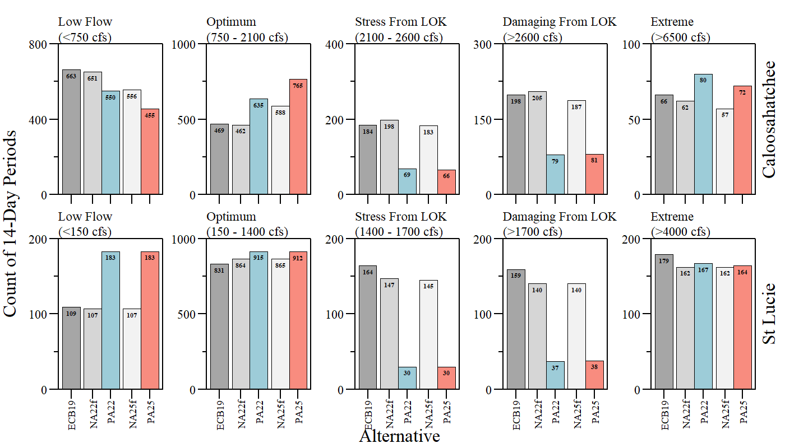
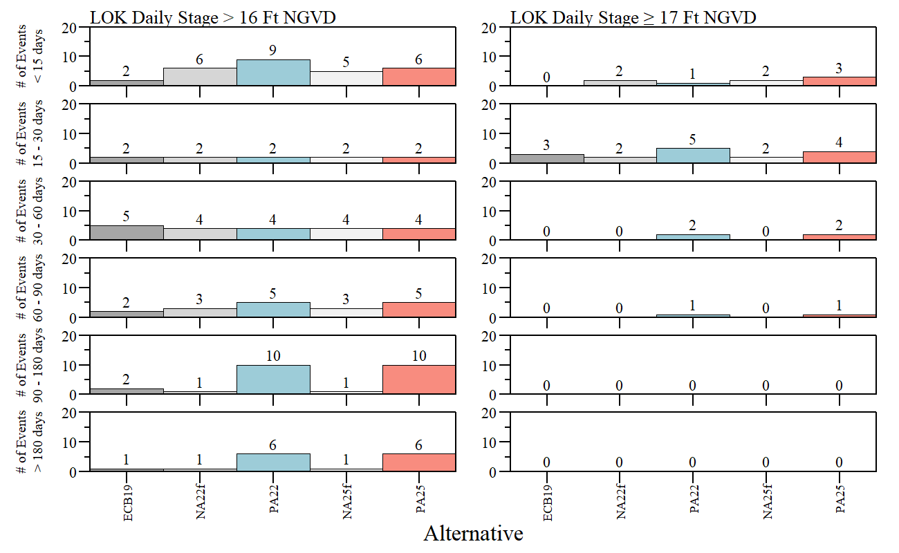
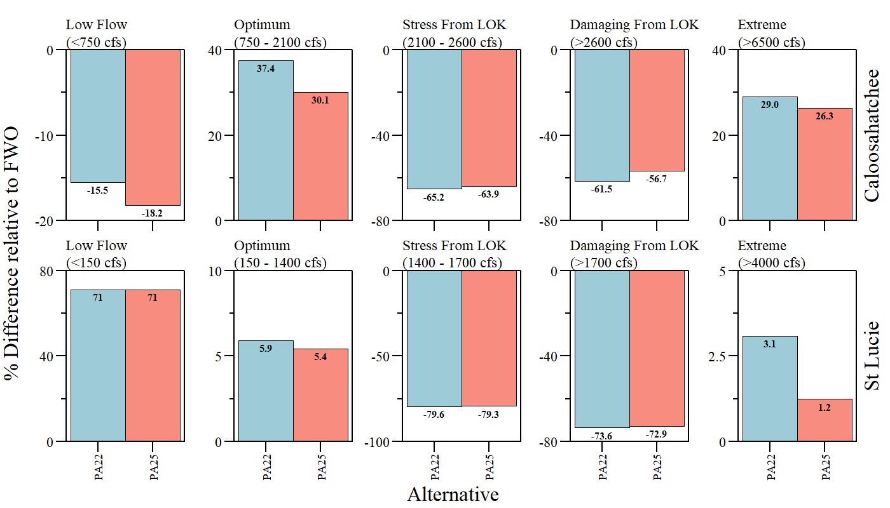
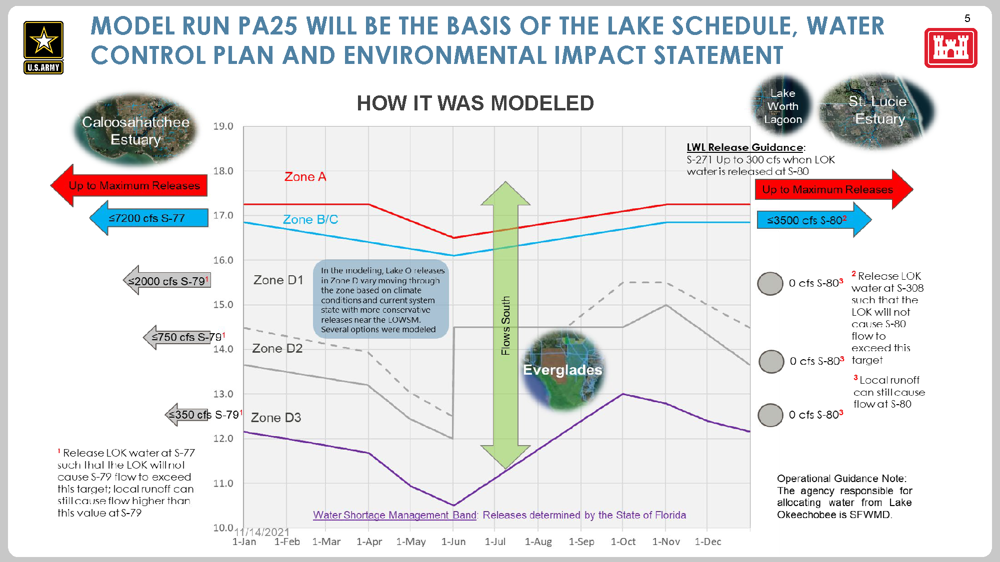

```{r setup, include=FALSE}
## Data Analysis source: ./src/iter3_array_eval.R

library(knitr)

options(htmltools.dir.version = FALSE)
knitr::opts_chunk$set(warning = FALSE, message = FALSE, echo=FALSE)

##
library(flextable)
library(magrittr)
library(plyr)
library(reshape2)

wd="C:/Julian_LaCie/_Github/LOSOM_ModelEval"

plot.path="C:/Julian_LaCie/_Github/LOSOM_ModelEval/Plots/"
export.path="C:/Julian_LaCie/_GitHub/LOSOM_ModelEval/Export/"

##
##
alts.sort2=c("ECB19","NA22f","PA22","NA25f","PA25")
```

layout: true

<div class="my-footer">
<span>  </span>
</div>

---
name: title
class: left, middle

### Lake Okeechobee System Operating Manual

.pull-left[
#### Preferred Alternative - LOSOM Listening Session

*Sanibel-Captiva Conservation Foundation*

*Conservancy of Southwest Florida*

**DRAFT** - `r paste(format(as.Date("2022-01-24"),"%B %d, %Y"))#  ,"<br>(Updated:", format(as.Date(Sys.Date()),"%B %d, %Y"),")")`

]
<!-- this ends up being the title slide since seal = FALSE-->

.pull-right[
```{r ,fig.align="center",out.width="40%"}
knitr::include_graphics('./Plots/SCCF Logo knockout_c.png')
```

```{r ,fig.align="center",out.width="40%"}
knitr::include_graphics('./Plots/ConSWFL.jpeg')
```

]


```{r xaringanExtra, include=FALSE, warnint=FALSE}
# devtools::install_github("gadenbuie/xaringanExtra")
# xaringanExtra::use_webcam()
xaringanExtra::use_tile_view()
# xaringanExtra::use_scribble()
```
.footnote[
Paul Julian PhD<br>[`r fontawesome::fa("fas fa-envelope")`](mailto: pjulian@sccf.org) .small[pjulian@sccf.org]

.small[Use cursor keys for navigation, press .red["O"] for a slide .red[O]verview]

```{r} 
bsplus::bs_button(
    label = "Download PDF Version",
    button_type = "primary",
    button_size = "small") %>%
    htmltools::a(
      href = "https://sccf-tech.github.io/slides/LOSOM/sccf_iter3_LOSOMListen.pdf"
      )
```
]

---
name: intro

--
### The Good

* Estuaries: `r paste("\u21E7")` optimal flow & `r paste("\u21E9")` stress and damaging flow

* Everglades: `r paste("\u21E7")` flow south (via S351 & S354) 

--

### The Bad

* Estuaries: `r paste("\u21E7")` extreme flow events 

* Lake Okeechobee: `r paste("\u21E7")` high stage (17 & 16 Ft NGVD metrics)

* Lake Okeechobee: `r paste("\u21E7")` in stage envelope scores (+36% difference to FWO)

--

### The Ugly

* Proposed 1.5 Ft WSM buffer


---
name: SalEnv1

### Salinity Envelope
```{r ,fig.align="center",out.width="95%",fig.cap="RECOVER salinity envelope evaluation during the simulation period of record for Caloosahatchee (top) and St Lucie (bottom) estuaries."}

```

.small[[FWO Comparison](#SalEnv2)]
---
name: SalEnv3

### Salinity Envelope - Extreme 
```{r ,fig.align="center",out.width="90%",fig.cap="RECOVER salinity envelope - Extreme flow category evaluation relative to each respective FWO/No Action Alterantives during the simulation period of record for Caloosahatchee (top) and St Lucie (bottom) estuaries."}

```

---
name: extreme

### CRE - Extreme
```{r ,fig.align="center",out.width="90%",fig.cap="Total (left) and Lake derived (right) extreme discharge events and duration for the Caloosahatchee River Estuary."}

```

[SLE Extreme Event & Duration](#extreme2)


---
class: extreme

### Extreme event - Recommendation

* While reduced LOK derived stressful and damaging flow events is good minimizing LOK derived extreme events for CRE is recommended.

--

* Extreme events (regardless of source) can adversely impact estuary and near shore environment.
  * nutrient transport, high color, prolonged freshwater conditions in estuary, etc.

--

* Large discharges can alter circulation patterns in lower estuary such that Gulf water is drawn into estuary through barrier islands' main inlets which can draw in and concentration *K. brevis* (if present) from Gulf rather than flush it out (Dye et al 2020 & Olabarrieta et al *In Prep*).


.footnote[
.small[
Dye, B., Jose, F., Allahdadi, M.N., 2020. Circulation Dynamics and Seasonal Variability for the Charlotte Harbor Estuary, Southwest Florida Coast. Journal of Coastal Research 36, 276–288. [link](https://bioone.org/journals/journal-of-coastal-research/volume-36/issue-2/JCOASTRES-D-19-00071.1/Circulation-Dynamics-and-Seasonal-Variability-for-the-Charlotte-Harbor-Estuary/10.2112/JCOASTRES-D-19-00071.1.full)

]
]

---
name: LOK

### Lake Okeechobee 
```{r ,fig.align="center",out.width="75%",fig.cap="Percent of time LOK stage above 17 Ft, 16 Ft and below 10 Ft NGVD29 during the period of simulation."}
knitr::include_graphics('./Plots/Iteration3_Final/LOK_stg.png')
```

---
name: LOK2

### Lake Okeechobee - Stage Envelope

```{r ,fig.align="center",out.width="80%",fig.cap="LOK ecological stage envelope total scores (all years)."}
knitr::include_graphics('./Plots/Iteration3_Final/LOK_EnvScore_AllYrs.png')
```
.center[
.small[
+36% Diff to FWO Total Penalty; +115% Diff to FWO Upper Penalty; -22% Diff to FWO Lower Penalty 
]
]
---
name: LOK3

### Lake Okeechobee - High Stage Events

```{r ,fig.align="center",out.width="100%",fig.cap="Extreme high (left) and moderate high (right) stage events and duration for Lake Okeechobee."}

```

---
name: LakeEval

### Application of Hydrologic Restoration Goals for a Large Subtropical Lake *(In Prep.)*

.pull-left[
Based on methodology of Havens (2002). 

Lake stage is a major driver in Lake ecology (see Conceptual Ecological Model).
.small[
* Extreme high lake stage (>5.2 m/17 Ft NGVD29)

* Moderate high lake stage (>4.9 m/16 Ft NGVD29) > 90 days

* Moderate low lake stage (<3.3 m/11 Ft NGVD29) > 90 days

* Extreme low lake stage (<3.0 m/10 Ft NGVD29)

* Spring/SNKI nest period recession
  * March 1 - June 15
  * weekly recession rate between -0.05 and 0.05 Ft/wk (0.02 m/wk) for more than 1/4th of nesting period.

* Events per decade
  
  ]
]


--

.pull-right[

.red[**Preliminary results:**]

```{r}
data.frame(Alternative=c("ECB19","NA25f","PA25"),Score=c(0.75,0.78,0.53))%>%
   flextable()%>%
  width(width=c(1,0.5))%>%
  padding(padding=0.1,part="all")%>%
  font(fontname="Times New Roman",part="all")%>%
  fontsize(size=10,part="body")%>%
  fontsize(size=12,part="header")%>%
  bold(part="header")
```


* PA25 has higher Extreme & Moderate high stage events .small[(see Extreme Event Analysis [slide](#LOK3))] lowering the score.

* LOSOM is not a restoration plan but should take into account ecology of the system. 

* Benefits to other parts of the system is balanced on the back of the Lake.


]

.small[
Havens (2002) Development and Application of Hydrologic Restoration Goals for a Large Subtropical Lake. Lake and Reservoir Management 18:285–292. doi: [10.1080/07438140209353934](http://www.tandfonline.com/doi/abs/10.1080/07438140209353934)

]

---
name: WSM

### Low lake stage management

* Last PDT meeting SFWMD stated 

.content-box-gray[the state *“is asking for explicit reliance 
on the District to guide operational decisions when Lake stages 
are at or below 1.5 feet above the Water Shortage Management Band.”*]

--

.pull-left[
```{r ,fig.align="center",out.width="100%"}
knitr::include_graphics('./Plots/Iteration3_Final/LOSOM.png')
```
]

--

.pull-right[
```{r ,fig.align="center",out.width="100%"}

```
]
---
name: WSM2

### Low lake stage management

* The WSM buffer would effectively create a new management band in the schedule. 

--

* This new concept is not included in the current modeling.

--

* Represents up to 520 - 591 kAc-Ft of water that could be moved around (or withheld from the estuaries and Everglades).
  * based on [stage-volume relationship](#stage_vol).
  * *Zone D3 to S79<sup>1</sup> (`r paste("\u2264")` 350 cfs)* a small fraction of total available volume in buffer .small[([How it was modeled](#LOSOMProcess))].

.footnote[
.small[
<sup>1</sup> Release LOK water at S77 such that the LOK will not cause S79 flow to exceed this target; local runoff can still cause flow higher than this value at S79.
]
]

--

* In current modeling, Lake stage is within the proposed WSM buffer ~22% of time for both preferred alternatives (during period of simulation)
  * Conversely, Lake stage is within Zone D3 ~ 29% of the time for both preferred alternatives (during period of simulation).

--

* Joint letter on behalf of Friends of the Everglades, Calusa Waterkeeper, Sanibel Captiva Conservation Foundation, Florida Oceanographic and Conservancy of Southwest Florida sent to Col. Booth ([link](https://sccf-tech.github.io/slides/LOSOM/LOSOMLetters/LOSOM letter Jan 21 2022_FINAL.pdf) to letter).


---
class: inverse


---
name: SalEnv2

### Salinity Envelope
```{r ,fig.align="center",out.width="100%",fig.cap="RECOVER salinity envelope evaluation relative to each respective FWO/No Action Alterantives during the simulation period of record for Caloosahatchee (top) and St Lucie (bottom) estuaries."}

```


---
name: extreme2


### SLE - Extreme
```{r ,fig.align="center",out.width="90%",fig.cap="Total (left) and Lake derived (right) extreme discharge events and duration for the St Lucie Estuary."}

```

---
name: stage_vol


### LOK - Stage - Volume Relationship
```{r ,fig.align="center",out.width="80%",fig.cap="Lake Okeechobee Stage-Volume-Area relationship based on 50 Ft Bathymetry."}

```

---
name: LOSOMProcess

### How it (TSP) was modeled...

```{r ,fig.align="center",out.width="100%"}


```

.small[
*From USACE PDT 12 Jan 2022 meeting presentation*
]
