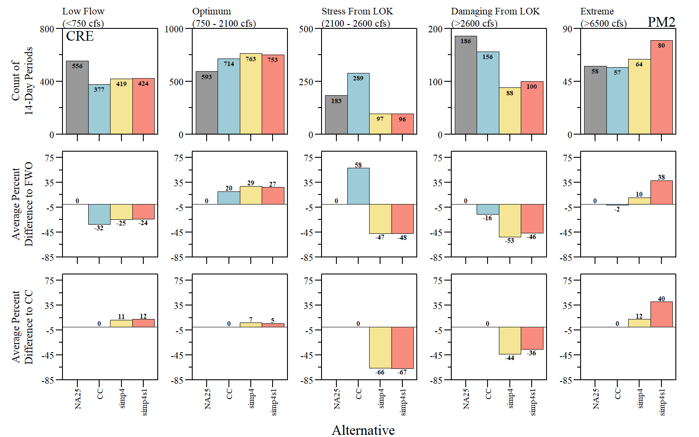
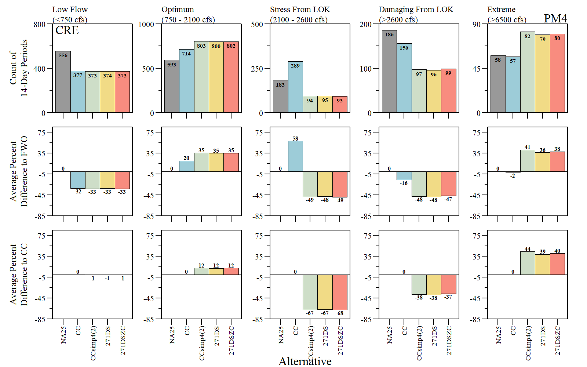
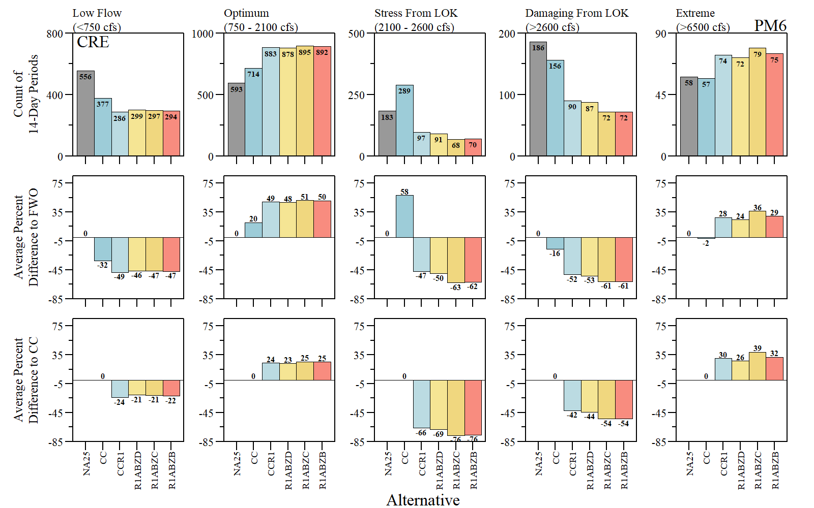

```{r setup, include=FALSE}
library(knitr)

options(htmltools.dir.version = FALSE)
knitr::opts_chunk$set(warning = FALSE, message = FALSE, echo=FALSE)

##
library(flextable)
library(magrittr)
library(plyr)
library(reshape2)

wd="C:/Julian_LaCie/_Github/LOSOM_ModelEval"

plot.path="C:/Julian_LaCie/_Github/LOSOM_ModelEval/Plots/"
export.path="C:/Julian_LaCie/_GitHub/LOSOM_ModelEval/Export/"

##
alts.sort=c("NA25","ECBr","CC")
```

layout: true

<div class="my-footer">
<span>  </span>
</div>

---
name: title
class: left, middle

### Lake Okeechobee System Operating Manual

.pull-left[
#### Iteration 3 - Phase 1 Technical Evaluation

*Sanibel-Captiva Conservation Foundation*

*Conservancy of Southwest Florida*

**DRAFT** - `r paste(format(as.Date("2021-09-21"),"%B %d, %Y"))#,"<br>(Updated:", format(as.Date(Sys.Date()),"%B %d, %Y"),")")`

]
<!-- this ends up being the title slide since seal = FALSE-->

.pull-right[
```{r ,fig.align="center",out.width="40%"}
knitr::include_graphics('./Plots/SCCF Logo knockout_c.png')
```

```{r ,fig.align="center",out.width="40%"}
knitr::include_graphics('./Plots/ConSWFL.jpeg')
```

]


```{r xaringanExtra, include=FALSE, warnint=FALSE}
# devtools::install_github("gadenbuie/xaringanExtra")
# xaringanExtra::use_webcam()
xaringanExtra::use_tile_view()
# xaringanExtra::use_scribble()
```
.footnote[
Paul Julian PhD<br>[`r fontawesome::fa("fas fa-envelope")`](mailto: pjulian@sccf.org) .small[pjulian@sccf.org]

.small[Use cursor keys for navigation, press .red["O"] for a slide .red[O]verview]

```{r} 
bsplus::bs_button(
    label = "Download PDF Version",
    button_type = "primary",
    button_size = "small") %>%
    htmltools::a(
      href = "https://sccf-tech.github.io/slides/LOSOM/SCCF_iter3_p1.pdf"
      )
```
]

---
name: background

### Iteration 3 Modeling

#### Phase 1
* Initial sensitivity runs based on Alternative CC & Iteration 3 goals
* Simplify release guidance and reduce dimensionality for optimization
* Test schedule components based on simplified schedule & Iteration 3 goals

#### Notes

Alternative Naming
* CC == CCTSP
* 2 versions of CCsimp4 - After simp4s1 (*Phase 1 - Test Flows to St Lucie Estuary*) was run it was renames as CCsimp4. Therefore in this presentation the second CCsimp4 was renamed to CCsimp4(2).


---
name: InitialSense


### Phase 1 - Initial Sensitivity Runs

* **S1:** Preserve opportunity to send water out of the lake for longer which addresses the goal of increasing flexibility in the lower portions of the schedule.

* **S2:** Regulate CRE releases by using flows at S-79 in all conditions in all zones except in Zone A

* **S3:** Reduce stress to CRE by incorporating friendly estuary release concepts from 4BC-1

* **S4:** Reduce stress to CRE by incorporating alternating estuary release concept from 4BC-2

* **S3-4:** Combination of friendly estuary release concepts and alternating estuary release concepts

* **S5:** Reduce stress to CRE by reducing maximum up to flows in Zone D

* **S6:** Combine zones B & C

* **S7:** Address algae by incorporating no releases to the Northern Estuaries in the months June –August except in Zone A


---
name: InitialSense1


### Phase 1 - Initial Sensitivity Runs

```{r ,fig.align="center",out.width="90%",fig.cap="RECOVER salinity envelope counts (top), % difference to FWO (middle) and % difference to CC (bottom)."}


```

---
name: InitialSense2


### Phase 1 - Initial Sensitivity Runs

```{r ,fig.align="center",out.width="45%",fig.cap="Average annual regulatory discharges to the Caloosahatchee during the simulation period of record."}


```

---
name: Simp


### Phase 1 - Simplify Release Guidance

* Combine zones, simplify release guidance flowcharts

* Add complexity where it is needed to meet the goals of Iteration 3 optimization

```{r ,fig.align="center",out.width="90%",fig.cap="CC and 'CCsimp4' simplified regulation schedule."}

knitr::include_graphics('./Plots/Iteration3_TechEval/CC_simp_REGSCH.png')
```

---
name: Simp


### Phase 1 - Simplify Release Guidance

```{r ,fig.align="center",out.width="90%",fig.cap="RECOVER salinity envelope counts (top), % difference to FWO (middle) and % difference to CC (bottom)."}


```

---
name: Simp


### Phase 1 - Simplify Release Guidance

```{r ,fig.align="center",out.width="45%",fig.cap="Average annual regulatory discharges to the Caloosahatchee during the simulation period of record."}


```

---
name: Simptest


### Phase 1 - Test Schedule Components – CCsimp4

* Flows to St. Lucie Estuary (simp4 and simp4s1)

* Increased flexibility in lower portion of the schedule (smp4ZFS, smp4ZFW, smp4ZFSW)

* Opportunity to send desirable dry season flows to Lake Worth Lagoon (271DS, 271DSZC)

* Zone B regulation point for CRE (S77 vs S79) (ZB_S77)

---
name: Simptest


### Phase 1 - Test Schedule Components – CCsimp4

Flows to St. Lucie Estuary (simp4 and simp4s1)

```{r ,fig.align="center",out.width="90%",fig.cap="RECOVER salinity envelope counts (top), % difference to FWO (middle) and % difference to CC (bottom)."}


```

---
name: Simptest


### Phase 1 - Test Schedule Components – CCsimp4

Flows to St. Lucie Estuary (simp4 and simp4s1)

```{r ,fig.align="center",out.width="45%",fig.cap="Average annual regulatory discharges to the Caloosahatchee during the simulation period of record."}

knitr::include_graphics('./Plots/Iteration3_TechEval/CRE_RegQ_PM2.png')
```

---
name: Simptest


### Phase 1 - Test Schedule Components – CCsimp4

Increased flexibility in lower portion of the schedule (smp4ZFS, smp4ZFW, smp4ZFSW)

```{r ,fig.align="center",out.width="90%",fig.cap="RECOVER salinity envelope counts (top), % difference to FWO (middle) and % difference to CC (bottom)."}


```

---
name: Simptest


### Phase 1 - Test Schedule Components – CCsimp4

Increased flexibility in lower portion of the schedule (smp4ZFS, smp4ZFW, smp4ZFSW)

```{r ,fig.align="center",out.width="45%",fig.cap="Average annual regulatory discharges to the Caloosahatchee during the simulation period of record."}


```

---
name: Simptest


### Phase 1 - Test Schedule Components – CCsimp4

Opportunity to send desirable dry season flows to Lake Worth Lagoon (271DS, 271DSZC)

```{r ,fig.align="center",out.width="90%",fig.cap="RECOVER salinity envelope counts (top), % difference to FWO (middle) and % difference to CC (bottom)."}


```

---
name: Simptest


### Phase 1 - Test Schedule Components – CCsimp4

Opportunity to send desirable dry season flows to Lake Worth Lagoon (271DS, 271DSZC)

```{r ,fig.align="center",out.width="45%",fig.cap="Average annual regulatory discharges to the Caloosahatchee during the simulation period of record."}


```

---
name: Simptest


### Phase 1 - Test Schedule Components – CCsimp4

Zone B regulation point for CRE (S77 vs S79) (ZB_S77)

```{r ,fig.align="center",out.width="90%",fig.cap="RECOVER salinity envelope counts (top), % difference to FWO (middle) and % difference to CC (bottom)."}

knitr::include_graphics('./Plots/Iteration3_TechEval/CRE_RECOVER_SalEnv_PM5.png')
```

---
name: Simptest


### Phase 1 - Test Schedule Components – CCsimp4

Zone B regulation point for CRE (S77 vs S79) (ZB_S77)

```{r ,fig.align="center",out.width="45%",fig.cap="Average annual regulatory discharges to the Caloosahatchee during the simulation period of record."}


```

---
name: Simptest


### Phase 1 - Test Schedule Components – CCR1

* CCR1 used CCsimp4 as base and incorporated features from smp4ZFSW, 271DS and ZB_S77

Evaluated: 

* Opportunities to reduce algal bloom risk in the northern estuaries (R1ABZD, R1ABZC, R1ABZB)

* Opportunities to improve lake health by incorporating extreme and moderate recovery operations (CCR1ED, CCR1MD1, CCRMD2)

* Opportunities to address water supply performance by modifying operations in lower portions of the schedule (R1WSEN, R1WSMF)

---
name: Simptest


### Phase 1 - Test Schedule Components – CCR1

Reduce algal bloom risk in the northern estuaries (R1ABZD, R1ABZC, R1ABZB)

```{r ,fig.align="center",out.width="90%",fig.cap="RECOVER salinity envelope counts (top), % difference to FWO (middle) and % difference to CC (bottom)."}


```

---
name: Simptest


### Phase 1 - Test Schedule Components –  CCR1

Reduce algal bloom risk in the northern estuaries (R1ABZD, R1ABZC, R1ABZB)

```{r ,fig.align="center",out.width="45%",fig.cap="Average annual regulatory discharges to the Caloosahatchee during the simulation period of record."}


```

---
name: Simptest


### Phase 1 - Test Schedule Components – CCR1

Incorporating extreme and moderate recovery operations (CCR1ED, CCR1MD1, CCRMD2)

```{r ,fig.align="center",out.width="90%",fig.cap="RECOVER salinity envelope counts (top), % difference to FWO (middle) and % difference to CC (bottom)."}

knitr::include_graphics('./Plots/Iteration3_TechEval/CRE_RECOVER_SalEnv_PM7.png')
```

---
name: Simptest


### Phase 1 - Test Schedule Components –  CCR1

Incorporating extreme and moderate recovery operations (CCR1ED, CCR1MD1, CCRMD2)

```{r ,fig.align="center",out.width="45%",fig.cap="Average annual regulatory discharges to the Caloosahatchee during the simulation period of record."}


```

---
name: Simptest


### Phase 1 - Test Schedule Components – CCR1

Address water supply performance (R1WSEN, R1WSMF)

```{r ,fig.align="center",out.width="90%",fig.cap="RECOVER salinity envelope counts (top), % difference to FWO (middle) and % difference to CC (bottom)."}


```

---
name: Simptest


### Phase 1 - Test Schedule Components –  CCR1

Address water supply performance (R1WSEN, R1WSMF)

```{r ,fig.align="center",out.width="45%",fig.cap="Average annual regulatory discharges to the Caloosahatchee during the simulation period of record."}


```

---
name: sum

### Phase 1 - Inital Summary

* The alternative that reduces the number of extreme events (i.e. >6500 cfs at S79) the most is CC_S3 (from initial Sensitivity Runs) relative to [FWO (-41.4%)](#InitialSense1).
  * **S3:** Reduce stress to CRE by incorporating friendly estuary release concepts from 4BC-1

* Meanwhile, CC_S4 (from initial Sensitivity Runs) reduces the regulatory discharges to the Caloosahatchee the most relative to the [FWO (-34.8%)](#InitialSense2).
  * **S4:** Reduce stress to CRE by incorporating alternating estuary release concept from 4BC-2
  
* Other aspects need to be evaluated for sensitivity run suitability (i.e. increased optimal; reduce low, stress and damaging; Lake ecological envelope performance and; SLE/LWL salinity envelope performance)

* MCDA approach could can be used to screen sensitivity runs.