```{r setup, include=FALSE}
library(knitr)

options(htmltools.dir.version = FALSE)
knitr::opts_chunk$set(warning = FALSE, message = FALSE, echo=FALSE)

##
library(flextable)
library(magrittr)
library(plyr)
library(reshape2)

wd="C:/Julian_LaCie/_Github/LOSOM_ModelEval"

plot.path="C:/Julian_LaCie/_Github/LOSOM_ModelEval/Plots/"
export.path="C:/Julian_LaCie/_GitHub/LOSOM_ModelEval/Export/"

##
alts.sort=c("NA25", "CC", "CC_S1", "CC_S2", "CC_S3", "CC_S3-4", "CC_S4", 
"CC_S5", "CC_S6", "CC_S7", "CCsimp5", "CCsimp5a", "CCsimp4(1)", 
"CCsimp4S1", "CCsimp4(2)", "CCsimp4ZFS", "CCsimp4ZFW", "CCsimp4ZFSW", 
"CCsimp4_271DS", "CCsimp4_271DSZC", "CCsimp4ZB77", "CCR1", "R1ABZD", 
"R1ABZC", "R1ABZB", "CCR1ED", "CCR1MD1", "CCR1MD2", "R1WSEN", 
"R1WSMF")
```

layout: true

<div class="my-footer">
<span>  </span>
</div>

---
name: title
class: left, middle

### Lake Okeechobee System Operating Manual

.pull-left[
#### Iteration 3 - Phase 1 Technical Evaluation

*Sanibel-Captiva Conservation Foundation*

*Conservancy of Southwest Florida*

**DRAFT** - `r paste(format(as.Date("2021-09-30"),"%B %d, %Y"),"<br>(Updated:", format(as.Date(Sys.Date()),"%B %d, %Y"),")")`

]
<!-- this ends up being the title slide since seal = FALSE-->

.pull-right[
```{r ,fig.align="center",out.width="40%"}
knitr::include_graphics('./Plots/SCCF Logo knockout_c.png')
```

```{r ,fig.align="center",out.width="40%"}
knitr::include_graphics('./Plots/ConSWFL.jpeg')
```

]


```{r xaringanExtra, include=FALSE, warnint=FALSE}
# devtools::install_github("gadenbuie/xaringanExtra")
# xaringanExtra::use_webcam()
xaringanExtra::use_tile_view()
# xaringanExtra::use_scribble()
```
.footnote[
Paul Julian PhD<br>[`r fontawesome::fa("fas fa-envelope")`](mailto: pjulian@sccf.org) .small[pjulian@sccf.org]

.small[Use cursor keys for navigation, press .red["O"] for a slide .red[O]verview]

```{r} 
bsplus::bs_button(
    label = "Download PDF Version",
    button_type = "primary",
    button_size = "small") %>%
    htmltools::a(
      href = "https://sccf-tech.github.io/slides/LOSOM/SCCF_iter3_p1_v2.pdf"
      )
```
]

---
name: background

### Iteration 3 Modeling

* Requested all output data (i.e. `.DSS` files for each alternative) from SFWMD/IMC

#### Phase 1
* Initial sensitivity runs based on Alternative CC & Iteration 3 goals
* Simplify release guidance and reduce dimensionality for optimization
* Test schedule components based on simplified schedule & Iteration 3 goals

#### Notes

Alternative Naming (in USACE presentation 16-17 Sept 2021)
* CC == CCTSP 
* CCsimp4 == simp4 
* 2 versions of CCsimp4 - After simp4s1 (*Phase 1 - Test Flows to St Lucie Estuary*) was run it was renamed as CCsimp4. Therefore in this presentation the second CCsimp4 was renamed to CCsimp4(2).


---
name: InitialSense


### Phase 1 - Initial Sensitivity Runs

* **S1:** Preserve opportunity to send water out of the lake for longer which addresses the goal of increasing flexibility in the lower portions of the schedule.

* **S2:** Regulate CRE releases by using flows at S-79 in all conditions in all zones except in Zone A

* **S3:** Reduce stress to CRE by incorporating friendly estuary release concepts from 4BC-1

* **S4:** Reduce stress to CRE by incorporating alternating estuary release concept from 4BC-2

* **S3-4:** Combination of friendly estuary release concepts and alternating estuary release concepts

* **S5:** Reduce stress to CRE by reducing maximum up to flows in Zone D

* **S6:** Combine zones B & C

* **S7:** Address algae by incorporating no releases to the Northern Estuaries in the months June –August except in Zone A


---
name: Simp


### Phase 1 - Simplify Release Guidance

* Combine zones, simplify release guidance flowcharts

* Add complexity where it is needed to meet the goals of Iteration 3 optimization

```{r ,fig.align="center",out.width="90%",fig.cap="CC and 'CCsimp4' simplified regulation schedule."}

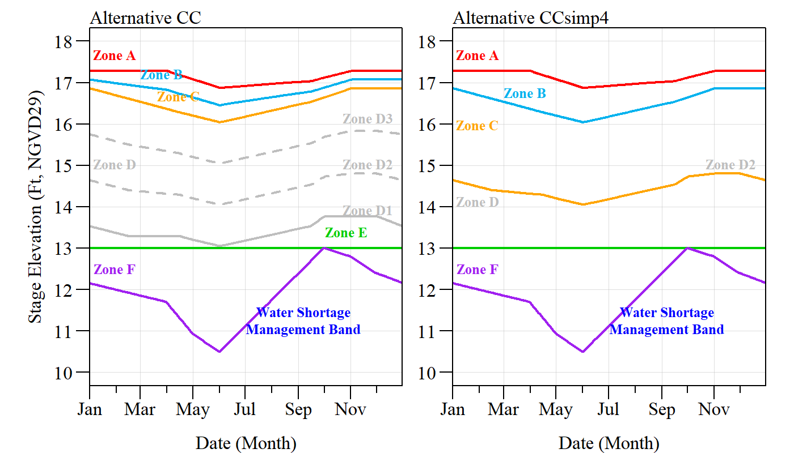
```

---
name: Simptest


### Phase 1 - Test Schedule Components – CCsimp4

* Flows to St. Lucie Estuary (simp4 and simp4s1)

* Increased flexibility in lower portion of the schedule (smp4ZFS, smp4ZFW, smp4ZFSW)
  * smp4ZFS - Flow to LOWSM line (removal of Zone F) for flows south only
  * smp4ZFW - Flow to LOWSM line (removal of Zone F) for flows west only
  * smp4ZFSW - Flow to LOWSM line (removal of Zone F) for flows south and west

* Opportunity to send desirable dry season flows to Lake Worth Lagoon (271DS, 271DSZC)
  * 271DS - S271 sends 200 cfs when S155A 14-day moving average is `r paste("\u2264")`100 during dry season
  * S71DSZC - Same as S271DS but flood control level is above Zone C line. 

* Zone B regulation point for CRE (S77 vs S79) (ZB_S77)

---
name: Simptest


### Phase 1 - Test Schedule Components – CCR1

* CCR1 used CCsimp4 as base and incorporated features from smp4ZFSW, 271DS and ZB_S77
.small[
* ZFSW logic - flow south and west to LOWSM line
* 271DS logic - S271 sends 200 cfs when S155A 14-day moving average is `r paste("\u2264")`100 during dry season
* ZB_S77 - Zone B regulation point for CRE - S77 instead of S79
]

Evaluated: 

* Opportunities to reduce algal bloom risk in the northern estuaries (R1ABZD, R1ABZC, R1ABZB)
.small[
* all reg releases in June, July, August set to 0 in Zone D, C and B and lower (R1ABZD, R1ABZC, R1ABZB, respectively)
]

* Opportunities to improve lake health by incorporating extreme and moderate recovery operations (CCR1ED, CCR1MD1, CCRMD2)
 .small[
* Takes into account El `r paste0("Ni","\u00F1","o")` forecast, recovery envelope counts and <11 Ft stage threshold
]

* Opportunities to address water supply performance by modifying operations in lower portions of the schedule (R1WSEN, R1WSMF)
 .small[
* Full flows being ~750 cfs west and up to max south 
* R1WSMF - Lake forecasted to enter into WSM band
* R1WSEN - Cutbacks during ENSO conditions
]

---
name: CRE Recover


### CRE RECOVER metrics
.left-column[RECOVER salinity envelope evaluation during the simulation period of record for Caloosahatchee with Lake (LOK) and Basin contributions delineated.]

.right-column[
```{r ,fig.align="center",out.width="100%"}

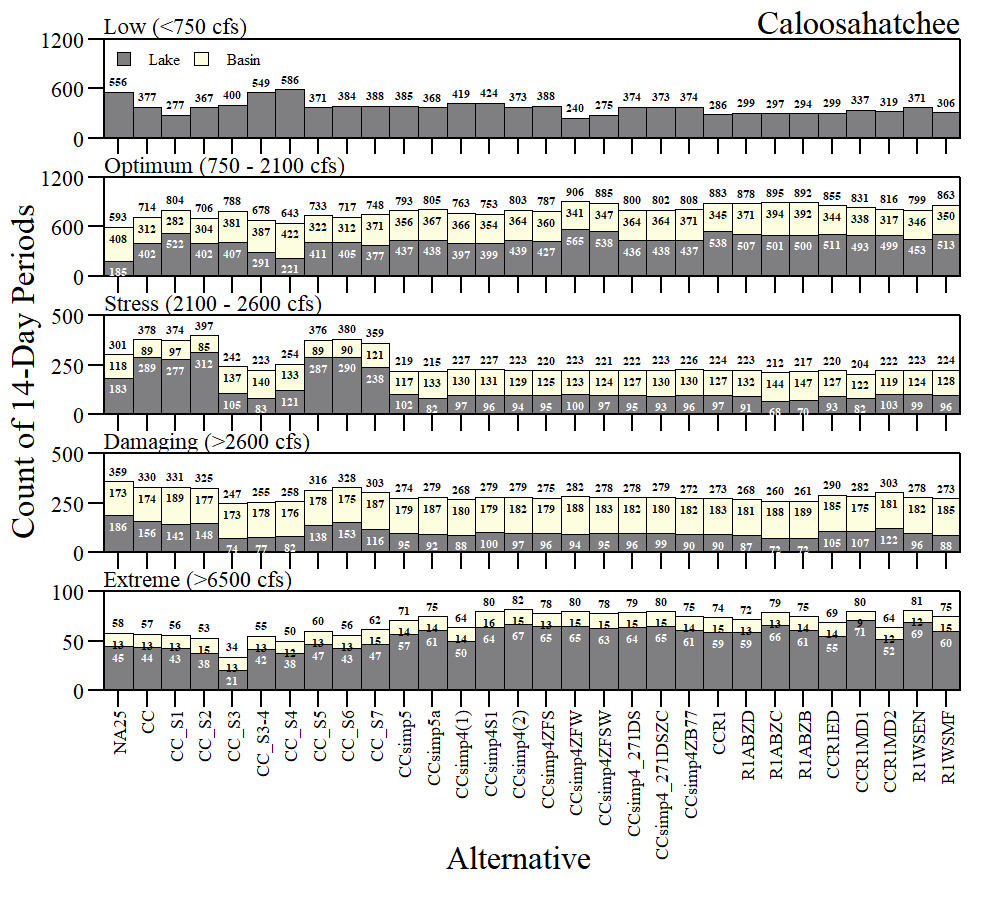
```
]

---
name: CRE Recover


### CRE RECOVER metrics
.left-column[RECOVER salinity envelope evaluation relative to FWO (NA25) during the simulation period of record for Caloosahatchee specific to Lake, Basin and total counts.]

.right-column[
```{r ,fig.align="center",out.width="100%"}

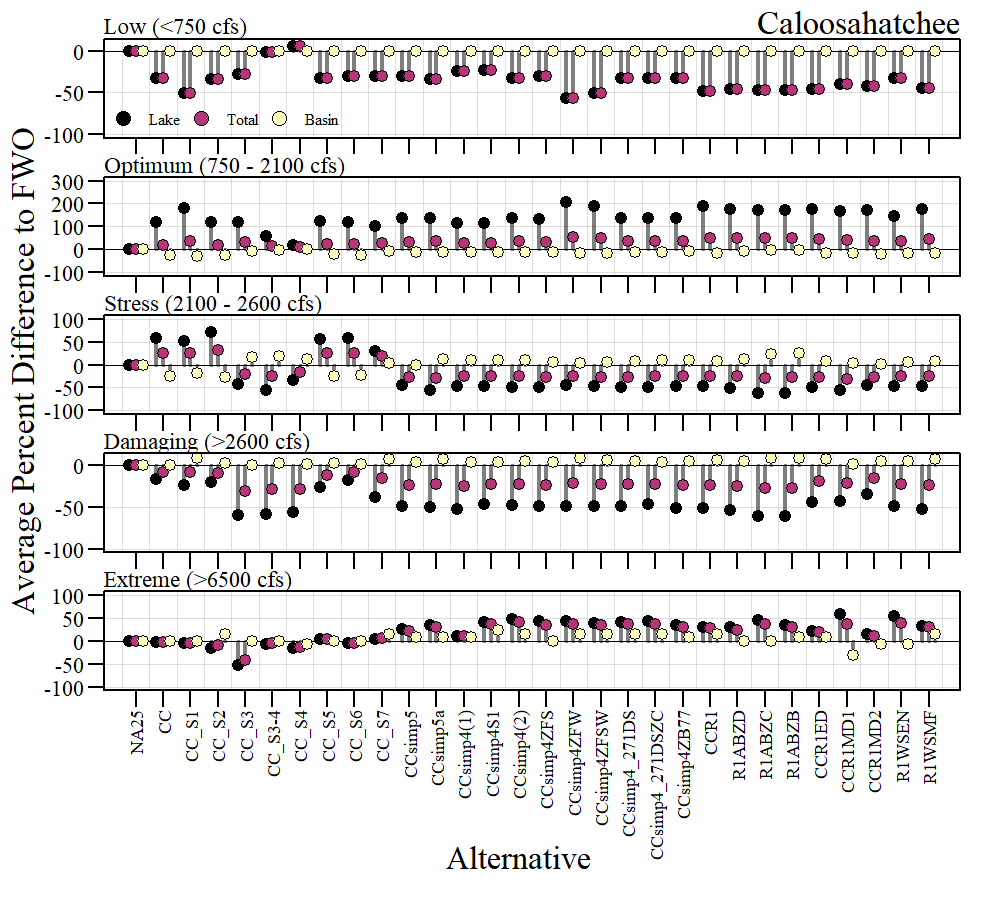
```
]

---
name: CRE Extreme


### CRE Extreme Flow Events
.left-column[Number of events and duration of events of extreme flow events (>6500 cfs) for the Caloosahatchee (all flows; Basin+LOK).]

.right-column[
```{r ,fig.align="center",out.width="74%"}

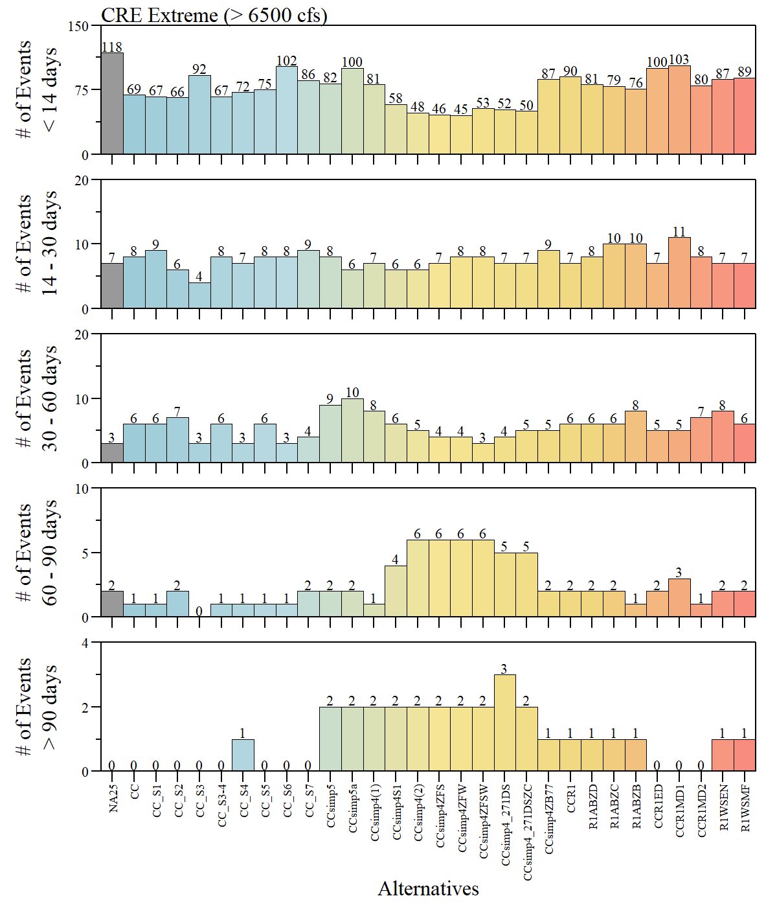
```
]

---
name: CRE Extreme


### CRE Extreme Flow Events
.left-column[Number of events and duration of events of extreme flow events (>6500 cfs) for the Caloosahatchee from Lake Okeechobee.]

.right-column[
```{r ,fig.align="center",out.width="74%"}

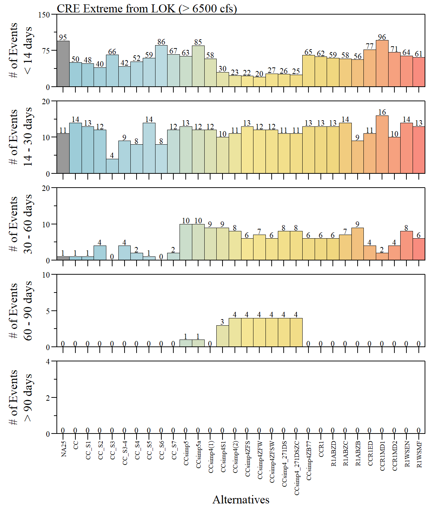
```
]

---
name: CRE Extreme


### CRE Extreme Flow Events

```{r ,fig.align="center",out.width="100%"}

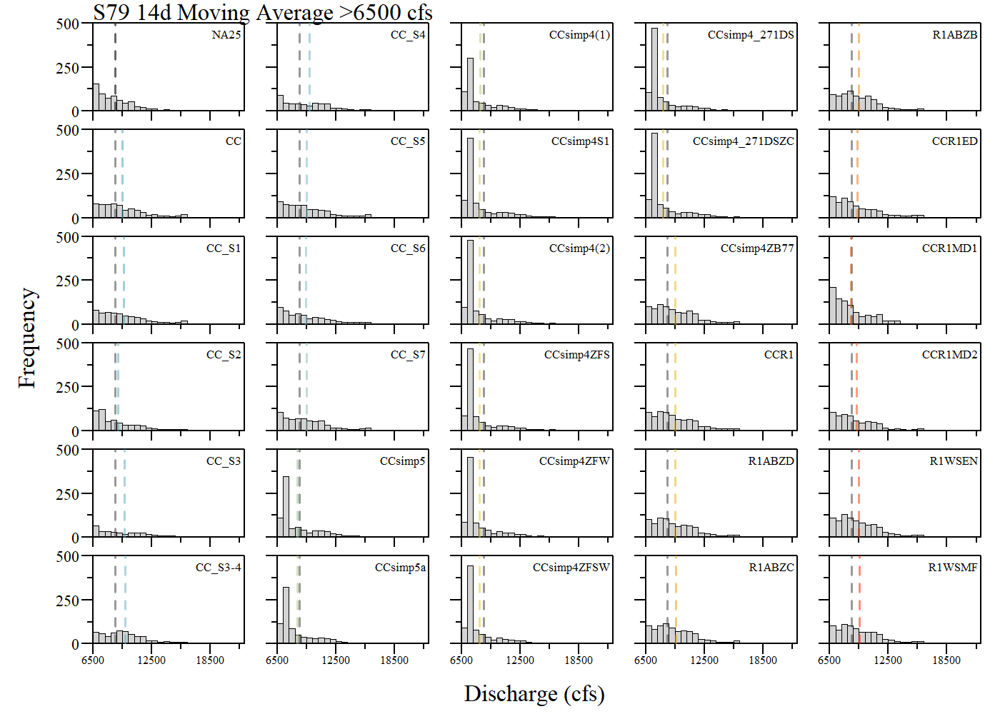
```
<!-- fig.cap="Histogram of S79 discharges >6500 cfs. The grey dashed line is the mean 14-day S79 moving average discharge >6500 cfs relative to the colored dashed line for each specific alternative." -->


---
name: CRE flow

### CRE Discharge

Mean annual total S-79 discharge during the period of simulation
.pull-left[
```{r}
q.dat.CY.mean=read.csv(paste0(export.path,"Iteration3/Iter3P1_AnnQ.csv"))
q.dat.CY.mean$S79.FWO=with(q.dat.CY.mean,(S79-S79[1])/S79[1])*100
q.dat.CY.mean$S77_QFC.FWO=with(q.dat.CY.mean,(S77_QFC-S77_QFC[1])/S77_QFC[1])*100

q.dat.CY.mean[1:15,c("Alt","S79","S79.FWO")]%>%
  flextable()%>%
  colformat_double(j=2,digits=0,big.mark = "")%>%
  colformat_double(j=3,digits=1,big.mark = "")%>%
  set_header_labels("Alt"="Alternative",
                    "S79"="S-79\n(x1000 Ac-Ft Y\u207B\u00B9)",
                    "S79.FWO"="S-79\n(% Diff FWO)")%>%
  padding(padding=1,part="all")%>%
  fontsize(size=8,part="body")%>%
  fontsize(size=9,part="header")%>%
  align(j=2:3,align="center",part="all")%>%
  width(width=c(0.5,1,1))%>%
  font(fontname="Times New Roman",part="all")%>%
  bold(part="header")

```
]

.pull-right[
```{r}
q.dat.CY.mean[16:30,c("Alt","S79","S79.FWO")]%>%
  flextable()%>%
  colformat_double(j=2,digits=0,big.mark = "")%>%
  colformat_double(j=3,digits=1,big.mark = "")%>%
  set_header_labels("Alt"="Alternative",
                    "S79"="S-79\n(x1000 Ac-Ft Y\u207B\u00B9)",
                    "S79.FWO"="S-79\n(% Diff FWO)")%>%
  padding(padding=1,part="all")%>%
  fontsize(size=8,part="body")%>%
  fontsize(size=9,part="header")%>%
  align(j=2:3,align="center",part="all")%>%
  width(width=c(0.5,1,1))%>%
  font(fontname="Times New Roman",part="all")%>%
  bold(part="header")

```
]

---
name: CREQ

### CRE Discharge

Mean annual total S-77 regulatory (flood protection) discharge during the period of simulation
.pull-left[
```{r}
q.dat.CY.mean[1:15,c("Alt","S77_QFC","S77_QFC.FWO")]%>%
  flextable()%>%
  colformat_double(j=2,digits=0,big.mark = "")%>%
  colformat_double(j=3,digits=1,big.mark = "")%>%
  set_header_labels("Alt"="Alternative",
                    "S77_QFC"="S-77 Reg Q\n(x1000 Ac-Ft Y\u207B\u00B9)",
                    "S77_QFC.FWO"="S-77 Reg Q\n(% Diff FWO)")%>%
  padding(padding=1,part="all")%>%
  fontsize(size=8,part="body")%>%
  fontsize(size=9,part="header")%>%
  align(j=2:3,align="center",part="all")%>%
  width(width=c(0.5,1,1))%>%
  font(fontname="Times New Roman",part="all")%>%
  bold(part="header")

```
]

.pull-right[
```{r}
q.dat.CY.mean[16:30,c("Alt","S77_QFC","S77_QFC.FWO")]%>%
  flextable()%>%
  colformat_double(j=2,digits=0,big.mark = "")%>%
  colformat_double(j=3,digits=1,big.mark = "")%>%
  set_header_labels("Alt"="Alternative",
                    "S77_QFC"="S-77 Reg Q\n(x1000 Ac-Ft Y\u207B\u00B9)",
                    "S77_QFC.FWO"="S-77 Reg Q\n(% Diff FWO)")%>%
  padding(padding=1,part="all")%>%
  fontsize(size=8,part="body")%>%
  fontsize(size=9,part="header")%>%
  align(j=2:3,align="center",part="all")%>%
  width(width=c(0.5,1,1))%>%
  font(fontname="Times New Roman",part="all")%>%
  bold(part="header")

```
]

---
name: SLE Recover


### SLE RECOVER metrics
.left-column[RECOVER salinity envelope evaluation during the simulation period of record for St Lucie with Lake (LOK) and Basin contributions delineated.]

.right-column[
```{r ,fig.align="center",out.width="100%"}

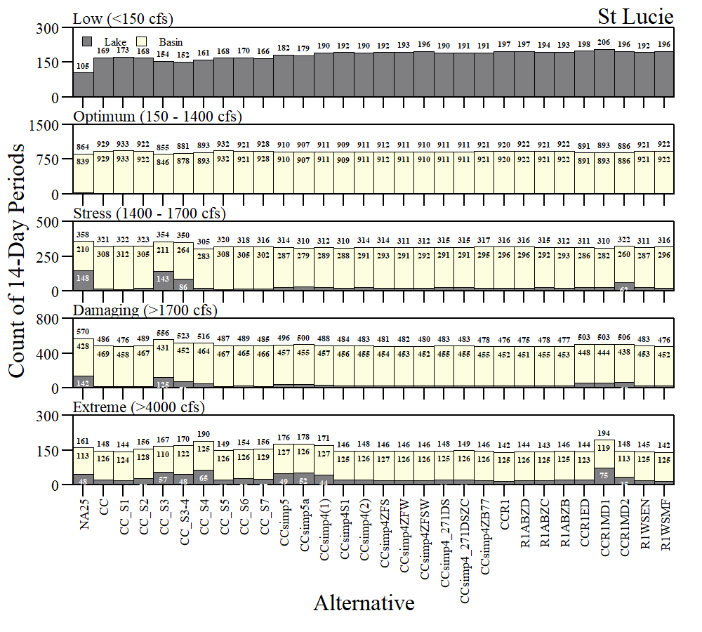
```
]

---
name: SLE Recover


### SLE RECOVER metrics
.left-column[RECOVER salinity envelope evaluation relative to FWO (NA25) during the simulation period of record for St Lucie specific to Lake, Basin and total counts.]

.right-column[
```{r ,fig.align="center",out.width="100%"}

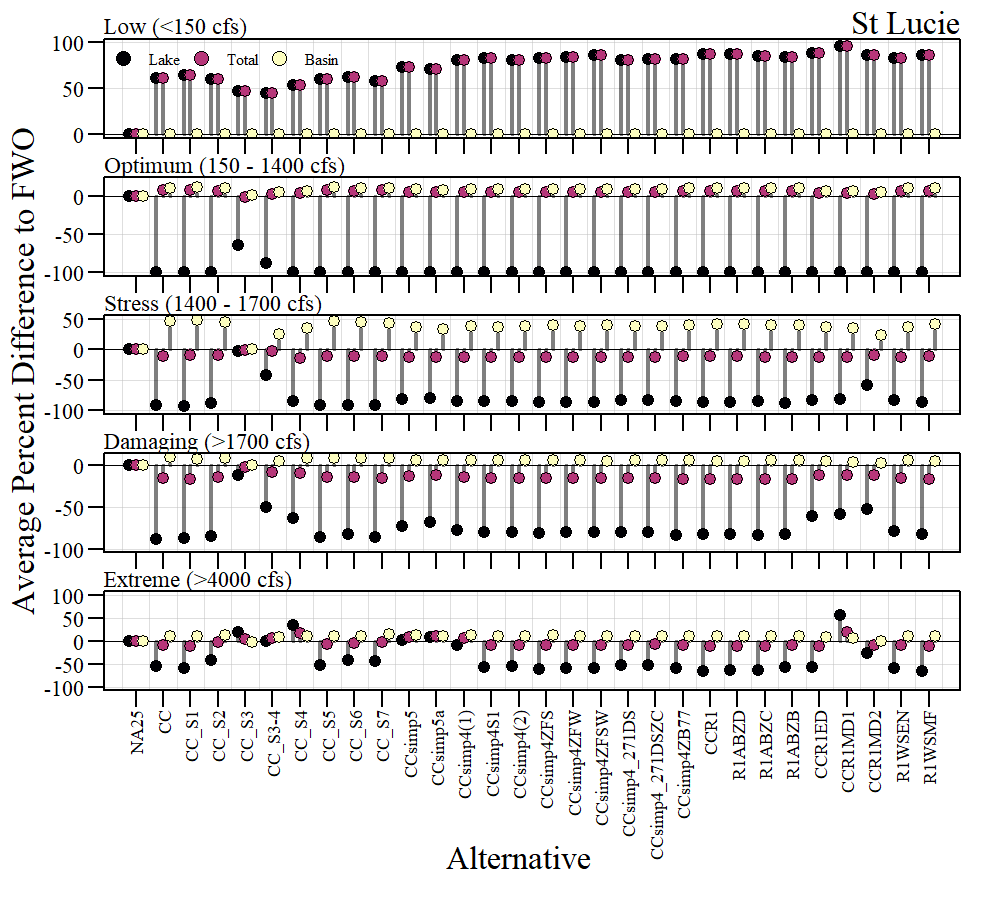
```
]

---
name: CRE Extreme


### SLE Extreme Flow Events
.left-column[Number of events and duration of events of extreme flow events (>4000 cfs) for the St Lucie (all flows; Basin+LOK).]

.right-column[
```{r ,fig.align="center",out.width="74%"}

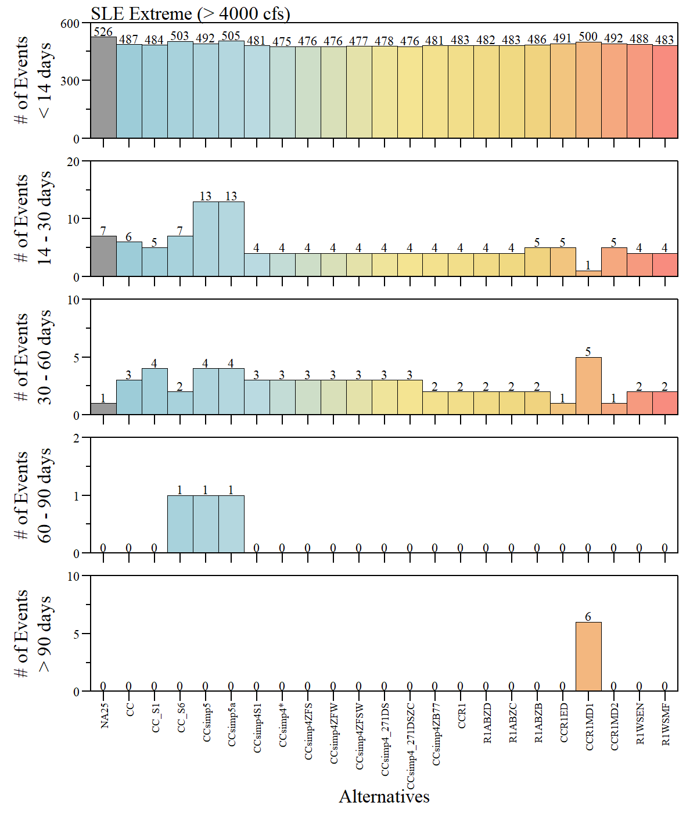
```
]

---
name: CRE Extreme


### SLE Extreme Flow Events
.left-column[Number of events and duration of events of extreme flow events (>4000 cfs) for the St Lucie from Lake Okeechobee.]

.right-column[
```{r ,fig.align="center",out.width="74%"}

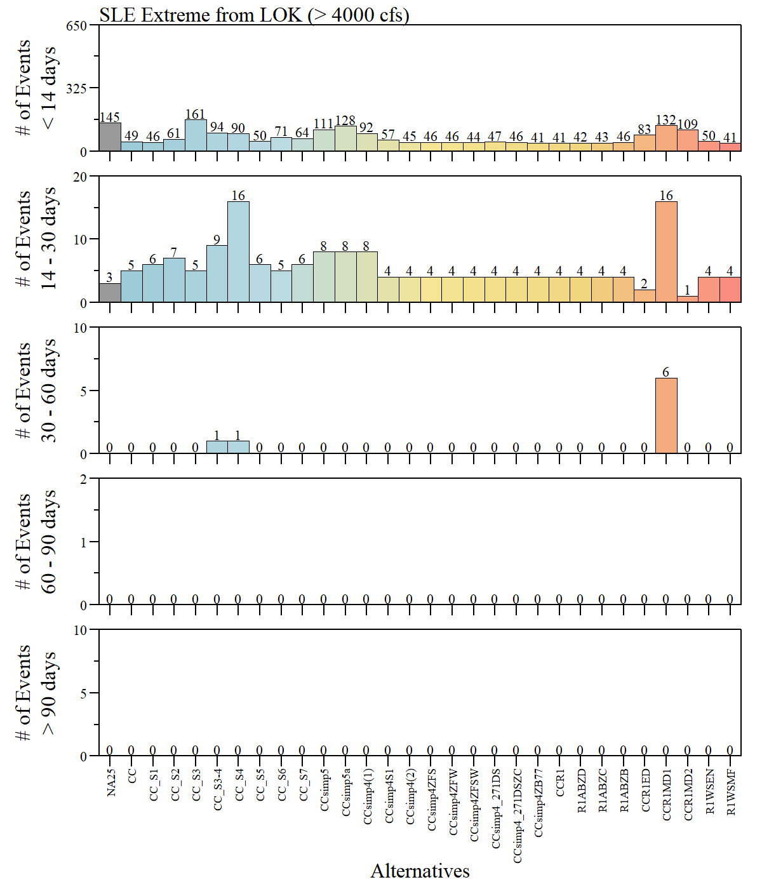
```
]

---
name: SLE flow

### SLE Discharge

Mean annual total S-80 discharge during the period of simulation
.pull-left[
```{r}
q.dat.CY.mean$S80.FWO=with(q.dat.CY.mean,(S80-S80[1])/S80[1])*100
q.dat.CY.mean$S308_QFC.FWO=with(q.dat.CY.mean,(S308_QFC-S308_QFC[1])/S308_QFC[1])*100

q.dat.CY.mean[1:15,c("Alt","S80","S80.FWO")]%>%
  flextable()%>%
  colformat_double(j=2,digits=0,big.mark = "")%>%
  colformat_double(j=3,digits=1,big.mark = "")%>%
  set_header_labels("Alt"="Alternative",
                    "S80"="S-80\n(x1000 Ac-Ft Y\u207B\u00B9)",
                    "S80.FWO"="S-80\n(% Diff FWO)")%>%
  padding(padding=1,part="all")%>%
  fontsize(size=8,part="body")%>%
  fontsize(size=9,part="header")%>%
  align(j=2:3,align="center",part="all")%>%
  width(width=c(0.5,1,1))%>%
  font(fontname="Times New Roman",part="all")%>%
  bold(part="header")

```
]

.pull-right[
```{r}
q.dat.CY.mean[16:30,c("Alt","S80","S80.FWO")]%>%
  flextable()%>%
  colformat_double(j=2,digits=0,big.mark = "")%>%
  colformat_double(j=3,digits=1,big.mark = "")%>%
  set_header_labels("Alt"="Alternative",
                    "S80"="S-80\n(x1000 Ac-Ft Y\u207B\u00B9)",
                    "S80.FWO"="S-80\n(% Diff FWO)")%>%
  padding(padding=1,part="all")%>%
  fontsize(size=8,part="body")%>%
  fontsize(size=9,part="header")%>%
  align(j=2:3,align="center",part="all")%>%
  width(width=c(0.5,1,1))%>%
  font(fontname="Times New Roman",part="all")%>%
  bold(part="header")

```
]

---
name: SLEQ

### SLE Discharge

Mean annual total S-308 regulatory (flood protection) discharge during the period of simulation
.pull-left[
```{r}
q.dat.CY.mean[1:15,c("Alt","S308_QFC","S308_QFC.FWO")]%>%
  flextable()%>%
  colformat_double(j=2,digits=0,big.mark = "")%>%
  colformat_double(j=3,digits=1,big.mark = "")%>%
  set_header_labels("Alt"="Alternative",
                    "S308_QFC"="S-308 Reg Q\n(x1000 Ac-Ft Y\u207B\u00B9)",
                    "S308_QFC.FWO"="S-308 Reg Q\n(% Diff FWO)")%>%
  padding(padding=1,part="all")%>%
  fontsize(size=8,part="body")%>%
  fontsize(size=9,part="header")%>%
  align(j=2:3,align="center",part="all")%>%
  width(width=c(0.5,1,1))%>%
  font(fontname="Times New Roman",part="all")%>%
  bold(part="header")
```
]

.pull-right[
```{r}
q.dat.CY.mean[16:30,c("Alt","S308_QFC","S308_QFC.FWO")]%>%
  flextable()%>%
  colformat_double(j=2,digits=0,big.mark = "")%>%
  colformat_double(j=3,digits=1,big.mark = "")%>%
  set_header_labels("Alt"="Alternative",
                    "S308_QFC"="S-308 Reg Q\n(x1000 Ac-Ft Y\u207B\u00B9)",
                    "S308_QFC.FWO"="S-308 Reg Q\n(% Diff FWO)")%>%
  padding(padding=1,part="all")%>%
  fontsize(size=8,part="body")%>%
  fontsize(size=9,part="header")%>%
  align(j=2:3,align="center",part="all")%>%
  width(width=c(0.5,1,1))%>%
  font(fontname="Times New Roman",part="all")%>%
  bold(part="header")

```
]

---
name: Lake

### Lake Okeechobee Stage Envelope

```{r ,fig.align="center",out.width="90%",fig.cap="Annual lake stage envelope scores (below, above and total)."}

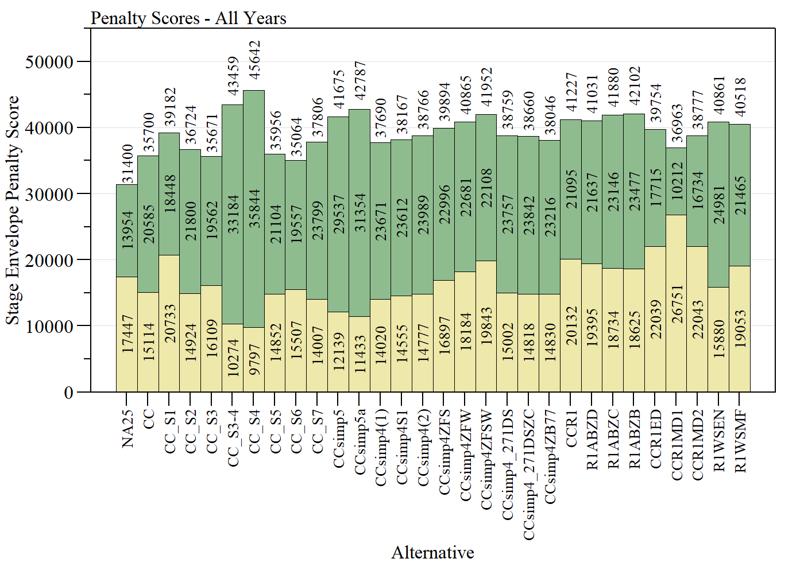
```

---
name: Lake

### Lake Okeechobee Stage Envelope

```{r ,fig.align="center",out.width="90%",fig.cap="Total score percent difference to FWO."}

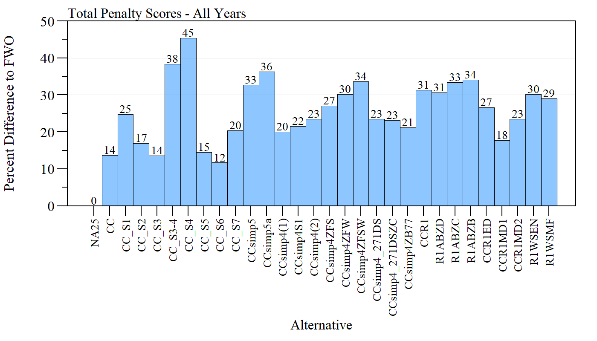
```

---
name: Lake

### Lake Okeechobee Stage Envelope

```{r ,fig.align="center",out.width="90%",fig.cap="May to September lake stage envelope scores (below, above and total)."}

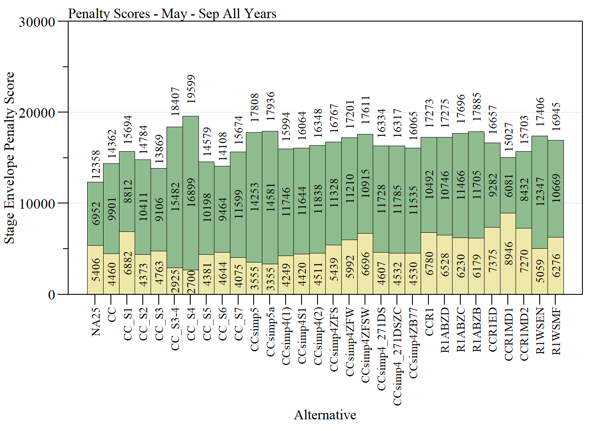
```


---
name: Lake

### Lake Okeechobee Stage Envelope

```{r ,fig.align="center",out.width="75%",fig.cap="Frequency of high and low stages across alternatives."}

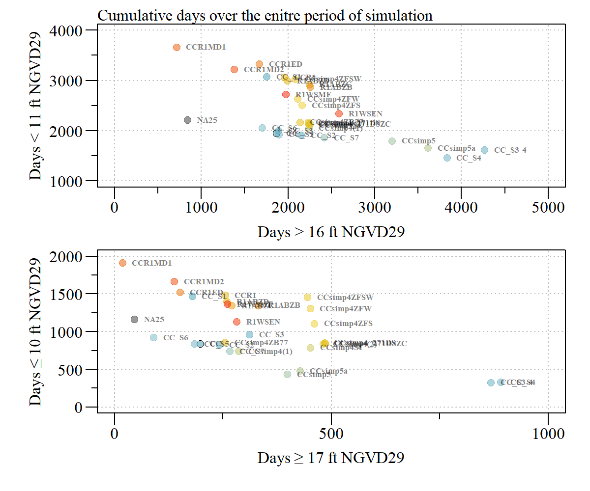
```

---
name: Lake

### Lake Okeechobee Stage Envelope

```{r ,fig.align="center",out.width="75%",fig.cap="Frequency of high and low stages across alternatives during May to September."}

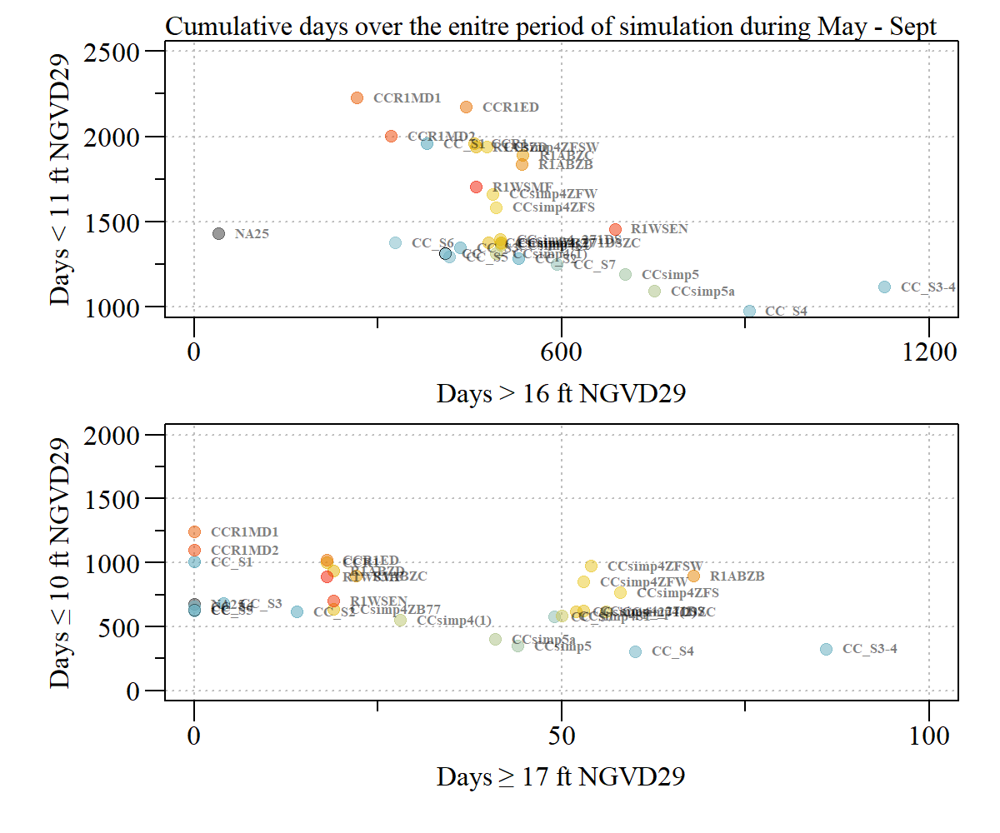
```

---
name: LOK Extreme


### Lake High Stage Events
.left-column[Number and duration of events with stage elevations >16 Ft NGVD29.]

.right-column[
```{r ,fig.align="center",out.width="74%"}

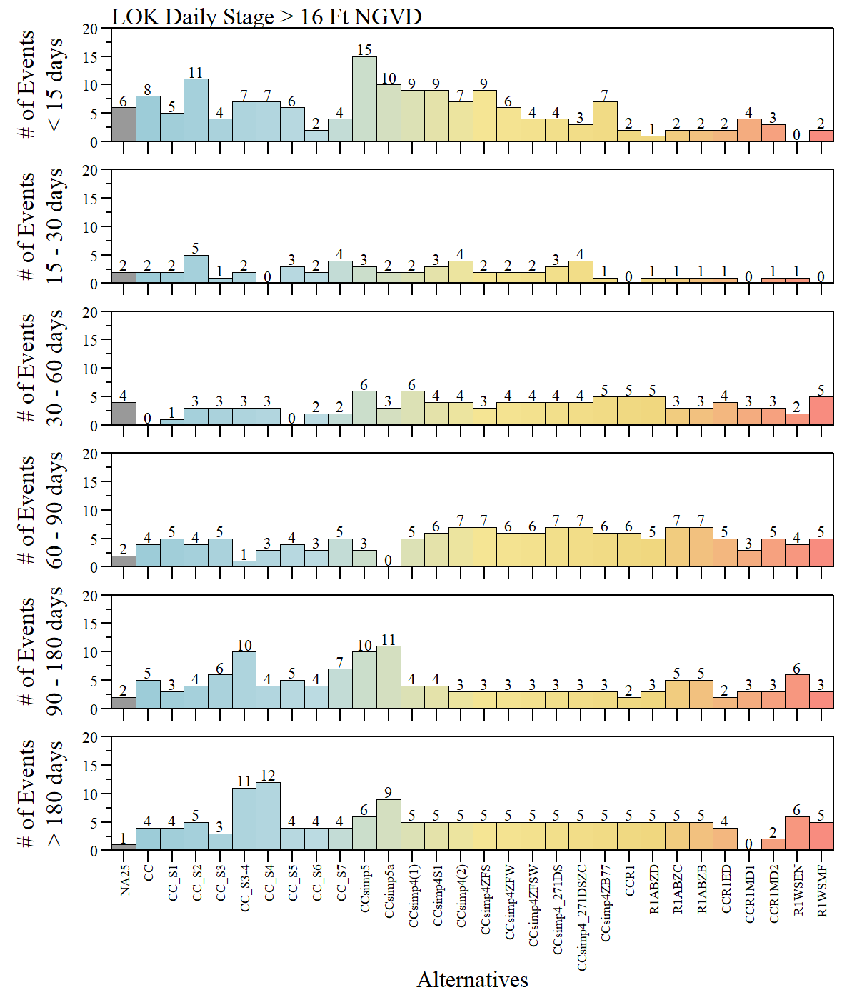
```
]

---
name: LOK Extreme


### Lake High Stage Events
.left-column[Number and duration of events with stage elevations `r paste0("\u2265")`17 Ft NGVD29.]

.right-column[
```{r ,fig.align="center",out.width="74%"}

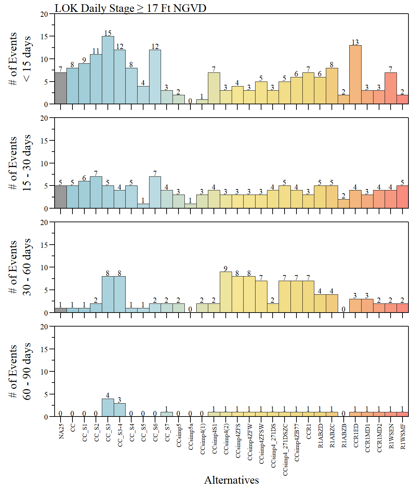
```
]

---
name: LOK Return


### Lake High Stage Return Period
```{r ,fig.align="center",out.width="90%",fig.cap="Return/recurrance period of annual maximum stage for each alternative."}

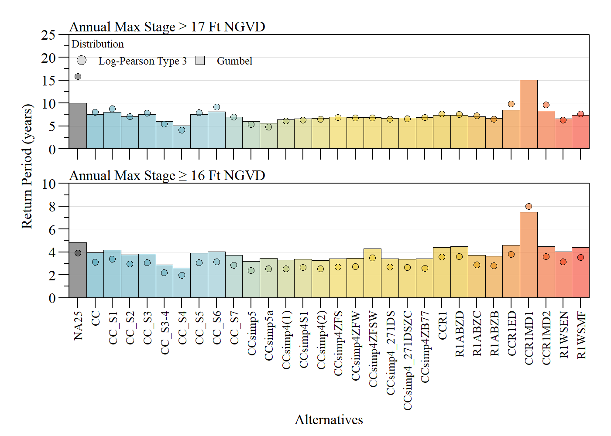
```