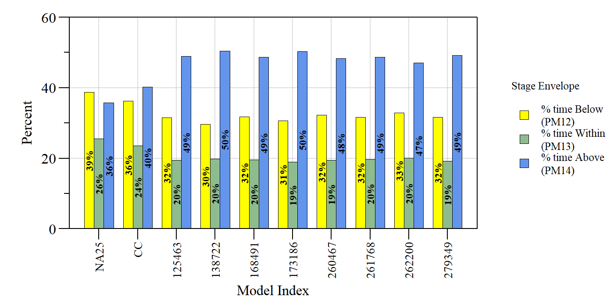

```{r setup, include=FALSE}
library(knitr)

options(htmltools.dir.version = FALSE)
knitr::opts_chunk$set(warning = FALSE, message = FALSE, echo=FALSE)

##
library(flextable)
library(magrittr)
library(plyr)
library(reshape2)

wd="C:/Julian_LaCie/_Github/LOSOM_ModelEval"

plot.path="C:/Julian_LaCie/_Github/LOSOM_ModelEval/Plots/"
export.path="C:/Julian_LaCie/_GitHub/LOSOM_ModelEval/Export/"
```

layout: true

<div class="my-footer">
<span>  </span>
</div>

---
name: title
class: left, middle

### Lake Okeechobee System Operating Manual

.pull-left[
#### Iteration 3 - Phase 2 Batch Analysis

*Sanibel-Captiva Conservation Foundation*

*Conservancy of Southwest Florida*

**DRAFT** - `r paste(format(as.Date("2021-10-22"),"%B %d, %Y"),"<br>(Updated:", format(as.Date(Sys.Date()),"%B %d, %Y"),")")`

]
<!-- this ends up being the title slide since seal = FALSE-->

.pull-right[
```{r ,fig.align="center",out.width="40%"}
knitr::include_graphics('./Plots/SCCF Logo knockout_c.png')
```

```{r ,fig.align="center",out.width="40%"}
knitr::include_graphics('./Plots/ConSWFL.jpeg')
```

]


```{r xaringanExtra, include=FALSE, warnint=FALSE}
# devtools::install_github("gadenbuie/xaringanExtra")
# xaringanExtra::use_webcam()
xaringanExtra::use_tile_view()
# xaringanExtra::use_scribble()
```
.footnote[
<!-- Paul Julian PhD<br>[`r fontawesome::fa("fas fa-envelope")`](mailto: pjulian@sccf.org) .small[pjulian@sccf.org] -->

.small[Use cursor keys for navigation, press .red["O"] for a slide .red[O]verview]

```{r} 
bsplus::bs_button(
    label = "Download PDF Version",
    button_type = "primary",
    button_size = "small") %>%
    htmltools::a(
      href = "https://sccf-tech.github.io/slides/LOSOM/SCCF_iter3_p1_v2.pdf"
      )
```
]

---
name: USACE
class: middle

Evaluation of model runs presented to PDT by USACE 2021-10-26

```{r ,fig.align="center",out.width="85%"}


```

---
name: USACE_estuary

### Iteration 3 - Phase 2

```{r ,fig.align="center",out.width="64%"}


```

---
name: USACE_estuary

### Iteration 3 - Phase 2

```{r ,fig.align="center",out.width="64%"}


```

---
name: USACE_estuary2

### Iteration 3 - Phase 2

```{r ,fig.align="center",out.width="100%"}


```

---
name: USACE_estuary3

### Iteration 3 - Phase 2

```{r ,fig.align="center",out.width="75%"}


```

---
name: USACE_estuary4

### Iteration 3 - Phase 2

```{r ,fig.align="center",out.width="100%"}


```

---
name: Lake Okeechobee

### Iteration 3 - Phase 2

```{r ,fig.align="center",out.width="100%"}


```


---
name: Lake Okeechobee

### Iteration 3 - Phase 2

```{r ,fig.align="center",out.width="100%"}


```

---
name: Lake Okeechobee

### Iteration 3 - Phase 2 

```{r ,fig.align="center",out.width="60%"}


```

---
name: Lake Okeechobee2

### Iteration 3 - Phase 2

```{r ,fig.align="center",out.width="100%"}


```

---
name: Lake Okeechobee3

### Iteration 3 - Phase 2

```{r ,fig.align="center",out.width="100%"}


```


---
name: RegulatoryFlow

### Iteration 3 - Phase 2

```{r ,fig.align="center",out.width="100%"}


```

---
name: RegulatoryFlow

### Iteration 3 - Phase 2

```{r ,fig.align="center",out.width="100%"}


```


---
name: FWO

### Iteration 3 - Phase 2

```{r,include=F,echo=F}
vars=c(paste0("PM",c(30,31,37,38,36,80,81,86,87,85,88,40,39,20)),"total.pen")

baseline2=read.csv(paste0(export.path,"Iteration3/Iter3P2_baselines.csv"))
tmp.dat=read.csv(paste0(export.path,"Iteration3/Iter3P2_USACEselect.csv"))

FWO.compare=data.frame(Index=tmp.dat$Index)
for(i in 1:length(vars)){
FWO.val=subset(baseline2,Model=="NA25")[,vars[i]]
val=((tmp.dat[,vars[i]]-FWO.val)/FWO.val)*100
tmp=data.frame(val=val)
colnames(tmp)=paste0(vars[i],".FWO")
FWO.compare=cbind(FWO.compare,tmp)
}
FWO.compare

PM.xwalk=data.frame(PM=vars,
                    Descript=c(paste("CRE",c("Low","Optimum","Stress from LOK","Damaging from LOK","Extreme"),sep=" - "),
                               paste("SLE",c("Low","Optimum","Stress from LOK","Damaging from LOK","Extreme"),sep=" - "),
                               "S308 Regulatory Flow","S77 Regulatory Flow","CRE MFL","LOK MFL","LOK - Total Stage Envelope Penalty"))

PM.xwalk$Descript2=with(PM.xwalk,paste0(Descript," (",ifelse(PM=="total.pen","PM10+PM11",PM),")"))

PM.xwalk$variable=paste0(PM.xwalk$PM,".FWO")
FWO.compare2=reshape2::melt(FWO.compare,id.vars="Index")
FWO.compare2=merge(FWO.compare2,PM.xwalk[,c("variable","Descript2")])
FWO.compare2.xtab=reshape2::dcast(FWO.compare2,Descript2~Index,value.var = "value",fun.aggregate=function(x) round(mean(x),1))
FWO.compare2.xtab=FWO.compare2.xtab[,c("Descript2",tmp.dat$Index)]
FWO.compare2.xtab=FWO.compare2.xtab[match(PM.xwalk$Descript2,FWO.compare2.xtab$Descript2),]

```

```{r}
cols=adjustcolor(c("lightgreen",rep("white",6),"indianred1"),0.5)
FWO.compare2.xtab%>%
  flextable()%>%
  padding(padding=1,part="all")%>%
  fontsize(size=8,part="body")%>%
  fontsize(size=9,part="header")%>%
  font(fontname="Times New Roman",part="all")%>%
  autofit()%>%
  set_header_labels("Descript2"="Performance Measure")%>%
  add_header("CC"="Model Index",
             "125463"="Model Index",
             "138722"="Model Index",
             "168491"="Model Index",
             "173186"="Model Index",
             "260467"="Model Index", 
             "261768"="Model Index",
             "262200"="Model Index",
             "279349"="Model Index")%>%
  merge_h(part="header")%>%
  align(align="center",part="header")%>%
  align(align="center",part="all")%>%
  align(j=1,align="left",part="all")%>%
  # bg(j=3:10,i=1,bg=cols[rank(FWO.compare2.xtab[1,3:10])])%>%
  # bg(j=3:10,i=2,bg=cols[rank(-FWO.compare2.xtab[2,3:10])])%>%
  # bg(j=3:10,i=3,bg=cols[rank(FWO.compare2.xtab[3,3:10])])%>%
  # bg(j=3:10,i=4,bg=cols[rank(FWO.compare2.xtab[4,3:10])])%>%
  # bg(j=3:10,i=5,bg=cols[rank(FWO.compare2.xtab[5,3:10])])%>%
  # bg(j=3:10,i=6,bg=cols[rank(FWO.compare2.xtab[6,3:10])])%>%
  # bg(j=3:10,i=7,bg=cols[rank(-FWO.compare2.xtab[7,3:10])])%>%
  # bg(j=3:10,i=8,bg=cols[rank(FWO.compare2.xtab[8,3:10])])%>%
  # bg(j=3:10,i=9,bg=cols[rank(FWO.compare2.xtab[9,3:10])])%>%
  # bg(j=3:10,i=10,bg=cols[rank(FWO.compare2.xtab[10,3:10])])%>%
  # bg(j=3:10,i=11,bg=cols[rank(FWO.compare2.xtab[11,3:10])])%>%
  # bg(j=3:10,i=12,bg=cols[rank(FWO.compare2.xtab[12,3:10])])%>%
  # bg(j=3:10,i=13,bg=cols[rank(FWO.compare2.xtab[13,3:10])])%>%
  # bg(j=3:10,i=14,bg=cols[rank(FWO.compare2.xtab[14,3:10])])%>%
  # bg(j=3:10,i=15,bg=cols[rank(FWO.compare2.xtab[15,3:10])])%>%
  footnote(j=1,part="header",ref_symbols = "",value=as_paragraph("Percent Difference relative to FWO (NA25)"))%>%
  #footnote(j=1,part="header",ref_symbols = "",value=as_paragraph("Green value indicates best and Red indicates worst for each metric across selected models"))%>%
  font(fontname="Times New Roman",part="all")

```

*“Balance is not a passive resting place—it takes work, balancing the giving and the taking...”*
- Robin Wall Kimmerer

---
name: WaterSupply

### Iteration 3 - Phase 2

```{r ,fig.align="center",out.width="55%"}


```

---
name: Empty
class: inverse middle center

## East Coast Stakeholder<br>Selected Plans

Model Index: 273238, 121211, 142495, 128556, 158755


---
name: EastCoast_estuary

### Iteration 3 - Phase 2

```{r ,fig.align="center",out.width="100%"}


```

---
name: Lake Okeechobee2

### Iteration 3 - Phase 2

```{r ,fig.align="center",out.width="100%"}


```

---
name: Lake Okeechobee3

### Iteration 3 - Phase 2

```{r ,fig.align="center",out.width="100%"}


```

---
name: USACE_estuary

### Iteration 3 - Phase 2

```{r ,fig.align="center",out.width="64%"}


```

---
name: Lake Okeechobee

### Iteration 3 - Phase 2 

```{r ,fig.align="center",out.width="60%"}


```

---
name: RegulatoryFlow

### Iteration 3 - Phase 2

```{r ,fig.align="center",out.width="100%"}


```


---
name: FWO

### Iteration 3 - Phase 2

```{r,include=F,echo=F}
vars=c(paste0("PM",c(30,31,37,38,36,80,81,86,87,85,88,40,39,20,5,6)),"total.pen")

# baseline2=read.csv(paste0(export.path,"Iteration3/Iter3P2_baselines.csv"))
tmp.dat=read.csv(paste0(export.path,"Iteration3/Iter3P2_eastcoastselect.csv"))

FWO.compare=data.frame(Index=tmp.dat$Index)
for(i in 1:length(vars)){
FWO.val=subset(baseline2,Model=="NA25")[,vars[i]]
val=((tmp.dat[,vars[i]]-FWO.val)/FWO.val)*100
tmp=data.frame(val=val)
colnames(tmp)=paste0(vars[i],".FWO")
FWO.compare=cbind(FWO.compare,tmp)
}
FWO.compare

PM.xwalk=data.frame(PM=vars,
                    Descript=c(paste("CRE",c("Low","Optimum","Stress from LOK","Damaging from LOK","Extreme"),sep=" - "),
                               paste("SLE",c("Low","Optimum","Stress from LOK","Damaging from LOK","Extreme"),sep=" - "),
                               "S308 Regulatory Flow","S77 Regulatory Flow","CRE MFL","LOK MFL","LOK >17 Ft","LOK >16 Ft","LOK - Total Stage Envelope Penalty"))
PM.xwalk$variable=paste0(PM.xwalk$PM,".FWO")

PM.xwalk$Descript2=with(PM.xwalk,paste0(Descript," (",ifelse(PM=="total.pen","PM10+PM11",PM),")"))

PM.xwalk$variable=paste0(PM.xwalk$PM,".FWO")
FWO.compare2=reshape2::melt(FWO.compare,id.vars="Index")
FWO.compare2=merge(FWO.compare2,PM.xwalk[,c("variable","Descript2")])
FWO.compare2.xtab=reshape2::dcast(FWO.compare2,Descript2~Index,value.var = "value",fun.aggregate=function(x) round(mean(x),1))
FWO.compare2.xtab=FWO.compare2.xtab[,c("Descript2",tmp.dat$Index)]
FWO.compare2.xtab=FWO.compare2.xtab[match(PM.xwalk$Descript2,FWO.compare2.xtab$Descript2),]

```

```{r}
cols=adjustcolor(c("lightgreen",rep("white",6),"indianred1"),0.5)
FWO.compare2.xtab%>%
  flextable()%>%
  padding(padding=1,part="all")%>%
  fontsize(size=7,part="body")%>%
  fontsize(size=8,part="header")%>%
  font(fontname="Times New Roman",part="all")%>%
  autofit()%>%
  set_header_labels("Descript2"="Performance Measure")%>%
  add_header("CC"="Model Index",
             "121211"="Model Index",
             "128556"="Model Index",
             "142495"="Model Index",
             "158755"="Model Index",
             "273238"="Model Index")%>%
  merge_h(part="header")%>%
  align(align="center",part="header")%>%
  align(align="center",part="all")%>%
  align(j=1,align="left",part="all")%>%
  footnote(j=1,part="header",ref_symbols = "",value=as_paragraph("Percent Difference relative to FWO (NA25)"))%>%
  font(fontname="Times New Roman",part="all")

```

---
name: FWO

### Iteration 3 - Phase 2 (USACE & East Coast)

```{r,include=F,echo=F}
# vars=c(paste0("PM",c(30,31,37,38,36,80,81,86,87,85,88,40,39,20)),"total.pen")

# baseline2=read.csv(paste0(export.path,"Iteration3/Iter3P2_baselines.csv"))
tmp.dat1=read.csv(paste0(export.path,"Iteration3/Iter3P2_USACEselect.csv"))
tmp.dat2=read.csv(paste0(export.path,"Iteration3/Iter3P2_eastcoastselect.csv"))
tmp.dat=rbind(tmp.dat1,subset(tmp.dat2,Index!="CC"))

FWO.compare=data.frame(Index=tmp.dat$Index)
for(i in 1:length(vars)){
FWO.val=subset(baseline2,Model=="NA25")[,vars[i]]
val=((tmp.dat[,vars[i]]-FWO.val)/FWO.val)*100
tmp=data.frame(val=val)
colnames(tmp)=paste0(vars[i],".FWO")
FWO.compare=cbind(FWO.compare,tmp)
}
FWO.compare

PM.xwalk$variable=paste0(PM.xwalk$PM,".FWO")
FWO.compare2=reshape2::melt(FWO.compare,id.vars="Index")
FWO.compare2=merge(FWO.compare2,PM.xwalk[,c("variable","Descript2")])
FWO.compare2.xtab=reshape2::dcast(FWO.compare2,Descript2~Index,value.var = "value",fun.aggregate=function(x) round(mean(x),1))
FWO.compare2.xtab=FWO.compare2.xtab[,c("Descript2",tmp.dat$Index)]
FWO.compare2.xtab=FWO.compare2.xtab[match(PM.xwalk$Descript2,FWO.compare2.xtab$Descript2),]
```

```{r}
cols=adjustcolor(c("lightgreen",rep("white",6),"indianred1"),0.5)
FWO.compare2.xtab%>%
  flextable()%>%
  padding(padding=1,part="all")%>%
  fontsize(size=7,part="body")%>%
  fontsize(size=8,part="header")%>%
  font(fontname="Times New Roman",part="all")%>%
  autofit()%>%
  set_header_labels("Descript2"="Performance Measure")%>%
  add_header("CC"="Model Index",
             "125463"="Model Index",
             "138722"="Model Index",
             "168491"="Model Index",
             "173186"="Model Index",
             "260467"="Model Index", 
             "261768"="Model Index",
             "262200"="Model Index",
             "279349"="Model Index",
             "121211"="Model Index",
             "128556"="Model Index",
             "142495"="Model Index",
             "158755"="Model Index",
             "273238"="Model Index")%>%
  merge_h(part="header")%>%
  align(align="center",part="header")%>%
  align(align="center",part="all")%>%
  align(j=1,align="left",part="all")%>%
  footnote(j=1,part="header",ref_symbols = "",value=as_paragraph("Percent Difference relative to FWO (NA25)"))%>%
  font(fontname="Times New Roman",part="all")%>%
  vline(j=10)

```


---

```{r,include=F,echo=F}
tmp.dat=rbind(subset(baseline2,Index=="NA25")[,c("Index",vars)],tmp.dat[,c("Index",vars)])

raw.tmp.dat=reshape2::melt(tmp.dat,id.vars="Index")
raw.tmp.dat=merge(raw.tmp.dat,PM.xwalk[,c("PM","Descript2")],by.x="variable",by.y="PM")
raw.tmp.dat.xtab=reshape2::dcast(raw.tmp.dat,Descript2~Index,value.var = "value",fun.aggregate=function(x) round(mean(x),1))
raw.tmp.dat.xtab=raw.tmp.dat.xtab[,c("Descript2",tmp.dat$Index)]
raw.tmp.dat.xtab=raw.tmp.dat.xtab[match(PM.xwalk$Descript2,raw.tmp.dat.xtab$Descript2),]
```

```{r}
raw.tmp.dat.xtab%>%
  flextable()%>%
  colformat_double(j=2:16,big.mark="")%>%
  padding(padding=1,part="all")%>%
  fontsize(size=7,part="body")%>%
  fontsize(size=8,part="header")%>%
  font(fontname="Times New Roman",part="all")%>%
  # width(width=c(4,rep(1,14)))%>%
  autofit()%>%
  set_header_labels("Descript2"="Performance Measure")%>%
  add_header("CC"="Model Index",
             "125463"="Model Index",
             "138722"="Model Index",
             "168491"="Model Index",
             "173186"="Model Index",
             "260467"="Model Index", 
             "261768"="Model Index",
             "262200"="Model Index",
             "279349"="Model Index",
             "121211"="Model Index",
             "128556"="Model Index",
             "142495"="Model Index",
             "158755"="Model Index",
             "273238"="Model Index")%>%
  merge_h(part="header")%>%
  align(align="center",part="header")%>%
  align(align="center",part="all")%>%
  align(j=1,align="left",part="all")%>%
  footnote(j=1,part="header",ref_symbols = "",value=as_paragraph("Percent Difference relative to FWO (NA25)"))%>%
  footnote(j=1,part="header",ref_symbols = "",value=as_paragraph("Units: Salinity metric, 14-day peroid count; Regulatory Discharge, x1000 Ac-Ft Yr\u207B\u00B9; MFL, number of exceedances; Stage Envelope Penalty, Score."))%>%
  font(fontname="Times New Roman",part="all")%>%
  vline(j=11)
```