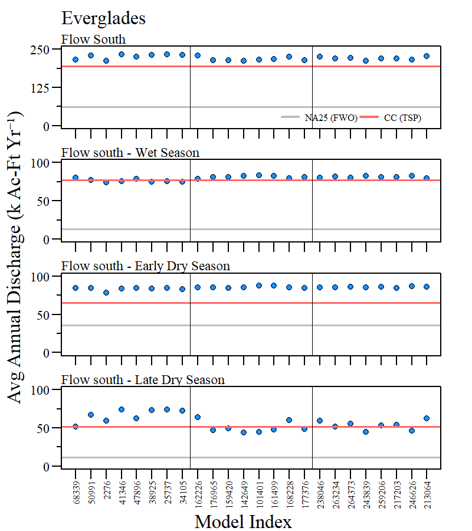

```{r setup, include=FALSE}
library(knitr)

options(htmltools.dir.version = FALSE)
knitr::opts_chunk$set(warning = FALSE, message = FALSE, echo=FALSE)

##
library(flextable)
library(magrittr)
library(plyr)
library(reshape2)

wd="C:/Julian_LaCie/_Github/LOSOM_ModelEval"

plot.path="C:/Julian_LaCie/_Github/LOSOM_ModelEval/Plots/"
export.path="C:/Julian_LaCie/_GitHub/LOSOM_ModelEval/Export/"
```

layout: true

<div class="my-footer">
<span>  </span>
</div>

---
name: title
class: left, middle

### Lake Okeechobee System Operating Manual

.pull-left[
#### Iteration 3 - Phase 2 Batch Analysis

*Sanibel-Captiva Conservation Foundation*

*Conservancy of Southwest Florida*

**DRAFT** - `r paste(format(as.Date("2021-10-22"),"%B %d, %Y"))#,"<br>(Updated:", format(as.Date(Sys.Date()),"%B %d, %Y"),")")`

]
<!-- this ends up being the title slide since seal = FALSE-->

.pull-right[
```{r ,fig.align="center",out.width="40%"}
knitr::include_graphics('./Plots/SCCF Logo knockout_c.png')
```

```{r ,fig.align="center",out.width="40%"}
knitr::include_graphics('./Plots/ConSWFL.jpeg')
```

]


```{r xaringanExtra, include=FALSE, warnint=FALSE}
# devtools::install_github("gadenbuie/xaringanExtra")
# xaringanExtra::use_webcam()
xaringanExtra::use_tile_view()
# xaringanExtra::use_scribble()
```
.footnote[
<!-- Paul Julian PhD<br>[`r fontawesome::fa("fas fa-envelope")`](mailto: pjulian@sccf.org) .small[pjulian@sccf.org] -->

.small[Use cursor keys for navigation, press .red["O"] for a slide .red[O]verview]

```{r} 
bsplus::bs_button(
    label = "Download PDF Version",
    button_type = "primary",
    button_size = "small") %>%
    htmltools::a(
      href = "https://sccf-tech.github.io/slides/LOSOM/SCCF_iter3_p1_v2.pdf"
      )
```
]

---
name: Goals

### Iteration 3 Goals 

* Goals presented by USACE focused on water supply (tribal, LOSA and LECSA), estuary and lake health, and moving more water to the southern Everglades (see USACE Technical Stakeholder Engagement - 16-17 Sept 2021 meeting presentation).

* For purposes of this analysis we focused on:
  * *Reduce stress to the Caloosahatchee River and Estuary*
  * *Help Lake ecology by addressing the duration and number of events above 17 feet*
  
* Initially CC was used as the foundation (Phase 1 of Iteration 3)

* After the initial alternative sensitivity runs (i.e.  Iteration 3, Phase 1), alternative CCR1 was considered for the next phase of Iteration 3 to build *"CCR2B"*
  
---
name: methods

### Iteration 3 - Run Screening

Using the RSM-BN Batch Runs spreadsheets (~240,000 runs)
.small[
* Runs were initially screened based on PM values relative to CC and NA25 (FWO)
  * Caloosahatchee optimal discharge (PM31)
  * Caloosahatchee stress discharge from LOK (PM37)
  * Caloosahatchee damaging discharge from LOK (PM38)
  * Caloosahatchee extreme discharge (PM36)
  * Percent LOK Stage >17 Ft NGVD29 (PM5)

* To narrow the data down, runs were subsetted based on PMs listed above relative to the CC value `r paste("\u00B1")` 5% (i.e. CC PM31 + 5%, CC PM37 - 5%, etc) than sorted and the 1st eight of each batch were retained 
]


*Example R Code*
```
b1.screen<-subset(dat,
                 PM31>CC.val$PM31*1.05&
                   PM37<CC.val$PM37*0.95&
                   PM38<CC.val$PM38*0.95&
                   PM36<CC.val$PM36*0.95&
                   PM5<CC.val$PM5*0.95&
                   batch==1)
b1.screen<-b1.screen[order(-b1.screen$PM31,b1.screen$PM37,
                           b1.screen$PM38,b1.screen$PM36,
                           b1.screen$PM5),]
b1.screen<-b1.screen[1:8,]
```
<br>
```{r}
dat=read.csv("C:/Julian_LaCie/_GitHub/LOSOM_ModelEval/Export/Iteration3/Iter3_P2_screen.csv")

library(downloadthis)

dat%>%
  download_this(
    output_name = "Iter3_Phase2_Screen",
    output_extension = ".xlsx",
    button_label = "Download Screened Data",
    button_type = "primary",
    has_icon = TRUE,
    icon = "fa fa-file-excel")
```
---
name: InitialScreen

### Iteration 3 - Phase 2 (Initial Screening)

```{r ,fig.align="center",out.width="60%"}

knitr::include_graphics('./Plots/Iteration3_Batch/CRE_screen.png')
```

---
name: InitialScreen2

### Iteration 3 - Phase 2

```{r ,fig.align="center",out.width="45%"}


```


---
name: Estuary

### Iteration 3 - Phase 2

```{r ,fig.align="center",out.width="64%"}


```


---
name: Lake Okeechobee

### Iteration 3 - Phase 2

```{r ,fig.align="center",out.width="60%"}

knitr::include_graphics('./Plots/Iteration3_Batch/LOK_subset.png')
```

---
name: Flow South

### Iteration 3 - Phase 2

```{r ,fig.align="center",out.width="60%"}


```

---
name: Conclusions

### Iteration 3 - Phase 2

* This is an initial look at the batch results and expect our evaluation to evolve with greater understanding.

* There appears to be several plans where we can balance the needs of system without adversely impacted other parts of the system. 