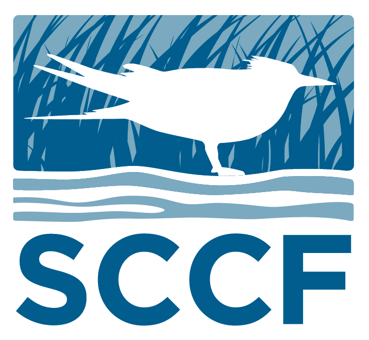

```{r setup, include=FALSE}
library(knitr)

options(htmltools.dir.version = FALSE)
knitr::opts_chunk$set(warning = FALSE, message = FALSE, echo=FALSE)

##
library(flextable)
library(magrittr)
library(plyr)
library(reshape2)

wd="C:/Julian_LaCie/_Github/LOSOM_ModelEval"

plot.path="C:/Julian_LaCie/_Github/LOSOM_ModelEval/Plots/"
export.path="C:/Julian_LaCie/_GitHub/LOSOM_ModelEval/Export/"
```

layout: true

<div class="my-footer">
<span>  </span>
</div>

---
name: title
class: left, middle

### Lake Okeechobee System Operating Manual


.pull-left[
#### Iteration 3 - Phase 2 Batch Analysis

*Sanibel-Captiva Conservation Foundation*

*Conservancy of Southwest Florida*

**DRAFT** - `r paste(format(as.Date("2021-11-16"),"%B %d, %Y"),"<br>(Updated:", format(as.Date(Sys.Date()),"%B %d, %Y"),")")`

]
<!-- this ends up being the title slide since seal = FALSE-->
  
.pull-right[
```{r ,fig.align="center",out.width="40%"}
    
```
    
```{r ,fig.align="center",out.width="40%"}
    knitr::include_graphics('./Plots/ConSWFL.jpeg')
```
    
]


```{r xaringanExtra, include=FALSE, warnint=FALSE}
# devtools::install_github("gadenbuie/xaringanExtra")
# xaringanExtra::use_webcam()
xaringanExtra::use_tile_view()
# xaringanExtra::use_scribble()
```
.footnote[
<!-- Paul Julian PhD<br>[`r fontawesome::fa("fas fa-envelope")`](mailto: pjulian@sccf.org) .small[pjulian@sccf.org] -->

.small[Use cursor keys for navigation, press .red["O"] for a slide .red[O]verview]

```{r} 
bsplus::bs_button(
    label = "Download PDF Version",
    button_type = "primary",
    button_size = "small") %>%
    htmltools::a(
      href = "https://sccf-tech.github.io/slides/LOSOM/SCCF_iter3_p1_tsp.pdf"
      )
```
]

---
name: table


### Iteration 3 - Phase 2

```{r,echo=F}
vars=c(paste0("PM",c(30,31,37,38,36,80,81,86,87,85,79,117,88,40,39,20,5,6)),"total.pen")
PM.xwalk=data.frame(PM=vars,
                    Descript=c(paste("CRE",c("Low","Optimum","Stress from LOK","Damaging from LOK","Extreme"),sep=" - "),
                               paste("SLE",c("Low","Optimum","Stress from LOK","Damaging from LOK","Extreme"),sep=" - "),"CRE - Months >6500 cfs","SLE - Months >4000 cfs",
                               "S308 Regulatory Flow","S77 Regulatory Flow","CRE MFL","LOK MFL","LOK >17 Ft","LOK >16 Ft","LOK - Total Stage Envelope Penalty"))
PM.xwalk$Descript2=with(PM.xwalk,paste0(Descript," (",ifelse(PM=="total.pen","PM10+PM11",PM),")"))
PM.xwalk$variable=paste0(PM.xwalk$PM,".FWO")

base.tsp=read.csv(paste0(export.path,"Iteration3/Iter3P2_tsp.csv"))
base.tsp[,2:ncol(base.tsp)]=sapply(base.tsp[,2:ncol(base.tsp)],FUN=function(x) as.numeric(sub("%","",x)))

tmp.dat=subset(base.tsp,Index%in%c("CC","260467"))

FWO.compare=data.frame(Index=tmp.dat$Index)
for(i in 1:length(vars)){
FWO.val=subset(base.tsp,Index=="NA25")[,vars[i]]
val=((tmp.dat[,vars[i]]-FWO.val)/FWO.val)*100
tmp=data.frame(val=val)
colnames(tmp)=paste0(vars[i],".FWO")
FWO.compare=cbind(FWO.compare,tmp)
}
# FWO.compare

PM.xwalk2=subset(PM.xwalk,!(variable%in%c(paste0("PM",c(39,20,5,6),".FWO"))))

FWO.compare2=reshape2::melt(FWO.compare,id.vars="Index")
FWO.compare2=merge(FWO.compare2,PM.xwalk[,c("variable","Descript2")])
FWO.compare2=subset(FWO.compare2,!(variable%in%c(paste0("PM",c(39,20,5,6),".FWO"))))

FWO.compare2.xtab=reshape2::dcast(FWO.compare2,Descript2~Index,value.var = "value",fun.aggregate=function(x) round(mean(x),1))
FWO.compare2.xtab=FWO.compare2.xtab[,c("Descript2",tmp.dat$Index)]
FWO.compare2.xtab=FWO.compare2.xtab[match(PM.xwalk2$Descript2,FWO.compare2.xtab$Descript2),]

```

.pull-left[
```{r,echo=F}
FWO.compare2.xtab%>%
  flextable()%>%
  padding(padding=1,part="all")%>%
  fontsize(size=7,part="body")%>%
  fontsize(size=8,part="header")%>%
  font(fontname="Times New Roman",part="all")%>%
  autofit()%>%
  set_header_labels("Descript2"="Performance Measure")%>%
  add_header("CC"="Model Index",
             "260467"="Model Index")%>%
  bg(i=~Descript2%in%subset(PM.xwalk,PM%in%c(paste0("PM",c(31,37,38,86,87,88))))$Descript2,j=3,bg="yellow")%>%
  merge_h(part="header")%>%
  align(align="center",part="header")%>%
  align(align="center",part="all")%>%
  align(j=1,align="left",part="all")%>%
  footnote(j=1,part="header",ref_symbols = "",value=as_paragraph("Percent Difference relative to FWO (NA25)"))%>%
  font(fontname="Times New Roman",part="all")

```
]

.pull-right[

* The selected plan (Model Index 260467) provides substantial reduction in SLE regulatory discharges, SLE stress and damaging from the Lake salinity envelope counts.

* This plan also increases CRE optimum and reduces CRE stress and damaging from the Lake salinity envelope counts.

]
---
name: estuary


### Salinity Envelope

```{r ,fig.align="center",out.width="64%"}


```

---
name: estuary


### Salinity Envelope - Baselines

```{r ,fig.align="center",out.width="64%"}


```

---
name: estuary


### Salinity Envelope - Extreme Discharges

```{r ,fig.align="center",out.width="75%"}


```

---
name: estuary


### Salinity Envelope - Extreme Discharges

```{r ,fig.align="center",out.width="75%"}


```

---
name: estuary


### Salinity Envelope - Extreme Discharges

```{r ,fig.align="center",out.width="100%"}


```

* Based on daily discharges >6500 cfs
* Can have more counts of LOK events/duration than Basin + LOK (see event >90 days)

---
name: estuary


### Salinity Envelope - Extreme Discharges

* Example of >90 Day (106 days) extreme event observed in the simulation period of record.

```{r ,fig.align="center",out.width="100%"}


```


---
name: estuary


### Salinity Envelope - Extreme Discharges

```{r ,fig.align="center",out.width="75%"}


```

---
name: reg flow

### Regulatory Discharges

```{r ,fig.align="center",out.width="100%"}


```

---
name: reg flow


### Regulatory Discharges

```{r ,fig.align="center",out.width="100%"}


```

---
name: ZoneD

### Lake Okeechobee Regulation Schedule
```{r ,fig.align="center",out.width="90%",fig.cap="Percent of time above, within, and below Zone D of the regulation schedule."}


```

---
name: ZoneD

### Lake Okeechobee Regulation Schedule
```{r ,fig.align="center",out.width="65%",fig.cap="Distribution of S79 (Lake + Basin) daily discharges relative to above, within, and below Zone D of the regulation schedule."}


```

---
name: ZoneD

### Lake Okeechobee Regulation Schedule
```{r ,fig.align="center",out.width="65%",fig.cap="Distribution of S80 (Lake + Basin) daily discharges relative to above, within, and below Zone D of the regulation schedule."}

knitr::include_graphics('./Plots/Iteration3_Batch_TSP/TSP_S80Q_zones.png')
```


---
name: Lake


### Lake Okeechobee

```{r ,fig.align="center",out.width="60%"}


```

---
name: Lake


### Lake Okeechobee

```{r ,fig.align="center",out.width="90%"}


```

```{r ,fig.align="center",out.width="90%"}


```

---
name: Lake


### Lake Okeechobee - High Stage Events

```{r ,fig.align="center",out.width="80%"}


```
