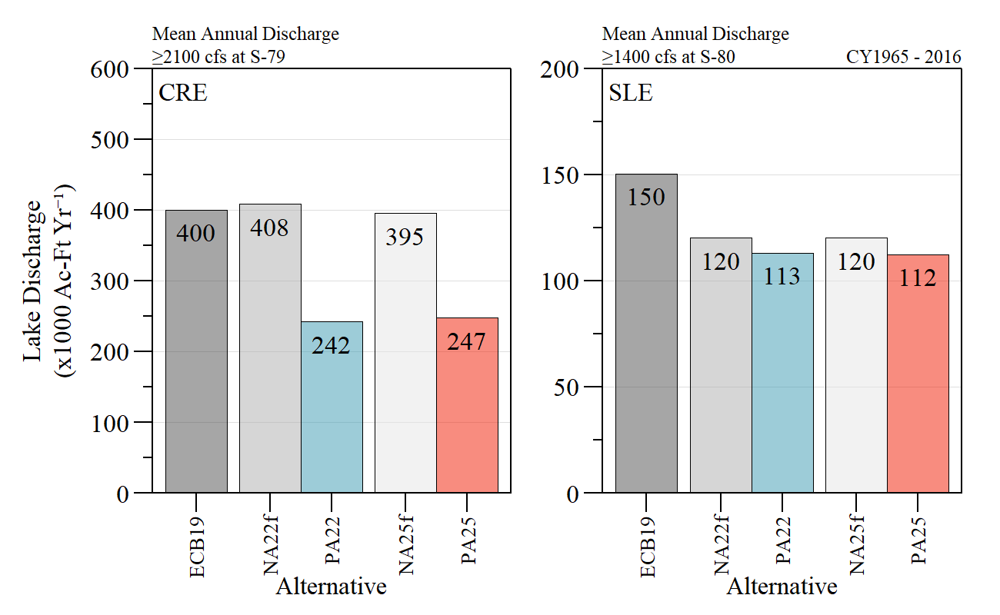

```{r setup, include=FALSE}
## Data Analysis source: ./src/iter3_array_eval.R

library(knitr)

options(htmltools.dir.version = FALSE)
knitr::opts_chunk$set(warning = FALSE, message = FALSE, echo=FALSE)

##
library(flextable)
library(magrittr)
library(plyr)
library(reshape2)

wd="C:/Julian_LaCie/_Github/LOSOM_ModelEval"

plot.path="C:/Julian_LaCie/_Github/LOSOM_ModelEval/Plots/"
export.path="C:/Julian_LaCie/_GitHub/LOSOM_ModelEval/Export/"

##
##
alts.sort2=c("ECB19","NA22f","PA22","NA25f","PA25")
```

layout: true

<div class="my-footer">
<span>  </span>
</div>

---
name: title
class: left, middle

### Lake Okeechobee System Operating Manual

.pull-left[
#### Iteration 3 Modeling Evaluation - Preferred Alternative

*Sanibel-Captiva Conservation Foundation*

*Conservancy of Southwest Florida*

**DRAFT** - `r paste(format(as.Date("2021-12-14"),"%B %d, %Y") ,"<br>(Updated:", format(as.Date(Sys.Date()),"%B %d, %Y"),")")`

]
<!-- this ends up being the title slide since seal = FALSE-->

.pull-right[
```{r ,fig.align="center",out.width="40%"}
knitr::include_graphics('./Plots/SCCF Logo knockout_c.png')
```

```{r ,fig.align="center",out.width="40%"}
knitr::include_graphics('./Plots/ConSWFL.jpeg')
```

]


```{r xaringanExtra, include=FALSE, warnint=FALSE}
# devtools::install_github("gadenbuie/xaringanExtra")
# xaringanExtra::use_webcam()
xaringanExtra::use_tile_view()
# xaringanExtra::use_scribble()
```
.footnote[
Paul Julian PhD<br>[`r fontawesome::fa("fas fa-envelope")`](mailto: pjulian@sccf.org) .small[pjulian@sccf.org]

.small[Use cursor keys for navigation, press .red["O"] for a slide .red[O]verview]

```{r} 
bsplus::bs_button(
    label = "Download PDF Version",
    button_type = "primary",
    button_size = "small") %>%
    htmltools::a(
      href = "https://github.com/SwampThingPaul/LOSOM_ModelEval/raw/main/SCCF_iter3_prefalt.pdf"
      )
```
]
---
name: alternatives

### Iteration 3 - Model runs

```{r}

data.frame(Alternative=c("ECB19","NA22f","NA25f","PA22","PA25"),
           Description=c(
             "LOSOM Existing Conditions Baseline 2019 with LORS08",
             "LOSOM No Action 2022 (without C43 Reservoir) with LORS08",
             "LOSOM No Action 2025 (with C43 Reservoir) with LORS08",
             "Preferred Alterative 2022. Distinct operational zones and regulatory disharge rates selected based on LOSOM objectives (without C43 Reservoir)",
             "Preferred Alterative 2025. Distinct operational zones and regulatory disharge rates selected based on LOSOM objectives (with C43 Reservoir)"
           ))%>%
  flextable()%>%
  colformat_char(na_str="---")%>%
  width(width=c(1,5))%>%
  padding(padding=0.1,part="all")%>%
  font(fontname="Times New Roman",part="all")%>%
  fontsize(size=10,part="body")%>%
  fontsize(size=12,part="header")%>%
  bold(part="header")%>%
  footnote(i=c(1,2,3),j=1,
           value=as_paragraph(c("Existing Conditions Baseline 2019","No Action Condition 2022", "No Action Condition 2025")),
           ref_symbols = c(" 1 "," 2 "," 3"),part="body")
  
```

---
name: SalEnv1

### Salinity Envelope
```{r ,fig.align="center",out.width="100%",fig.cap="RECOVER salinity envelope evaluation during the simulation period of record for Caloosahatchee (top) and St Lucie (bottom) estuaries."}
knitr::include_graphics('./Plots/Iteration3_Final/RECOVER_SalEnv_.png')
```

---
name: SalEnv2

### Salinity Envelope
```{r ,fig.align="center",out.width="100%",fig.cap="RECOVER salinity envelope evaluation relative to each respective FWO/No Action Alterantives during the simulation period of record for Caloosahatchee (top) and St Lucie (bottom) estuaries."}
knitr::include_graphics('./Plots/Iteration3_Final/RECOVER_SalEnv_FWO.png')
```

---
name: SalEnv_table


```{r}
tmp=read.csv(paste0(export.path,"Iteration3/PrefAlt/SalEnv.csv"))

vars.CRE=paste("CRE",c("low.count","opt.count","high.LOK.count","dam.LOK.count","high3.count"),sep=".")
vars.SLE=paste("SLE",c("low.count","opt.count","high.LOK.count","dam.LOK.count","high2.count"),sep=".")

salenv.cnt.dat=reshape2::dcast(tmp,Alt~variable,value.var = "value",sum)
CRE.sal.env=salenv.cnt.dat[,c("Alt",vars.CRE),]
CRE.sal.env$Area="CRE"
CRE.sal.env=CRE.sal.env[,c(7,1:6)]
colnames(CRE.sal.env)=c("Area","Alt","low","opt","stress.lok","dam.lok","high")
CRE.sal.env=CRE.sal.env[match(alts.sort2,CRE.sal.env$Alt),]

SLE.sal.env=salenv.cnt.dat[,c("Alt",vars.SLE),]
SLE.sal.env$Area="SLE"
SLE.sal.env=SLE.sal.env[,c(7,1:6)]
colnames(SLE.sal.env)=c("Area","Alt","low","opt","stress.lok","dam.lok","high")
SLE.sal.env=SLE.sal.env[match(alts.sort2,SLE.sal.env$Alt),]

rbind(CRE.sal.env,SLE.sal.env)%>%
  flextable()%>%
  merge_v(j=1)%>%
  fix_border_issues()%>%
  valign(j=1,valign="top")%>%
  hline(i=5)%>%
  set_header_labels("low"="Low\nEvents",
                    "opt"="Optimum\nEvents",
                    "stress.lok"="Stress Events from LOK",
                    "dam.lok"="Damaging Events from LOK",
                    "high"="Extreme Events")%>%
  padding(padding=1,part="all")%>%
  font(fontname="Times New Roman",part="all")%>%
  fontsize(size=9,part="body")%>%
  fontsize(size=10,part="header")%>%
  align(j=3:7,align="center",part="all")%>%
  footnote(i=c(1,6),j=1,value=as_paragraph("CRE: Caloosahatchee Estuary; SLE: St Lucie Estuary"),ref_symbols=" 1 ",inline = T)%>%
  footnote(j=c(3),part="header",value=as_paragraph(as_b("Low Flows"), " CRE: < 750 cfs; SLE: < 150 cfs"),ref_symbols=" ",inline = F)%>%
  footnote(j=c(4),part="header",value=as_paragraph(as_b("Optimum Flows")," CRE: \u2265 750 cfs & < 2100 cfs; SLE: \u2265 150 cfs & < 1400 cfs cfs"),ref_symbols=" ")%>%
  footnote(j=c(5),part="header",value=as_paragraph(as_b("Stressful Flows")," CRE: \u2265 2100 cfs & < 2600 cfs; SLE: \u2265 1400 cfs & < 1700 cfs"),ref_symbols=" ")%>%
  footnote(j=c(7),part="header",value=as_paragraph(as_b("Damaging Flows")," CRE: > 2600 cfs; SLE:> 1700 cfs"),ref_symbols=" ")%>%
  footnote(j=c(1),part="header",value=as_paragraph(as_b("Data Source:")," USACE and SFWMD Interagency Modeling Center."),ref_symbols=" ")%>%
  font(fontname="Times New Roman",part="all")%>%
  # bold(j=9:14,part="body")%>%
  fontsize(size=9,part="body")%>%
  set_caption(caption="RECOVER Estuary salinit envelope 14-day period count of low, optimum, stress, damaging and extreme flow events for Caloosatchee and St Lucie estuaries based on 14-day moving average discharge data. ")

```


---
name: SalEnv4

### Salinity Envelope
```{r ,fig.align="center",out.width="100%",fig.cap="Monthly salinity envelope evaluation during the simulation period of record for Caloosahatchee (top) and St Lucie (bottom) estuaries."}

```

---
name: SalEnv5

### Salinity Envelope
```{r ,fig.align="center",out.width="100%",fig.cap="Monthly salinity envelope evaluation relative to each respective FWO/No Action Alterantives during the simulation period of record for Caloosahatchee (top) and St Lucie (bottom) estuaries."}

```

---
name: CREQ1

### CRE Discharge
```{r ,fig.align="center",out.width="90%",fig.cap="Comparing monthly average discharge at S79 between NA22f and PA22."}

```

---
name: CREQ2

### CRE Discharge
```{r ,fig.align="center",out.width="90%",fig.cap="Comparing monthly average discharge at S79 between NA25f and PA25."}

```

---
name: CREQ3

### CRE Discharge
```{r ,fig.align="center",out.width="50%",fig.cap="Seasonality of monthly average discharge across all alternatives."}

```

---
name: CREQ4

### CRE Discharge
```{r ,fig.align="center",out.width="95%",fig.cap="Calendar plot of monthly average S-79 discharge."}
knitr::include_graphics('./Plots/Iteration3_Final/MonthQ_S79_cat.png')
```

---
name: RegQ

### Regulatory Discharge
```{r ,fig.align="center",out.width="100%",fig.cap="Average annual flood control (i.e. regulatory) discharges for each major flow-path."}

```

---
name: RegQ2

### Regulatory Discharge
```{r ,fig.align="center",out.width="100%",fig.cap="Average annual lake sourced discharges to CRE and SLE within stressful and damaging discharges."}

```

---
name: ZoneD

### Lake Okeechobee Regulation Schedule
```{r ,fig.align="center",out.width="90%",fig.cap="Percent of time (period of simulation) above, within and below Zone D."}

```

---
name: ZoneD2
class: middle

### Lake Okeechobee Regulation Schedule
```{r ,fig.align="center",out.width="110%",fig.cap="Distribution of daily discharge at S79 above, within and below Zone D."}

```

---
name: LOK

### Lake Okeechobee 
```{r ,fig.align="center",out.width="50%",fig.cap="Percent of time LOK stage above 17 Ft, 16 Ft and below 10 Ft NGVD29"}

```

---
name: LOK

### Lake Okeechobee 
```{r ,fig.align="center",out.width="100%",fig.cap="Timeline of annual LOK max stage > 17 Ft NGVD29."}

```

---
name: LOK2

### Lake Okeechobee - Stage Envelope

```{r ,fig.align="center",out.width="100%",fig.cap="Normal and recovery ecological stage envelope timeline for each alternative."}

```

---
name: LOK3

### Lake Okeechobee - Stage Envelope

```{r ,fig.align="center",out.width="80%",fig.cap="LOK ecological stage envelope total scores (all years)."}

```

---
name: LOK4

### Lake Okeechobee - Stage Envelope

```{r ,fig.align="center",out.width="80%",fig.cap="LOK ecological stage envelope total scores (all years, May to September)."}

```

---
name: LOK5

### Lake Okeechobee - High Stage Events

```{r ,fig.align="center",out.width="80%"}

knitr::include_graphics('./Plots/Iteration3_Final/LOK_highstg_events.png')
```

---
name: LOK6

### Lake Okeechobee - weekly recession
```{r ,fig.align="center",out.width="100%",fig.cap="Calendar plot of LOK weekly recession rates (all years and days)."}

```

---
name: LOK6

### Lake Okeechobee - weekly recession
```{r ,fig.align="center",out.width="100%",fig.cap="Calendar plot of LOK weekly recession rates specific to SNKI nesting period."}

```
