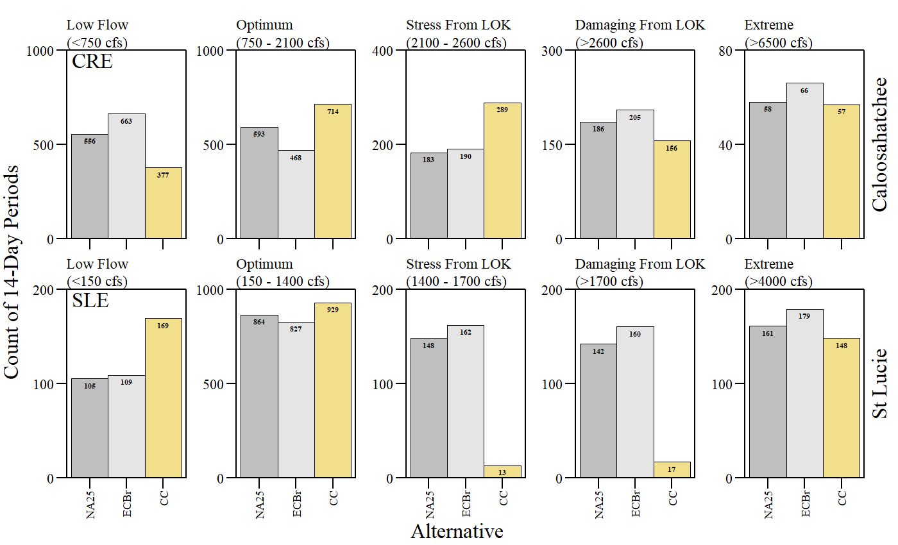
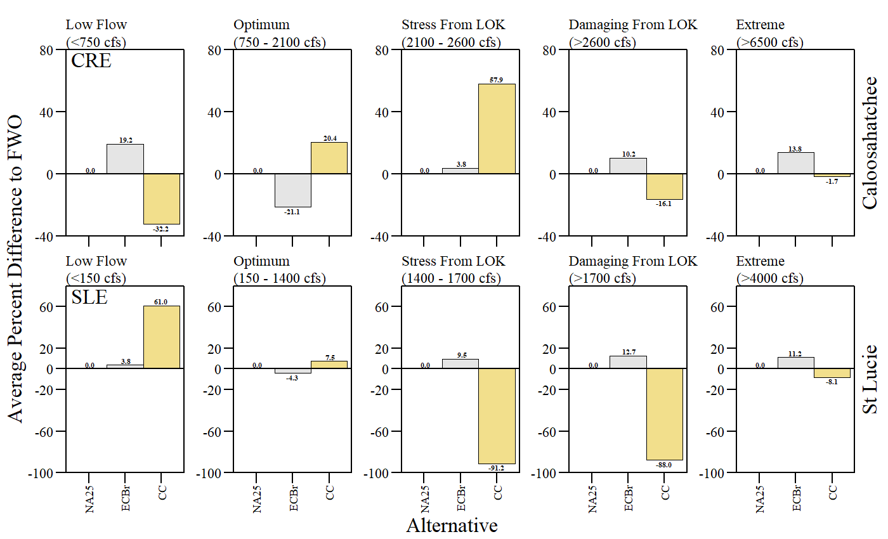

```{r setup, include=FALSE}
library(knitr)

options(htmltools.dir.version = FALSE)
knitr::opts_chunk$set(warning = FALSE, message = FALSE, echo=FALSE)

##
library(flextable)
library(magrittr)
library(plyr)
library(reshape2)

wd="C:/Julian_LaCie/_Github/LOSOM_ModelEval"

plot.path="C:/Julian_LaCie/_Github/LOSOM_ModelEval/Plots/"
export.path="C:/Julian_LaCie/_GitHub/LOSOM_ModelEval/Export/"

##
alts.sort=c("NA25","ECBr","CC")
```

layout: true

<div class="my-footer">
<span>  </span>
</div>

---
name: title
class: left, middle

### Lake Okeechobee System Operating Manual

.pull-left[
#### POST Iteration 2 Modeling Evaluation

*Sanibel-Captiva Conservation Foundation*

*Conservancy of Southwest Florida*

**DRAFT** - `r paste(format(as.Date("2021-08-12"),"%B %d, %Y"),"<br>(Updated:", format(as.Date(Sys.Date()),"%B %d, %Y"),")")`

]
<!-- this ends up being the title slide since seal = FALSE-->

.pull-right[
```{r ,fig.align="center",out.width="40%"}
knitr::include_graphics('./Plots/SCCF Logo knockout_c.png')
```

```{r ,fig.align="center",out.width="40%"}
knitr::include_graphics('./Plots/ConSWFL.jpeg')
```

]


```{r xaringanExtra, include=FALSE, warnint=FALSE}
# devtools::install_github("gadenbuie/xaringanExtra")
# xaringanExtra::use_webcam()
xaringanExtra::use_tile_view()
# xaringanExtra::use_scribble()
```
.footnote[
Paul Julian PhD<br>[`r fontawesome::fa("fas fa-envelope")`](mailto: pjulian@sccf.org) .small[pjulian@sccf.org]

.small[Use cursor keys for navigation, press .red["O"] for a slide .red[O]verview]

```{r} 
bsplus::bs_button(
    label = "Download PDF Version",
    button_type = "primary",
    button_size = "small") %>%
    htmltools::a(
      href = "https://github.com/SwampThingPaul/LOSOM_ModelEval/raw/main/SCCF_postiter2_sum.pdf"
      )
```
]
---
name: USACE CRE
class: middle


```{r ,fig.align="center"}
tb.dat=read.csv(paste0(export.path,"post_iter2_estsum.csv"))

tb.dat%>%
  flextable()%>%
  colformat_double(j=3,digits=0)%>%
  colformat_double(j=8:12,digits=1,na_str = " ")%>%
  merge_v(j=1)%>%
  fix_border_issues()%>%
  valign(j=1,valign="top")%>%
  vline(j=7)%>%
  hline(i=3)%>%
  set_header_labels(
    "region"="Estuary",
    "RegFlow"="Regulatory Flows (kacft/yr)",
    "high_LOK"="Stress Events From LOK",
    "high_basin"="Stress Events From Basin",
    "dam_LOK"="Damaging Events From LOK",
    "dam_basin"="Damaging Events From Basin",
    "PerFWO_RegFlow"="Regulatory Flows (kacft/yr)",
    "PerFWO_high_LOK"="Stress Events From LOK",
    "PerFWO_high_basin"="Stress Events From Basin",
    "PerFWO_dam_LOK"="Damaging Events From LOK",
    "PerFWO_dam_basin"="Damaging Events From Basin")%>%
  add_header(
    "RegFlow"="Summarized Data",
   "high_LOK"="Summarized Data",
   "high_basin"="Summarized Data",
   "dam_LOK"="Summarized Data",
   "dam_basin"="Summarized Data",
   "PerFWO_RegFlow"="Percent Different from FWO",
   "PerFWO_high_LOK"="Percent Different from FWO",
   "PerFWO_high_basin"="Percent Different from FWO",
   "PerFWO_dam_LOK"="Percent Different from FWO",
   "PerFWO_dam_basin"="Percent Different from FWO")%>%
  merge_h(part="header")%>%
  align(align="center",part="header")%>%
  padding(padding=1,part="all")%>%
  fontsize(size=9,part="body")%>%
  fontsize(size=10,part="header")%>%
  align(j=3:12,align="center",part="body")%>%
  bg(i=c(1,4),j=8:12,bg="grey")%>%
  bg(i=~PerFWO_RegFlow<0,j=8,bg="lightgreen")%>%bg(i=~PerFWO_RegFlow>0,j=8,bg="tomato")%>%
  bg(i=~PerFWO_high_LOK<0,j=9,bg="lightgreen")%>%bg(i=~PerFWO_high_LOK>0,j=9,bg="tomato")%>%
  bg(i=~PerFWO_high_basin<0,j=10,bg="lightgreen")%>%bg(i=~PerFWO_high_basin>0,j=10,bg="tomato")%>%
  bg(i=~PerFWO_dam_LOK<0,j=11,bg="lightgreen")%>%bg(i=~PerFWO_dam_LOK>0,j=11,bg="tomato")%>%
  bg(i=~PerFWO_dam_basin<0,j=12,bg="lightgreen")%>%bg(i=~PerFWO_dam_basin>0,j=12,bg="tomato")%>%
  width(width=c(0.5,0.5,0.75,0.75,0.75,1,1,0.75,0.75,0.75,1,1))%>%
  footnote(i=c(1,4),j=1,value=as_paragraph("CRE: Caloosahatchee Estuary; SLE: St Lucie Estuary"),ref_symbols=" 1 ")%>%
  footnote(i=c(1,4),j=2,value=as_paragraph("NA25 = Future without project (FWO)"),ref_symbols=" 2 ")%>%
  footnote(j=c(4,5,9,10),part="header",value=as_paragraph("Stressful Flows:\nCRE: \u2265 2100 cfs & < 2600 cfs\nSLE: \u2265 1400 cfs & < 1700 cfs"),ref_symbols=" 3 ")%>%
  footnote(j=c(6,7,11,12),part="header",value=as_paragraph("Damaging Flows:\nCRE: > 2600 cfs\nSLE:> 1700 cfs"),ref_symbols=" 4 ")%>%
  font(fontname="Times New Roman",part="all")%>%
  bold(j=8:12,part="body")

 #dim(test)
```

.footnote[
.small[**Data Source:** USACE and SFWMD Interagency Modeling Center]
]

---
name: REC1


### RECOVER Metric

```{r ,fig.align="center",out.width="100%",fig.cap="RECOVER salinity envelope evaluation during the simulation period of record for Caloosahatchee (top) and St Lucie (bottom) estuaries."}


```

---
name: REC2


### RECOVER Metric

```{r ,fig.align="center",out.width="100%",fig.cap="RECOVER salinity envelope evaluation relative to FWO (NA25) during the simulation period of record for Caloosahatchee (top) and St Lucie (bottom) estuaries."}


```

---
name: LakeQ


### Lake Discharges

```{r ,fig.align="center",out.width="100%",fig.cap="Average annual lake discharge volume over the simulation period of record when stress and damaging discharge at S79 and S80, respectively." }


```

---
name: Flood


### Flood control discharges

```{r ,fig.align="center",out.width="100%",fig.cap="Average annual flood control discharges from Lake Okeechobee to Water Conservation Areas and Northern Estuaries over the simulation period of record." }


```

---
name: Loads


### Load
.pull-left[
```{r ,fig.align="center",out.width="120%" }


```
]

.pull-right[
Average percent difference from FWO (NA25) for discharge and estimated nutrient loads over the May 1965 - April 2016 (FL WY 1966 - 2016) period of simulation.

]