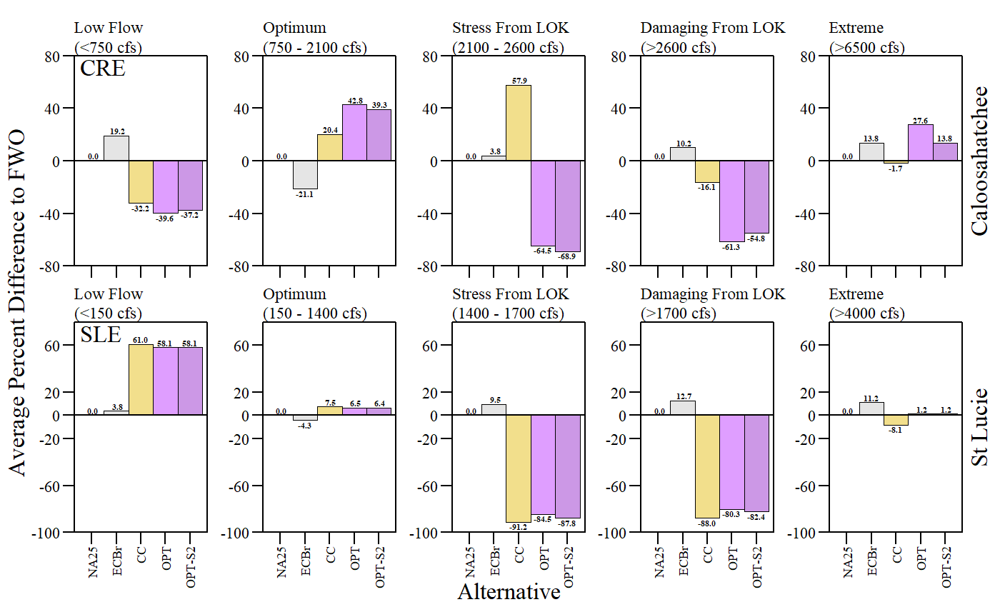
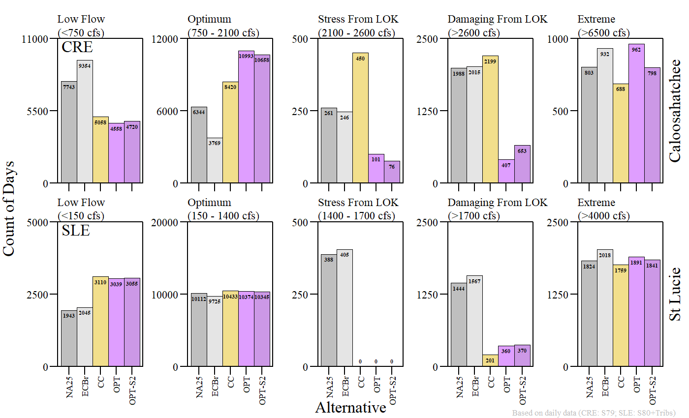
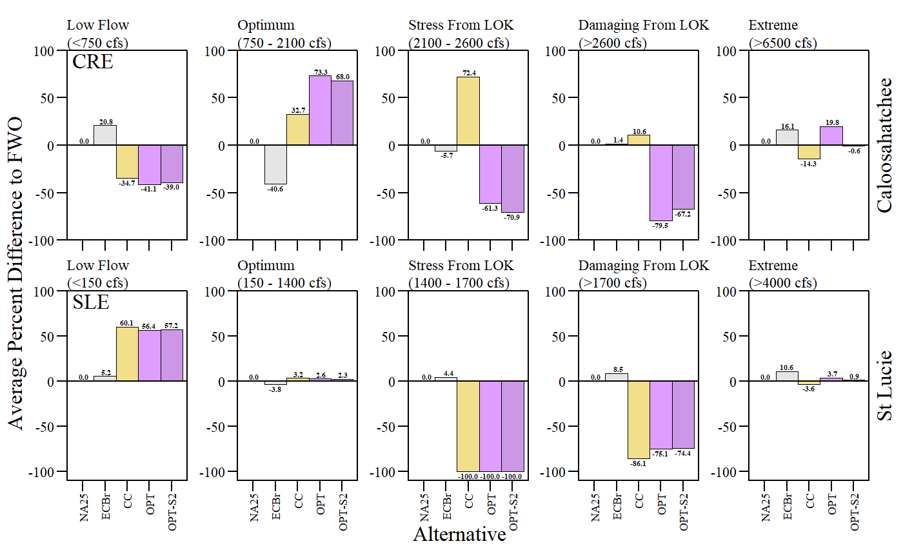
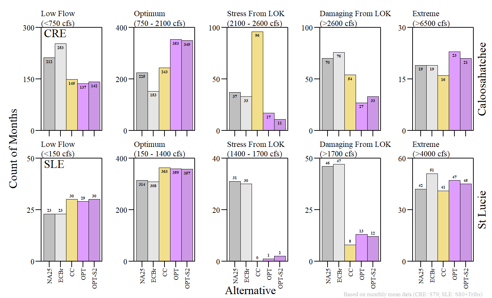
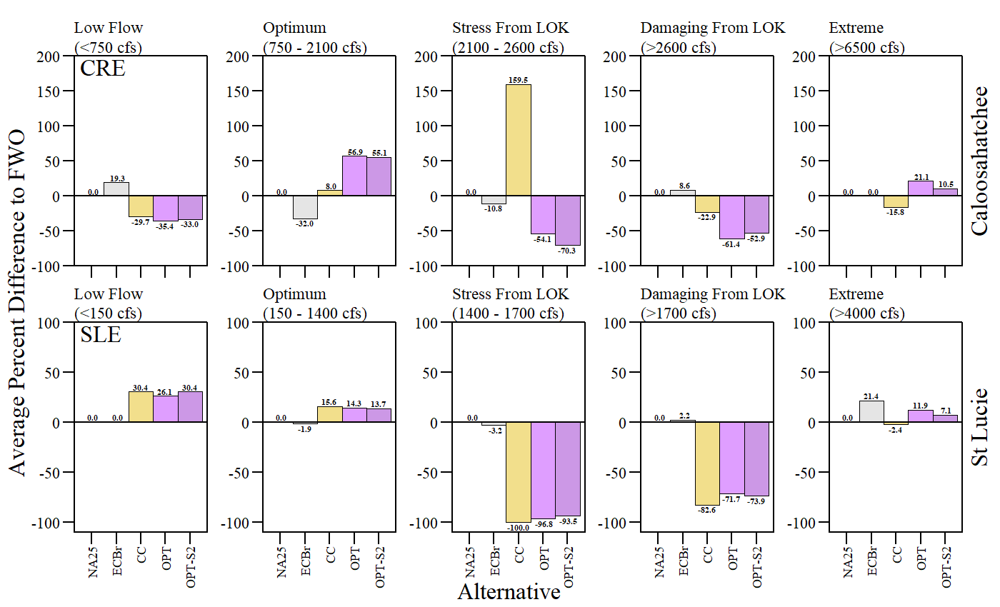
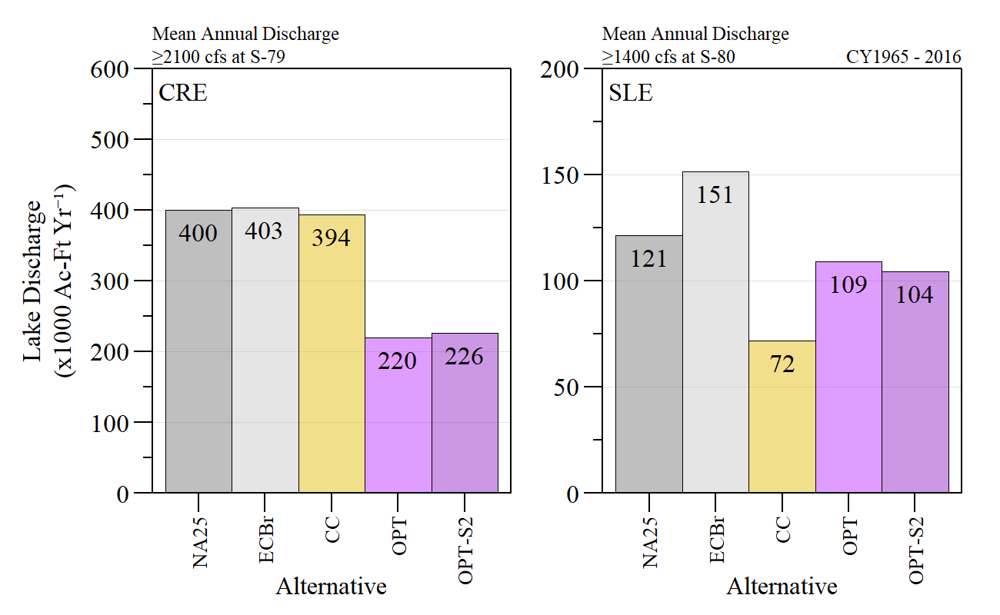
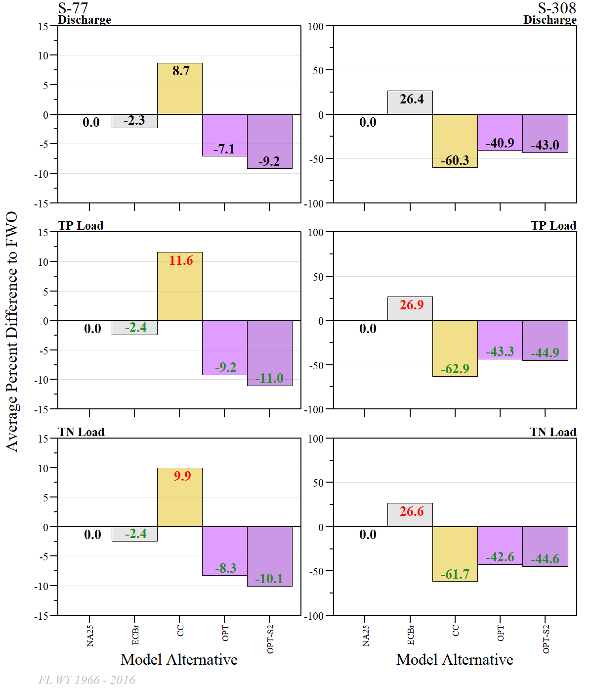

```{r setup, include=FALSE}
library(knitr)

options(htmltools.dir.version = FALSE)
knitr::opts_chunk$set(warning = FALSE, message = FALSE, echo=FALSE)

##
library(flextable)
library(magrittr)
library(plyr)
library(reshape2)

wd="C:/Julian_LaCie/_Github/LOSOM_ModelEval"

plot.path="C:/Julian_LaCie/_Github/LOSOM_ModelEval/Plots/"
export.path="C:/Julian_LaCie/_GitHub/LOSOM_ModelEval/Export/"

##
alts.sort=c("NA25","ECBr","CC")
```

layout: true

<div class="my-footer">
<span>  </span>
</div>

---
name: title
class: left, middle

### Lake Okeechobee System Operating Manual

.pull-left[
#### POST Iteration 2 Modeling Evaluation

*Sanibel-Captiva Conservation Foundation*

*Conservancy of Southwest Florida*

**DRAFT** - `r paste(format(as.Date("2021-08-23"),"%B %d, %Y"),"<br>(Updated:", format(as.Date(Sys.Date()),"%B %d, %Y"),")")`

]
<!-- this ends up being the title slide since seal = FALSE-->

.pull-right[
```{r ,fig.align="center",out.width="40%"}
knitr::include_graphics('./Plots/SCCF Logo knockout_c.png')
```

```{r ,fig.align="center",out.width="40%"}
knitr::include_graphics('./Plots/ConSWFL.jpeg')
```

]


```{r xaringanExtra, include=FALSE, warnint=FALSE}
# devtools::install_github("gadenbuie/xaringanExtra")
# xaringanExtra::use_webcam()
xaringanExtra::use_tile_view()
# xaringanExtra::use_scribble()
```
.footnote[
Paul Julian PhD<br>[`r fontawesome::fa("fas fa-envelope")`](mailto: pjulian@sccf.org) .small[pjulian@sccf.org]

.small[Use cursor keys for navigation, press .red["O"] for a slide .red[O]verview]

```{r} 
bsplus::bs_button(
    label = "Download PDF Version",
    button_type = "primary",
    button_size = "small") %>%
    htmltools::a(
      href = "https://sccf-tech.github.io/slides/LOSOM/SCCF_postiter2_sum_opt.pdf"
      )
```
]

---
name: Reg

### Regulation Schedule

```{r ,fig.align="center",out.width="100%",fig.cap="Regulation Schedule with zones identified for CC and OPT"}


```

---
name: CREMFL

### Caloosahatchee MFL

```{r ,fig.align="center",out.width="80%",fig.cap="Minimum flow and levels evaluation for the Caloosahatchee River Estuary for alternative 'OPT' during the simulated period of record."}


```

---
name: CREMFL

### Caloosahatchee MFL

```{r ,fig.align="center",out.width="80%",fig.cap="Minimum flow and levels evaluation for the Caloosahatchee River Estuary for alternative 'OPT-S2' during the simulated period of record."}


```

---
name: CREMFL

### Caloosahatchee MFL

```{r ,fig.align="center",out.width="100%",fig.cap="Comparison of MFL exceedances across FWO, ECB, CC and OPT during the simulated period of record. Percentage within bar represents percent difference relative to FWO."}


```

---
name: USACE CRE
class: middle


```{r ,fig.align="center"}
tb.dat=read.csv(paste0(export.path,"post_iter2_estsum_Iter2Opt.csv"))

tb.dat%>%
  flextable()%>%
  colformat_double(j=3,digits=0)%>%
  colformat_double(j=8:12,digits=1,na_str = " ")%>%
  merge_v(j=1)%>%
  fix_border_issues()%>%
  valign(j=1,valign="top")%>%
  vline(j=7)%>%
  hline(i=5)%>%
  set_header_labels(
    "region"="Estuary",
    "RegFlow"="Regulatory Flows (kacft/yr)",
    "high_LOK"="Stress Events From LOK",
    "high_basin"="Stress Events From Basin",
    "dam_LOK"="Damaging Events From LOK",
    "dam_basin"="Damaging Events From Basin",
    "PerFWO_RegFlow"="Regulatory Flows (kacft/yr)",
    "PerFWO_high_LOK"="Stress Events From LOK",
    "PerFWO_high_basin"="Stress Events From Basin",
    "PerFWO_dam_LOK"="Damaging Events From LOK",
    "PerFWO_dam_basin"="Damaging Events From Basin")%>%
  add_header(
    "RegFlow"="Summarized Data",
   "high_LOK"="Summarized Data",
   "high_basin"="Summarized Data",
   "dam_LOK"="Summarized Data",
   "dam_basin"="Summarized Data",
   "PerFWO_RegFlow"="Percent Different from FWO",
   "PerFWO_high_LOK"="Percent Different from FWO",
   "PerFWO_high_basin"="Percent Different from FWO",
   "PerFWO_dam_LOK"="Percent Different from FWO",
   "PerFWO_dam_basin"="Percent Different from FWO")%>%
  merge_h(part="header")%>%
  align(align="center",part="header")%>%
  padding(padding=1,part="all")%>%
  fontsize(size=8,part="body")%>%
  fontsize(size=9,part="header")%>%
  align(j=3:12,align="center",part="body")%>%
  bg(i=c(1,6),j=8:12,bg="grey")%>%
  bg(i=~PerFWO_RegFlow<0,j=8,bg="lightgreen")%>%bg(i=~PerFWO_RegFlow>0,j=8,bg="tomato")%>%
  bg(i=~PerFWO_high_LOK<0,j=9,bg="lightgreen")%>%bg(i=~PerFWO_high_LOK>0,j=9,bg="tomato")%>%
  bg(i=~PerFWO_high_basin<0,j=10,bg="lightgreen")%>%bg(i=~PerFWO_high_basin>0,j=10,bg="tomato")%>%
  bg(i=~PerFWO_dam_LOK<0,j=11,bg="lightgreen")%>%bg(i=~PerFWO_dam_LOK>0,j=11,bg="tomato")%>%
  bg(i=~PerFWO_dam_basin<0,j=12,bg="lightgreen")%>%bg(i=~PerFWO_dam_basin>0,j=12,bg="tomato")%>%
  width(width=c(0.5,0.75,0.75,0.75,0.75,1,1,0.75,0.75,0.75,1,1))%>%
  footnote(i=c(1,6),j=1,value=as_paragraph("CRE: Caloosahatchee Estuary; SLE: St Lucie Estuary"),ref_symbols=" 1 ",inline = T)%>%
  footnote(i=c(1,6),j=2,value=as_paragraph("NA25 = Future without project (FWO)"),ref_symbols=" 2 ",inline = T)%>%
  footnote(j=c(4,5,9,10),part="header",value=as_paragraph(as_b("Stressful Flows")," CRE: \u2265 2100 cfs & < 2600 cfs; SLE: \u2265 1400 cfs & < 1700 cfs"),ref_symbols=" ")%>%
  footnote(j=c(6,7,11,12),part="header",value=as_paragraph(as_b("Damaging Flows")," CRE: > 2600 cfs; SLE:> 1700 cfs"),ref_symbols=" ")%>%
   footnote(j=c(1),part="header",value=as_paragraph(as_b("Data Source:")," USACE and SFWMD Interagency Modeling Center. ",as_i(as_b("OPT"))," and ", as_i(as_b("OPT-S2"))," Alternative provided by Everglades Foundation"),ref_symbols=" ")%>%
  font(fontname="Times New Roman",part="all")%>%
  bold(j=8:12,part="body")%>%
  set_caption(caption="Average annual regulatory flows (QFC flow tag; CRE: S77; SLE: S308) and stress and damaging events based on RECOVER salinity envelope 14-day event counts for Caloosatchee and St Lucie estuaries. ")

 #dim(test)
```


---
name: REC1


### RECOVER Metric

```{r ,fig.align="center",out.width="100%",fig.cap="RECOVER salinity envelope evaluation during the simulation period of record for Caloosahatchee (top) and St Lucie (bottom) estuaries."}


```

---
name: REC2


### RECOVER Metric

```{r ,fig.align="center",out.width="100%",fig.cap="RECOVER salinity envelope evaluation relative to FWO (NA25) during the simulation period of record for Caloosahatchee (top) and St Lucie (bottom) estuaries."}


```


---
name: daily table
class: middle


```{r ,fig.align="center"}
sal.env.daily=read.csv(paste0(export.path,"SLE_SalEnv_count_da_Iter2Opt.csv"))

vars.val=c("region", "Alt", "low", "opt", "high.LOK", "high.Basin", "dam.LOK", 
            "dam.Basin","PerFWO.low", "PerFWO.opt", 
            "PerFWO.high.LOK", "PerFWO.high.Basin", 
            "PerFWO.dam.LOK", "PerFWO.dam.Basin")
sal.env.daily[sal.env.daily$Alt=="NA25",12:20]=NA

sal.env.daily[,vars.val]%>%
  flextable()%>%
  colformat_num(j=3:8,digits=0,na_str = "",big.mark ="")%>%
  colformat_double(j=9:14,digits=1,na_str = "---",big.mark ="")%>%
  merge_v(j=1)%>%
  fix_border_issues()%>%
  valign(j=1,valign="top")%>%
  vline(j=8)%>%
  hline(i=5)%>%
  set_header_labels(
    "region"="Estuary",
    "low"="Low Events",
    "opt"="Optimum Events",
    "high.LOK"="Stress Events From\nLOK",
    "high.Basin"="Stress Events From\nBasin",
    "dam.LOK"="Damaging Events From\nLOK",
    "dam.Basin"="Damaging Events From\nBasin",
    "PerFWO.low"="Low Events",
    "PerFWO.opt"="Optimum Events",
    "PerFWO.high.LOK"="Stress Events From\nLOK",
    "PerFWO.high.Basin"="Stress Events From\nBasin",
    "PerFWO.dam.LOK"="Damaging Events From\nLOK",
    "PerFWO.dam.Basin"="Damaging Events From\nBasin")%>%
  add_header(
    "low"="Summarized Data",
    "opt"="Summarized Data",
    "high.LOK"="Summarized Data",
    "high.Basin"="Summarized Data",
    "dam.LOK"="Summarized Data",
    "dam.Basin"="Summarized Data",
    "PerFWO.low"="Percent Different from FWO",
    "PerFWO.opt"="Percent Different from FWO",
    "PerFWO.high.LOK"="Percent Different from FWO",
    "PerFWO.high.Basin"="Percent Different from FWO",
    "PerFWO.dam.LOK"="Percent Different from FWO",
    "PerFWO.dam.Basin"="Percent Different from FWO")%>%
  merge_h(part="header")%>%
  align(align="center",part="header")%>%
  padding(padding=0.75,part="all")%>%
  fontsize(size=8,part="body")%>%
  fontsize(size=9,part="header")%>%
  align(j=3:14,align="center",part="body")%>%
  width(width=c(0.5,0.8,0.8,0.75,1,1,1,1,0.75,0.75,1,1,1,1))%>%
  footnote(i=c(1,6),j=1,value=as_paragraph("CRE: Caloosahatchee Estuary; SLE: St Lucie Estuary"),ref_symbols=" 1 ",inline = T)%>%
  footnote(i=c(1,6),j=2,value=as_paragraph("NA25 = Future without project (FWO)"),ref_symbols=" 2 ",inline = T)%>%
  footnote(j=c(3,9),part="header",value=as_paragraph(as_b("Low Flows"), " CRE: < 750 cfs; SLE: < 150 cfs"),ref_symbols=" ",inline = F)%>%
  footnote(j=c(4,10),part="header",value=as_paragraph(as_b("Optimum Flows")," CRE: \u2265 750 cfs & < 2100 cfs; SLE: \u2265 150 cfs & < 1400 cfs cfs"),ref_symbols=" ")%>%
  footnote(j=c(5,6,11,12),part="header",value=as_paragraph(as_b("Stressful Flows")," CRE: \u2265 2100 cfs & < 2600 cfs; SLE: \u2265 1400 cfs & < 1700 cfs"),ref_symbols=" ")%>%
  footnote(j=c(7,8,13,14),part="header",value=as_paragraph(as_b("Damaging Flows")," CRE: > 2600 cfs; SLE:> 1700 cfs"),ref_symbols=" ")%>%
   footnote(j=c(1),part="header",value=as_paragraph(as_b("Data Source:")," USACE and SFWMD Interagency Modeling Center. ",as_i(as_b("OPT"))," and ", as_i(as_b("OPT-S2"))," Alternative provided by Everglades Foundation"),ref_symbols=" ")%>%
  font(fontname="Times New Roman",part="all")%>%
  # bold(j=9:14,part="body")%>%
  fontsize(size=9,part="body")%>%
  set_caption(caption="Daily count of low, optimum, stress and damaging flow events for Caloosatchee and St Lucie estuaries. ")

 #dim(test)
```

---
name: Daily1


### Daily Metric

```{r ,fig.align="center",out.width="95%",fig.cap="Daily salinity envelope evaluation during the simulation period of record for Caloosahatchee (top) and St Lucie (bottom) estuaries. Low, Optimum and Extreme events are from all sources."}


```

---
name: Daily2


### Daily Metric

```{r ,fig.align="center",out.width="95%",fig.cap="Daily salinity envelope evaluation relative to FWO (NA25) during the simulation period of record for Caloosahatchee (top) and St Lucie (bottom) estuaries. Low, Optimum and Extreme events are from all sources."}


```

---
name: DailyExEvent


### Daily Metric - Extreme Events

```{r ,fig.align="center",out.width="75%",fig.cap="Number and duration of events where daily discharge for CRE and SLE fall within the extreme (CRE: >6500 cfs; SLE: >4000 cfs)."}


```


---
name: month table
class: middle


```{r ,fig.align="center"}
sal.env.month=read.csv(paste0(export.path,"SLE_SalEnv_count_mon_Iter2Opt.csv"))

vars.val=c("region", "Alt", "low", "opt", "high.LOK", "high.Basin", "dam.LOK", 
            "dam.Basin","PerFWO.low", "PerFWO.opt", 
            "PerFWO.high.LOK", "PerFWO.high.Basin", 
            "PerFWO.dam.LOK", "PerFWO.dam.Basin")
sal.env.month[sal.env.month$Alt=="NA25",12:20]=NA

sal.env.month[,vars.val]%>%
  flextable()%>%
  colformat_num(j=3:8,digits=0,na_str = "",big.mark ="")%>%
  colformat_double(j=9:14,digits=1,na_str = "---",big.mark ="")%>%
  merge_v(j=1)%>%
  fix_border_issues()%>%
  valign(j=1,valign="top")%>%
  vline(j=8)%>%
  hline(i=5)%>%
  set_header_labels(
    "region"="Estuary",
    "low"="Low Events",
    "opt"="Optimum Events",
    "high.LOK"="Stress Events From\nLOK",
    "high.Basin"="Stress Events From\nBasin",
    "dam.LOK"="Damaging Events From\nLOK",
    "dam.Basin"="Damaging Events From\nBasin",
    "PerFWO.low"="Low Events",
    "PerFWO.opt"="Optimum Events",
    "PerFWO.high.LOK"="Stress Events From\nLOK",
    "PerFWO.high.Basin"="Stress Events From\nBasin",
    "PerFWO.dam.LOK"="Damaging Events From\nLOK",
    "PerFWO.dam.Basin"="Damaging Events From\nBasin")%>%
  add_header(
    "low"="Summarized Data",
    "opt"="Summarized Data",
    "high.LOK"="Summarized Data",
    "high.Basin"="Summarized Data",
    "dam.LOK"="Summarized Data",
    "dam.Basin"="Summarized Data",
    "PerFWO.low"="Percent Different from FWO",
    "PerFWO.opt"="Percent Different from FWO",
    "PerFWO.high.LOK"="Percent Different from FWO",
    "PerFWO.high.Basin"="Percent Different from FWO",
    "PerFWO.dam.LOK"="Percent Different from FWO",
    "PerFWO.dam.Basin"="Percent Different from FWO")%>%
  merge_h(part="header")%>%
  align(align="center",part="header")%>%
  padding(padding=0.75,part="all")%>%
  fontsize(size=8,part="body")%>%
  fontsize(size=9,part="header")%>%
  align(j=3:14,align="center",part="body")%>%
  width(width=c(0.5,0.80,0.8,0.75,1,1,1,1,0.75,0.75,1,1,1,1))%>%
  footnote(i=c(1,6),j=1,value=as_paragraph("CRE: Caloosahatchee Estuary; SLE: St Lucie Estuary"),ref_symbols=" 1 ",inline = T)%>%
  footnote(i=c(1,6),j=2,value=as_paragraph("NA25 = Future without project (FWO)"),ref_symbols=" 2 ",inline = T)%>%
  footnote(j=c(3,9),part="header",value=as_paragraph(as_b("Low Flows"), " CRE: < 750 cfs; SLE: < 150 cfs"),ref_symbols=" ",inline = F)%>%
  footnote(j=c(4,10),part="header",value=as_paragraph(as_b("Optimum Flows")," CRE: \u2265 750 cfs & < 2100 cfs; SLE: \u2265 150 cfs & < 1400 cfs cfs"),ref_symbols=" ")%>%
  footnote(j=c(5,6,11,12),part="header",value=as_paragraph(as_b("Stressful Flows")," CRE: \u2265 2100 cfs & < 2600 cfs; SLE: \u2265 1400 cfs & < 1700 cfs"),ref_symbols=" ")%>%
  footnote(j=c(7,8,13,14),part="header",value=as_paragraph(as_b("Damaging Flows")," CRE: > 2600 cfs; SLE:> 1700 cfs"),ref_symbols=" ")%>%
  footnote(j=c(1),part="header",value=as_paragraph(as_b("Data Source:")," USACE and SFWMD Interagency Modeling Center. ",as_i(as_b("OPT"))," and ", as_i(as_b("OPT-S2"))," Alternative provided by Everglades Foundation"),ref_symbols=" ")%>%
  font(fontname="Times New Roman",part="all")%>%
  # bold(j=9:14,part="body")%>%
  fontsize(size=9,part="body")%>%
  set_caption(caption="Monthly count of low, optimum, stress and damaging flow events for Caloosatchee and St Lucie estuaries based on monthly mean discharge data. ")

 #dim(test)
```

---
name: Month1


### Monthly Metric

```{r ,fig.align="center",out.width="95%",fig.cap="Monthly salinity envelope evaluation during the simulation period of record for Caloosahatchee (top) and St Lucie (bottom) estuaries. Low, Optimum and Extreme events are from all sources."}


```

---
name: Month2


### Monthly Metric

```{r ,fig.align="center",out.width="95%",fig.cap="Monthly salinity envelope evaluation relative to FWO (NA25) during the simulation period of record for Caloosahatchee (top) and St Lucie (bottom) estuaries. Low, Optimum and Extreme events are from all sources."}


```


---
name: LakeQ


### Lake Discharges

```{r ,fig.align="center",out.width="100%",fig.cap="Average annual lake discharge volume over the simulation period of record when stress and damaging discharge at S79 and S80, respectively." }


```

---
name: LakeQ2


### Lake Discharges

```{r ,fig.align="center",out.width="100%",fig.cap="Average annual lake discharge volume over the simulation period of record when low and optimum discharge at S79 and S80, respectively." }


```

---
name: Flood


### Flood control discharges

```{r ,fig.align="center",out.width="100%",fig.cap="Average annual flood control discharges from Lake Okeechobee to Water Conservation Areas and Northern Estuaries over the simulation period of record." }


```

---
name: Loads


### Load
.pull-left[
```{r ,fig.align="center",out.width="120%" }


```
]

.pull-right[
Average percent difference from FWO (NA25) for discharge and estimated nutrient loads over the May 1965 - April 2016 (FL WY 1966 - 2016) period of simulation.

]

---
name: Backflow

### Back Flow/Pump

```{r}
all.nut.mod.sum=read.csv(paste0(export.path,"post_iter2_backpump_QLoad_Iter2Opt.csv"))

all.nut.mod.sum%>%
  flextable()%>%
  colformat_double(j=3,digits=1,big.mark="",suffix="%")%>%
  colformat_double(j=4,digits=1,big.mark="")%>%
  colformat_double(j=5:6,digits=0,big.mark="")%>%
  colformat_double(j=7:9,digits=1,big.mark="",na_str="---")%>%
  merge_v(j=1)%>%
  fix_border_issues()%>%
  valign(j=1,valign="top")%>%
  vline(j=c(2,6))%>%
  hline(i=c(5,10))%>%
  set_header_labels(
    "Area"="Area",
    "PerWB"="Percent Total Inflow\nWater Budget",
    "mean.flow"="Discharge\n(kAcf-Ft WY\u207B\u00B9)",
    "mean.TP.load"="TP Load\n(kg WY\u207B\u00B9)",
    "mean.TN.load"="TN Load\n(kg WY\u207B\u00B9)",
    "Q.BF.FWO.diff"="Discharge",
    "TP.FWO.diff"="TP Load",
    "TN.FWO.diff"="TN Load")%>%
  add_header("PerWB"="Average Annual",
             "mean.flow"="Average Annual",
             "mean.TP.load"="Average Annual",
             "mean.TN.load"="Average Annual",
             "Q.BF.FWO.diff"="% Change\nCompare to FWO",
             "TP.FWO.diff"="% Change\nCompare to FWO",
             "TN.FWO.diff"="% Change\nCompare to FWO")%>%
  merge_h(part="header")%>%
  align(j=3:7,align="center",part="header")%>%
  padding(padding=0.25,part="all")%>%
  width(width=c(0.5,0.5,1,0.75,0.75,0.75,0.75,0.75,0.75))%>%
  align(j=3:9,align="center",part="all")%>%
  bg(i=~Q.BF.FWO.diff<0,j=7,bg="lightgreen")%>%bg(i=~Q.BF.FWO.diff>0,j=7,bg="tomato")%>%bg(i=~is.na(Q.BF.FWO.diff)==T,j=7,bg="lightgrey")%>%
  bg(i=~TP.FWO.diff<0,j=8,bg="lightgreen")%>%bg(i=~TP.FWO.diff>0,j=8,bg="tomato")%>%bg(i=~is.na(TP.FWO.diff)==T,j=8,bg="lightgrey")%>%
  bg(i=~TN.FWO.diff<0,j=9,bg="lightgreen")%>%bg(i=~TN.FWO.diff>0,j=9,bg="tomato")%>%bg(i=~is.na(TN.FWO.diff)==T,j=9,bg="lightgrey")%>%
  footnote(j=2:4,part="header",value=as_paragraph("Simulation period of record between Florida Water Year 1966 - 2016 (May 1965 - April 2016)"))%>%
  set_caption(caption="Average annual load and average percent change relative to FWO (NA25) over the simulation period or record between May 1965 and April 2016 for back flow/pumping from S77, S308 and EAA (S2, S3 and S4) to Lake Okeechobee.")%>%
  fontsize(size=7,part="body")%>%
  fontsize(size=8,part="header")

```

---
name: LWL


### Lake Worth Lagoon
```{r ,fig.align="center",out.width="75%",fig.cap="Aveage annual discharge over the simulation period of record for Lake Worth Lagoon via C10A." }


```


---
name: LWL


### Lake Worth Lagoon
```{r ,fig.align="center",out.width="75%" }


```

* Prior analysis uses a combination of RSMBN (C10A) and RSMGL (S155A) models. 
  - RSMGL provides a finer detail modeling of flows used within the basin that is passed through S155A.
* Due to limited information (for OPT Alternative), RSMBN was used to evaluate LOK and Basin flows to LWL. 

---
name: LOKReg

### Lake Okeechobee Regulation Schedule

```{r ,fig.align="center",out.width="80%",fig.cap="Percent of time above, within, and below Zone D of the regulation schedule."}


```


---
name: LOK MFL

### Lake Okeechobee MFL

```{r ,fig.align="center",out.width="80%",fig.cap="Minimum flow and levels evaluation for the Lake Okeechobee for alternative 'OPT' during the simulated period of record. Percentage within bar represents percent difference relative to FWO."}


```

---
name: LOK MFL

### Lake Okeechobee MFL

```{r ,fig.align="center",out.width="80%",fig.cap="Minimum flow and levels evaluation for the Lake Okeechobee for alternative 'OPT-S2' during the simulated period of record. Percentage within bar represents percent difference relative to FWO."}


```
---
name: LOK MFL

### Lake Okeechobee MFL

```{r ,fig.align="center",out.width="90%",fig.cap="Comparison of MFL exceedances across FWO, ECB, CC and OPT during the simulated period of record."}


```

* In our analysis ECBr had 11 exceedances (USACE is reporting 12 **currently troubleshooting**)

---
name: LakeEnvelopes


### Lake Okeechobee
```{r ,fig.align="center",out.width="100%" }


```

---
name: LakeStage1


### Lake Okeechobee
```{r ,fig.align="center",out.width="100%" }


```

---
name: LakeStage2


### Lake Okeechobee
```{r ,fig.align="center",out.width="100%" }


```

---
name: LakeStage3


### Lake Okeechobee
```{r ,fig.align="center",out.width="100%" }


```

---
name: LakeStage4


### Lake Okeechobee
```{r ,fig.align="center",out.width="100%" }


```

---
name: LakeStage5


### Lake Okeechobee - High Stage Events
```{r ,fig.align="center",out.width="75%" }


```

---
name: LakeStage6


### Lake Okeechobee - Low Stage Events
```{r ,fig.align="center",out.width="75%" }

knitr::include_graphics('./Plots/Post-Iteration_2/LOK_lowstg_events_Iter2Opt.png')
```

